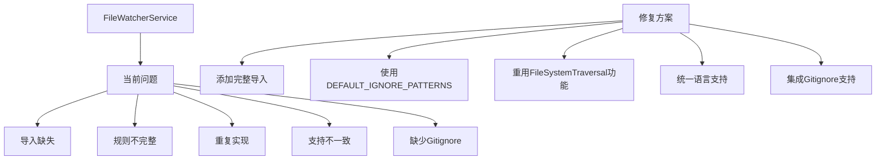

我已经完成了对 `src/service/filesystem/FileWatcherService.ts` 模块的详细分析，以下是发现的关于忽略规则导入和使用的主要问题：

## 🔍 发现的主要问题

### 1. **导入缺失问题**
- **缺少 DEFAULT_IGNORE_PATTERNS 导入**：FileWatcherService.ts 没有导入 [`DEFAULT_IGNORE_PATTERNS`](src/service/filesystem/defaultIgnorePatterns.ts:1) 常量
- **缺少 GitignoreParser 导入**：没有导入 [`GitignoreParser`](src/service/filesystem/FileSystemTraversal.ts:6) 来支持 .gitignore 和 .indexignore 规则

### 2. **忽略规则不完整**
- **硬编码的默认模式**：在 [`shouldIgnoreFile`](src/service/filesystem/FileWatcherService.ts:541-546) 方法中只使用了4个基本模式：
  ```typescript
  ['**/node_modules/**', '**/.git/**', '**/dist/**', '**/build/**']
  ```
- **对比 FileSystemTraversal**：FileSystemTraversal 使用了完整的 [`DEFAULT_IGNORE_PATTERNS`](src/service/filesystem/FileSystemTraversal.ts:9)（包含153个模式）

### 3. **重复实现问题**
- **重复的 matchesPattern 方法**：FileWatcherService 重新实现了 [`matchesPattern`](src/service/filesystem/FileWatcherService.ts:565-578) 方法
- **功能不完整**：相比 FileSystemTraversal 中的 [`matchesPattern`](src/service/filesystem/FileSystemTraversal.ts:376-475) 方法，缺少对复杂模式的处理能力

### 4. **语言支持不一致**
- **扩展名支持较少**：FileWatcherService 只支持 [`12种扩展名`](src/service/filesystem/FileWatcherService.ts:599-612)
- **对比 FileSystemTraversal**：支持 [`19种扩展名`](src/service/filesystem/FileSystemTraversal.ts:59-79)，包括文本文件格式

### 5. **缺少 Gitignore 集成**
- **没有 .gitignore 支持**：FileWatcherService 没有集成 .gitignore 和 .indexignore 文件解析
- **对比 FileSystemTraversal**：完整支持 [`Gitignore 集成`](src/service/filesystem/FileSystemTraversal.ts:104-116)

## 📋 修复建议

1. **导入缺失的依赖**：添加 DEFAULT_IGNORE_PATTERNS 和 GitignoreParser 导入
2. **统一忽略规则**：使用完整的 DEFAULT_IGNORE_PATTERNS 而不是硬编码的有限模式
3. **重用现有实现**：移除重复的 matchesPattern 方法，使用 FileSystemTraversal 的功能
4. **扩展语言支持**：统一使用 FileSystemTraversal 的语言检测逻辑
5. **集成 Gitignore**：添加 .gitignore 和 .indexignore 文件支持

## 🗺️ 架构图



这个模块需要重构以保持与 FileSystemTraversal 的一致性，避免重复实现和维护问题。


执行该修改方案。
由于gitignore/indexignore规则需要热更新，忽略规则热更新时[由忽略规则的更新触发]也需要修改FileSystemTraversal使用的忽略规则。