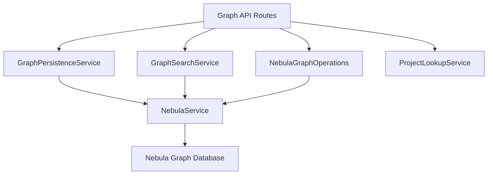

# 后端Graph API端点完善方案

## 📋 概述

本方案旨在为代码库索引与检索服务的后端添加完整的Graph API端点，基于现有的Nebula集成提供丰富的图数据操作和分析功能。

## 🎯 目标功能

### 1. 核心API端点

#### 1.1 图数据管理API
- 项目空间管理（创建、删除、清空）
- 图数据统计信息
- 批量数据操作

#### 1.2 图查询与搜索API
- 自定义图查询
- 节点关系查询
- 路径搜索
- 图遍历查询

#### 1.3 图分析API
- 代码依赖分析
- 调用图分析
- 影响范围分析
- 循环依赖检测

#### 1.4 图统计API
- 图结构指标
- 性能监控
- 缓存统计

## 🏗️ 架构设计

### API路由结构

```
src/api/
├── routes/
│   ├── GraphRoutes.ts              # 图数据操作路由
│   ├── GraphQueryRoutes.ts         # 图查询路由
│   ├── GraphAnalysisRoutes.ts      # 图分析路由
│   └── GraphStatsRoutes.ts         # 图统计路由
```

### 服务依赖关系



## 🔧 技术实现方案

### 1. GraphRoutes - 图数据管理API

```typescript
// 项目空间管理
POST /api/v1/graph/space/:projectId/create    # 创建项目空间
POST /api/v1/graph/space/:projectId/delete    # 删除项目空间
POST /api/v1/graph/space/:projectId/clear     # 清空项目空间
GET  /api/v1/graph/space/:projectId/info      # 获取空间信息

// 图数据操作
POST /api/v1/graph/nodes                      # 批量插入节点
POST /api/v1/graph/edges                      # 批量插入边
DELETE /api/v1/graph/nodes                     # 批量删除节点
```

### 2. GraphQueryRoutes - 图查询API

```typescript
// 自定义查询
POST /api/v1/graph/query                       # 执行自定义图查询

// 关系查询
POST /api/v1/graph/related                     # 查询相关节点
POST /api/v1/graph/path                        # 查询路径
POST /api/v1/graph/traversal                   # 图遍历查询

// 搜索查询
POST /api/v1/graph/search                      # 图语义搜索
GET  /api/v1/graph/search/suggestions          # 搜索建议
```

### 3. GraphAnalysisRoutes - 图分析API

```typescript
// 依赖分析
POST /api/v1/graph/analysis/dependencies       # 文件依赖分析
POST /api/v1/graph/analysis/circular           # 循环依赖检测

// 调用图分析
POST /api/v1/graph/analysis/callgraph          # 函数调用图
POST /api/v1/graph/analysis/impact             # 影响范围分析

// 代码结构分析
GET /api/v1/graph/analysis/overview/:projectId  # 项目概览
GET /api/v1/graph/analysis/metrics/:projectId   # 结构指标
```

### 4. GraphStatsRoutes - 图统计API

```typescript
// 图统计信息
GET /api/v1/graph/stats/:projectId             # 图统计信息
GET /api/v1/graph/stats/cache                  # 缓存统计
GET /api/v1/graph/stats/performance            # 性能指标

// 监控端点
GET /api/v1/graph/stats/health                 # 健康检查
GET /api/v1/graph/stats/status                 # 服务状态
```

## 📊 详细API设计

### 1. 项目空间管理端点

#### 创建项目空间
```typescript
POST /api/v1/graph/space/:projectId/create
Request Body: {
  partitionNum?: number;    // 分区数量
  replicaFactor?: number;   // 副本因子
  vidType?: string;        // 顶点ID类型
}

Response: {
  success: boolean;
  spaceName: string;
  config: any;
}
```

#### 获取空间信息
```typescript
GET /api/v1/graph/space/:projectId/info
Response: {
  success: boolean;
  data: {
    name: string;
    partition_num: number;
    replica_factor: number;
    vid_type: string;
    status: string;
  }
}
```

### 2. 图查询端点

#### 执行自定义查询
```typescript
POST /api/v1/graph/query
Request Body: {
  query: string;           // nGQL查询语句
  projectId: string;       // 项目ID
  parameters?: any;       // 查询参数
}

Response: {
  success: boolean;
  data: any[];
  executionTime: number;
}
```

#### 查询相关节点
```typescript
POST /api/v1/graph/related
Request Body: {
  nodeId: string;         // 节点ID
  projectId: string;      // 项目ID
  relationshipTypes?: string[]; // 关系类型
  maxDepth?: number;      // 最大深度
  limit?: number;         // 结果限制
}

Response: {
  success: boolean;
  nodes: GraphNode[];
  relationships: GraphRelationship[];
}
```

### 3. 图分析端点

#### 依赖分析
```typescript
POST /api/v1/graph/analysis/dependencies
Request Body: {
  filePath: string;       // 文件路径
  projectId: string;      // 项目ID
  includeTransitive?: boolean; // 包含传递依赖
  includeCircular?: boolean;   // 包含循环依赖
}

Response: {
  success: boolean;
  data: {
    direct: string[];     // 直接依赖
    transitive: string[]; // 传递依赖
    circular: string[];  // 循环依赖
  }
}
```

#### 调用图分析
```typescript
POST /api/v1/graph/analysis/callgraph
Request Body: {
  functionName: string;   // 函数名称
  projectId: string;      // 项目ID
  depth?: number;         // 调用深度
  direction?: 'in' | 'out' | 'both'; // 调用方向
}

Response: {
  success: boolean;
  data: CallGraphResult;
}
```

## 🚀 实施计划

### 阶段一：基础API框架（1周）
- [ ] 创建GraphRoutes基础框架
- [ ] 实现项目空间管理API
- [ ] 添加错误处理和验证
- [ ] 集成到主API服务器

### 阶段二：核心查询功能（2周）
- [ ] 实现GraphQueryRoutes
- [ ] 添加自定义查询端点
- [ ] 实现关系查询功能
- [ ] 添加路径搜索支持

### 阶段三：高级分析功能（2周）
- [ ] 实现GraphAnalysisRoutes
- [ ] 添加依赖分析端点
- [ ] 实现调用图分析
- [ ] 添加影响范围分析

### 阶段四：统计和监控（1周）
- [ ] 实现GraphStatsRoutes
- [ ] 添加性能监控端点
- [ ] 实现缓存统计
- [ ] 添加健康检查

## 📈 性能优化策略

### 1. 查询优化
- **批处理操作**: 支持批量节点和边操作
- **查询缓存**: 实现查询结果缓存
- **分页支持**: 大数据量查询分页

### 2. 缓存策略
- **查询缓存**: 缓存常用查询结果
- **统计缓存**: 缓存图统计信息
- **元数据缓存**: 缓存图结构元数据

### 3. 性能监控
- **查询性能**: 监控查询执行时间
- **缓存命中率**: 监控缓存效果
- **资源使用**: 监控内存和CPU使用

## ⚠️ 风险与缓解

### 1. 性能风险
- **风险**: 复杂图查询可能影响性能
- **缓解**: 实现查询超时和资源限制
- **缓解**: 添加查询优化和索引

### 2. 数据一致性风险
- **风险**: 图数据和向量数据不一致
- **缓解**: 实现事务机制
- **缓解**: 添加数据同步检查

### 3. 复杂度风险
- **风险**: API端点复杂度高
- **缓解**: 模块化设计，逐步实现
- **缓解**: 提供详细文档和示例

## 🔗 依赖关系

### 内部依赖
- NebulaGraphOperations服务
- GraphPersistenceService服务  
- GraphSearchService服务
- ProjectLookupService服务

### 外部依赖
- Nebula Graph数据库
- 项目索引数据
- 配置管理服务

## 🧪 测试策略

### 单元测试
- 测试每个API端点的基本功能
- 验证错误处理和边界条件
- 测试查询参数验证

### 集成测试
- 测试API与Nebula服务的集成
- 验证数据一致性
- 测试性能基准

### 端到端测试
- 测试完整的数据流
- 验证前端-后端集成
- 测试真实场景用例

## 📚 文档计划

### API文档
- OpenAPI/Swagger规范
- 端点详细说明
- 请求/响应示例

### 开发文档
- 架构设计说明
- 集成指南
- 性能优化建议

### 用户文档
- API使用指南
- 示例代码
- 最佳实践

此方案将为后端提供一个功能完整、性能优化的Graph API体系，支持前端的各种图数据操作和分析需求。