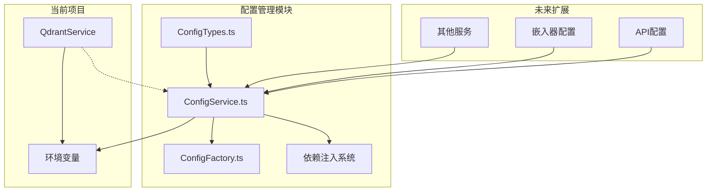

## 配置管理模块迁移方案

基于对当前项目和参考配置模块的分析，我设计了以下配置管理模块迁移方案：

### 📋 当前项目配置现状分析

1. **配置使用方式**：直接使用 `process.env` 环境变量
2. **主要配置需求**：Qdrant数据库配置（host、port、apiKey等）
3. **配置位置**：主要在 [`QdrantService.ts`](src/database/QdrantService.ts:30-36) 中硬编码

### 🎯 迁移目标

1. 创建专门的配置管理模块，替代直接的环境变量访问
2. 提供类型安全的配置访问
3. 保持向后兼容性，逐步迁移其他配置
4. 支持配置验证和默认值设置

### 📁 新的配置模块架构



### 🏗️ 模块结构设计

```
src/config/
├── ConfigTypes.ts          # 配置类型定义
├── ConfigService.ts        # 配置服务核心实现  
├── ConfigFactory.ts        # 配置工厂（可选）
└── index.ts                # 模块导出
```

### 🔧 核心功能设计

1. **类型安全配置**：基于TypeScript接口定义配置结构
2. **环境变量验证**：使用Joi进行环境变量验证
3. **默认值支持**：为所有配置项提供合理的默认值
4. **单例模式**：全局唯一的配置服务实例
5. **向后兼容**：保持现有环境变量命名不变

### 📝 实施步骤

1. **创建配置类型定义**（[`ConfigTypes.ts`](src/config/ConfigTypes.ts)）
2. **实现配置服务**（[`ConfigService.ts`](src/config/ConfigService.ts)）
3. **集成Qdrant配置**：更新QdrantService使用新配置服务
4. **更新依赖注入**：确保配置服务可被其他模块访问
5. **编写迁移文档**：记录配置变更和使用方式

### 🎨 配置类型设计（简化版）

```typescript
// 专注于当前项目需求的配置类型
export interface QdrantConfig {
  host: string;
  port: number;
  apiKey?: string;
  useHttps: boolean;
  timeout: number;
  collection: string;
}

export interface EmbeddingConfig {
  provider: string;
  // 其他嵌入器相关配置...
}

export interface AppConfig {
  nodeEnv: string;
  port: number;
  qdrant: QdrantConfig;
  embedding: EmbeddingConfig;
}
```

### ⚡ 迁移策略

1. **渐进式迁移**：先迁移Qdrant配置，其他配置保持原样
2. **兼容性保证**：新配置服务读取相同的环境变量
3. **最小化变更**：只修改必要的配置访问代码
4. **测试验证**：确保迁移后功能正常

这个方案专注于为当前项目创建专门的配置管理模块，首先满足Qdrant的配置需求，同时为未来的扩展预留了架构空间。