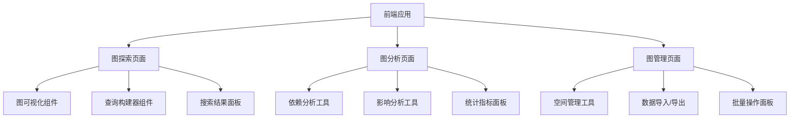

# 前端Nebula图操作模块实施方案

## 📋 概述

本方案旨在为代码库索引与检索服务的前端添加Nebula图数据库操作模块，提供图数据管理、查询、可视化和分析功能。

## 🎯 目标功能

### 1. 核心功能模块

#### 1.1 图数据管理
- 项目空间管理（创建、删除、清空）
- 图数据统计信息展示
- 批量数据导入/导出

#### 1.2 图查询与搜索
- 节点关系查询
- 路径搜索（最短路径、所有路径）
- 图遍历查询
- 高级图搜索

#### 1.3 图可视化
- 交互式图可视化展示
- 节点和关系属性查看
- 图布局调整
- 搜索高亮和过滤

#### 1.4 图分析
- 代码依赖分析
- 影响范围分析
- 图统计指标
- 代码质量评估

## 🏗️ 架构设计

### 前端模块结构

```
frontend/
├── src/
│   ├── pages/
│   │   ├── GraphExplorerPage.ts      # 图探索页面（主页面）
│   │   ├── GraphAnalysisPage.ts      # 图分析页面
│   │   └── GraphManagementPage.ts    # 图管理页面
│   ├── components/
│   │   ├── graph/
│   │   │   ├── GraphVisualizer.ts    # 图可视化组件
│   │   │   ├── GraphQueryBuilder.ts   # 查询构建器组件
│   │   │   ├── GraphStatsPanel.ts     # 统计面板组件
│   │   │   └── GraphSearchPanel.ts    # 搜索面板组件
│   │   └── common/
│   │       └── LoadingSpinner.ts     # 加载指示器
│   ├── services/
│   │   ├── graphApi.ts               # 图API客户端
│   │   └── graphCache.ts             # 图数据缓存
│   └── types/
│       └── graph.ts                  # 图相关类型定义
```

### 页面路由设计



## 🔧 技术实现方案

### 1. 图可视化组件

使用 [Cytoscape.js](https://js.cytoscape.org/) 实现交互式图可视化：

```typescript
class GraphVisualizer {
  private cy: cytoscape.Core;
  
  constructor(container: HTMLElement) {
    this.cy = cytoscape({
      container: container,
      style: [
        {
          selector: 'node',
          style: {
            'background-color': '#6197ff',
            'label': 'data(label)',
            'text-valign': 'center',
            'text-halign': 'center'
          }
        },
        {
          selector: 'edge',
          style: {
            'width': 3,
            'line-color': '#ccc',
            'target-arrow-color': '#ccc',
            'target-arrow-shape': 'triangle',
            'curve-style': 'bezier'
          }
        }
      ],
      layout: {
        name: 'cose',
        idealEdgeLength: 100,
        nodeOverlap: 20,
        refresh: 20,
        fit: true,
        padding: 30,
        randomize: false,
        componentSpacing: 100,
        nodeRepulsion: 400000,
        edgeElasticity: 100,
        nestingFactor: 5,
        gravity: 80,
        numIter: 1000,
        initialTemp: 200,
        coolingFactor: 0.95,
        minTemp: 1.0
      }
    });
  }
  
  // 加载图数据
  async loadGraphData(nodes: GraphNode[], edges: GraphEdge[]) {
    // 实现数据加载逻辑
  }
  
  // 搜索高亮
  highlightSearchResults(results: SearchResult[]) {
    // 实现搜索高亮
  }
}
```

### 2. API客户端服务

```typescript
class GraphApiClient {
  private baseUrl: string;
  
  constructor(baseUrl: string = 'http://localhost:3010') {
    this.baseUrl = baseUrl;
  }
  
  // 图查询方法
  async executeQuery(query: GraphQuery): Promise<GraphResult> {
    const response = await fetch(`${this.baseUrl}/api/v1/graph/query`, {
      method: 'POST',
      headers: { 'Content-Type': 'application/json' },
      body: JSON.stringify(query)
    });
    return await response.json();
  }
  
  // 获取图统计信息
  async getGraphStats(projectId: string): Promise<GraphStats> {
    const response = await fetch(`${this.baseUrl}/api/v1/graph/stats/${projectId}`);
    return await response.json();
  }
  
  // 执行路径搜索
  async findPath(sourceId: string, targetId: string, options?: PathSearchOptions): Promise<PathResult> {
    const response = await fetch(`${this.baseUrl}/api/v1/graph/path`, {
      method: 'POST',
      headers: { 'Content-Type': 'application/json' },
      body: JSON.stringify({ sourceId, targetId, options })
    });
    return await response.json();
  }
  
  // 管理项目空间
  async manageSpace(projectId: string, operation: SpaceOperation): Promise<SpaceOperationResult> {
    const response = await fetch(`${this.baseUrl}/api/v1/graph/space/${projectId}`, {
      method: 'POST',
      headers: { 'Content-Type': 'application/json' },
      body: JSON.stringify({ operation })
    });
    return await response.json();
  }
}
```

### 3. 类型定义

```typescript
// 图节点类型
interface GraphNode {
  id: string;
  label: string;
  type: NodeType; // 'file' | 'function' | 'class' | 'import'
  properties: Record<string, any>;
}

// 图边类型
interface GraphEdge {
  id: string;
  source: string;
  target: string;
  type: EdgeType; // 'BELONGS_TO' | 'CONTAINS' | 'IMPORTS' | 'CALLS' | 'EXTENDS' | 'IMPLEMENTS'
  properties: Record<string, any>;
}

// 图查询类型
interface GraphQuery {
  type: QueryType; // 'RELATED_NODES' | 'PATH' | 'TRAVERSAL' | 'STATS'
  parameters: Record<string, any>;
  options?: QueryOptions;
}

// 搜索选项
interface SearchOptions {
  maxResults?: number;
  minScore?: number;
  relationshipTypes?: string[];
  maxDepth?: number;
}
```

## 📊 界面设计

### 1. 图探索页面布局

```
+-----------------------------------------+
| 顶部导航栏                              |
+-----------------+-----------------------+
| 侧边栏          |                        |
| - 查询构建器    |                        |
| - 搜索面板      |  主图可视化区域        |
| - 过滤器       |                        |
+-----------------+-----------------------+
| 底部状态栏      |                        |
+-----------------------------------------+
```

### 2. 图分析页面布局

```
+-----------------------------------------+
| 顶部导航栏                              |
+-----------------+-----------------------+
| 分析工具面板    |  分析结果可视化        |
| - 依赖分析      | - 依赖图              |
| - 影响分析      | - 影响范围图          |
| - 统计指标      | - 统计图表            |
+-----------------+-----------------------+
| 底部控制台      |                        |
+-----------------------------------------+
```

## 🚀 实施计划

### 阶段一：基础框架（1周）
- [ ] 创建图API客户端服务
- [ ] 定义图相关类型
- [ ] 搭建基础页面框架
- [ ] 集成Cytoscape.js可视化库

### 阶段二：核心功能（2周）
- [ ] 实现图数据管理界面
- [ ] 开发查询构建器组件
- [ ] 实现图可视化组件
- [ ] 添加搜索和过滤功能

### 阶段三：高级功能（2周）
- [ ] 实现图分析工具
- [ ] 添加依赖分析功能
- [ ] 实现影响范围分析
- [ ] 优化性能和用户体验

### 阶段四：测试优化（1周）
- [ ] 进行功能测试
- [ ] 性能优化
- [ ] 用户体验改进
- [ ] 文档编写

## 📈 预期效果

1. **用户体验提升**：提供直观的图数据探索界面
2. **开发效率提高**：简化图查询和分析操作
3. **代码理解增强**：通过可视化帮助理解代码结构
4. **问题发现加速**：快速识别依赖问题和影响范围

## ⚠️ 风险与缓解

1. **性能风险**：大数据量图可视化可能影响性能
   - 缓解：实现数据分页和懒加载
   - 缓解：优化图布局算法

2. **复杂度风险**：图操作功能复杂度高
   - 缓解：模块化设计，逐步实现
   - 缓解：提供详细文档和示例

3. **兼容性风险**：不同浏览器兼容性问题
   - 缓解：使用成熟的可视化库
   - 缓解：进行多浏览器测试

## 🔗 依赖关系

- 后端需要提供完整的Graph API端点
- 需要Nebula Graph服务正常运行
- 需要现有的项目索引数据

此方案将为前端提供一个功能完整、用户体验良好的Nebula图操作模块，显著提升代码库分析和探索能力。