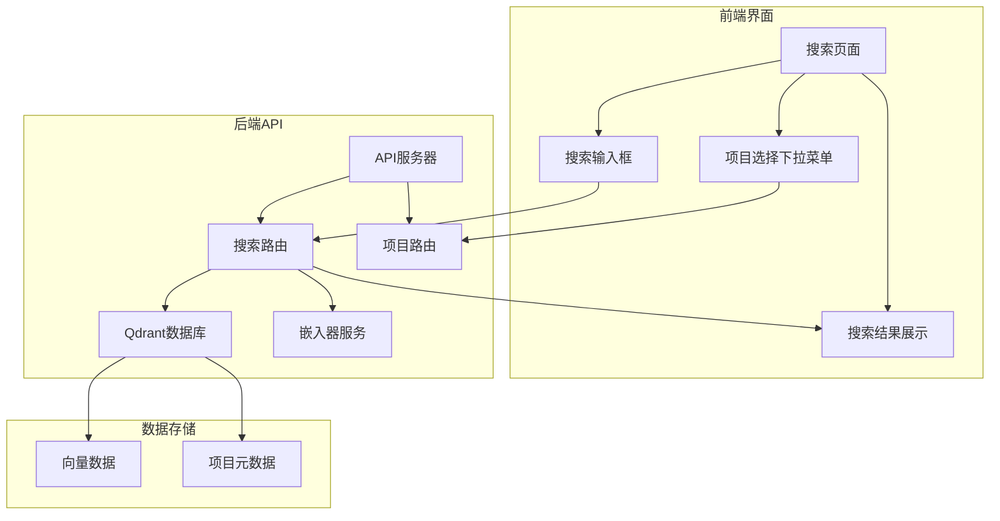

# 前端搜索功能增强设计方案

## 📋 项目概述

本方案旨在将当前基于mock数据的搜索功能改造为真实的生产环境搜索功能，主要包含以下改进：

1. **环境配置调整**：将mock模式设置为false，启用真实搜索
2. **项目选择功能**：在前端搜索页面添加项目选择下拉菜单
3. **真实搜索实现**：调用后端真实搜索API，使用向量数据库进行语义搜索
4. **相似度计算**：使用实际的向量相似度计算结果

## 🎯 当前状态分析

### 现有架构
- **前端**：使用原生TypeScript + Vite构建，当前调用 `/api/search` 端点
- **后端**：Express.js API服务器，当前使用mock数据返回搜索结果
- **数据库**：已集成Qdrant向量数据库，但搜索功能未启用
- **项目映射**：已有项目映射机制，支持多项目管理

### 主要问题
1. API服务器中的 `/api/search` 端点使用硬编码的mock数据
2. 前端搜索页面缺少项目选择功能
3. 搜索API未与Qdrant数据库集成
4. 相似度得分是模拟数据，不是实际计算结果

## 🔧 技术实现方案

### 1. 环境配置调整

在 `.env` 文件中添加配置选项：

```env
# 搜索模式配置
SEARCH_MOCK_MODE=false
SEARCH_DEFAULT_PROJECT=a2c7b9d32367187c
SEARCH_RESULT_LIMIT=10
SEARCH_SCORE_THRESHOLD=0.3
```

### 2. 后端API改造

#### 修改 `src/api/ApiServer.ts`

- 移除现有的 `/api/search` mock实现
- 重定向到 `/api/v1/indexing/search` 端点
- 添加环境变量检查，控制mock模式

#### 增强 `src/api/routes/IndexingRoutes.ts`

- 实现真实的搜索功能，集成Qdrant数据库
- 支持项目过滤、语义搜索、相似度计算

### 3. 前端界面改造

#### 修改 `frontend/src/pages/SearchPage.ts`

- 添加项目选择下拉菜单
- 修改搜索表单，包含项目ID参数
- 更新结果显示，展示真实相似度得分

#### 增强 `frontend/src/services/api.ts`

- 修改search方法，支持项目ID参数
- 添加获取项目列表的方法

### 4. 数据库集成

启用Qdrant向量数据库搜索功能，使用真实的嵌入向量进行相似度计算。

## 📊 系统架构图



## 🚀 实施步骤

### 阶段一：环境配置与后端改造（1-2天）

1. **环境变量配置**
   - 添加SEARCH_MOCK_MODE环境变量
   - 配置默认项目和搜索参数

2. **API服务器改造**
   - 修改ApiServer.ts，移除mock搜索
   - 增强IndexingRoutes.ts，实现真实搜索

3. **数据库集成**
   - 配置Qdrant连接
   - 实现向量搜索功能

### 阶段二：前端界面改造（1天）

1. **项目选择功能**
   - 添加项目下拉菜单
   - 实现项目列表获取

2. **搜索表单增强**
   - 支持项目ID参数
   - 添加搜索选项配置

3. **结果展示优化**
   - 显示真实相似度得分
   - 优化结果展示格式

### 阶段三：测试与优化（1天）

1. **功能测试**
   - 测试项目选择功能
   - 验证搜索结果准确性

2. **性能优化**
   - 优化搜索响应时间
   - 添加结果缓存机制

3. **用户体验优化**
   - 添加加载状态指示
   - 错误处理和用户提示

## 📝 API接口设计

### 搜索请求格式
```typescript
interface SearchRequest {
  query: string;
  projectId: string; // 新增：项目ID参数
  limit?: number;
  threshold?: number;
  searchType?: 'semantic' | 'keyword' | 'hybrid';
}
```

### 搜索响应格式
```typescript
interface SearchResponse {
  success: boolean;
  data: {
    results: Array<{
      id: string;
      score: number; // 真实相似度得分
      snippet: {
        content: string;
        filePath: string;
        language: string;
        metadata?: any;
      };
    }>;
    total: number;
    query: string;
    projectId: string;
  };
}
```

## 📈 性能优化详细设计

### 1. 结果分页

为支持大规模结果集，实现分页机制：

- **后端实现**：
  - 在Qdrant搜索中添加offset和limit参数
  - 实现游标分页，避免深度分页性能问题
  - 添加分页元数据返回（当前页、总页数、总结果数）

- **前端实现**：
  - 添加分页控件（上一页/下一页/页码跳转）
  - 实现无限滚动加载（可选）
  - 缓存已加载的页面结果

### 2. 查询优化

优化搜索查询以提高性能：

- **索引优化**：
  - 为常用过滤字段（如projectId、language、filePath）创建有效载荷索引
  - 使用Qdrant的推荐索引策略

- **查询优化**：
  - 使用向量预过滤减少搜索空间
  - 实现复合查询（向量+元数据过滤）
  - 添加查询缓存机制（对于高频查询）

### 3. 缓存机制

实现多层缓存策略：

- **嵌入缓存**：
  - 利用现有的EmbeddingCacheService缓存查询文本的向量表示
  - 设置合理的TTL（默认2小时）
  - 支持按模型清理缓存

- **搜索结果缓存**：
  - 缓存完整的搜索结果（向量+过滤）
  - 根据查询复杂度设置不同TTL
  - 实现缓存失效策略（项目更新时清理相关缓存）

- **项目元数据缓存**：
  - 缓存项目列表和项目信息
  - 在项目创建/删除时更新缓存

### 4. 并发控制

管理并发搜索请求以避免资源耗尽：

- **后端并发控制**：
  - 限制同时进行的搜索请求数量（通过配置）
  - 实现请求队列机制，避免拒绝服务
  - 添加超时控制（默认30秒）

- **嵌入器并发控制**：
  - 利用BaseEmbedder中的并发控制机制
  - 设置合理的maxConcurrent参数（默认5）
  - 实现请求排队和超时处理

## 🛡️ 错误处理与日志支持

### 1. 错误处理策略

实现全面的错误处理机制：

- **网络错误处理**：
  - 处理Qdrant连接失败
  - 处理嵌入器API调用失败
  - 实现重试机制（最多3次）

- **参数验证**：
  - 验证查询文本非空
  - 验证项目ID存在且有效
  - 验证搜索参数范围（limit、threshold等）

- **资源错误处理**：
  - 处理内存不足情况
  - 处理数据库查询超时
  - 处理嵌入器响应超时

### 2. 错误信息设计

提供明确的错误信息以帮助调试：

- **用户友好错误**：
  - 简洁明了的错误描述
  - 可能的解决方案建议
  - 错误代码便于技术支持

- **开发者调试信息**：
  - 详细的错误堆栈跟踪
  - 相关上下文信息（查询参数、项目ID等）
  - 错误发生时间戳

### 3. 日志系统集成

全面集成现有的日志服务：

- **结构化日志记录**：
  - 使用LoggerService记录结构化日志
  - 区分不同日志级别（INFO、WARN、ERROR、DEBUG）
  - 记录关键操作的执行时间

- **关键操作日志**：
  - 搜索请求接收和响应
  - 嵌入器调用和响应
  - 数据库查询和结果
  - 缓存命中/未命中情况

- **性能监控日志**：
  - 记录搜索响应时间
  - 记录嵌入生成时间
  - 记录数据库查询时间

- **错误日志**：
  - 详细记录所有错误信息
  - 包含错误上下文和堆栈跟踪
  - 记录错误发生频率用于问题分析

### 4. 监控和告警

实现基本的监控能力：

- **健康检查端点**：
  - 提供系统健康状态
  - 检查数据库连接状态
  - 检查嵌入器可用性

- **性能指标**：
  - 平均响应时间
  - 错误率统计
  - 缓存命中率

## 🔍 验证指标

1. **功能完整性**：项目选择、搜索、结果展示功能正常
2. **性能指标**：搜索响应时间 < 2秒
3. **准确性**：搜索结果与查询语义相关
4. **用户体验**：界面友好，操作流畅

## 🎯 交付成果

1. 完整的前端搜索页面，支持项目选择
2. 真实的后端搜索API，集成Qdrant数据库
3. 准确的相似度计算和结果排序
4. 完整的文档和测试用例

通过本方案的实施，系统将从mock模式完全过渡到生产就绪的搜索功能，为用户提供准确、高效的代码搜索体验。