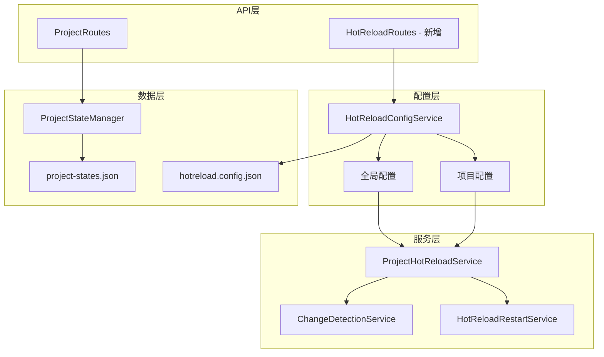
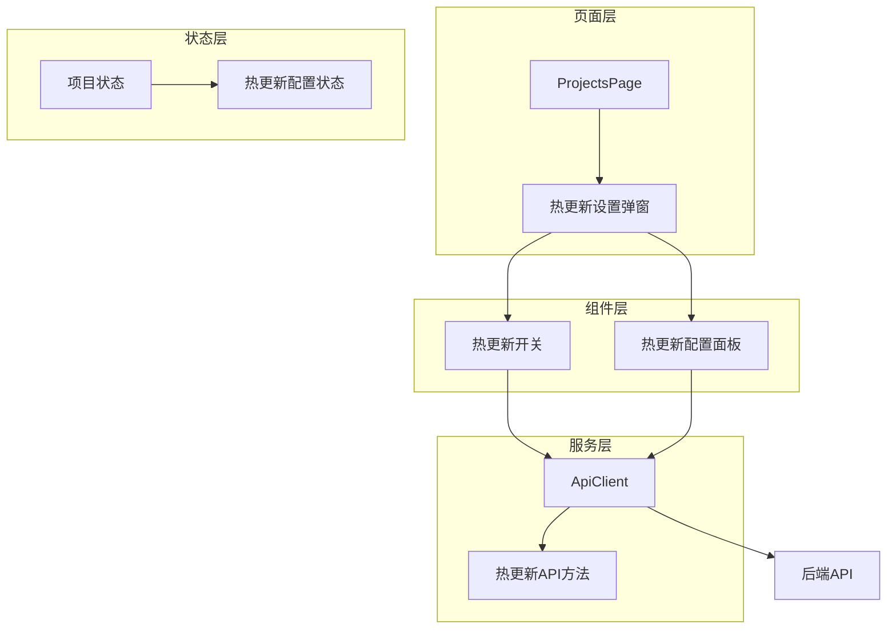

# 项目级热更新配置实施方案

## 📋 概述

当前热更新配置仅支持全局设定，无法针对单个项目进行精细控制。本方案旨在实现项目级热更新配置，允许用户通过前端界面为每个项目独立设置热更新行为。

## 🎯 当前问题分析

### 现有架构
1. **全局配置**: [`HotReloadConfigService`](src/service/filesystem/HotReloadConfigService.ts) 支持全局热更新配置
2. **项目配置**: 项目状态存储在 [`project-states.json`](data/project-states.json) 中，包含 `settings.watchChanges` 字段
3. **前端界面**: 项目管理页面 [`ProjectsPage`](frontend/src/pages/ProjectsPage.ts) 缺少热更新配置控件

### 限制
- 热更新只能全局启用或禁用
- 无法为特定项目单独配置热更新行为
- 前端界面缺少配置控件

## 🏗️ 架构设计

### 后端架构扩展



### 前端架构扩展



## 🔧 技术实现方案

### 1. 后端API扩展

#### 新增热更新配置API端点

在 [`ProjectRoutes`](src/api/routes/ProjectRoutes.ts) 中添加：

```typescript
// 获取项目热更新配置
this.router.get('/:projectId/hot-reload', this.getProjectHotReloadConfig.bind(this));

// 更新项目热更新配置  
this.router.put('/:projectId/hot-reload', this.updateProjectHotReloadConfig.bind(this));

// 启用/禁用项目热更新
this.router.post('/:projectId/hot-reload/toggle', this.toggleProjectHotReload.bind(this));
```

#### 新增热更新路由

创建 [`HotReloadRoutes`](src/api/routes/HotReloadRoutes.ts)：

```typescript
import { Router, Request, Response, NextFunction } from 'express';
import { HotReloadConfigService } from '../../service/filesystem/HotReloadConfigService';

export class HotReloadRoutes {
    private router: Router;
    
    constructor(private configService: HotReloadConfigService) {
        this.router = Router();
        this.setupRoutes();
    }
    
    private setupRoutes(): void {
        // 获取全局热更新配置
        this.router.get('/global', this.getGlobalConfig.bind(this));
        
        // 更新全局热更新配置
        this.router.put('/global', this.updateGlobalConfig.bind(this));
        
        // 获取所有项目热更新配置
        this.router.get('/projects', this.getAllProjectConfigs.bind(this));
    }
    
    // 实现方法...
}
```

### 2. 前端界面扩展

#### 项目管理页面增强

在 [`ProjectsPage`](frontend/src/pages/ProjectsPage.ts) 中添加热更新配置列：

```typescript
// 在项目表格中添加热更新状态列
private renderProjectsList(projects: any[], container: HTMLElement) {
    container.innerHTML = projects.map(project => `
        <tr>
            <!-- 现有列... -->
            <td>
                <hot-reload-status 
                    project-id="${project.id}"
                    enabled="${project.hotReload?.enabled || false}">
                </hot-reload-status>
            </td>
            <td>
                <button class="action-button configure" 
                        data-project-id="${project.id}" 
                        data-action="configure-hot-reload">
                    配置
                </button>
            </td>
        </tr>
    `).join('');
}
```

#### 新增热更新配置组件

创建 [`HotReloadConfigModal`](frontend/src/components/HotReloadConfigModal.ts)：

```typescript
export class HotReloadConfigModal extends HTMLElement {
    private projectId: string = '';
    private config: any = {};
    
    constructor() {
        super();
        this.attachShadow({ mode: 'open' });
    }
    
    connectedCallback() {
        this.render();
        this.setupEventListeners();
    }
    
    private render() {
        this.shadowRoot!.innerHTML = `
            <style>
                /* 模态框样式 */
            </style>
            <div class="modal">
                <h3>热更新配置 - ${this.projectId}</h3>
                <div class="form-group">
                    <label>
                        <input type="checkbox" id="hot-reload-enabled" 
                               ${this.config.enabled ? 'checked' : ''}>
                        启用热更新
                    </label>
                </div>
                <!-- 更多配置选项 -->
                <div class="modal-actions">
                    <button id="save-config">保存</button>
                    <button id="cancel">取消</button>
                </div>
            </div>
        `;
    }
    
    // 事件处理和方法...
}
```

### 3. API客户端扩展

在 [`ApiClient`](frontend/src/services/api.ts) 中添加热更新相关方法：

```typescript
// 获取项目热更新配置
async getProjectHotReloadConfig(projectId: string): Promise<any> {
    const response = await fetch(`${this.apiBaseUrl}/api/v1/projects/${projectId}/hot-reload`);
    return await response.json();
}

// 更新项目热更新配置
async updateProjectHotReloadConfig(projectId: string, config: any): Promise<any> {
    const response = await fetch(`${this.apiBaseUrl}/api/v1/projects/${projectId}/hot-reload`, {
        method: 'PUT',
        headers: { 'Content-Type': 'application/json' },
        body: JSON.stringify(config)
    });
    return await response.json();
}

// 切换项目热更新状态
async toggleProjectHotReload(projectId: string, enabled: boolean): Promise<any> {
    const response = await fetch(`${this.apiBaseUrl}/api/v1/projects/${projectId}/hot-reload/toggle`, {
        method: 'POST',
        headers: { 'Content-Type': 'application/json' },
        body: JSON.stringify({ enabled })
    });
    return await response.json();
}
```

### 4. 数据模型扩展

#### 项目状态模型更新

在 [`ProjectState`](src/service/project/ProjectStateManager.ts) 接口中添加热更新配置：

```typescript
export interface ProjectState {
    // 现有字段...
    hotReload: {
        enabled: boolean;
        config: {
            debounceInterval?: number;
            watchPatterns?: string[];
            ignorePatterns?: string[];
            maxFileSize?: number;
            errorHandling?: {
                maxRetries?: number;
                alertThreshold?: number;
                autoRecovery?: boolean;
            };
        };
        lastEnabled?: Date;
        lastDisabled?: Date;
        changesDetected?: number;
        errorsCount?: number;
    };
}
```

#### 热更新配置持久化

扩展 [`HotReloadConfigService`](src/service/filesystem/HotReloadConfigService.ts) 支持项目配置持久化：

```typescript
interface HotReloadConfigFile {
    global: HotReloadGlobalConfig;
    projects: {
        [projectPath: string]: ProjectHotReloadConfig;
    };
}
```

## 🚀 实施步骤

### 阶段一：后端基础功能 (2-3天)

1. **扩展项目状态模型** ✅
   - 在 `ProjectState` 中添加热更新配置字段
   - 更新 `project-states.json` 数据结构

2. **增强热更新配置服务** 
   - 扩展 `HotReloadConfigService` 支持项目级配置
   - 实现配置持久化到 `hotreload.config.json`

3. **实现API端点**
   - 在 `ProjectRoutes` 中添加热更新配置端点
   - 创建 `HotReloadRoutes` 用于全局配置管理

### 阶段二：前端界面开发 (3-4天)

1. **扩展API客户端**
   - 在 `ApiClient` 中添加热更新相关方法

2. **创建配置组件**
   - 开发 `HotReloadConfigModal` 组件
   - 创建 `HotReloadStatus` 状态显示组件

3. **增强项目管理页面**
   - 在 `ProjectsPage` 中添加热更新配置列
   - 实现配置模态框的集成

### 阶段三：集成测试 (2天)

1. **后端集成测试**
   - 测试配置持久化和恢复
   - 验证热更新服务正确响应配置变更

2. **前端集成测试**
   - 测试配置界面功能
   - 验证API调用正确性

3. **端到端测试**
   - 测试完整的热更新配置工作流
   - 验证配置变更对实际热更新行为的影响

## 📊 预期效果

### 功能特性
- ✅ 项目级热更新启用/禁用
- ✅ 精细化的热更新配置（去抖间隔、监控模式等）
- ✅ 实时配置生效，无需重启服务
- ✅ 配置持久化，重启后保持设置
- ✅ 前端友好的配置界面

### 性能考虑
- 配置变更采用增量更新，避免全量重载
- 使用防抖机制处理频繁的配置变更
- 配置持久化采用异步操作，不影响主线程

### 用户体验
- 清晰的热更新状态指示
- 直观的配置界面
- 实时反馈配置变更效果
- 错误处理和恢复机制

## 🔍 风险评估与缓解

### 技术风险
1. **配置同步问题**
   - 风险：多服务间配置不一致
   - 缓解：使用集中式配置服务，确保一致性

2. **性能影响**
   - 风险：频繁配置变更影响系统性能
   - 缓解：使用批量更新和防抖机制

3. **数据持久化**
   - 风险：配置丢失或损坏
   - 缓解：实现配置备份和恢复机制

### 兼容性考虑
- 向后兼容现有的全局配置
- 平滑迁移现有项目状态
- 提供配置重置功能

## 📝 后续优化方向

1. **批量操作支持**
   - 批量启用/禁用多个项目的热更新
   - 配置模板和批量应用

2. **高级监控功能**
   - 热更新性能监控
   - 变更统计和报告

3. **智能配置推荐**
   - 基于项目类型的推荐配置
   - 自适应配置优化

4. **远程管理支持**
   - REST API 配置管理
   - 命令行工具支持

## 🎯 验收标准

- [ ] 可以在前端为每个项目独立配置热更新
- [ ] 配置变更实时生效，无需重启服务
- [ ] 配置持久化，服务重启后保持设置
- [ ] 提供清晰的状态反馈和错误处理
- [ ] 兼容现有的全局配置机制
- [ ] 性能影响在可接受范围内

通过本方案的实施，将实现完整的项目级热更新配置能力，显著提升系统的灵活性和用户体验。