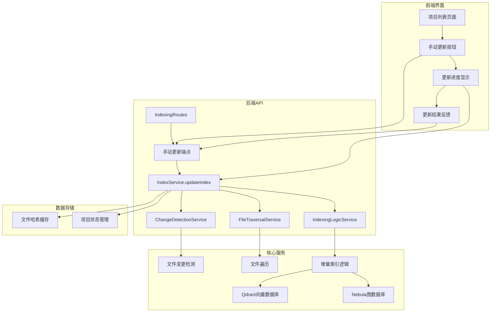
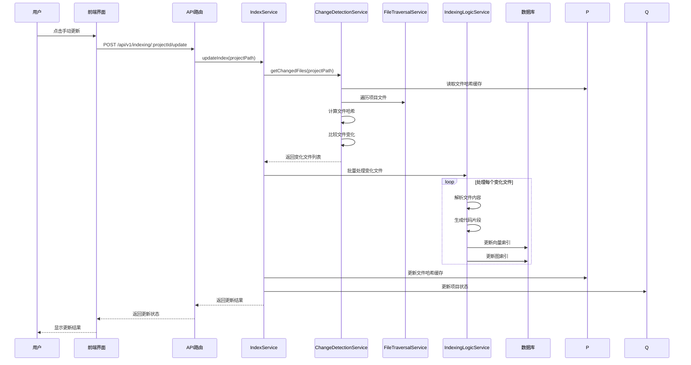

# 手动更新索引功能设计文档

## 📋 概述

本文档详细设计了手动更新索引功能的实现方案。该功能允许用户在热更新禁用时手动触发索引更新，仅更新发生变化的文件，而不是重新构建整个索引。

## 🎯 需求分析

### 核心需求
1. **手动触发更新**：用户可以通过界面手动触发索引更新
2. **增量更新**：只更新发生变化的文件，不重新索引未变化的文件
3. **与热更新互补**：在热更新禁用时提供手动更新选项
4. **状态反馈**：提供实时更新进度和状态反馈
5. **错误处理**：处理更新过程中的各种错误情况

### 与现有功能的区别
- **重新索引**：删除所有现有索引数据，重新构建完整索引
- **手动更新**：仅更新变化的文件，保留未变化的索引数据
- **热更新**：自动监控文件变化并实时更新

## 🏗️ 架构设计

### 系统架构图



### 数据流设计



## 🔧 后端实现设计

### 1. 新增API端点

在 `IndexingRoutes` 中添加手动更新端点：

```typescript
// src/api/routes/IndexingRoutes.ts

/**
 * @route POST /api/v1/indexing/:projectId/update
 * @desc Manually update project index (incremental)
 * @param {string} params.projectId - Project ID
 * @param {object} body - Update options
 * @returns {object} 200 - Update result
 */
this.router.post('/:projectId/update', this.updateIndex.bind(this));
```

### 2. 新增IndexService方法

在 `IndexService` 中添加手动更新方法：

```typescript
// src/service/index/IndexService.ts

/**
 * 手动更新项目索引（增量更新）
 */
async updateIndex(projectPath: string, options?: IndexSyncOptions): Promise<UpdateIndexResult> {
    // 实现增量更新逻辑
}

interface UpdateIndexResult {
    projectId: string;
    projectPath: string;
    totalFiles: number;
    updatedFiles: number;
    deletedFiles: number;
    unchangedFiles: number;
    errors: Array<{ filePath: string; error: string }>;
    processingTime: number;
}
```

### 3. 增量更新算法

```typescript
// 增量更新核心逻辑
private async performIncrementalUpdate(projectPath: string, options?: IndexSyncOptions): Promise<UpdateIndexResult> {
    const startTime = Date.now();
    const projectId = this.projectIdManager.getProjectId(projectPath);
    
    if (!projectId) {
        throw new Error(`Project not found: ${projectPath}`);
    }

    // 1. 获取当前索引的文件列表
    const indexedFiles = await this.indexingLogicService.getIndexedFiles(projectPath);
    
    // 2. 扫描项目文件系统
    const currentFiles = await this.fileTraversalService.getProjectFiles(projectPath, options);
    
    // 3. 检测文件变化
    const changes = await this.detectFileChanges(projectPath, indexedFiles, currentFiles);
    
    // 4. 处理变化的文件
    const results = await this.processFileChanges(projectPath, changes, options);
    
    // 5. 更新文件哈希缓存
    await this.updateFileHashes(projectPath, currentFiles);
    
    return {
        projectId,
        projectPath,
        totalFiles: currentFiles.length,
        updatedFiles: results.updatedFiles,
        deletedFiles: results.deletedFiles,
        unchangedFiles: results.unchangedFiles,
        errors: results.errors,
        processingTime: Date.now() - startTime
    };
}
```

### 4. 文件变化检测

```typescript
private async detectFileChanges(
    projectPath: string, 
    indexedFiles: string[], 
    currentFiles: string[]
): Promise<FileChanges> {
    const changes: FileChanges = {
        added: [],
        modified: [],
        deleted: [],
        unchanged: []
    };

    // 检测新增文件
    for (const file of currentFiles) {
        if (!indexedFiles.includes(file)) {
            changes.added.push(file);
        }
    }

    // 检测删除文件
    for (const file of indexedFiles) {
        if (!currentFiles.includes(file)) {
            changes.deleted.push(file);
        }
    }

    // 检测修改文件（通过文件哈希比较）
    const existingFiles = currentFiles.filter(file => indexedFiles.includes(file));
    for (const file of existingFiles) {
        const hasChanged = await this.hasFileChanged(projectPath, file);
        if (hasChanged) {
            changes.modified.push(file);
        } else {
            changes.unchanged.push(file);
        }
    }

    return changes;
}
```

## 🎨 前端实现设计

### 1. 项目列表页面增强

在 `ProjectsPage` 中添加手动更新功能：

```typescript
// frontend/src/pages/ProjectsPage.ts

private renderProjectRow(project: any): string {
    return `
        <tr>
            <td><input type="checkbox" class="project-checkbox" data-project-id="${project.projectId}"></td>
            <td>${project.name || 'Unknown'}</td>
            <td class="project-path">${project.projectPath}</td>
            <td>${project.status?.totalFiles || 0}</td>
            <td>
                <span class="status-badge ${this.getVectorStatusClass(project)}">
                    ${this.getVectorStatusText(project)}
                </span>
            </td>
            <td>
                <span class="status-badge ${this.getGraphStatusClass(project)}">
                    ${this.getGraphStatusText(project)}
                </span>
            </td>
            <td class="project-actions">
                <button class="btn-update" data-project-id="${project.projectId}" title="手动更新索引">
                    🔄 更新
                </button>
                <button class="btn-reindex" data-project-id="${project.projectId}" title="重新构建索引">
                    🔄 重建
                </button>
                <button class="btn-delete" data-project-id="${project.projectId}" title="删除索引">
                    🗑️ 删除
                </button>
            </td>
        </tr>
    `;
}
```

### 2. 更新进度组件

```typescript
// frontend/src/components/UpdateProgressModal.ts

export class UpdateProgressModal {
    private modal: HTMLElement;
    private progressBar: HTMLElement;
    private progressText: HTMLElement;
    private detailsContainer: HTMLElement;
    
    constructor() {
        this.render();
        this.setupEventListeners();
    }
    
    show(projectName: string): void {
        // 显示更新进度模态框
    }
    
    updateProgress(progress: UpdateProgress): void {
        // 更新进度信息
    }
    
    hide(): void {
        // 隐藏模态框
    }
}

interface UpdateProgress {
    totalFiles: number;
    updatedFiles: number;
    deletedFiles: number;
    unchangedFiles: number;
    currentFile: string;
    progress: number;
    errors: Array<{ filePath: string; error: string }>;
}
```

### 3. API客户端扩展

```typescript
// frontend/src/services/api.ts

/**
 * 手动更新项目索引
 */
async updateProjectIndex(projectId: string, options?: UpdateOptions): Promise<ApiResponse<UpdateIndexResult>> {
    return this.request('POST', `/api/v1/indexing/${projectId}/update`, options);
}

/**
 * 获取更新进度
 */
async getUpdateProgress(projectId: string): Promise<ApiResponse<UpdateProgress>> {
    return this.request('GET', `/api/v1/indexing/${projectId}/update/progress`);
}

/**
 * 取消更新操作
 */
async cancelUpdate(projectId: string): Promise<ApiResponse<void>> {
    return this.request('DELETE', `/api/v1/indexing/${projectId}/update`);
}
```

## 🔍 核心算法设计

### 1. 文件变化检测算法

```typescript
class FileChangeDetector {
    private fileHashes: Map<string, string> = new Map();
    
    async hasFileChanged(projectPath: string, filePath: string): Promise<boolean> {
        const currentHash = await this.calculateFileHash(filePath);
        const previousHash = this.fileHashes.get(this.getFileKey(projectPath, filePath));
        
        if (!previousHash) {
            // 新文件，需要索引
            this.fileHashes.set(this.getFileKey(projectPath, filePath), currentHash);
            return true;
        }
        
        const hasChanged = currentHash !== previousHash;
        if (hasChanged) {
            this.fileHashes.set(this.getFileKey(projectPath, filePath), currentHash);
        }
        
        return hasChanged;
    }
    
    private async calculateFileHash(filePath: string): Promise<string> {
        // 使用文件内容和元数据计算哈希
        const fs = await import('fs/promises');
        const crypto = await import('crypto');
        
        const stats = await fs.stat(filePath);
        const content = await fs.readFile(filePath, 'utf-8');
        
        const hash = crypto.createHash('sha256');
        hash.update(content);
        hash.update(stats.mtime.toISOString());
        hash.update(stats.size.toString());
        
        return hash.digest('hex');
    }
}
```

### 2. 增量更新策略

```typescript
class IncrementalUpdateStrategy {
    async execute(projectPath: string, changes: FileChanges): Promise<UpdateResult> {
        const results: UpdateResult = {
            updatedFiles: 0,
            deletedFiles: 0,
            unchangedFiles: changes.unchanged.length,
            errors: []
        };
        
        // 处理新增和修改的文件
        const filesToUpdate = [...changes.added, ...changes.modified];
        for (const file of filesToUpdate) {
            try {
                await this.indexingLogicService.indexFile(projectPath, file);
                results.updatedFiles++;
            } catch (error) {
                results.errors.push({
                    filePath: file,
                    error: error instanceof Error ? error.message : String(error)
                });
            }
        }
        
        // 处理删除的文件
        for (const file of changes.deleted) {
            try {
                await this.indexingLogicService.removeFileFromIndex(projectPath, file);
                results.deletedFiles++;
            } catch (error) {
                results.errors.push({
                    filePath: file,
                    error: error instanceof Error ? error.message : String(error)
                });
            }
        }
        
        return results;
    }
}
```

## 📊 性能优化

### 1. 批量处理

```typescript
// 使用现有的性能优化器进行批量处理
const batchResults = await this.performanceOptimizer.processBatches(
    filesToUpdate,
    async (batch) => {
        // 批量处理文件更新
        const promises = batch.map(file => 
            this.performanceOptimizer.executeWithRetry(
                () => this.indexFile(projectPath, file),
                `updateFile:${file}`
            )
        );
        await this.concurrencyService.processWithConcurrency(promises, maxConcurrency);
        return batch.map(file => ({ filePath: file, success: true }));
    },
    'incrementalUpdate'
);
```

### 2. 内存管理

```typescript
// 内存使用监控和优化
private async monitorMemoryUsage(): Promise<void> {
    const memoryUsage = process.memoryUsage();
    const usagePercent = memoryUsage.heapUsed / memoryUsage.heapTotal;
    
    if (usagePercent > 0.8) {
        this.logger.warn('High memory usage detected during incremental update', {
            memoryUsage: memoryUsage,
            usagePercent: usagePercent * 100
        });
        
        if (global.gc) {
            global.gc();
        }
    }
}
```

## 🔒 错误处理

### 1. 更新失败处理

```typescript
private async handleUpdateError(projectId: string, error: Error, context: any): Promise<void> {
    this.logger.error('Incremental update failed', {
        projectId,
        error: error.message,
        context
    });
    
    // 更新项目状态为错误
    await this.projectStateManager.updateProjectState(projectId, {
        lastUpdateStatus: 'error',
        lastUpdateError: error.message,
        lastUpdateTime: new Date()
    });
    
    // 触发错误事件
    await this.emit('updateError', projectId, error);
}
```

### 2. 重试机制

```typescript
private async retryUpdateOperation<T>(
    operation: () => Promise<T>,
    maxRetries: number = 3
): Promise<T> {
    let lastError: Error;
    
    for (let attempt = 1; attempt <= maxRetries; attempt++) {
        try {
            return await operation();
        } catch (error) {
            lastError = error instanceof Error ? error : new Error(String(error));
            this.logger.warn(`Update operation failed, attempt ${attempt}/${maxRetries}`, {
                error: lastError.message
            });
            
            if (attempt < maxRetries) {
                await new Promise(resolve => setTimeout(resolve, 1000 * attempt)); // 指数退避
            }
        }
    }
    
    throw lastError!;
}
```

## 📈 监控和日志

### 1. 更新指标收集

```typescript
interface UpdateMetrics {
    projectId: string;
    startTime: Date;
    endTime: Date;
    duration: number;
    totalFiles: number;
    updatedFiles: number;
    deletedFiles: number;
    unchangedFiles: number;
    errorCount: number;
    memoryUsage: MemoryUsage;
    performance: {
        filesPerSecond: number;
        averageFileSize: number;
        processingTime: number;
    };
}
```

### 2. 事件系统

```typescript
// 扩展IndexService事件系统
on(event: 'updateStarted', listener: (projectId: string) => Promise<void>): void;
on(event: 'updateProgress', listener: (projectId: string, progress: UpdateProgress) => Promise<void>): void;
on(event: 'updateCompleted', listener: (projectId: string, result: UpdateResult) => Promise<void>): void;
on(event: 'updateError', listener: (projectId: string, error: Error) => Promise<void>): void;
```

## 🧪 测试策略

### 1. 单元测试

```typescript
describe('Incremental Update', () => {
    it('应该检测到新增的文件', async () => {
        // 测试新增文件检测逻辑
    });
    
    it('应该检测到修改的文件', async () => {
        // 测试文件修改检测逻辑
    });
    
    it('应该检测到删除的文件', async () => {
        // 测试文件删除检测逻辑
    });
    
    it('应该正确处理文件哈希冲突', async () => {
        // 测试哈希冲突处理
    });
});
```

### 2. 集成测试

```typescript
describe('Manual Update API', () => {
    it('应该成功执行手动更新', async () => {
        // 测试完整的更新流程
    });
    
    it('应该返回正确的更新统计信息', async () => {
        // 测试统计信息准确性
    });
    
    it('应该处理更新过程中的错误', async () => {
        // 测试错误处理
    });
});
```

## 📋 实施计划

### 阶段一：后端核心功能（1-2周）
1. 实现文件变化检测算法
2. 实现增量更新逻辑
3. 添加API端点
4. 实现错误处理和重试机制

### 阶段二：前端界面（1周）
1. 添加手动更新按钮和界面
2. 实现进度显示组件
3. 集成API调用

### 阶段三：测试和优化（1周）
1. 编写单元测试和集成测试
2. 性能优化和内存管理
3. 错误处理完善

### 阶段四：文档和部署（0.5周）
1. 更新API文档
2. 更新用户文档
3. 部署和验证

## 🔄 与现有系统的集成

### 1. 与热更新系统的关系
- 手动更新和热更新共享相同的文件变化检测逻辑
- 手动更新可以看作是热更新的手动触发版本
- 两者使用相同的索引更新接口

### 2. 与重新索引的区别
- 重新索引：删除所有数据，重新构建完整索引
- 手动更新：保留未变化数据，只更新变化部分
- 性能对比：手动更新通常比重新索引快很多

### 3. 配置管理
```typescript
interface UpdateConfig {
    enableHashComparison: boolean;
    maxConcurrentUpdates: number;
    batchSize: number;
    retryAttempts: number;
    fileSizeLimit: number;
}
```

这个设计提供了完整的手动更新索引功能，与现有系统无缝集成，同时保持了高性能和可靠性。