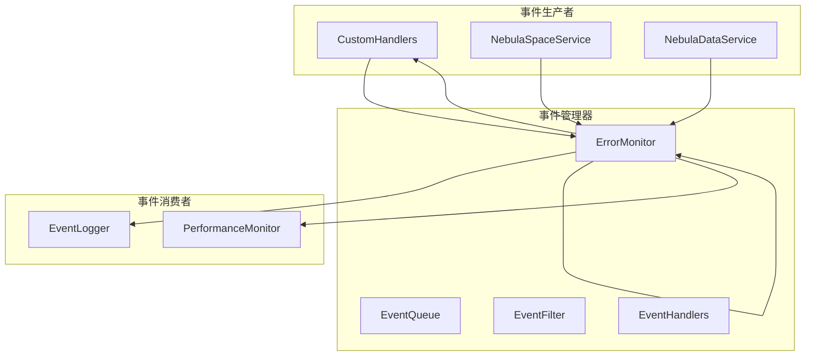

# NebulaEventManager 实现方案

## 📋 概述

本文档详细描述了 `NebulaEventManager` 事件管理系统的设计和实现方案，用于将事件处理逻辑从 `NebulaConnectionManager` 中分离出来，提供统一的事件发布、订阅和管理功能。

## 🎯 设计目标

### 核心功能
1. **事件发布**: 提供统一的事件发布接口
2. **事件订阅**: 支持多种事件订阅方式
3. **事件过滤**: 基于事件类型、来源等进行过滤
4. **性能监控**: 事件处理性能统计和监控
5. **错误处理**: 事件处理错误的统一处理

### 架构原则
- **单一职责**: 专门负责事件管理，不涉及业务逻辑
- **可扩展**: 支持多种事件源和事件类型
- **高性能**: 异步事件处理，避免阻塞主线程
- **可观察**: 提供事件流的监控和调试能力

## 📊 架构设计

### 系统架构



### 事件类型定义

```typescript
enum NebulaEventType {
  // 连接事件
  CONNECTION_OPENED = 'connection_opened',
  CONNECTION_CLOSED = 'connection_closed',
  CONNECTION_ERROR = 'connection_error',
  
  // 查询事件
  QUERY_EXECUTED = 'query_executed',
  QUERY_FAILED = 'query_failed',
  TRANSACTION_STARTED = 'transaction_started',
  TRANSACTION_COMPLETED = 'transaction_completed',
  
  // 空间事件
  SPACE_CREATED = 'space_created',
  SPACE_DELETED = 'space_deleted',
  SPACE_SELECTED = 'space_selected',
  
  // 系统事件
  SERVICE_INITIALIZED = 'service_initialized',
  SERVICE_SHUTDOWN = 'service_shutdown',
  CONFIG_UPDATED = 'config_updated'
}

interface NebulaEvent {
  type: NebulaEventType;
  source: string;
  timestamp: Date;
  data: Record<string, any>;
  error?: Error;
  correlationId?: string;
}
```

## 🔧 接口设计

### INebulaEventManager 接口

```typescript
interface INebulaEventManager {
  // 事件发布
  emit(event: NebulaEvent): void;
  emitAsync(event: NebulaEvent): Promise<void>;
  
  // 事件订阅
  on(eventType: NebulaEventType | string, handler: EventHandler): Subscription;
  once(eventType: NebulaEventType | string, handler: EventHandler): Subscription;
  off(subscription: Subscription): void;
  
  // 批量操作
  onMultiple(events: (NebulaEventType | string)[], handler: EventHandler): Subscription[];
  offMultiple(subscriptions: Subscription[]): void;
  
  // 查询和监控
  getEventStats(): EventStats;
  getActiveSubscriptions(): ActiveSubscription[];
  clearAll(): void;
  
  // 配置管理
  setConfig(config: EventManagerConfig): void;
  getConfig(): EventManagerConfig;
}

type EventHandler = (event: NebulaEvent) => void | Promise<void>;
interface Subscription { id: string; eventType: string; handler: EventHandler; }
```

## 🚀 实现细节

### 1. 核心事件管理器实现

```typescript
@injectable()
class NebulaEventManager implements INebulaEventManager {
  private handlers: Map<string, EventHandler[]> = new Map();
  private config: EventManagerConfig;
  private stats: EventStats = {
    totalEvents: 0,
    processedEvents: 0,
    failedEvents: 0,
    activeSubscriptions: 0
  };
  
  constructor(@inject(TYPES.ConfigService) private configService: ConfigService) {
    this.config = this.loadDefaultConfig();
  }
  
  emit(event: NebulaEvent): void {
    this.stats.totalEvents++;
    
    const handlers = this.handlers.get(event.type) || [];
    const allHandlers = this.handlers.get('*') || [];
    
    // 同步执行所有处理器
    [...handlers, ...allHandlers].forEach(handler => {
      try {
        handler(event);
        this.stats.processedEvents++;
      } catch (error) {
        this.stats.failedEvents++;
        this.handleHandlerError(error, event, handler);
      }
    });
  }
  
  async emitAsync(event: NebulaEvent): Promise<void> {
    this.stats.totalEvents++;
    
    const handlers = this.handlers.get(event.type) || [];
    const allHandlers = this.handlers.get('*') || [];
    
    // 异步执行所有处理器
    await Promise.allSettled(
      [...handlers, ...allHandlers].map(async handler => {
        try {
          await handler(event);
          this.stats.processedEvents++;
        } catch (error) {
          this.stats.failedEvents++;
          this.handleHandlerError(error, event, handler);
        }
      })
    );
  }
}
```

### 2. 订阅管理实现

```typescript
on(eventType: string, handler: EventHandler): Subscription {
  if (!this.handlers.has(eventType)) {
    this.handlers.set(eventType, []);
  }
  
  const handlers = this.handlers.get(eventType)!;
  handlers.push(handler);
  
  this.stats.activeSubscriptions++;
  
  return {
    id: uuidv4(),
    eventType,
    handler,
    unsubscribe: () => this.off({ id: uuidv4(), eventType, handler })
  };
}

off(subscription: Subscription): void {
  const handlers = this.handlers.get(subscription.eventType);
  if (handlers) {
    const index = handlers.indexOf(subscription.handler);
    if (index > -1) {
      handlers.splice(index, 1);
      this.stats.activeSubscriptions--;
    }
  }
}
```

### 3. 性能监控实现

```typescript
private async processWithMetrics(
  handler: EventHandler, 
  event: NebulaEvent
): Promise<void> {
  const startTime = Date.now();
  
  try {
    await handler(event);
    const duration = Date.now() - startTime;
    
    // 记录性能指标
    this.recordPerformanceMetrics(event.type, duration, true);
  } catch (error) {
    const duration = Date.now() - startTime;
    this.recordPerformanceMetrics(event.type, duration, false);
    throw error;
  }
}

private recordPerformanceMetrics(
  eventType: string, 
  duration: number, 
  success: boolean
): void {
  if (!this.performanceMetrics.has(eventType)) {
    this.performanceMetrics.set(eventType, {
      totalCount: 0,
      successCount: 0,
      failureCount: 0,
      totalDuration: 0,
      maxDuration: 0,
      minDuration: Infinity
    });
  }
  
  const metrics = this.performanceMetrics.get(eventType)!;
  metrics.totalCount++;
  metrics.totalDuration += duration;
  metrics.maxDuration = Math.max(metrics.maxDuration, duration);
  metrics.minDuration = Math.min(metrics.minDuration, duration);
  
  if (success) {
    metrics.successCount++;
  } else {
    metrics.failureCount++;
  }
}
```

## 🎯 集成计划

### 阶段一：事件管理器创建（3天）
1. 创建 `NebulaEventManager` 核心类
2. 实现基本的事件发布/订阅功能
3. 编写单元测试

### 阶段二：重构现有代码（4天）
1. 修改 `NebulaConnectionManager` 使用事件管理器
2. 更新其他服务使用统一的事件接口
3. 迁移现有的事件监听逻辑

### 阶段三：高级功能（3天）
1. 实现性能监控和统计
2. 添加事件过滤和路由功能
3. 实现持久化事件日志

### 阶段四：测试验证（2天）
1. 单元测试覆盖
2. 集成测试验证
3. 性能压力测试

## 📈 优势

### 架构改进
- **解耦合**: 事件生产者和消费者完全解耦
- **可扩展**: 轻松添加新的事件类型和处理器
- **可维护**: 事件逻辑集中管理

### 性能提升
- **异步处理**: 避免事件处理阻塞主线程
- **批量处理**: 支持批量事件处理
- **智能路由**: 基于事件类型进行智能路由

### 可观察性
- **实时监控**: 实时监控事件流状态
- **性能分析**: 详细的事件处理性能分析
- **错误追踪**: 完整的事件错误追踪

## 🧪 测试策略

### 单元测试
```typescript
describe('NebulaEventManager', () => {
  let eventManager: NebulaEventManager;
  
  beforeEach(() => {
    eventManager = new NebulaEventManager();
  });
  
  test('should emit events to registered handlers', () => {
    const mockHandler = jest.fn();
    eventManager.on('test_event', mockHandler);
    
    eventManager.emit({
      type: 'test_event',
      source: 'test',
      timestamp: new Date(),
      data: { message: 'test' }
    });
    
    expect(mockHandler).toHaveBeenCalledTimes(1);
  });
});
```

### 集成测试
- 与现有服务的集成测试
- 性能基准测试
- 并发处理测试

## 📋 实施时间表

| 阶段 | 时间 | 负责人 | 状态 |
|------|------|--------|------|
| 需求分析和设计 | 2天 | 架构师 | 📅 计划 |
| 核心功能实现 | 3天 | 开发团队 | 📅 计划 |
| 重构现有代码 | 4天 | 开发团队 | 📅 计划 |
| 高级功能开发 | 3天 | 开发团队 | 📅 计划 |
| 测试验证 | 2天 | QA团队 | 📅 计划 |

## ✅ 验收标准

1. **功能完整性**: 所有事件管理功能正常工作
2. **性能达标**: 事件处理延迟 < 10ms
3. **可靠性**: 事件不丢失，至少一次投递
4. **可扩展性**: 支持 1000+ 并发事件处理
5. **监控完备**: 完整的监控和统计功能

## 🎯 总结

`NebulaEventManager` 将显著提高系统的可观察性和可维护性，为分布式事件处理奠定坚实基础。建议立即开始第一阶段的设计和实现工作。