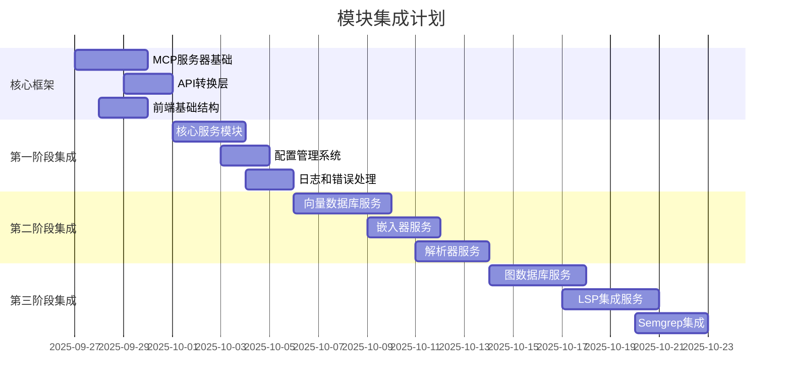

# 第一阶段实施计划：基础框架搭建

## 🎯 阶段目标

建立MCP服务的基础框架，包括：
1. MCP服务器核心框架
2. API转换层基础结构  
3. 前端基础界面
4. 模拟数据准备
5. 基本搜索功能（使用模拟数据）

## 📋 实施步骤

### 步骤1: 创建项目基础结构

```bash
# 创建必要的目录结构
mkdir -p src/{api,config,core,mcp,services,types}
mkdir -p frontend/{src,public}
mkdir -p data/mock
```

### 步骤2: 分析现有ref模块结构

基于对 `ref/` 目录的分析，制定以下分批集成计划：



### 步骤3: 创建模拟数据

在 `data/mock/` 目录下创建以下JSON文件：

**data/mock/code-snippets.json**
```json
{
  "snippets": [
    {
      "id": "snippet_001",
      "content": "function calculateTotal(items) {\n  return items.reduce((sum, item) => sum + item.price, 0);\n}",
      "filePath": "src/utils/math.js",
      "language": "javascript",
      "type": "function",
      "name": "calculateTotal",
      "metadata": {
        "parameters": ["items"],
        "returnType": "number"
      }
    },
    {
      "id": "snippet_002", 
      "content": "class UserService {\n  constructor() {\n    this.users = new Map();\n  }\n  \n  addUser(user) {\n    this.users.set(user.id, user);\n  }\n}",
      "filePath": "src/services/user.js",
      "language": "javascript", 
      "type": "class",
      "name": "UserService",
      "metadata": {
        "methods": ["addUser"],
        "properties": ["users"]
      }
    }
  ]
}
```

**data/mock/search-results.json**
```json
{
  "results": [
    {
      "id": "result_001",
      "score": 0.95,
      "snippetId": "snippet_001",
      "matchType": "semantic",
      "highlightedContent": "function <mark>calculateTotal</mark>(items) {\n  return items.reduce((sum, item) => sum + item.price, 0);\n}"
    }
  ]
}
```

### 步骤4: MCP服务器基础框架

创建 `src/mcp/MCPServer.ts`:

```typescript
import { McpServer } from '@modelcontextprotocol/sdk/server/mcp.js';
import { StdioServerTransport } from '@modelcontextprotocol/sdk/server/stdio.js';
import { z } from 'zod';

export class MCPServer {
  private server: McpServer;
  private transport: StdioServerTransport;

  constructor() {
    // 初始化MCP服务器
    this.server = new McpServer({
      name: 'codebase-index-mcp',
      version: '1.0.0',
      description: 'Intelligent codebase indexing and analysis service',
    });

    // 初始化传输层
    this.transport = new StdioServerTransport();

    // 注册工具
    this.setupToolHandlers();
  }

  private setupToolHandlers(): void {
    // 搜索工具
    this.server.tool(
      'codebase.search',
      {
        query: z.string().describe('Search query'),
        options: z.object({
          limit: z.number().optional().default(10),
          type: z.enum(['semantic', 'keyword', 'hybrid']).optional().default('semantic')
        }).optional()
      },
      async (args) => {
        const results = await this.handleSearch(args);
        return {
          content: [{ type: 'text', text: JSON.stringify(results) }]
        };
      }
    );

    // 状态检查工具
    this.server.tool(
      'codebase.status',
      {},
      async () => {
        const status = await this.getStatus();
        return {
          content: [{ type: 'text', text: JSON.stringify(status) }]
        };
      }
    );
  }

  private async handleSearch(args: any): Promise<any> {
    // 第一阶段使用模拟数据
    const mockData = await this.loadMockData();
    const query = args.query.toLowerCase();
    
    const results = mockData.snippets.filter(snippet => 
      snippet.content.toLowerCase().includes(query) ||
      snippet.name?.toLowerCase().includes(query)
    ).slice(0, args.options?.limit || 10);

    return {
      results: results.map((result, index) => ({
        id: `result_${index + 1}`,
        score: 0.9 - (index * 0.1),
        snippet: result,
        matchType: 'keyword'
      })),
      total: results.length,
      query: args.query
    };
  }

  private async loadMockData(): Promise<any> {
    // 在实际实现中会从文件系统读取
    return {
      snippets: [
        {
          id: "snippet_001",
          content: "function calculateTotal(items) {\n  return items.reduce((sum, item) => sum + item.price, 0);\n}",
          filePath: "src/utils/math.js",
          language: "javascript",
          type: "function",
          name: "calculateTotal"
        }
      ]
    };
  }

  private async getStatus(): Promise<any> {
    return {
      status: 'ready',
      version: '1.0.0',
      features: ['search'],
      mockMode: true
    };
  }

  async start(): Promise<void> {
    await this.server.connect(this.transport);
    console.log('MCP Server started successfully');
  }

  async stop(): Promise<void> {
    this.server.close();
    console.log('MCP Server stopped');
  }
}
```

### 步骤5: API转换层

创建 `src/api/ApiServer.ts`:

```typescript
import express from 'express';
import cors from 'cors';

export class ApiServer {
  private app: express.Application;
  private port: number;

  constructor(port: number = 3000) {
    this.app = express();
    this.port = port;

    this.setupMiddleware();
    this.setupRoutes();
  }

  private setupMiddleware(): void {
    this.app.use(cors());
    this.app.use(express.json());
  }

  private setupRoutes(): void {
    // 搜索端点
    this.app.post('/api/search', async (req, res) => {
      try {
        const { query, options } = req.body;
        
        // 模拟MCP工具调用
        const results = {
          results: [
            {
              id: 'mock_result_1',
              score: 0.95,
              snippet: {
                content: `// Mock result for: ${query}`,
                filePath: 'src/mock/file.js',
                language: 'javascript'
              }
            }
          ],
          total: 1,
          query
        };

        res.json({ success: true, data: results });
      } catch (error) {
        res.status(500).json({ 
          success: false, 
          error: error instanceof Error ? error.message : 'Unknown error' 
        });
      }
    });

    // 状态端点
    this.app.get('/api/status', (req, res) => {
      res.json({
        status: 'ready',
        version: '1.0.0',
        mockMode: true
      });
    });
  }

  start(): void {
    this.app.listen(this.port, () => {
      console.log(`API Server running on port ${this.port}`);
    });
  }
}
```

### 步骤6: 前端基础结构

**frontend/package.json**
```json
{
  "name": "codebase-index-frontend",
  "version": "1.0.0",
  "description": "Frontend for codebase index MCP service",
  "type": "module",
  "scripts": {
    "dev": "vite",
    "build": "tsc && vite build",
    "preview": "vite preview"
  },
  "dependencies": {
    "typescript": "^5.0.0"
  },
  "devDependencies": {
    "vite": "^5.0.0",
    "@types/node": "^20.0.0"
  }
}
```

**frontend/src/app.ts**
```typescript
class CodebaseSearchApp {
  private apiBaseUrl: string;

  constructor(apiBaseUrl: string = 'http://localhost:3000') {
    this.apiBaseUrl = apiBaseUrl;
    this.initialize();
  }

  private initialize(): void {
    this.setupEventListeners();
    this.updateStatus();
  }

  private setupEventListeners(): void {
    const searchForm = document.getElementById('search-form');
    const searchInput = document.getElementById('search-input') as HTMLInputElement;

    searchForm?.addEventListener('submit', (e) => {
      e.preventDefault();
      this.performSearch(searchInput.value);
    });
  }

  private async performSearch(query: string): Promise<void> {
    try {
      const response = await fetch(`${this.apiBaseUrl}/api/search`, {
        method: 'POST',
        headers: { 'Content-Type': 'application/json' },
        body: JSON.stringify({ query })
      });

      const result = await response.json();
      this.displayResults(result);
    } catch (error) {
      this.displayError(error);
    }
  }

  private displayResults(result: any): void {
    const resultsContainer = document.getElementById('results-container');
    if (!resultsContainer) return;

    if (result.success && result.data.results.length > 0) {
      resultsContainer.innerHTML = result.data.results.map((item: any) => `
        <div class="result-item">
          <div class="score">Score: ${item.score.toFixed(2)}</div>
          <pre class="code">${item.snippet.content}</pre>
          <div class="file-path">${item.snippet.filePath}</div>
        </div>
      `).join('');
    } else {
      resultsContainer.innerHTML = '<div class="no-results">No results found</div>';
    }
  }

  private displayError(error: any): void {
    const resultsContainer = document.getElementById('results-container');
    if (resultsContainer) {
      resultsContainer.innerHTML = `
        <div class="error">
          Error: ${error instanceof Error ? error.message : 'Unknown error'}
        </div>
      `;
    }
  }

  private async updateStatus(): Promise<void> {
    try {
      const response = await fetch(`${this.apiBaseUrl}/api/status`);
      const status = await response.json();
      
      const statusElement = document.getElementById('status');
      if (statusElement) {
        statusElement.textContent = `Status: ${status.status} ${status.mockMode ? '(Mock Mode)' : ''}`;
      }
    } catch (error) {
      console.error('Failed to get status:', error);
    }
  }
}

// 启动应用
new CodebaseSearchApp();
```

### 步骤7: 主应用入口

创建 `src/main.ts`:

```typescript
import { MCPServer } from './mcp/MCPServer.js';
import { ApiServer } from './api/ApiServer.js';

class Application {
  private mcpServer: MCPServer;
  private apiServer: ApiServer;

  constructor() {
    this.mcpServer = new MCPServer();
    this.apiServer = new ApiServer();
  }

  async start(): Promise<void> {
    try {
      // 启动MCP服务器
      await this.mcpServer.start();
      
      // 启动API服务器
      this.apiServer.start();

      console.log('Application started successfully');
      console.log('MCP Server: Ready for MCP connections');
      console.log('API Server: http://localhost:3000');
      
    } catch (error) {
      console.error('Failed to start application:', error);
      process.exit(1);
    }
  }

  async stop(): Promise<void> {
    await this.mcpServer.stop();
    console.log('Application stopped');
  }
}

// 启动应用
const app = new Application();
app.start().catch(console.error);

// 优雅关闭
process.on('SIGINT', async () => {
  await app.stop();
  process.exit(0);
});

process.on('SIGTERM', async () => {
  await app.stop();
  process.exit(0);
});
```

## 🧪 测试计划

### 单元测试
- MCP工具处理测试
- API端点测试
- 前端功能测试

### 集成测试
- MCP协议通信测试
- API到前端集成测试
- 模拟数据搜索测试

### 测试命令
```bash
# 运行测试
npm test

# 开发模式运行
npm run dev

# 构建项目
npm run build
```

## 📊 成功标准

1. ✅ MCP服务器能够启动并响应工具调用
2. ✅ API服务器能够处理HTTP请求
3. ✅ 前端界面能够显示搜索结果
4. ✅ 搜索功能使用模拟数据正常工作
5. ✅ 所有组件能够协同工作

## ⚠️ 风险与缓解

### 技术风险
- **MCP协议兼容性**: 使用官方SDK确保兼容性
- **跨平台问题**: 测试在不同操作系统上的运行

### 开发风险  
- **模块依赖**: 明确模块边界，减少耦合
- **数据一致性**: 使用模拟数据避免数据一致性问题

### 缓解策略
- 分阶段开发，每个阶段都有可测试的成果
- 编写全面的测试用例
- 使用TypeScript确保类型安全

## 🔄 下一步计划

完成第一阶段后，下一步将：
1. 集成真实的数据库服务
2. 实现真正的嵌入器功能
3. 添加更多的搜索算法
4. 实现实时索引更新功能

---

*文档版本: 1.0*
*创建日期: 2025-09-27*