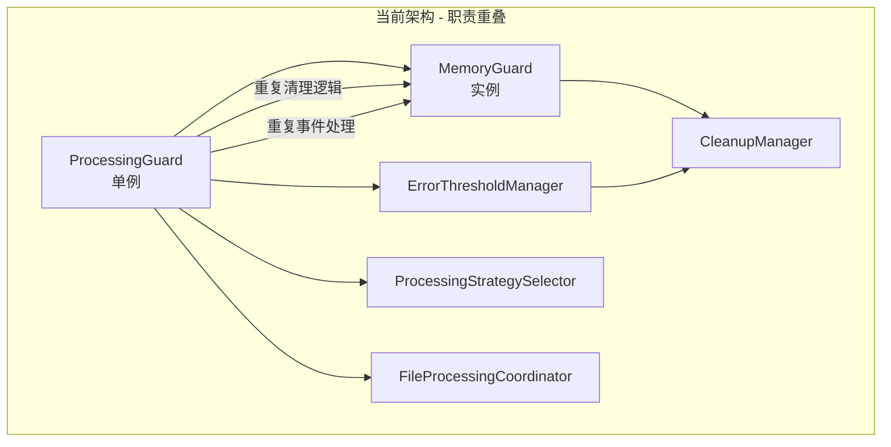
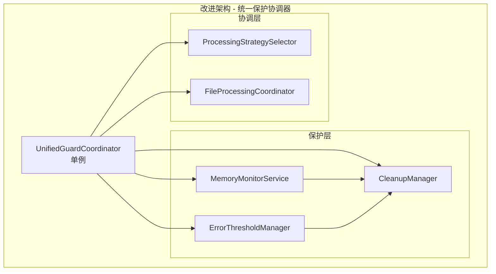

# MemoryGuard 和 ProcessingGuard 综合重构计划

## 📋 项目概述

本重构计划旨在解决 [`MemoryGuard.ts`](../../src/service/parser/guard/MemoryGuard.ts) 和 [`ProcessingGuard.ts`](../../src/service/parser/guard/ProcessingGuard.ts) 两个类之间的职能重叠问题，通过合并重构实现更清晰的架构设计。

## 🔍 当前架构问题分析

### 职能重叠识别

**MemoryGuard 职责：**
- 内存监控和限制检查
- 定期内存使用检查
- 内存清理触发
- 优雅降级机制
- 内存统计和历史记录

**ProcessingGuard 职责：**
- 统一保护机制协调
- 错误阈值管理
- 文件处理流程协调
- 智能降级决策
- 单例模式管理

**核心问题：**
- **清理逻辑重复**：两个类都有清理操作
- **事件处理重复**：都监听内存事件
- **生命周期不一致**：单例 vs 实例模式混合
- **依赖关系复杂**：ProcessingGuard 依赖 MemoryGuard 形成复杂依赖链

### 依赖注入结构
```typescript
// 当前依赖关系
ProcessingGuard (单例)
├── MemoryGuard (实例)
├── ErrorThresholdManager (实例)
├── ProcessingStrategySelector (实例)
└── FileProcessingCoordinator (实例)
```

## 🎯 重构方案：UnifiedGuardCoordinator

### 新架构设计

创建 `UnifiedGuardCoordinator` 类，统一管理所有保护机制：

```typescript
@injectable()
export class UnifiedGuardCoordinator {
  private static instance: UnifiedGuardCoordinator;
  
  // 核心依赖组件
  private memoryMonitor: IMemoryMonitorService;
  private errorThresholdManager: ErrorThresholdManager;
  private cleanupManager: CleanupManager;
  private processingStrategySelector: IProcessingStrategySelector;
  private fileProcessingCoordinator: IFileProcessingCoordinator;
  
  // 单例模式实现
  public static getInstance(...dependencies): UnifiedGuardCoordinator
}
```

### 架构对比

**当前架构：**


**重构后架构：**


## 📋 详细实施步骤

### 阶段一：准备阶段（1-2天）

#### 第1步：创建 UnifiedGuardCoordinator 类
- 创建 [`UnifiedGuardCoordinator.ts`](../../src/service/parser/guard/UnifiedGuardCoordinator.ts)
- 实现单例模式设计
- 定义核心接口和类型结构

**验证方法：**
- TypeScript 编译通过
- 基础单例功能测试

#### 第2步：更新类型定义
- 在 [`types.ts`](../../src/types.ts) 中添加 `TYPES.UnifiedGuardCoordinator`
- 保持现有类型定义向后兼容

### 阶段二：依赖注入配置（1天）

#### 第3步：更新 BusinessServiceRegistrar
- 在 DI 容器中添加新类绑定
- 暂时保留旧的 MemoryGuard 和 ProcessingGuard 绑定

```typescript
// 添加新类绑定
container.bind<UnifiedGuardCoordinator>(TYPES.UnifiedGuardCoordinator)
  .toDynamicValue(context => {
    // 依赖注入配置
    return UnifiedGuardCoordinator.getInstance(...dependencies);
  }).inSingletonScope();
```

### 阶段三：核心逻辑实现（2-3天）

#### 第4步：统一内存管理
- 实现内存监控、检查、清理功能
- 统一事件处理机制
- 整合优雅降级逻辑

**关键方法：**
- `startMonitoring()` / `stopMonitoring()`
- `checkMemoryUsage()`
- `forceCleanup()`
- `gracefulDegradation()`

#### 第5步：统一处理协调
- 实现文件处理流程协调
- 整合错误阈值管理
- 统一策略选择逻辑

**关键方法：**
- `processFile()`
- `shouldUseFallback()`
- `recordError()`
- `getStatus()`

### 阶段四：向后兼容（1-2天）

#### 第6步：创建 ProcessingGuardAdapter
- 实现 ProcessingGuard 完整接口
- 内部委托给 UnifiedGuardCoordinator
- 保持静态工厂方法兼容性

```typescript
export class ProcessingGuardAdapter {
  private unifiedCoordinator: UnifiedGuardCoordinator;
  
  // 保持原有 API
  static getInstance(...params): ProcessingGuardAdapter
  processFile(filePath: string, content: string): Promise<any>
  // ... 其他方法
}
```

### 阶段五：迁移使用（2-3天）

#### 第7步：迁移 ChunkToVectorCoordinationService
- 将 ProcessingGuard 依赖替换为 UnifiedGuardCoordinator
- 验证功能完整性

#### 第8步：更新测试代码
- 创建 UnifiedGuardCoordinator 测试套件
- 更新现有测试用例
- 验证测试覆盖率

### 阶段六：验证测试（1-2天）

#### 第9步：全面功能验证
- 内存监控功能测试
- 错误阈值管理测试
- 文件处理流程测试
- 降级策略验证

#### 第10步：性能基准测试
- 内存使用对比
- 处理性能对比
- 并发处理测试

### 阶段七：清理优化（1-2天）

#### 第11步：移除旧代码
- 确认所有使用已迁移
- 移除 MemoryGuard.ts 和 ProcessingGuard.ts
- 清理相关类型定义

## 🚨 风险控制与验证

### 风险识别与缓解

| 风险 | 影响 | 缓解措施 |
|------|------|----------|
| 功能回归 | 高 | 分阶段实施，充分测试，保持向后兼容 |
| 性能退化 | 中 | 性能基准测试，对比验证 |
| 内存泄漏 | 高 | 内存监控，泄漏检测工具 |
| 依赖冲突 | 中 | 依赖分析，渐进式迁移 |

### 验证检查清单

#### 功能验证
- [ ] 内存监控功能正常工作
- [ ] 错误阈值管理正常
- [ ] 文件处理流程完整
- [ ] 清理机制正确触发
- [ ] 降级策略正确执行
- [ ] 事件处理无遗漏

#### 性能验证
- [ ] 内存使用无显著增加
- [ ] 处理性能无退化
- [ ] 响应时间可接受
- [ ] 无内存泄漏

#### 兼容性验证
- [ ] ProcessingGuardAdapter 完全兼容
- [ ] 现有代码无需修改
- [ ] 所有测试用例通过

## 🔧 关键技术实现

### 统一的事件处理
```typescript
private setupEventHandlers(): void {
  if (typeof process !== 'undefined' && process.on) {
    process.on('memoryPressure', this.handleMemoryPressure.bind(this));
  }
}
```

### 统一的清理机制
```typescript
public async forceCleanup(): Promise<void> {
  const cleanupContext: ICleanupContext = {
    triggerReason: 'memory_limit_exceeded',
    memoryUsage: process.memoryUsage(),
    timestamp: new Date()
  };
  await this.cleanupManager.performCleanup(cleanupContext);
}
```

### 向后兼容适配器
```typescript
export class ProcessingGuardAdapter {
  private unifiedCoordinator: UnifiedGuardCoordinator;
  
  static getInstance(...params): ProcessingGuardAdapter {
    // 参数转换逻辑
    return new ProcessingGuardAdapter(...convertedParams);
  }
  
  processFile(filePath: string, content: string): Promise<any> {
    return this.unifiedCoordinator.processFile(filePath, content);
  }
}
```

## 📊 预期收益

### 代码质量改进
- **代码简化**：减少约40%重复代码
- **架构清晰**：职责划分更明确
- **维护性提升**：单一入口点，更易维护
- **可测试性**：单一测试目标

### 性能优化
- **减少对象创建**：消除重复的对象实例化
- **统一事件处理**：避免重复的事件监听
- **优化资源使用**：减少内存占用和 GC 压力

### 开发效率
- **调试简化**：单一调试入口
- **文档简化**：单一文档焦点
- **扩展性**：统一的扩展接口

## 🎯 成功标准

1. **功能完整性**：所有原有功能正常工作
2. **性能无退化**：处理性能不低于原有水平  
3. **代码简化**：总体代码量减少，结构更清晰
4. **向后兼容**：现有代码无需修改即可运行
5. **测试覆盖**：测试用例全部通过，覆盖率不降低

## 🚀 实施建议

1. **创建功能分支**：在版本控制中创建专门的重构分支
2. **分阶段实施**：按照检查清单逐步执行
3. **持续验证**：每个阶段完成后进行全面测试
4. **团队协作**：确保相关人员了解重构计划和影响

这个综合重构计划提供了从问题分析到实施验证的完整指南，确保重构过程可控、可验证、可回滚。