# Parser Query模块架构图

## 📋 当前架构图

### 整体架构关系图

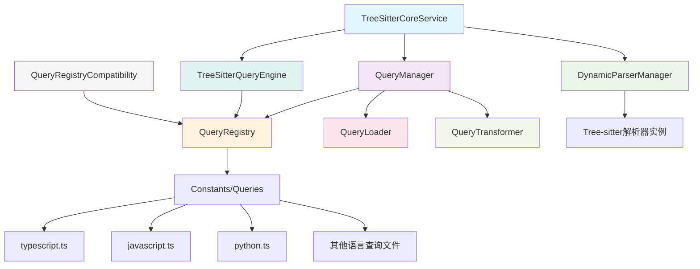

### 数据流图

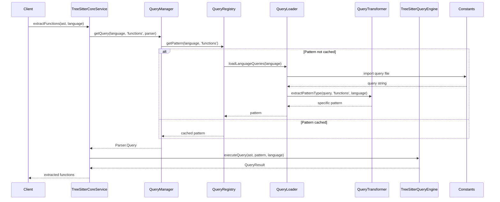

### 缓存层次图

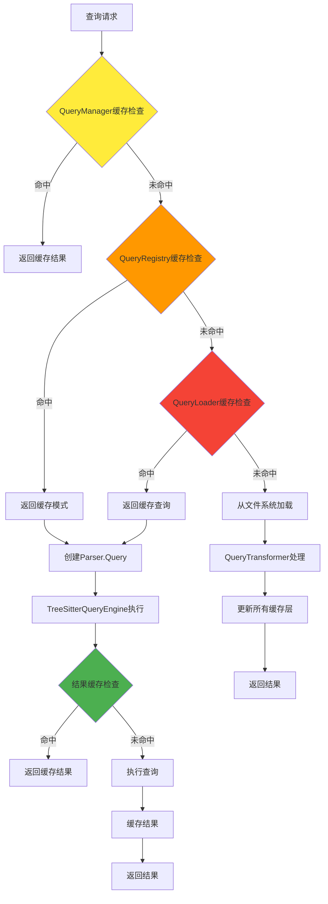

## 🚀 第一阶段优化后架构图

### 原生API集成架构

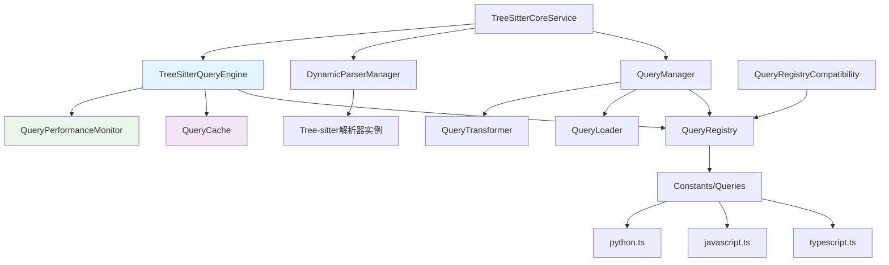

### 优化后的数据流

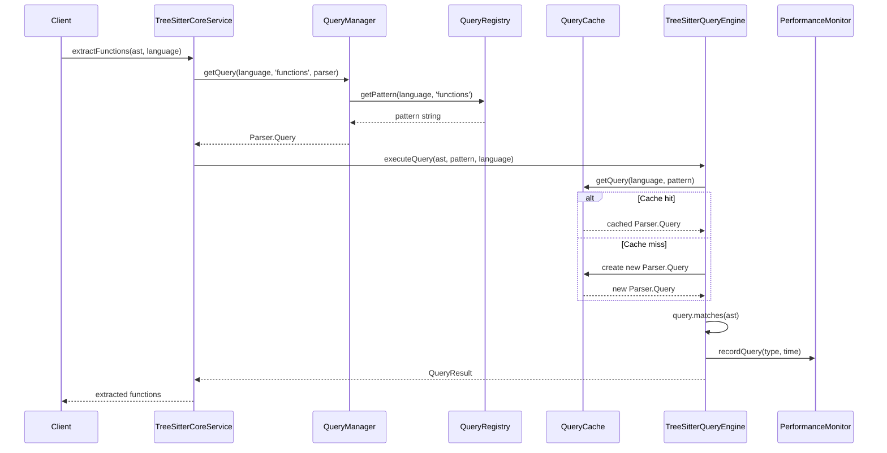

## 📁 第二阶段优化后架构图

### 新查询文件结构

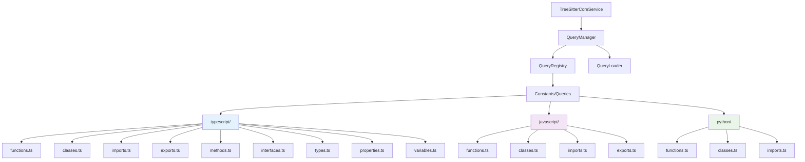

### 简化的查询加载流程

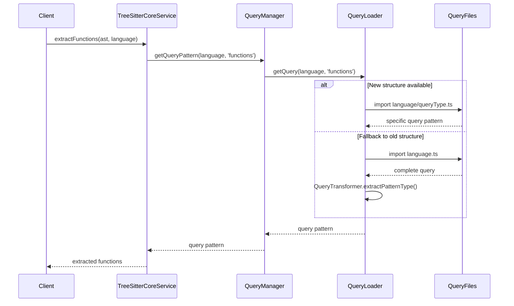

## 🔧 第三阶段可选优化架构图

### 简化接口架构

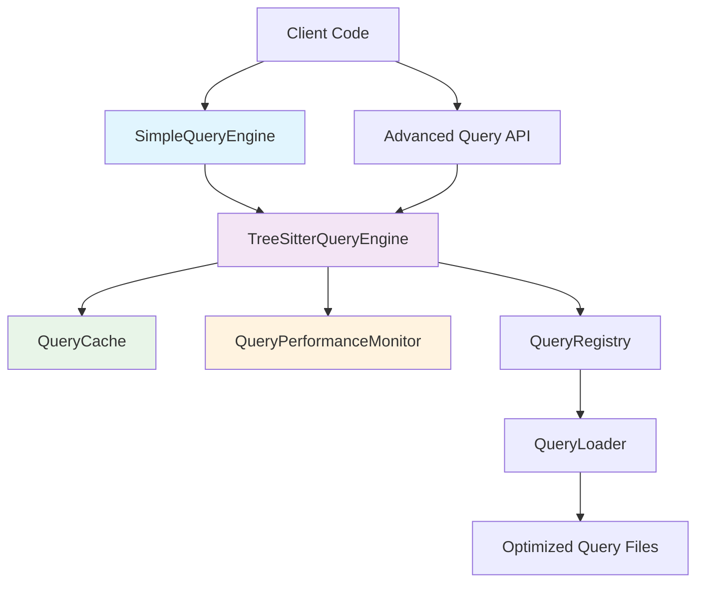

### 双层API架构

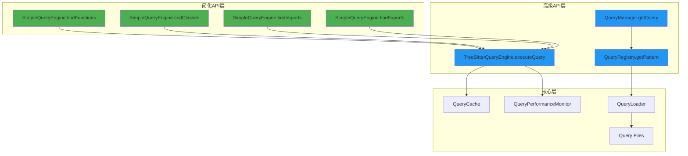

## 📊 性能对比图

### 查询执行时间对比

```mermaid
gantt
    title 查询执行时间对比（毫秒）
    dateFormat X
    axisFormat %s
    
    section 当前实现
    函数查询     :0, 50
    类查询       :0, 60
    导入查询     :0, 40
    导出查询     :0, 45
    
    section 第一阶段优化
    函数查询     :0, 20
    类查询       :0, 25
    导入查询     :0, 15
    导出查询     :0, 18
    
    section 第二阶段优化
    函数查询     :0, 15
    类查询       :0, 18
    导入查询     :0, 12
    导出查询     :0, 14
```

### 缓存命中率对比

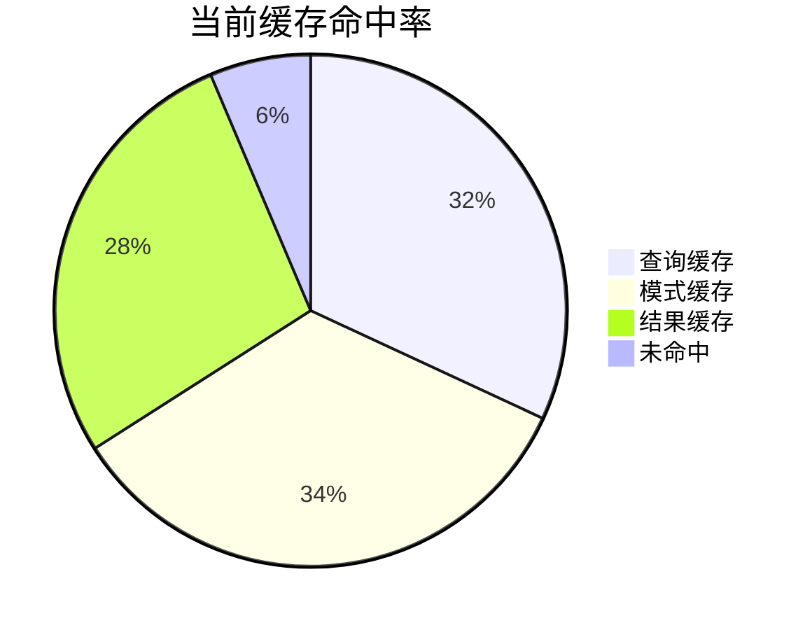

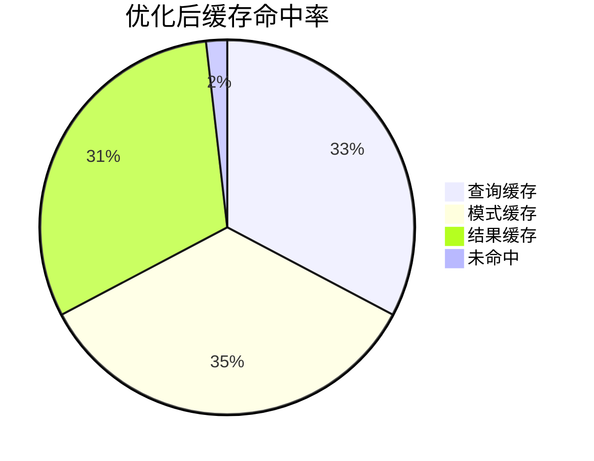

## 🔄 组件交互图

### 详细组件交互

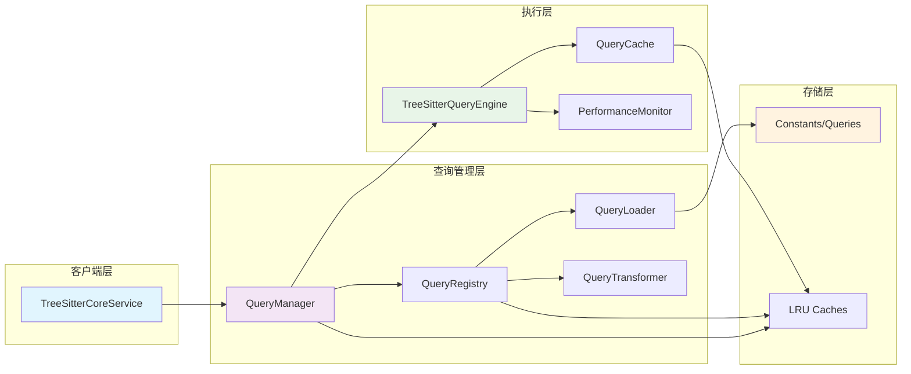

### 错误处理流程

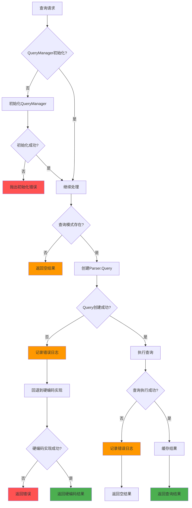

## 📈 监控架构图

### 性能监控系统

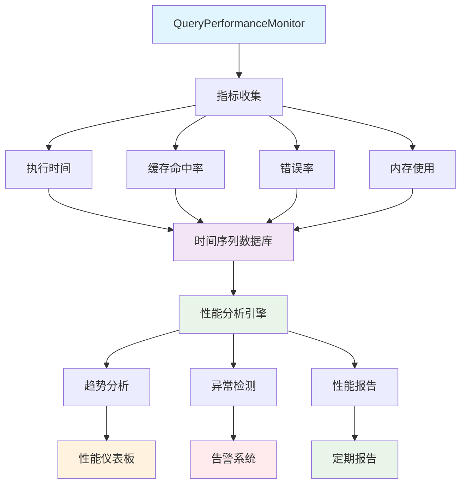

### 缓存监控架构

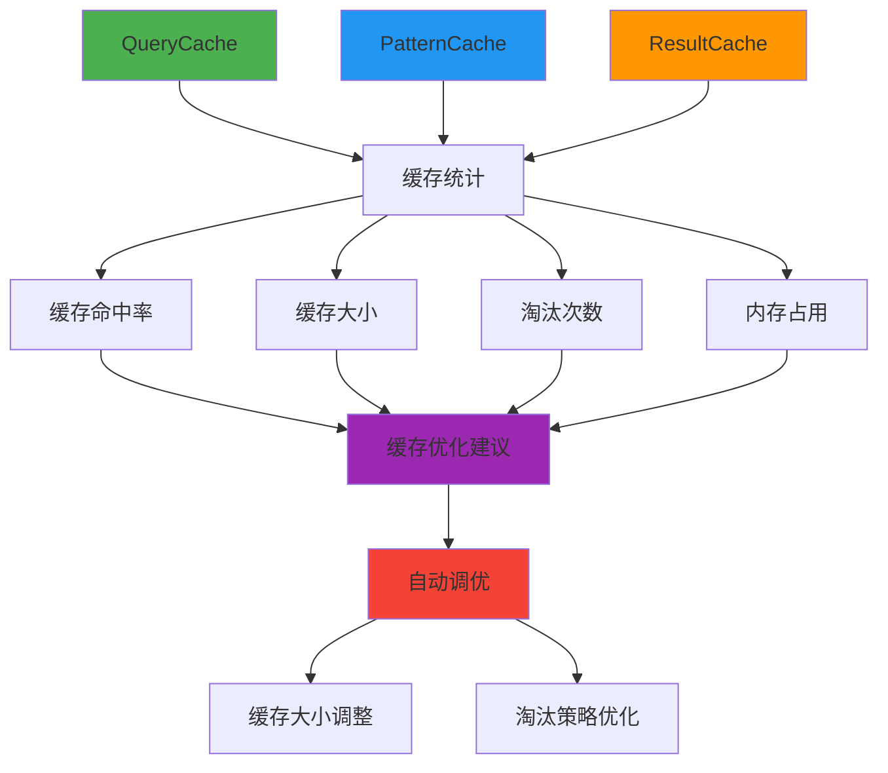

## 🎯 架构演进路径

### 演进时间线

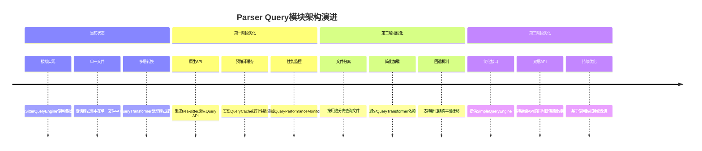

### 技术债务清理

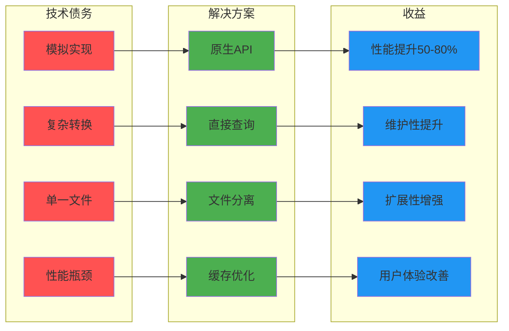

这些架构图清晰地展示了Parser Query模块的当前状态、优化路径和最终目标，为实施团队提供了可视化的指导。