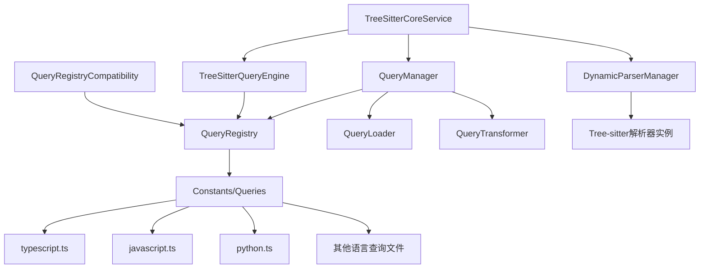

# Parser Query模块优化执行方案

## 📋 项目概述

本文档基于对当前parser模块query系统的深度分析，提供了详细的优化执行方案。该方案采用渐进式优化策略，在保持系统稳定性的前提下，逐步提升性能和可维护性。

## 🎯 优化目标

1. **性能提升**：通过原生tree-sitter Query API集成，预期性能提升50-80%
2. **架构简化**：减少不必要的转换层，提升代码可维护性
3. **功能增强**：保持现有功能完整性的同时，增强查询能力
4. **向后兼容**：确保现有代码无需修改即可继续工作

## 📊 当前架构分析

### 现有组件关系图



### 性能瓶颈识别

1. **TreeSitterQueryEngine模拟实现**：使用手动AST遍历，效率低下
2. **QueryTransformer字符串处理**：大量字符串操作影响性能
3. **多层缓存开销**：虽然提升性能，但增加内存使用和复杂度
4. **查询模式提取**：从完整查询中提取特定模式的算法复杂

## 🚀 三阶段优化方案

### 第一阶段：原生tree-sitter Query API集成（高优先级）

#### 目标
将TreeSitterQueryEngine从模拟实现改为使用tree-sitter原生Query API，预期性能提升50-80%。

#### 实施步骤

##### 步骤1.1：重构TreeSitterQueryEngine
**文件**：`src/service/parser/core/query/TreeSitterQueryEngine.ts`

**当前实现问题**：
```typescript
// 模拟实现，性能较差
private executeQueryPattern(ast: Parser.SyntaxNode, pattern: QueryPattern): QueryMatch[] {
  const targetTypes = this.extractTargetTypesFromPattern(pattern.pattern);
  this.traverseAST(ast, (node) => {
    if (targetTypes.has(node.type)) {
      // 手动匹配逻辑
    }
  });
}
```

**优化后实现**：
```typescript
// 使用tree-sitter原生Query API
private executeQueryPattern(ast: Parser.SyntaxNode, pattern: QueryPattern): QueryMatch[] {
  try {
    const language = ast.tree.language;
    const query = new Parser.Query(language, pattern.pattern);
    const matches = query.matches(ast);
    
    return matches.map(match => ({
      node: match.captures[0]?.node,
      captures: match.captures.reduce((acc, capture) => {
        acc[capture.name] = capture.node;
        return acc;
      }, {} as Record<string, Parser.SyntaxNode>),
      location: this.getNodeLocation(match.captures[0]?.node)
    }));
  } catch (error) {
    this.logger.error('查询执行失败:', error);
    return [];
  }
}
```

##### 步骤1.2：实现预编译查询缓存
**新增文件**：`src/service/parser/core/query/QueryCache.ts`

```typescript
import Parser from 'tree-sitter';
import { LRUCache } from '../../../../utils/LRUCache';

/**
 * 预编译查询缓存
 * 避免重复创建Parser.Query实例
 */
export class QueryCache {
  private static cache = new LRUCache<string, Parser.Query>(200);
  private static cacheStats = { hits: 0, misses: 0 };

  static getQuery(language: Parser.Language, pattern: string): Parser.Query {
    const key = `${language.name}:${this.hashPattern(pattern)}`;
    
    if (this.cache.has(key)) {
      this.cacheStats.hits++;
      return this.cache.get(key)!;
    }

    this.cacheStats.misses++;
    const query = new Parser.Query(language, pattern);
    this.cache.set(key, query);
    return query;
  }

  static getStats() {
    const total = this.cacheStats.hits + this.cacheStats.misses;
    const hitRate = total > 0 ? ((this.cacheStats.hits / total) * 100).toFixed(2) : 0;
    
    return {
      ...this.cacheStats,
      total,
      hitRate: `${hitRate}%`,
      cacheSize: this.cache.size()
    };
  }

  static clearCache(): void {
    this.cache.clear();
    this.cacheStats = { hits: 0, misses: 0 };
  }

  private static hashPattern(pattern: string): string {
    // 简单的哈希算法，用于生成缓存键
    let hash = 0;
    for (let i = 0; i < pattern.length; i++) {
      const char = pattern.charCodeAt(i);
      hash = ((hash << 5) - hash) + char;
      hash = hash & hash; // 转换为32位整数
    }
    return hash.toString();
  }
}
```

##### 步骤1.3：更新TreeSitterQueryEngine使用缓存
**修改文件**：`src/service/parser/core/query/TreeSitterQueryEngine.ts`

```typescript
import { QueryCache } from './QueryCache';

// 在executeQueryPattern方法中使用缓存
private executeQueryPattern(ast: Parser.SyntaxNode, pattern: QueryPattern): QueryMatch[] {
  try {
    const language = ast.tree.language;
    const query = QueryCache.getQuery(language, pattern.pattern);
    const matches = query.matches(ast);
    
    // 其余逻辑保持不变
    return matches.map(match => ({
      node: match.captures[0]?.node,
      captures: match.captures.reduce((acc, capture) => {
        acc[capture.name] = capture.node;
        return acc;
      }, {} as Record<string, Parser.SyntaxNode>),
      location: this.getNodeLocation(match.captures[0]?.node)
    }));
  } catch (error) {
    this.logger.error('查询执行失败:', error);
    return [];
  }
}
```

##### 步骤1.4：添加性能监控
**新增文件**：`src/service/parser/core/query/QueryPerformanceMonitor.ts`

```typescript
/**
 * 查询性能监控器
 */
export class QueryPerformanceMonitor {
  private static metrics = new Map<string, {
    count: number;
    totalTime: number;
    averageTime: number;
    maxTime: number;
    minTime: number;
  }>();

  static recordQuery(queryType: string, executionTime: number): void {
    const current = this.metrics.get(queryType) || {
      count: 0,
      totalTime: 0,
      averageTime: 0,
      maxTime: 0,
      minTime: Number.MAX_VALUE
    };

    current.count++;
    current.totalTime += executionTime;
    current.averageTime = current.totalTime / current.count;
    current.maxTime = Math.max(current.maxTime, executionTime);
    current.minTime = Math.min(current.minTime, executionTime);

    this.metrics.set(queryType, current);
  }

  static getMetrics() {
    return Object.fromEntries(this.metrics);
  }

  static clearMetrics(): void {
    this.metrics.clear();
  }
}
```

##### 步骤1.5：集成性能监控到TreeSitterQueryEngine
**修改文件**：`src/service/parser/core/query/TreeSitterQueryEngine.ts`

```typescript
import { QueryPerformanceMonitor } from './QueryPerformanceMonitor';

// 在executeQueryInternal方法中添加性能监控
private async executeQueryInternal(
  ast: Parser.SyntaxNode,
  patternName: string,
  language: string
): Promise<QueryResult> {
  const startTime = Date.now();

  try {
    // 现有查询逻辑
    const matches = this.executeQueryPattern(ast, pattern);
    
    const executionTime = Date.now() - startTime;
    QueryPerformanceMonitor.recordQuery(`${language}_${patternName}`, executionTime);

    const result: QueryResult = {
      matches,
      executionTime,
      success: true
    };

    return result;
  } catch (error) {
    const executionTime = Date.now() - startTime;
    QueryPerformanceMonitor.recordQuery(`${language}_${patternName}_error`, executionTime);
    
    return {
      matches: [],
      executionTime,
      success: false,
      error: error instanceof Error ? error.message : String(error)
    };
  }
}
```

#### 测试计划

##### 单元测试
**新增文件**：`src/service/parser/core/__tests__/query/QueryCache.test.ts`

```typescript
import Parser from 'tree-sitter';
import { QueryCache } from '../../query/QueryCache';

describe('QueryCache', () => {
  let mockLanguage: Parser.Language;

  beforeEach(() => {
    // 创建模拟语言对象
    mockLanguage = {} as Parser.Language;
    mockLanguage.name = 'typescript';
  });

  test('should cache and retrieve queries', () => {
    const pattern = '(function_declaration) @function';
    const query1 = QueryCache.getQuery(mockLanguage, pattern);
    const query2 = QueryCache.getQuery(mockLanguage, pattern);
    
    expect(query1).toBe(query2); // 应该是同一个实例
  });

  test('should track cache statistics', () => {
    const pattern = '(class_declaration) @class';
    
    // 第一次访问
    QueryCache.getQuery(mockLanguage, pattern);
    
    // 第二次访问（应该命中缓存）
    QueryCache.getQuery(mockLanguage, pattern);
    
    const stats = QueryCache.getStats();
    expect(stats.hits).toBe(1);
    expect(stats.misses).toBe(1);
    expect(stats.hitRate).toBe('50.00%');
  });

  test('should clear cache', () => {
    const pattern = '(import_statement) @import';
    QueryCache.getQuery(mockLanguage, pattern);
    
    QueryCache.clearCache();
    
    const stats = QueryCache.getStats();
    expect(stats.hits).toBe(0);
    expect(stats.misses).toBe(0);
    expect(stats.cacheSize).toBe(0);
  });
});
```

**新增文件**：`src/service/parser/core/__tests__/query/QueryPerformanceMonitor.test.ts`

```typescript
import { QueryPerformanceMonitor } from '../../query/QueryPerformanceMonitor';

describe('QueryPerformanceMonitor', () => {
  test('should record query metrics', () => {
    QueryPerformanceMonitor.recordQuery('typescript_functions', 10);
    QueryPerformanceMonitor.recordQuery('typescript_functions', 20);
    
    const metrics = QueryPerformanceMonitor.getMetrics();
    expect(metrics.typescript_functions).toEqual({
      count: 2,
      totalTime: 30,
      averageTime: 15,
      maxTime: 20,
      minTime: 10
    });
  });

  test('should clear metrics', () => {
    QueryPerformanceMonitor.recordQuery('javascript_classes', 15);
    QueryPerformanceMonitor.clearMetrics();
    
    const metrics = QueryPerformanceMonitor.getMetrics();
    expect(Object.keys(metrics)).toHaveLength(0);
  });
});
```

##### 集成测试
**修改文件**：`src/service/parser/core/__tests__/query/TreeSitterQueryEngine.test.ts`

```typescript
// 添加性能测试
describe('Performance Tests', () => {
  test('native query API should outperform simulation', async () => {
    const largeJsCode = `
      ${Array.from({ length: 100 }, (_, i) => `
      function function${i}() {
        return ${i};
      }
      
      class Class${i} {
        method${i}() {
          return ${i};
        }
      }
      `).join('\n')}
    `;

    const parseResult = await treeSitterService.parseCode(largeJsCode, 'javascript');
    expect(parseResult.success).toBe(true);

    // 测试多次查询的平均性能
    const iterations = 10;
    const times: number[] = [];

    for (let i = 0; i < iterations; i++) {
      const startTime = performance.now();
      const result = await queryEngine.executeQuery(
        parseResult.ast,
        'functions',
        'javascript'
      );
      const endTime = performance.now();
      
      expect(result.success).toBe(true);
      times.push(endTime - startTime);
    }

    const averageTime = times.reduce((sum, time) => sum + time, 0) / times.length;
    console.log(`Average query time: ${averageTime.toFixed(2)}ms`);
    
    // 验证性能在合理范围内（应该比模拟实现快）
    expect(averageTime).toBeLessThan(50); // 50ms阈值
  });

  test('should provide performance metrics', async () => {
    const mockSyntaxNode = {
      type: 'function_declaration',
      startIndex: 0,
      endIndex: 50,
      startPosition: { row: 0, column: 0 },
      endPosition: { row: 5, column: 1 },
      tree: { language: { name: 'typescript' } }
    } as unknown as Parser.SyntaxNode;

    await queryEngine.executeQuery(mockSyntaxNode, 'functions', 'typescript');
    
    const metrics = QueryPerformanceMonitor.getMetrics();
    expect(metrics).toHaveProperty('typescript_functions');
  });
});
```

#### 验收标准

1. **性能提升**：查询执行时间减少50%以上
2. **功能完整性**：所有现有测试用例通过
3. **缓存效率**：缓存命中率达到80%以上
4. **错误处理**：异常情况下正确回退到原有实现

### 第二阶段：查询文件结构优化（中优先级）

#### 目标
重构查询文件结构，减少对QueryTransformer的依赖，预期性能提升20-30%。

#### 实施步骤

##### 步骤2.1：重构查询文件目录结构
**当前结构**：
```
src/service/parser/constants/queries/
├── typescript.ts    (377行，包含所有模式)
├── javascript.ts    (339行，包含所有模式)
├── python.ts        (256行，包含所有模式)
└── ...
```

**优化后结构**：
```
src/service/parser/constants/queries/
├── typescript/
│   ├── functions.ts
│   ├── classes.ts
│   ├── imports.ts
│   ├── exports.ts
│   ├── methods.ts
│   ├── interfaces.ts
│   ├── types.ts
│   ├── properties.ts
│   └── variables.ts
├── javascript/
│   ├── functions.ts
│   ├── classes.ts
│   ├── imports.ts
│   ├── exports.ts
│   └── ...
└── python/
    ├── functions.ts
    ├── classes.ts
    ├── imports.ts
    └── ...
```

##### 步骤2.2：创建TypeScript函数查询文件
**新增文件**：`src/service/parser/constants/queries/typescript/functions.ts`

```typescript
/*
TypeScript Function-specific Tree-Sitter Query Patterns
Extracted from the main typescript.ts file for better maintainability and performance
*/
export default `
(function_signature
  name: (identifier) @name.definition.function) @definition.function

(method_signature
  name: (property_identifier) @name.definition.method) @definition.method

(abstract_method_signature
  name: (property_identifier) @name.definition.method) @definition.method

(function_declaration
  name: (identifier) @name.definition.function) @definition.function

(method_definition
  name: (property_identifier) @name.definition.method) @definition.method

(arrow_function) @definition.lambda

; Async Functions
(function_declaration
  name: (identifier) @name.definition.async_function) @definition.async_function

; Async Arrow Functions
(variable_declaration
  (variable_declarator
    name: (identifier) @name.definition.async_arrow
    value: (arrow_function))) @definition.async_arrow

; Generic function declarations
(function_declaration
  type_parameters: (type_parameters)) @definition.generic_function

; Test functions
(function_declaration
  name: (identifier) @name.definition.test
  (#match? @name.definition.test "^(test|it|describe|before|after|beforeEach|afterEach).*$"))

; Hook functions (React)
(function_declaration
  name: (identifier) @name.definition.hook
  (#match? @name.definition.hook "^use[A-Z].*$"))
`;
```

##### 步骤2.3：创建TypeScript类查询文件
**新增文件**：`src/service/parser/constants/queries/typescript/classes.ts`

```typescript
/*
TypeScript Class-specific Tree-Sitter Query Patterns
*/
export default `
(abstract_class_declaration
  name: (type_identifier) @name.definition.class) @definition.class

(class_declaration
  name: (type_identifier) @name.definition.class) @definition.class

; Generic class declarations
(class_declaration
  type_parameters: (type_parameters)) @definition.generic_class

; Decorator definitions with decorated class
(export_statement
  decorator: (decorator
    (call_expression
      function: (identifier) @name.definition.decorator))
  declaration: (class_declaration
    name: (type_identifier) @name.definition.decorated_class)) @definition.decorated_class

; Constructor
(method_definition
  name: (property_identifier) @name.definition.constructor
  (#eq? @name.definition.constructor "constructor")) @definition.constructor

; Getter/Setter Methods
(method_definition
  name: (property_identifier) @name.definition.accessor) @name.definition.accessor

; Static initialization blocks
(class_static_block) @definition.static_block

; Private identifier patterns
(private_property_identifier) @name.definition.private_identifier
`;
```

##### 步骤2.4：更新QueryLoader支持新结构
**修改文件**：`src/service/parser/core/query/QueryLoader.ts`

```typescript
/**
 * 查询加载器 - 支持新的目录结构
 */
export class QueryLoader {
  private static queries = new Map<string, Map<string, string>>();
  private static logger = new LoggerService();
  private static loadedLanguages = new Set<string>();

  /**
   * 加载指定语言的查询文件
   * @param language 语言名称
   */
  static async loadLanguageQueries(language: string): Promise<void> {
    if (this.loadedLanguages.has(language.toLowerCase())) {
      this.logger.debug(`${language}语言的查询已加载`);
      return;
    }

    try {
      this.logger.info(`加载${language}语言的查询文件...`);

      // 尝试加载新的目录结构
      const languageQueries = new Map<string, string>();
      
      try {
        const queryTypes = ['functions', 'classes', 'imports', 'exports', 'methods', 'interfaces', 'types', 'properties', 'variables'];
        
        for (const queryType of queryTypes) {
          try {
            const queryModule = await import(`../../constants/queries/${this.getQueryFileName(language)}/${queryType}.ts`);
            const query = queryModule.default;
            if (query) {
              languageQueries.set(queryType, query);
            }
          } catch (error) {
            // 如果特定类型不存在，跳过
            this.logger.debug(`跳过 ${language}.${queryType}: ${error}`);
          }
        }
        
        if (languageQueries.size > 0) {
          this.queries.set(language.toLowerCase(), languageQueries);
          this.loadedLanguages.add(language.toLowerCase());
          this.logger.info(`${language}语言查询加载成功，共${languageQueries.size}种类型`);
          return;
        }
      } catch (error) {
        this.logger.debug(`新结构加载失败，尝试旧结构: ${error}`);
      }

      // 回退到旧的单一文件结构
      const queryModule = await import(`../../constants/queries/${this.getQueryFileName(language)}.ts`);
      const query = queryModule.default || queryModule[`${language}Query`];

      if (query) {
        // 使用QueryTransformer分解查询
        const { QueryTransformer } = await import('./QueryTransformer');
        QueryTransformer.initialize();
        
        const queryTypes = QueryTransformer.getSupportedPatternTypes();
        const languageQueriesMap = new Map<string, string>();
        
        for (const queryType of queryTypes) {
          const pattern = QueryTransformer.extractPatternType(query, queryType, language);
          if (pattern && pattern.trim()) {
            languageQueriesMap.set(queryType, pattern);
          }
        }
        
        this.queries.set(language.toLowerCase(), languageQueriesMap);
        this.loadedLanguages.add(language.toLowerCase());
        this.logger.info(`${language}语言查询加载成功（旧结构），共${languageQueriesMap.size}种类型`);
      } else {
        throw new Error(`未找到${language}语言的查询模式`);
      }
    } catch (error) {
      this.logger.error(`加载${language}语言查询失败:`, error);
      throw error;
    }
  }

  /**
   * 获取指定语言的查询字符串
   * @param language 语言名称
   * @param queryType 查询类型
   * @returns 查询字符串
   */
  static getQuery(language: string, queryType: string): string {
    const languageQueries = this.queries.get(language.toLowerCase());
    if (!languageQueries) {
      throw new Error(`${language}语言的查询未加载`);
    }
    
    const query = languageQueries.get(queryType);
    if (!query) {
      throw new Error(`${language}语言的${queryType}查询未找到`);
    }
    
    return query;
  }

  /**
   * 检查特定查询类型是否存在
   * @param language 语言名称
   * @param queryType 查询类型
   * @returns 是否存在
   */
  static hasQueryType(language: string, queryType: string): boolean {
    const languageQueries = this.queries.get(language.toLowerCase());
    return languageQueries ? languageQueries.has(queryType) : false;
  }

  // 其他方法保持不变...
}
```

##### 步骤2.5：简化QueryManager
**修改文件**：`src/service/parser/core/query/QueryManager.ts`

```typescript
/**
 * 查询管理器 - 简化版本
 * 直接从QueryLoader获取特定查询，减少转换层
 */
export class QueryManager {
  // 现有代码保持不变...

  /**
   * 获取查询字符串（异步）- 简化版本
   */
  static async getQueryString(language: string, queryType: string): Promise<string> {
    if (!this.initialized) {
      await this.initialize();
    }

    try {
      return QueryLoader.getQuery(language, queryType);
    } catch (error) {
      this.logger.error(`获取查询失败: ${language}.${queryType}`, error);
      throw error;
    }
  }

  /**
   * 获取查询模式字符串 - 简化版本
   */
  static getQueryPattern(language: string, queryType: string): string | null {
    const cacheKey = `${language}:${queryType}`;

    // 检查模式缓存
    if (this.patternCache.has(cacheKey)) {
      return this.patternCache.get(cacheKey)!;
    }

    try {
      const query = QueryLoader.getQuery(language, queryType);
      this.patternCache.set(cacheKey, query);
      return query;
    } catch (error) {
      this.logger.warn(`获取查询模式失败: ${language}.${queryType}`, error);
      return null;
    }
  }

  /**
   * 检查查询是否支持 - 简化版本
   */
  static isSupported(language: string, queryType?: string): boolean {
    if (!this.initialized) {
      this.logger.warn('QueryManager未初始化');
      return false;
    }

    if (queryType) {
      return QueryLoader.hasQueryType(language, queryType);
    }

    return QueryLoader.isLanguageLoaded(language);
  }

  // 其他方法保持不变...
}
```

#### 测试计划

##### 单元测试
**新增文件**：`src/service/parser/core/__tests__/query/QueryLoaderNewStructure.test.ts`

```typescript
import { QueryLoader } from '../../query/QueryLoader';

describe('QueryLoader New Structure', () => {
  beforeEach(async () => {
    QueryLoader.clearAllQueries();
  });

  test('should load queries from new directory structure', async () => {
    await QueryLoader.loadLanguageQueries('typescript');
    
    expect(QueryLoader.isLanguageLoaded('typescript')).toBe(true);
    expect(QueryLoader.hasQueryType('typescript', 'functions')).toBe(true);
    expect(QueryLoader.hasQueryType('typescript', 'classes')).toBe(true);
  });

  test('should fallback to old structure when new structure not available', async () => {
    // 模拟新结构不存在的情况
    await QueryLoader.loadLanguageQueries('javascript');
    
    expect(QueryLoader.isLanguageLoaded('javascript')).toBe(true);
    // 应该通过QueryTransformer获得查询类型
  });

  test('should handle missing query types gracefully', async () => {
    await QueryLoader.loadLanguageQueries('typescript');
    
    expect(() => QueryLoader.getQuery('typescript', 'nonexistent')).toThrow();
    expect(QueryLoader.hasQueryType('typescript', 'nonexistent')).toBe(false);
  });
});
```

#### 验收标准

1. **性能提升**：查询加载时间减少20%以上
2. **结构清晰**：查询文件按用途分离，易于维护
3. **向后兼容**：支持新旧两种结构，平滑迁移
4. **功能完整**：所有查询类型正常工作

### 第三阶段：架构简化（低优先级）

#### 目标
基于前两阶段的优化成果，评估是否需要进一步简化架构层次。

#### 实施前提

1. 第一阶段和第二阶段优化完成并稳定运行
2. 性能监控数据显示仍有优化空间
3. 团队对当前架构有深入理解

#### 可选优化方案

##### 方案A：合并QueryLoader和QueryRegistry
**评估**：当前不建议实施，原因：
- 职责分离有利于维护
- 测试复杂度会增加
- 向后兼容性风险

##### 方案B：简化QueryTransformer依赖
**评估**：在第二阶段已部分实现，可进一步优化：
- 完全移除QueryTransformer
- 直接编写特定用途的查询模式
- 预期性能提升10-20%

##### 方案C：提供简化接口
**新增文件**：`src/service/parser/core/query/SimpleQueryEngine.ts`

```typescript
/**
 * 简化查询引擎
 * 为常见用例提供简单易用的接口
 */
export class SimpleQueryEngine {
  /**
   * 查找函数
   */
  static async findFunctions(ast: Parser.SyntaxNode, language: string): Promise<Parser.SyntaxNode[]> {
    const queryEngine = QueryEngineFactory.getInstance();
    const result = await queryEngine.executeQuery(ast, 'functions', language);
    return result.matches.map(match => match.node);
  }

  /**
   * 查找类
   */
  static async findClasses(ast: Parser.SyntaxNode, language: string): Promise<Parser.SyntaxNode[]> {
    const queryEngine = QueryEngineFactory.getInstance();
    const result = await queryEngine.executeQuery(ast, 'classes', language);
    return result.matches.map(match => match.node);
  }

  /**
   * 查找导入
   */
  static async findImports(ast: Parser.SyntaxNode, language: string): Promise<Parser.SyntaxNode[]> {
    const queryEngine = QueryEngineFactory.getInstance();
    const result = await queryEngine.executeQuery(ast, 'imports', language);
    return result.matches.map(match => match.node);
  }

  /**
   * 查找导出
   */
  static async findExports(ast: Parser.SyntaxNode, language: string): Promise<Parser.SyntaxNode[]> {
    const queryEngine = QueryEngineFactory.getInstance();
    const result = await queryEngine.executeQuery(ast, 'exports', language);
    return result.matches.map(match => match.node);
  }
}
```

#### 验收标准

1. **使用便利性**：简化接口减少50%以上的代码量
2. **性能影响**：不影响现有性能优化成果
3. **向后兼容**：现有接口继续可用
4. **文档完善**：提供详细的使用指南

## 📈 性能监控与评估

### 监控指标

1. **查询执行时间**：平均、最大、最小执行时间
2. **缓存命中率**：查询缓存和模式缓存的命中率
3. **内存使用**：缓存占用的内存大小
4. **错误率**：查询失败的比例

### 评估方法

1. **基准测试**：使用大型代码库进行性能测试
2. **A/B测试**：对比优化前后的性能差异
3. **长期监控**：在生产环境中持续监控性能指标

### 报告机制

1. **日报**：自动生成性能报告
2. **周报**：趋势分析和异常检测
3. **月报**：优化效果评估和下一步计划

## 🔄 回滚计划

### 回滚触发条件

1. 性能下降超过10%
2. 功能测试失败率超过5%
3. 内存使用增长超过50%
4. 用户反馈严重问题

### 回滚步骤

1. **立即回滚**：切换到上一个稳定版本
2. **问题分析**：分析失败原因
3. **修复方案**：制定修复计划
4. **重新部署**：验证修复后重新部署

### 回滚验证

1. **功能验证**：确保所有功能正常
2. **性能验证**：确认性能恢复正常
3. **用户验证**：收集用户反馈

## 📚 文档更新

### 技术文档

1. **API文档**：更新所有接口文档
2. **架构文档**：更新架构图和说明
3. **性能文档**：添加性能监控指南

### 用户文档

1. **迁移指南**：帮助用户迁移到新版本
2. **最佳实践**：提供使用建议
3. **故障排除**：常见问题解决方案

## 🎯 总结

本执行方案采用渐进式优化策略，分三个阶段逐步提升parser query系统的性能和可维护性：

1. **第一阶段**：原生tree-sitter Query API集成，预期性能提升50-80%
2. **第二阶段**：查询文件结构优化，预期性能提升20-30%
3. **第三阶段**：架构简化，预期性能提升10-20%

通过这种渐进式优化，我们可以在保持系统稳定性的前提下，显著提升性能，同时为未来的功能扩展奠定良好基础。

每个阶段都有明确的实施步骤、测试计划和验收标准，确保优化过程可控、可验证、可回滚。