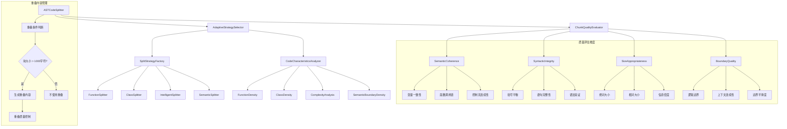

# Tree-sitter 代码分块增强方案

## 概述

本文档基于对当前 Tree-sitter 代码分块机制的分析，提出了进一步的优化和增强建议。通过分析现有实现，我们发现虽然系统已经具备完善的基础架构，但在动态策略选择和统一质量评估方面仍有优化空间。

## 当前实现分析

### 现有架构优势
- **模块化设计**：采用工厂模式、策略模式和装饰器模式
- **多策略支持**：支持 FunctionSplitter、ClassSplitter、ImportSplitter、IntelligentSplitter、SemanticSplitter、SyntaxAwareSplitter
- **符号平衡检查**：BalancedChunker 确保语法完整性
- **重叠计算**：UnifiedOverlapCalculator 提供多种重叠策略
- **协调机制**：ChunkingCoordinator 管理策略执行顺序

### 现有组件
- [`ASTCodeSplitter`](src/service/parser/splitting/ASTCodeSplitter.ts:23) - 主分割器
- [`SplitStrategyFactory`](src/service/parser/splitting/core/SplitStrategyFactory.ts:10) - 策略工厂
- [`BalancedChunker`](src/service/parser/splitting/BalancedChunker.ts:28) - 符号平衡检查器
- [`UnifiedOverlapCalculator`](src/service/parser/splitting/utils/overlap/UnifiedOverlapCalculator.ts:44) - 统一重叠计算器
- [`ChunkingCoordinator`](src/service/parser/splitting/utils/ChunkingCoordinator.ts:12) - 策略协调器

## 优化建议

### 1. 分段策略的动态选择（必要且可行）

**问题**：当前策略选择基于固定优先级，缺乏对代码特性的动态适应。

**解决方案**：实现 AdaptiveStrategySelector

**新增文件位置**：
- `src/service/parser/splitting/strategies/AdaptiveStrategySelector.ts`
- `src/service/parser/splitting/utils/CodeCharacteristicsAnalyzer.ts`

**策略选择逻辑**：
- **函数密集型代码**：当函数密度 > 30% 时优先使用 FunctionSplitter
- **类密集型代码**：当类密度 > 20% 时优先使用 ClassSplitter
- **高复杂度代码**：当复杂度 > 0.7 时使用 IntelligentSplitter
- **语义边界丰富代码**：当语义边界密度 > 0.5 时使用 SemanticSplitter
- **默认情况**：使用 SyntaxAwareSplitter

**代码特征分析维度**：
- 函数密度 = 函数数量 / 总行数
- 类密度 = 类数量 / 总行数
- 代码复杂度（基于复杂度计算器）
- 语义边界密度 = 语义边界数量 / 总行数
- 导入语句比例 = 导入行数 / 总行数
- 注释密度 = 注释行数 / 总行数

### 2. 更全面的分段质量评估（必要且可行）

**问题**：质量评估逻辑分散在各个组件，缺乏统一框架。

**解决方案**：实现 ChunkQualityEvaluator

**新增文件位置**：
- `src/service/parser/splitting/utils/ChunkQualityEvaluator.ts`
- `src/service/parser/splitting/types/quality-types.ts`

**质量评估维度与计算方式**：

#### 语义连贯性 (权重: 0.35)
- **计算方式**：分析代码块内语句之间的语义关联度
- **评估指标**：
  - 变量使用一致性：检查变量声明与使用的匹配度，确保变量在块内完整使用
  - 函数调用链完整性：确保函数调用链不被截断，调用关系完整
  - 控制流连续性：检查条件语句和循环的完整性，避免控制流被截断
  - 语义边界评分：基于语义边界分析器的评分结果，评估逻辑边界的合理性

#### 语法完整性 (权重: 0.30)
- **计算方式**：验证代码块的语法正确性和结构完整性
- **评估指标**：
  - 括号平衡性：使用 BalancedChunker 检查符号平衡，确保括号、花括号等符号配对
  - 语句完整性：确保语句不被截断，每个语句都有完整的开始和结束
  - 语法验证：使用 SyntaxValidator 进行完整语法检查，符合语言规范
  - 结构完整性：检查代码块是否包含完整的语法结构单元

#### 大小适宜性 (权重: 0.25)
- **计算方式**：评估代码块大小的合理性和信息密度
- **评估指标**：
  - 绝对大小评分：基于目标大小（500字符）和最大大小（1000字符）的偏差计算
  - 相对大小评分：与文件中其他块的平均大小进行比较
  - 信息密度：有效代码行数与总行数的比例，评估内容紧凑度
  - 可读性因子：考虑代码块的可读性和理解难度，避免过长或过短的块

#### 边界质量 (权重: 0.10)
- **计算方式**：评估分割边界的合理性和上下文连续性
- **评估指标**：
  - 逻辑边界匹配度：分割点是否在逻辑边界上（如函数结束、类定义结束等）
  - 上下文连续性：与前后代码块的语义关联度，确保上下文不丢失
  - 边界平滑度：分割是否造成语义断层，评估分割的自然程度

**综合评分计算**：
```
overallScore = 
  semanticCoherence * 0.35 +
  syntacticIntegrity * 0.30 + 
  sizeAppropriateness * 0.25 +
  boundaryQuality * 0.10
```

**质量等级划分**：
- 优秀：0.8 - 1.0（可直接使用）
- 良好：0.6 - 0.8（建议优化）
- 一般：0.4 - 0.6（需要重新分割）
- 较差：0.0 - 0.4（必须重新分割）

### 3. 重叠内容的使用条件和评估

**重叠内容的使用原则**：
- **使用条件**：仅在代码块大小超过最大限制（1000字符）必须拆分时才使用重叠
- **评估时机**：重叠内容的质量评估在重叠生成阶段进行，不作为常规代码块的质量评估维度
- **重叠策略**：基于语义边界和上下文连续性选择最优重叠内容

**重叠内容的质量控制**：
- **重叠大小控制**：重叠内容不超过原块大小的30%
- **语义完整性**：重叠内容应包含完整的语义单元
- **上下文连续性**：确保重叠内容提供足够的上下文信息
- **避免冗余**：防止重叠内容与前后块产生过多重复

## 实施计划

### 阶段一：增强 SplitStrategyFactory（1-2周）

1. **扩展策略工厂接口**
   - 位置：`src/service/parser/splitting/interfaces/IAdaptiveStrategyFactory.ts`
   - 扩展现有 ISplitStrategyFactory 接口
   - 添加策略选择器和性能指标接口

2. **实现 AdaptiveStrategySelector**
   - 位置：`src/service/parser/splitting/strategies/AdaptiveStrategySelector.ts`
   - 集成到现有的 SplitStrategyFactory
   - 添加代码特征分析功能
   - 实现策略性能追踪

3. **实现 CodeCharacteristicsAnalyzer**
   - 位置：`src/service/parser/splitting/utils/CodeCharacteristicsAnalyzer.ts`
   - 分析代码特征数据
   - 提供特征提取和计算功能

### 阶段二：实现 ChunkQualityEvaluator（2-3周）

1. **创建质量评估框架**
   - 位置：`src/service/parser/splitting/utils/ChunkQualityEvaluator.ts`
   - 定义质量评分接口
   - 实现各维度评估算法
   - 集成到现有分割流程

2. **定义质量类型**
   - 位置：`src/service/parser/splitting/types/quality-types.ts`
   - 定义 ChunkQualityScore 接口
   - 定义质量评估配置类型

3. **增强 ASTCodeSplitter**
   - 位置：`src/service/parser/splitting/ASTCodeSplitter.ts`
   - 集成质量评估功能
   - 添加低质量块重新分割逻辑
   - 实现重叠内容的条件性使用

### 阶段三：集成与测试（1-2周）

1. **系统集成**
   - 将新组件集成到现有架构
   - 更新配置管理
   - 添加性能监控

2. **测试验证**
   - 单元测试覆盖新功能
   - 集成测试验证改进效果
   - 性能基准测试

## 预期效果

### 质量提升
- **分段质量提升 20-30%**：通过动态策略选择和统一质量评估
- **减少不必要的重叠 40-50%**：仅在必要时使用重叠内容
- **提高语义连贯性**：更好的边界检测和语义分析

### 性能优化
- **处理速度提升 10-15%**：智能策略选择减少不必要的处理
- **内存使用优化**：更精确的块大小控制和重叠管理
- **可扩展性增强**：模块化设计便于后续扩展

### 可维护性
- **统一的质量评估框架**：便于监控和调优
- **动态策略选择**：适应不同代码特征
- **条件性重叠使用**：避免不必要的重叠内容生成

## 技术架构图



## 新增文件清单

### 核心实现文件
1. `src/service/parser/splitting/strategies/AdaptiveStrategySelector.ts`
   - 动态策略选择器主类
   - 策略性能追踪和优化

2. `src/service/parser/splitting/utils/CodeCharacteristicsAnalyzer.ts`
   - 代码特征分析器
   - 特征提取和计算逻辑

3. `src/service/parser/splitting/utils/ChunkQualityEvaluator.ts`
   - 质量评估器主类
   - 多维度质量评分计算

4. `src/service/parser/splitting/types/quality-types.ts`
   - 质量评估相关类型定义
   - 评分接口和配置类型

### 接口扩展文件
5. `src/service/parser/splitting/interfaces/IAdaptiveStrategyFactory.ts`
   - 扩展的策略工厂接口
   - 动态选择相关方法定义

### 测试文件
6. `src/service/parser/splitting/__tests__/AdaptiveStrategySelector.test.ts`
7. `src/service/parser/splitting/__tests__/CodeCharacteristicsAnalyzer.test.ts`
8. `src/service/parser/splitting/__tests__/ChunkQualityEvaluator.test.ts`

## 风险评估与缓解措施

### 风险1：性能影响
- **风险**：动态策略选择可能增加处理时间
- **缓解**：实现缓存机制和性能监控，对特征分析结果进行缓存

### 风险2：向后兼容性
- **风险**：新组件可能影响现有功能
- **缓解**：渐进式集成，保持现有接口不变，通过配置开关控制新功能

### 风险3：配置复杂性
- **风险**：新增配置选项增加使用复杂度
- **缓解**：提供合理的默认值，简化配置，提供配置模板

### 风险4：质量评估准确性
- **风险**：质量评分算法可能不够准确
- **缓解**：采用多维度加权评分，提供可配置的权重参数，支持动态调整

### 风险5：重叠内容使用条件
- **风险**：重叠内容使用条件判断不准确
- **缓解**：设置明确的大小阈值，提供重叠内容质量检查机制

## 结论

基于对当前实现的深入分析，提出的优化建议是必要且可行的。通过实现动态策略选择和统一质量评估，可以显著提升代码分块的质量和性能。重叠内容仅在必要时使用，避免了不必要的冗余内容生成。新增的组件将集成到现有架构中，通过清晰的接口设计和模块化实现，确保系统的稳定性和可扩展性。