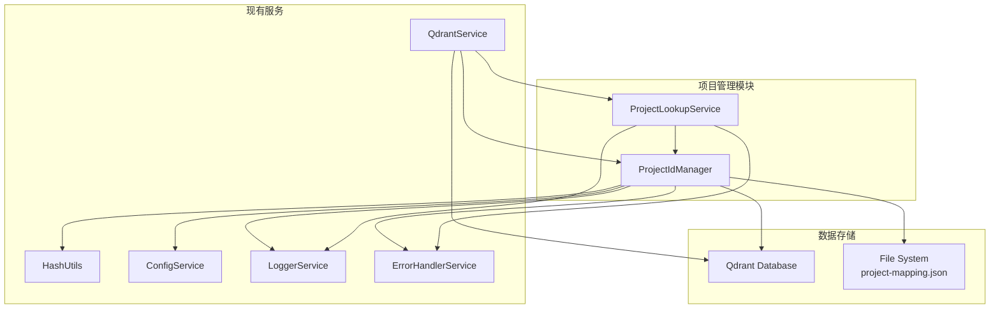
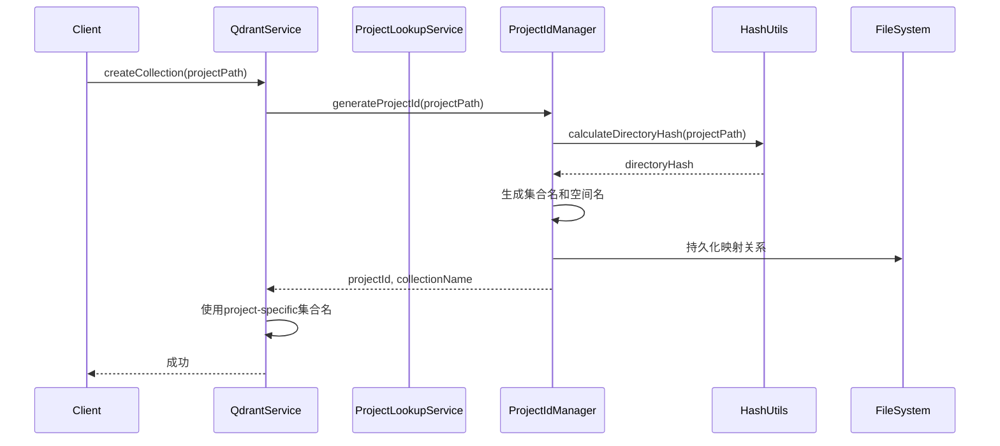

# 项目管理功能集成实施方案

## 📋 概述

本方案详细说明如何在现有代码库中集成项目管理功能，实现多项目代码库索引的隔离管理。基于对 `ref/src/database/ProjectIdManager.ts` 和 `ref/src/database/ProjectLookupService.ts` 的分析，我们将集成项目ID管理和项目查找服务。

## 🎯 实施目标

**主要目标**: 实现多项目代码库索引的隔离管理，确保不同项目的向量数据在Qdrant中完全隔离

**具体目标**:
1. 集成项目ID管理器，基于项目路径生成唯一项目ID
2. 实现项目查找服务，支持通过集合名、空间名查找项目
3. 建立项目映射关系的持久化机制
4. 集成到现有Qdrant服务中，实现多项目支持
5. 提供项目更新时间跟踪功能

## 📊 当前状态分析

### 现有基础设施
- ✅ Qdrant服务已就绪 ([`src/database/QdrantService.ts`](src/database/QdrantService.ts))
- ✅ HashUtils工具类已就绪 ([`src/utils/HashUtils.ts`](src/utils/HashUtils.ts))
- ✅ 依赖注入框架已就绪 ([`src/core/DIContainer.ts`](src/core/DIContainer.ts))
- ✅ 配置服务已就绪 ([`src/config/ConfigService.ts`](src/config/ConfigService.ts))
- ✅ 日志和错误处理服务已就绪

### 需要新增的组件
1. **ProjectIdManager** - 项目ID管理服务
2. **ProjectLookupService** - 项目查找服务
3. **类型定义扩展** - 更新TYPES和接口定义
4. **依赖注入配置** - 注册新服务到DI容器

## 🏗️ 架构设计

### 系统架构图



### 数据流图



## 📁 文件结构规划

```
src/
├── database/
│   ├── QdrantService.ts              # 现有 - 需要集成项目管理
│   ├── ProjectIdManager.ts           # 新增 - 项目ID管理
│   ├── ProjectLookupService.ts       # 新增 - 项目查找服务
│   └── __tests__/
│       ├── ProjectIdManager.test.ts  # 新增 - 单元测试
│       └── ProjectLookupService.test.ts # 新增 - 单元测试
├── types.ts                          # 现有 - 需要扩展类型定义
├── core/
│   └── DIContainer.ts                # 现有 - 需要注册新服务
└── config/
    └── ConfigService.ts              # 现有 - 可能需要扩展配置
```

## 🔧 实施细节

### 1. ProjectIdManager 实现要点

**核心功能**:
- 基于项目路径生成SHA256哈希作为项目ID
- 管理项目路径 ↔ 项目ID的双向映射
- 生成项目特定的集合名 (`project-{id}`) 和空间名 (`project_{id}`)
- 跟踪项目最后更新时间
- 支持映射关系的持久化存储

**关键代码适配**:
```typescript
// 需要适配HashUtils的导入和使用方式
import { HashUtils } from '../utils/HashUtils';

// 适配存储路径配置
const storagePath = process.env.PROJECT_MAPPING_PATH || './data/project-mapping.json';
```

### 2. ProjectLookupService 实现要点

**核心功能**:
- 通过集合名解析项目ID (`project-{id}` → `{id}`)
- 通过空间名解析项目ID (`project_{id}` → `{id}`)
- 获取项目路径信息
- 获取最新更新的项目

### 3. QdrantService 集成要点

**需要修改的现有功能**:
- 集合创建时使用项目特定的集合名
- 搜索和操作时支持项目过滤
- 集成项目查找服务

**示例修改**:
```typescript
// 在QdrantService中添加项目支持
async createCollectionForProject(projectPath: string, vectorSize: number): Promise<boolean> {
    const projectId = await this.projectIdManager.generateProjectId(projectPath);
    const collectionName = this.projectIdManager.getCollectionName(projectId);
    return this.createCollection(collectionName, vectorSize);
}
```

### 4. 依赖注入配置

**需要注册的服务**:
```typescript
// 在DIContainer.ts中注册新服务
diContainer.bind<ProjectIdManager>(TYPES.ProjectIdManager).to(ProjectIdManager).inSingletonScope();
diContainer.bind<ProjectLookupService>(TYPES.ProjectLookupService).to(ProjectLookupService).inSingletonScope();
```

### 5. 类型定义扩展

**需要新增的类型**:
```typescript
export const TYPES = {
    // ... 现有类型
    ProjectIdManager: Symbol.for('ProjectIdManager'),
    ProjectLookupService: Symbol.for('ProjectLookupService'),
};
```

## 🧪 测试策略

### 单元测试覆盖点
1. **ProjectIdManager测试**
   - 项目ID生成的一致性
   - 映射关系的正确性
   - 持久化功能的可靠性
   - 更新时间跟踪的正确性

2. **ProjectLookupService测试**
   - 集合名解析的正确性
   - 空间名解析的正确性
   - 项目路径查找的正确性

3. **集成测试**
   - 与QdrantService的集成
   - 多项目场景下的隔离性
   - 端到端的项目管理工作流

## 🔄 实施步骤

### 第一阶段：基础组件实现 (2-3天)
1. 创建 `src/database/ProjectIdManager.ts`
2. 创建 `src/database/ProjectLookupService.ts`
3. 扩展类型定义 `src/types.ts`
4. 更新依赖注入配置 `src/core/DIContainer.ts`

### 第二阶段：Qdrant服务集成 (2-3天)
1. 修改 `src/database/QdrantService.ts` 支持项目管理
2. 实现项目特定的集合操作
3. 添加项目过滤支持

### 第三阶段：测试和验证 (1-2天)
1. 编写单元测试
2. 进行集成测试
3. 验证多项目隔离功能

## ⚠️ 风险与缓解

### 技术风险
1. **哈希冲突风险**
   - 缓解：使用SHA256哈希，冲突概率极低
   - 措施：添加冲突检测和处理逻辑

2. **持久化数据损坏**
   - 缓解：实现数据备份和恢复机制
   - 措施：添加数据验证和修复功能

3. **性能影响**
   - 缓解：优化哈希计算和映射查询
   - 措施：添加缓存机制

### 集成风险
1. **现有功能影响**
   - 缓解：保持向后兼容性
   - 措施：分阶段逐步集成

2. **配置复杂性**
   - 缓解：提供合理的默认配置
   - 措施：完善的错误处理和日志

## 📊 验收标准

### 功能验收标准
1. ✅ 能够为不同项目路径生成唯一项目ID
2. ✅ 项目映射关系能够正确持久化和加载
3. ✅ 能够通过集合名/空间名解析出项目ID
4. ✅ Qdrant服务能够使用项目特定的集合名
5. ✅ 多项目数据在Qdrant中完全隔离
6. ✅ 项目更新时间跟踪功能正常

### 性能验收标准
1. ✅ 项目ID生成时间 < 100ms (平均)
2. ✅ 映射查询时间 < 10ms
3. ✅ 持久化操作时间 < 50ms
4. ✅ 内存使用稳定，无内存泄漏

### 质量验收标准
1. ✅ 单元测试覆盖率 ≥ 80%
2. ✅ 集成测试通过率 100%
3. ✅ 代码符合项目编码规范
4. ✅ 文档完整且准确

## 🔧 配置要求

### 环境变量配置
```bash
# 项目映射文件存储路径（可选）
PROJECT_MAPPING_PATH=./data/project-mapping.json

# 其他现有配置保持不变
```

### 目录结构要求
```
data/
└── project-mapping.json    # 项目映射关系存储文件
```

## 🚀 后续扩展

### 短期扩展 (下一阶段)
1. 项目元数据管理（描述、标签等）
2. 项目统计信息收集
3. 项目生命周期管理（创建、归档、删除）

### 中长期扩展
1. 项目权限管理
2. 项目共享和协作
3. 项目模板功能
4. 自动化项目发现和索引

---
*文档版本: 1.0*
*创建日期: 2025-09-27*
*最后更新: 2025-09-27*