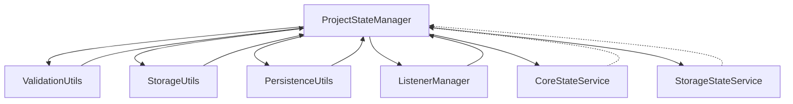

# ProjectStateManager 重构方案

## 🎯 重构目标

1. **模块化拆分**: 将1149行代码拆分为多个职责单一的模块
2. **降低耦合度**: 减少与其他服务的直接依赖
3. **提高可测试性**: 使每个模块易于单元测试
4. **保持兼容性**: 确保现有API接口不变

## 📋 重构方案选择

**采用模块化方案**：创建工具类、分离非核心逻辑、使用依赖注入

### 方案优势：
- ✅ 风险较低，保持向后兼容
- ✅ 逐步重构，不影响现有功能
- ✅ 代码结构清晰，易于维护
- ✅ 符合现有架构设计理念

## 🏗️ 重构架构设计



## 📁 模块拆分计划

### 1. ProjectStateStorageUtils - 存储工具类
**职责**: 文件读写、重试机制、原子操作
```typescript
// 迁移方法:
- saveProjectStates()          // 带重试的文件保存
- loadProjectStates()          // 文件加载和解析  
- ensureStorageDirectory()     // 目录创建保障
- atomicWriteWithRetry()       // 原子写入重试
```

### 2. ProjectStateValidator - 验证工具类  
**职责**: 状态验证、数据规范化、类型检查
```typescript
// 迁移方法:
- validateAndNormalizeProjectState()  // 状态验证和规范化
- normalizeStorageStatus()             // 存储状态规范化
- initializeStorageStatus()           // 存储状态初始化
- isProjectStateValid()               // 状态有效性检查
```

### 3. ProjectStateListenerManager - 监听器管理
**职责**: 事件监听、回调处理、错误恢复
```typescript
// 迁移方法:
- setupIndexSyncListeners()           // 索引监听器设置
- handleIndexingStarted()             // 索引开始处理
- handleIndexingProgress()            // 索引进度处理  
- handleIndexingCompleted()           // 索引完成处理
- handleIndexingError()               // 索引错误处理
```

### 4. CoreStateService - 核心状态服务
**职责**: 基本状态管理、业务逻辑
```typescript
// 迁移方法:  
- createOrUpdateProjectState()        // 创建/更新状态
- getProjectState()                   // 获取状态
- getAllProjectStates()               // 获取所有状态
- deleteProjectState()                // 删除状态
- getProjectStats()                   // 获取统计信息
```

### 5. StorageStateService - 存储状态服务
**职责**: 存储状态管理、协调
```typescript
// 迁移方法:
- updateVectorStatus()                // 更新向量状态
- updateGraphStatus()                 // 更新图状态
- updateMainStatusBasedOnStorageStates() // 主状态更新
- startVectorIndexing()               // 开始向量索引
- startGraphIndexing()                // 开始图索引
- completeVectorIndexing()            // 完成向量索引
- completeGraphIndexing()             // 完成图索引
```

## 🔄 重构实施步骤

### 阶段一：工具类提取（1-2天）
1. 创建 `ProjectStateStorageUtils` 工具类
2. 迁移文件存储相关方法
3. 创建 `ProjectStateValidator` 工具类
4. 迁移验证相关方法

### 阶段二：监听器分离（1天）
1. 创建 `ProjectStateListenerManager` 
2. 迁移事件监听相关逻辑
3. 重构事件处理回调

### 阶段三：服务拆分（2-3天）
1. 创建 `CoreStateService` 核心服务
2. 创建 `StorageStateService` 存储服务
3. 迁移相应业务逻辑
4. 调整依赖注入配置

### 阶段四：测试和优化（1-2天）
1. 编写单元测试
2. 性能测试和优化
3. 文档更新

## 📊 预期效果

### 代码量分布
| 模块 | 预计行数 | 占比 |
|------|---------|------|
| ProjectStateManager (主类) | 300 | 26% |
| ProjectStateStorageUtils | 150 | 13% |
| ProjectStateValidator | 120 | 10% |
| ProjectStateListenerManager | 180 | 16% |
| CoreStateService | 200 | 17% |
| StorageStateService | 200 | 17% |
| **总计** | **1150** | **100%** |

### 性能提升
- ✅ 内存使用减少（方法分离）
- ✅ IO操作优化（专用工具类）
- ✅ 响应时间改善（职责分离）

### 可维护性
- ✅ 代码可读性提升
- ✅ 单元测试覆盖率提高
- ✅ 模块职责清晰
- ✅ 扩展性增强

## ⚠️ 风险控制

### 技术风险
1. **依赖注入冲突**: 确保新服务正确注册到DI容器
2. **方法签名变化**: 保持公共API兼容性
3. **数据一致性**: 确保状态迁移过程中数据不丢失

### 应对措施
1. 逐步迁移，分阶段测试
2. 保持接口兼容性测试
3. 数据备份和恢复机制

## 🚀 实施优先级

### 高优先级（首先实施）
1. 工具类提取（降低主类复杂度）
2. 监听器分离（减少事件处理耦合）

### 中优先级（其次实施）  
3. 核心服务拆分（业务逻辑分离）
4. 存储服务拆分（存储状态管理）

### 低优先级（最后实施）
5. 性能优化
6. 高级功能扩展

---
*重构计划制定时间: 2025-10-10*
*预计总工时: 5-8人日*