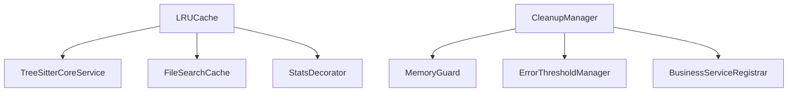

# Cleanup模块基础设施层迁移方案

## 📋 概述

本方案旨在将Universal Cleanup模块从`src/service/parser/universal/cleanup/`迁移到`src/infrastructure/cleanup/`，以更好地体现其系统级资源管理的职责，同时保持LRUCache在utils目录的现有位置。

## 🎯 目标

1. **架构优化**：将清理功能从业务服务层移动到基础设施层
2. **职责分离**：明确模块边界，提高代码可维护性
3. **最小化影响**：保持现有API不变，减少重构风险
4. **扩展性**：为未来添加更多清理策略提供良好基础

## 📊 当前架构分析

### 模块现状

| 模块 | 当前位置 | 功能描述 | 使用情况 |
|------|----------|----------|----------|
| LRUCache | `src/utils/LRUCache.ts` | 通用LRU缓存实现 | 被多个服务模块使用 |
| CleanupManager | `src/service/parser/universal/cleanup/` | 清理管理器框架 | 被MemoryGuard、ErrorThresholdManager使用 |

### 依赖关系分析



## 🏗️ 重构方案

### 方案一：Cleanup模块迁移到基础设施层

#### 目录结构调整
```
src/
├── infrastructure/
│   ├── cleanup/                    # 新增：清理基础设施
│   │   ├── CleanupManager.ts
│   │   ├── interfaces/
│   │   │   └── ICleanupStrategy.ts
│   │   └── strategies/
│   │       ├── LRUCacheCleanupStrategy.ts
│   │       ├── TreeSitterCacheCleanupStrategy.ts
│   │       └── GarbageCollectionStrategy.ts
│   └── caching/                    # 现有缓存基础设施
│       ├── CacheService.ts
│       ├── GraphCacheService.ts
│       └── types.ts
└── utils/
    └── LRUCache.ts                 # 保持原位置
```

#### 文件迁移清单

| 源文件 | 目标位置 | 状态 |
|--------|----------|------|
| `src/service/parser/universal/cleanup/CleanupManager.ts` | `src/infrastructure/cleanup/CleanupManager.ts` | 待迁移 |
| `src/service/parser/universal/cleanup/interfaces/ICleanupStrategy.ts` | `src/infrastructure/cleanup/interfaces/ICleanupStrategy.ts` | 待迁移 |
| `src/service/parser/universal/cleanup/strategies/LRUCacheCleanupStrategy.ts` | `src/infrastructure/cleanup/strategies/LRUCacheCleanupStrategy.ts` | 待迁移 |
| `src/service/parser/universal/cleanup/strategies/TreeSitterCacheCleanupStrategy.ts` | `src/infrastructure/cleanup/strategies/TreeSitterCacheCleanupStrategy.ts` | 待迁移 |
| `src/service/parser/universal/cleanup/strategies/GarbageCollectionStrategy.ts` | `src/infrastructure/cleanup/strategies/GarbageCollectionStrategy.ts` | 待迁移 |
| `src/service/parser/universal/cleanup/__tests__/CleanupManager.test.ts` | `src/infrastructure/cleanup/__tests__/CleanupManager.test.ts` | 待迁移 |

## 🔄 依赖更新清单

### 需要更新的导入路径

#### 1. MemoryGuard.ts
```typescript
// 当前
import { CleanupManager } from '../universal/cleanup/CleanupManager';

// 更新为
import { CleanupManager } from '../../../infrastructure/cleanup/CleanupManager';
```

#### 2. ErrorThresholdManager.ts
```typescript
// 当前
import { CleanupManager } from './cleanup/CleanupManager';
import { ICleanupContext } from './cleanup/interfaces/ICleanupStrategy';

// 更新为
import { CleanupManager, ICleanupContext } from '../../../infrastructure/cleanup';
```

#### 3. BusinessServiceRegistrar.ts
```typescript
// 当前
const { TreeSitterCacheCleanupStrategy } = require('../../service/parser/universal/cleanup/strategies/TreeSitterCacheCleanupStrategy');
const { LRUCacheCleanupStrategy } = require('../../service/parser/universal/cleanup/strategies/LRUCacheCleanupStrategy');
const { GarbageCollectionStrategy } = require('../../service/parser/universal/cleanup/strategies/GarbageCollectionStrategy');

// 更新为
const { TreeSitterCacheCleanupStrategy } = require('../../infrastructure/cleanup/strategies/TreeSitterCacheCleanupStrategy');
const { LRUCacheCleanupStrategy } = require('../../infrastructure/cleanup/strategies/LRUCacheCleanupStrategy');
const { GarbageCollectionStrategy } = require('../../infrastructure/cleanup/strategies/GarbageCollectionStrategy');
```

#### 4. 测试文件
```typescript
// 当前
import { CleanupManager } from '../CleanupManager';
import { ICleanupStrategy } from '../interfaces/ICleanupStrategy';

// 更新为
import { CleanupManager } from '../../infrastructure/cleanup/CleanupManager';
import { ICleanupStrategy } from '../../infrastructure/cleanup/interfaces/ICleanupStrategy';
```

## 🛠️ 实施步骤

### 阶段一：准备阶段（1-2天）

1. **创建目标目录结构**
   ```bash
   mkdir -p src/infrastructure/cleanup/interfaces
   mkdir -p src/infrastructure/cleanup/strategies
   mkdir -p src/infrastructure/cleanup/__tests__
   ```

2. **更新类型定义**
   - 检查是否需要更新`src/types.ts`中的类型定义
   - 确保所有导出类型正确

### 阶段二：文件迁移（2-3天）

1. **迁移核心文件**
   - 移动CleanupManager和相关接口
   - 移动所有清理策略
   - 移动测试文件

2. **更新导入路径**
   - 更新所有引用Cleanup模块的文件
   - 验证导入路径正确性

### 阶段三：验证测试（1-2天）

1. **运行现有测试**
   ```bash
   npm test src/infrastructure/cleanup/__tests__/CleanupManager.test.ts
   ```

2. **集成测试**
   - 验证MemoryGuard和ErrorThresholdManager功能正常
   - 验证BusinessServiceRegistrar依赖注入正常

3. **端到端测试**
   - 运行完整的测试套件
   - 验证系统整体功能

## 📝 代码变更示例

### CleanupManager.ts 导出更新
```typescript
// 在 src/infrastructure/cleanup/index.ts 中创建索引文件
export { CleanupManager } from './CleanupManager';
export { ICleanupStrategy, ICleanupContext, ICleanupResult } from './interfaces/ICleanupStrategy';
export { LRUCacheCleanupStrategy } from './strategies/LRUCacheCleanupStrategy';
export { TreeSitterCacheCleanupStrategy } from './strategies/TreeSitterCacheCleanupStrategy';
export { GarbageCollectionStrategy } from './strategies/GarbageCollectionStrategy';
```

### 依赖注入配置更新
```typescript
// BusinessServiceRegistrar.ts 更新
container.bind<CleanupManager>(TYPES.CleanupManager).toDynamicValue(context => {
  const logger = context.get<LoggerService>(TYPES.LoggerService);
  const cleanupManager = new CleanupManager(logger);
  
  // 初始化CleanupManager
  cleanupManager.initialize();
  
  // 注册清理策略 - 使用新的导入路径
  const { TreeSitterCacheCleanupStrategy } = require('../../infrastructure/cleanup/strategies/TreeSitterCacheCleanupStrategy');
  const { LRUCacheCleanupStrategy } = require('../../infrastructure/cleanup/strategies/LRUCacheCleanupStrategy');
  const { GarbageCollectionStrategy } = require('../../infrastructure/cleanup/strategies/GarbageCollectionStrategy');
  
  cleanupManager.registerStrategy(new TreeSitterCacheCleanupStrategy(logger));
  cleanupManager.registerStrategy(new LRUCacheCleanupStrategy(logger));
  cleanupManager.registerStrategy(new GarbageCollectionStrategy(logger));
  
  return cleanupManager;
}).inSingletonScope();
```

## 🔍 风险评估与缓解

### 风险点
1. **导入路径错误**：可能导致运行时错误
2. **依赖注入配置错误**：可能导致服务无法启动
3. **测试覆盖不足**：可能遗漏边界情况

### 缓解措施
1. **逐步迁移**：逐个文件迁移，及时验证
2. **自动化测试**：确保所有测试通过
3. **代码审查**：仔细检查导入路径和依赖关系

## 📈 预期收益

### 架构收益
- ✅ **职责清晰**：清理功能明确属于基础设施层
- ✅ **模块解耦**：减少业务服务与清理逻辑的耦合
- ✅ **可维护性**：相关功能集中管理

### 开发收益
- ✅ **代码复用**：清理策略可在整个系统中复用
- ✅ **扩展性**：易于添加新的清理策略
- ✅ **测试友好**：基础设施层测试更独立

## 🎯 验收标准

1. ✅ 所有文件成功迁移到新位置
2. ✅ 所有导入路径正确更新
3. ✅ 所有现有测试通过
4. ✅ 系统功能正常，无回归
5. ✅ 依赖注入配置正确
6. ✅ 代码构建和打包正常

## 📅 实施时间表

| 阶段 | 任务 | 预计时间 | 负责人 |
|------|------|----------|--------|
| 准备阶段 | 创建目录结构，更新类型定义 | 1-2天 | 开发团队 |
| 迁移阶段 | 文件迁移，更新导入路径 | 2-3天 | 开发团队 |
| 验证阶段 | 测试验证，修复问题 | 1-2天 | QA团队 |
| 部署阶段 | 代码审查，合并到主分支 | 1天 | 技术负责人 |

## 🔄 回滚计划

如果迁移过程中出现问题，可以：
1. 立即回退到原代码版本
2. 恢复原文件位置
3. 验证系统功能正常
4. 分析问题原因，重新规划迁移

---

**文档版本**: 1.0  
**创建日期**: 2025-10-17  
**最后更新**: 2025-10-17  
**状态**: 待实施