# 基于继承的代码重构计划

## 概述
本计划旨在通过创建基类来提供公共方法，避免重复实现同样的方法，同时保持不同模块的功能独立性。与直接合并的方案不同，本方案采用继承机制来复用代码。

## 重复职责分析

### 1. 相似度计算重复
- `SimilarityDetector.ts` - 基础相似度计算
- `SimilarityUtils.ts` - 相似度计算工具  
- `ChunkSimilarityUtils.ts` - 代码块相似度工具
- `UnifiedOverlapCalculator.ts` 中的相似度计算部分

### 2. 代码块合并逻辑重复
- `ChunkMerger.ts` - 代码块合并器
- `ChunkOptimizer.ts` - 代码块优化器
- `ChunkSimilarityUtils.ts` 中的合并方法
- `SimilarityUtils.ts` 中的合并方法

### 3. 性能监控重复
- `PerformanceMonitor.ts` - 性能监控器
- `PerformanceOptimizer.ts` - 性能优化器
- `ChunkingPerformanceOptimizer.ts` - 分段性能优化器

### 4. 工具方法重复
- 内容标准化方法（normalizeContent）
- 哈希计算方法（calculateContentHash）
- 编辑距离算法（levenshteinDistance）

## 重构方案

### 重构后的目录结构

```
src/service/parser/splitting/utils/
├── base/                           # 新增：基类目录
│   ├── BaseSimilarityCalculator.ts # 相似度计算基类
│   ├── BaseChunkProcessor.ts       # 代码块处理基类  
│   ├── BasePerformanceTracker.ts   # 性能监控基类
│   └── index.ts                    # 基类导出
├── similarity/                     # 相似度计算相关
│   ├── SimilarityDetector.ts       # 继承自BaseSimilarityCalculator
│   ├── SimilarityUtils.ts          # 继承自BaseSimilarityCalculator
│   └── index.ts
├── chunk-processing/              # 代码块处理相关
│   ├── ChunkMerger.ts              # 继承自BaseChunkProcessor
│   ├── ChunkOptimizer.ts           # 继承自BaseChunkProcessor
│   ├── ChunkSimilarityUtils.ts     # 继承自BaseChunkProcessor
│   └── index.ts
├── performance/                    # 性能监控相关
│   ├── PerformanceMonitor.ts       # 继承自BasePerformanceTracker
│   ├── PerformanceOptimizer.ts     # 继承自BasePerformanceTracker
│   ├── ChunkingPerformanceOptimizer.ts # 继承自BasePerformanceTracker
│   └── index.ts
├── structure-analysis/             # 代码结构分析（保持不变）
│   ├── CodeQualityAssessmentUtils.ts
│   ├── ContextAwareOverlapOptimizer.ts
│   ├── SemanticBoundaryAnalyzer.ts
│   └── index.ts
├── overlap-strategies/             # 重叠策略（保持不变）
│   ├── OverlapStrategyUtils.ts
│   ├── UnifiedOverlapCalculator.ts
│   └── index.ts
├── core/                           # 核心工具（保持不变）
│   ├── ASTNodeExtractor.ts
│   ├── ASTNodeTracker.ts
│   ├── ComplexityCalculator.ts
│   ├── ContentHashIDGenerator.ts
│   ├── SyntaxValidator.ts
│   └── index.ts
└── __tests__/                      # 测试目录
```

### 类继承关系图

```mermaid
classDiagram
    %% 基类
    class BaseSimilarityCalculator {
        +calculateSimilarity(content1: string, content2: string): number
        +isSimilar(content1: string, content2: string, threshold?: number): boolean
        +levenshteinDistance(str1: string, str2: string): number
        +normalizeContent(content: string): string
        +calculateContentHash(content: string): string
    }

    class BaseChunkProcessor {
        +mergeTwoChunks(chunk1: CodeChunk, chunk2: CodeChunk): CodeChunk
        +mergeContents(content1: string, content2: string, startLine1: number, startLine2: number): string
        +canMergeChunks(chunk1: CodeChunk, chunk2: CodeChunk, threshold?: number): boolean
        +isDuplicateChunk(chunk1: CodeChunk, chunk2: CodeChunk): boolean
    }

    class BasePerformanceTracker {
        +record(startTime: number, linesProcessed: number, cacheHit: boolean): void
        +getStats(): PerformanceStats
        +reset(): void
        +calculateProcessingMetrics(startTime: number, linesProcessed: number): ProcessingMetrics
    }

    %% 相似度计算继承关系
    BaseSimilarityCalculator <|-- SimilarityDetector
    BaseSimilarityCalculator <|-- SimilarityUtils
    BaseSimilarityCalculator <|-- ChunkSimilarityUtils

    %% 代码块处理继承关系  
    BaseChunkProcessor <|-- ChunkMerger
    BaseChunkProcessor <|-- ChunkOptimizer
    BaseChunkProcessor <|-- ChunkSimilarityUtils

    %% 性能监控继承关系
    BasePerformanceTracker <|-- PerformanceMonitor
    BasePerformanceTracker <|-- PerformanceOptimizer
    BasePerformanceTracker <|-- ChunkingPerformanceOptimizer

    %% 特殊类（不继承基类）
    class UnifiedOverlapCalculator
    class CodeQualityAssessmentUtils
    class ContextAwareOverlapOptimizer
    class SemanticBoundaryAnalyzer
    class OverlapStrategyUtils
```



### 实施步骤

#### 阶段1：创建基类目录和基础类

**步骤1.1：创建基类目录结构**
```bash
mkdir -p src/service/parser/splitting/utils/base
mkdir -p src/service/parser/splitting/utils/similarity
mkdir -p src/service/parser/splitting/utils/chunk-processing
mkdir -p src/service/parser/splitting/utils/performance
```

**步骤1.2：创建 BaseSimilarityCalculator 基类**
```typescript
// src/service/parser/splitting/utils/base/BaseSimilarityCalculator.ts
export abstract class BaseSimilarityCalculator {
  protected static readonly DEFAULT_THRESHOLD = 0.8;
  protected static readonly MIN_CONTENT_LENGTH = 10;

  static calculateSimilarity(content1: string, content极2: string): number {
    // 统一的相似度计算实现
  }

  // 其他公共方法...
}
```

#### 阶段2：重构相似度计算相关类

**步骤2.1：重构 SimilarityDetector**
```typescript
// src/service/parser/splitting/utils/similarity/SimilarityDetector.ts
import { BaseSimilarityCalculator } from '../base/BaseSimilarityCalculator';

export class SimilarityDetector extends BaseSimilarityCalculator {
  // 只保留特有的方法
  static calculateSimilarityMatrix(contents: string[]): number[][] {
    // 特有实现
  }
}
```

#### 阶段3：重构代码块处理相关类

**步骤3.1：创建 BaseChunkProcessor 基类**
```typescript
// src/service/parser/splitting/utils/base/BaseChunkProcessor.ts
export abstract class BaseChunkProcessor {
  static mergeTwoChunks(chunk1: CodeChunk, chunk2: CodeChunk): CodeChunk {
    // 统一的块合并实现
  }
}
```

#### 阶段4：重构性能监控相关类

**步骤4.1：创建 BasePerformanceTracker 基类**
```typescript
// src/service/parser/splitting/utils/base/BasePerformanceTracker.ts
export abstract class BasePerformanceTracker {
  protected totalLines: number = 0;
  
  record(startTime: number, linesProcessed: number, cacheHit: boolean): void {
    // 统一的性能记录实现
  }
}
```

#### 阶段5：更新依赖关系

**步骤5.1：更新导入语句**
将所有使用这些模块的文件更新为新的导入路径：
- 从 `./SimilarityDetector` 改为 `./similarity/SimilarityDetector`
- 从 `./ChunkMerger` 改为 `./chunk-processing/ChunkMerger`

## 预期收益

1. **减少代码冗余**: 消除重复的实现，提高代码复用率
2. **提高可维护性**: 集中管理公共方法，减少维护成本
3. **保持模块独立性**: 各个模块依然保持独立的功能职责
4. **增强一致性**: 统一接口和行为，提高系统一致性
5. **便于扩展**: 新的工具类可以轻松继承基类获得公共功能

## 风险评估

1. **兼容性风险**: 重构可能影响现有代码的兼容性
2. **测试风险**: 需要全面测试确保功能不受影响
3. **依赖风险**: 需要仔细处理模块间的依赖关系

## 缓解措施

1. **渐进式重构**: 分阶段进行，每个阶段完成后进行测试
2. **保留接口**: 确保新模块提供与原模块相同的接口
3. **全面测试**: 在每个阶段完成后进行全面的单元测试和集成测试
4. **回滚计划**: 准备回滚方案，以防出现问题