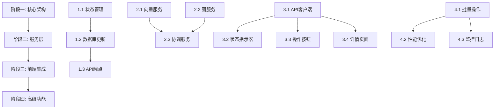

# 向量嵌入与图存储分离管理实施路线图

## 📋 概述

本文档提供了向量嵌入和图存储分离管理功能的详细实施路线图，包括阶段划分、任务分解、风险评估和验收标准。

## 🎯 总体目标

**项目目标**：实现向量嵌入（Qdrant）和图存储（Nebula Graph）的完全分离管理，支持独立状态跟踪和操作执行。

**时间范围**：3-4周（分阶段实施）

## 📅 实施阶段

### 阶段一：核心架构扩展（第1周）

#### 1.1 后端状态管理扩展
- [ ] **任务**：扩展 ProjectState 接口，添加 vectorStatus 和 graphStatus 字段
- [ ] **负责人**：后端开发工程师
- [ ] **时间预估**：2天
- [ ] **依赖**：无
- [ ] **产出**：
  - 更新的 ProjectState 接口定义
  - 状态管理逻辑实现
  - 单元测试覆盖

#### 1.2 数据库架构更新
- [ ] **任务**：更新项目状态存储格式，支持双状态
- [ ] **负责人**：后端开发工程师
- [ ] **时间预估**：1天
- [ ] **依赖**：1.1 完成
- [ ] **产出**：
  - 数据库迁移脚本
  - 数据兼容性处理
  - 回滚方案

#### 1.3 新增API端点
- [ ] **任务**：实现独立的向量和图存储API端点
- [ ] **负责人**：后端开发工程师
- [ ] **时间预估**：2天
- [ ] **依赖**：1.1 完成
- [ ] **产出**：
  - `/api/v1/projects/:projectId/index-vectors` (POST)
  - `/api/v1/projects/:projectId/index-graph` (POST)
  - `/api/v1/projects/:projectId/vector-status` (GET)
  - `/api/v1/projects/:projectId/graph-status` (GET)

### 阶段二：服务层实现（第2周）

#### 2.1 向量索引服务
- [ ] **任务**：实现 VectorIndexService，处理向量嵌入逻辑
- [ ] **负责人**：后端开发工程师
- [ ] **时间预估**：2天
- [ ] **依赖**：1.3 完成
- [ ] **产出**：
  - VectorIndexService 实现
  - 进度跟踪机制
  - 错误处理逻辑

#### 2.2 图索引服务
- [ ] **任务**：实现 GraphIndexService，处理图存储逻辑
- [ ] **负责人**：后端开发工程师
- [ ] **时间预估**：2天
- [ ] **依赖**：1.3 完成
- [ ] **产出**：
  - GraphIndexService 实现
  - Nebula Graph 集成
  - 数据一致性保障

#### 2.3 协调服务
- [ ] **任务**：实现 StorageCoordinatorService，协调双存储操作
- [ ] **负责人**：后端开发工程师
- [ ] **时间预估**：1天
- [ ] **依赖**：2.1, 2.2 完成
- [ ] **产出**：
  - 协调服务实现
  - 事务管理机制
  - 回滚处理

### 阶段三：前端集成（第3周）

#### 3.1 API客户端扩展
- [ ] **任务**：扩展前端 ApiClient，支持新API端点
- [ ] **负责人**：前端开发工程师
- [ ] **时间预估**：1天
- [ ] **依赖**：1.3 完成
- [ ] **产出**：
  - indexVectors() 方法
  - indexGraph() 方法
  - 状态查询方法

#### 3.2 状态指示器组件
- [ ] **任务**：实现双状态显示组件
- [ ] **负责人**：前端开发工程师
- [ ] **时间预估**：2天
- [ ] **依赖**：3.1 完成
- [ ] **产出**：
  - StorageStatusIndicator 组件
  - 响应式设计
  - 动画效果

#### 3.3 操作按钮组件
- [ ] **任务**：实现分离的操作按钮组件
- [ ] **负责人**：前端开发工程师
- [ ] **时间预估**：1天
- [ ] **依赖**：3.1 完成
- [ ] **产出**：
  - StorageActionButtons 组件
  - 状态感知禁用
  - 操作反馈

#### 3.4 详情页面增强
- [ ] **任务**：增强项目详情页，显示详细状态信息
- [ ] **负责人**：前端开发工程师
- [ ] **时间预估**：2天
- [ ] **依赖**：3.1 完成
- [ ] **产出**：
  - 存储状态面板
  - 实时进度更新
  - 操作历史记录

### 阶段四：高级功能（第4周）

#### 4.1 批量操作支持
- [ ] **任务**：实现批量向量嵌入和图存储操作
- [ ] **负责人**：全栈开发工程师
- [ ] **时间预估**：2天
- [ ] **依赖**：阶段一、二、三完成
- [ ] **产出**：
  - 批量API端点
  - 批量操作界面
  - 进度监控

#### 4.2 性能优化
- [ ] **任务**：优化双存储操作的性能和资源使用
- [ ] **负责人**：后端开发工程师
- [ ] **时间预估**：2天
- [ ] **依赖**：阶段一、二完成
- [ ] **产出**：
  - 性能基准测试
  - 资源使用优化
  - 并发控制

#### 4.3 监控和日志
- [ ] **任务**：增强监控和日志记录
- [ ] **负责人**：运维工程师
- [ ] **时间预估**：1天
- [ ] **依赖**：阶段一、二完成
- [ ] **产出**：
  - 操作日志记录
  - 性能监控仪表板
  - 告警配置

## 🛠️ 技术栈要求

### 后端技术栈
- **语言**: TypeScript
- **框架**: Express.js
- **数据库**: 项目状态JSON文件 + Qdrant + Nebula Graph
- **工具**: Jest (测试), ESLint, Prettier

### 前端技术栈
- **语言**: TypeScript
- **框架**: 原生Web组件
- **构建工具**: Vite
- **样式**: CSS3 + 自定义属性

## 🚧 关键依赖关系

## ⚠️ 风险评估与缓解

### 技术风险
1. **数据一致性风险**
   - **风险**：向量和图存储状态不一致
   - **缓解**：实现事务协调机制，添加一致性检查
   - **备选**：提供手动修复工具

2. **性能影响风险**
   - **风险**：双状态管理增加系统开销
   - **缓解**：异步状态更新，批量处理优化
   - **备选**：性能监控和自动降级

3. **兼容性风险**
   - **风险**：影响现有功能
   - **缓解**：保持API向后兼容，分阶段发布
   - **备选**：功能开关控制

### 资源风险
1. **开发资源不足**
   - **风险**：关键人员不可用
   - **缓解**：文档详细，知识共享
   - **备选**：调整优先级，分阶段交付

2. **测试覆盖不足**
   - **风险**：新功能测试不充分
   - **缓解**：自动化测试，代码审查
   - **备选**：灰度发布，监控反馈

## 📊 验收标准

### 功能验收标准
1. **状态分离** ✅
   - 向量和图存储状态独立显示和跟踪
   - 支持分别查询和更新

2. **独立操作** ✅
   - 可以分别执行向量嵌入和图存储
   - 操作结果正确反映在状态中

3. **前端集成** ✅
   - 项目列表显示双状态指示器
   - 详情页面显示详细状态信息
   - 支持分别操作

4. **批量操作** ✅
   - 支持批量向量嵌入
   - 支持批量图存储
   - 批量进度监控

### 性能验收标准
1. **响应时间** ⏱️
   - 状态查询响应时间 < 100ms
   - 操作执行响应时间 < 500ms

2. **资源使用** 💾
   - 内存使用增加 < 10%
   - CPU使用增加 < 5%

3. **可扩展性** 📈
   - 支持100+项目同时操作
   - 支持1000+文件批量处理

### 质量验收标准
1. **测试覆盖** ✅
   - 单元测试覆盖率 > 90%
   - 集成测试覆盖率 > 80%
   - E2E测试关键路径覆盖

2. **文档完整** ✅
   - API文档完整
   - 用户指南详细
   - 部署文档更新

3. **监控告警** ✅
   - 关键指标监控
   - 错误告警配置
   - 性能基线建立

## 🔄 发布策略

### 阶段发布
1. **Alpha版本**（第2周末）
   - 后端功能完成
   - 内部测试验证

2. **Beta版本**（第3周末）
   - 前端集成完成
   - 用户验收测试

3. **生产版本**（第4周末）
   - 所有功能完成
   - 性能优化完成
   - 正式发布

### 部署策略
- **金丝雀发布**：先部署到测试环境
- **蓝绿部署**：生产环境平滑升级
- **功能开关**：新功能可控启用

## 📋 团队分工

### 后端开发（2人）
- **开发工程师A**：状态管理、API端点、向量服务
- **开发工程师B**：图服务、协调服务、批量操作

### 前端开发（1人）
- **开发工程师C**：组件开发、API集成、用户体验

### 测试运维（1人）
- **工程师D**：测试验证、部署监控、性能优化

## 📞 沟通计划

### 日常沟通
- **每日站会**：9:00-9:15，进度同步和问题讨论
- **代码审查**：PR合并前双人审查
- **文档更新**：实时更新设计文档

### 里程碑会议
- **阶段评审**：每周末进行阶段成果评审
- **风险讨论**：每周三进行风险评估
- **用户反馈**：Beta版本后收集用户反馈

## 🎯 成功指标

### 技术指标
- 功能完成度：100%
- 测试覆盖率：>90%
- 性能指标：达标率100%
- 错误率：<0.1%

### 业务指标
- 用户满意度：>4.5/5
- 操作成功率：>99%
- 平均处理时间：<预期120%

### 团队指标
- 按时交付：100%
- 代码质量：A级
- 知识传递：完成率100%

---

*路线图版本：v1.0*
*最后更新：2024-01-15*
*下次评审：2024-01-22*