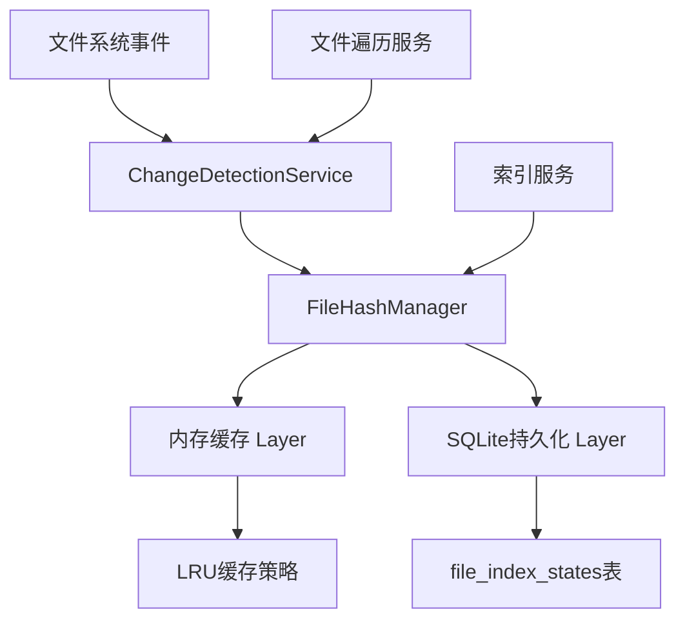

# SQLite集成状态分析与迁移方案

## 当前状态分析

### 1. ProjectIdManager - 项目映射管理

**当前实现状态：❌ 未使用SQLite**

- **存储方式**：内存存储 + JSON文件持久化
- **数据位置**：`./data/project-mapping.json`
- **主要问题**：
  - 使用内存Map存储项目映射关系
  - 通过JSON文件进行持久化
  - 未集成SQLite数据库

**关键代码分析**：
```typescript
// src/database/ProjectIdManager.ts
private projectIdMap: Map<string, string> = new Map(); // projectPath -> projectId
private collectionMap: Map<string, string> = new Map(); // projectId -> collectionName
private spaceMap: Map<string, string> = new Map(); // projectId -> spaceName
private pathToProjectMap: Map<string, string> = Map(); // projectId -> projectPath
private projectUpdateTimes: Map<string, Date> = new Map(); // projectId -> last update time

// 保存到JSON文件
async saveMapping(): Promise<void> {
  const storagePath = this.configService.get('project')?.mappingPath || './data/project-mapping.json';
  // ... JSON序列化和保存逻辑
}
```

### 2. ProjectStateManager - 项目状态管理

**当前实现状态：❌ 未使用SQLite**

- **存储方式**：内存存储 + JSON文件持久化
- **数据位置**：`./data/project-states.json`
- **主要问题**：
  - 使用内存Map存储项目状态
  - 通过JSON文件进行持久化
  - 依赖CoreStateService和StorageStateService进行状态管理
  - 未集成SQLite数据库

**关键代码分析**：
```typescript
// src/service/project/ProjectStateManager.ts
private projectStates: Map<string, ProjectState> = new Map();
private storagePath: string = './data/project-states.json';

// 通过ProjectStateStorageUtils加载和保存
private async loadProjectStates(): Promise<void> {
  this.projectStates = await ProjectStateStorageUtils.loadProjectStates(
    this.storagePath,
    this.logger,
    (rawState: any) => ProjectStateValidator.validateAndNormalizeProjectState(rawState)
  );
}
```

### 3. ChangeDetectionService - 文件哈希管理

**当前实现状态：❌ 未使用SQLite**

- **存储方式**：纯内存存储
- **数据位置**：内存中，无持久化
- **主要问题**：
  - 使用内存Map存储文件哈希
  - 重启后所有文件哈希信息丢失
  - 需要重新扫描所有文件计算哈希
  - 未集成SQLite数据库

**关键代码分析**：
```typescript
// src/service/filesystem/ChangeDetectionService.ts
private fileHashes: Map<string, string> = new Map();
private fileHistory: Map<string, FileHistoryEntry[]> = new Map();

// 初始化时从文件系统重新计算哈希
private async initializeFileHashes(rootPaths: string[]): Promise<void> {
  for (const rootPath of rootPaths) {
    const result = await this.fileSystemTraversal.traverseDirectory(rootPath);
    for (const file of result.files) {
      this.fileHashes.set(file.relativePath, file.hash);
    }
  }
}
```

### 4. SQLite基础架构状态

**✅ 已实现的SQLite组件：**

#### 4.1 SqliteDatabaseService
- **状态**: ✅ 已实现
- **文件**: `src/database/splite/SqliteDatabaseService.ts`
- **功能**: 数据库连接管理、表结构初始化、事务支持

#### 4.2 SqliteProjectManager
- **状态**: ✅ 已实现  
- **文件**: `src/database/splite/SqliteProjectManager.ts`
- **功能**: 项目空间管理、数据操作接口

#### 4.3 数据迁移工具
- **状态**: ✅ 已实现
- **文件**: `src/database/splite/migration/JsonToSqliteMigrator.ts`
- **功能**: JSON到SQLite的数据迁移、验证和回滚

#### 4.4 数据库表结构
```sql
-- 项目表
CREATE TABLE projects (
    id TEXT PRIMARY KEY,
    path TEXT UNIQUE NOT NULL,
    name TEXT,
    description TEXT,
    collection_name TEXT,
    space_name TEXT,
    created_at DATETIME NOT NULL,
    updated_at DATETIME NOT NULL,
    last_indexed_at DATETIME,
    status TEXT NOT NULL,
    settings JSON,
    metadata JSON
);

-- 文件索引状态表（包含文件哈希）
CREATE TABLE file_index_states (
    id INTEGER PRIMARY KEY AUTOINCREMENT,
    project_id TEXT NOT NULL,
    file_path TEXT NOT NULL,
    relative_path TEXT NOT NULL,
    content_hash TEXT NOT NULL,
    file_size INTEGER,
    last_modified DATETIME NOT NULL,
    last_indexed DATETIME,
    indexing_version INTEGER DEFAULT 1,
    chunk_count INTEGER,
    vector_count INTEGER,
    language TEXT,
    file_type TEXT,
    status TEXT DEFAULT 'pending',
    error_message TEXT,
    metadata JSON,
    created_at DATETIME NOT NULL,
    updated_at DATETIME NOT NULL,
    UNIQUE(project_id, file_path),
    FOREIGN KEY (project_id) REFERENCES projects(id) ON DELETE CASCADE
);

-- 项目状态表
CREATE TABLE project_status (
    project_id TEXT PRIMARY KEY,
    vector_status JSON NOT NULL,
    graph_status JSON NOT NULL,
    indexing_progress REAL DEFAULT 0,
    total_files INTEGER DEFAULT 0,
    indexed_files INTEGER DEFAULT 0,
    failed_files INTEGER DEFAULT 0,
    last_updated DATETIME NOT NULL,
    FOREIGN KEY (project_id) REFERENCES projects(id) ON DELETE CASCADE
);

-- 文件变更历史表
CREATE TABLE file_change_history (
    id INTEGER PRIMARY KEY AUTOINCREMENT,
    file_path TEXT NOT NULL,
    project_id TEXT NOT NULL,
    change_type TEXT NOT NULL,
    previous_hash TEXT,
    current_hash TEXT,
    file_size INTEGER,
    timestamp DATETIME NOT NULL,
    metadata JSON,
    FOREIGN KEY (project_id) REFERENCES projects(id) ON DELETE CASCADE
);
```

## 问题识别

### 1. 数据存储不一致
- **ProjectIdManager**：JSON文件存储
- **ProjectStateManager**：JSON文件存储  
- **ChangeDetectionService**：纯内存存储
- **SQLite数据库**：已创建但未使用

### 2. 性能问题
- 文件哈希每次重启都需要重新计算
- JSON文件读写性能较差
- 内存占用随项目规模增长

### 3. 数据一致性风险
- 不同组件使用不同的存储机制
- 缺乏事务支持
- 数据同步困难

## 文件哈希管理迁移方案

### 目标架构：内存缓存 + SQLite持久化



### 1. 创建FileHashManager服务

```typescript
// src/service/filesystem/FileHashManager.ts
@injectable()
export class FileHashManager {
  private memoryCache: Map<string, FileHashEntry> = new Map();
  private sqliteService: SqliteDatabaseService;
  private cacheSize: number = 10000; // 最大缓存条目数
  
  constructor(@inject(TYPES.SqliteDatabaseService) sqliteService: SqliteDatabaseService) {
    this.sqliteService = sqliteService;
  }
  
  // 获取文件哈希（优先从缓存，然后从数据库）
  async getFileHash(projectId: string, filePath: string): Promise<string | null> {
    const cacheKey = `${projectId}:${filePath}`;
    
    // 1. 检查内存缓存
    const cached = this.memoryCache.get(cacheKey);
    if (cached && !this.isCacheExpired(cached)) {
      return cached.hash;
    }
    
    // 2. 从数据库查询
    const dbHash = await this.getHashFromDatabase(projectId, filePath);
    if (dbHash) {
      // 更新缓存
      this.updateCache(cacheKey, dbHash);
      return dbHash;
    }
    
    return null;
  }
  
  // 更新文件哈希
  async updateFileHash(projectId: string, filePath: string, hash: string): Promise<void> {
    const cacheKey = `${projectId}:${filePath}`;
    
    // 1. 更新内存缓存
    this.updateCache(cacheKey, hash);
    
    // 2. 异步更新数据库
    await this.updateHashInDatabase(projectId, filePath, hash);
  }
  
  // 批量获取文件哈希
  async getFileHashes(projectId: string, filePaths: string[]): Promise<Map<string, string>> {
    const result = new Map<string, string>();
    
    // 分批处理，避免内存溢出
    for (let i = 0; i < filePaths.length; i += 100) {
      const batch = filePaths.slice(i, i + 100);
      const batchHashes = await this.getBatchHashes(projectId, batch);
      batchHashes.forEach((hash, path) => result.set(path, hash));
    }
    
    return result;
  }
}
```

### 2. 修改ChangeDetectionService

```typescript
// 修改ChangeDetectionService以使用FileHashManager
export class ChangeDetectionService extends EventEmitter {
  private fileHashManager: FileHashManager;
  // 移除原有的fileHashes和fileHistory
  
  async initializeFileHashes(rootPaths: string[]): Promise<void> {
    for (const rootPath of rootPaths) {
      const result = await this.fileSystemTraversal.traverseDirectory(rootPath);
      
      // 批量更新文件哈希到数据库
      const hashUpdates = result.files.map(file => ({
        projectId: this.getProjectIdForPath(file.path),
        filePath: file.relativePath,
        hash: file.hash
      }));
      
      await this.fileHashManager.batchUpdateHashes(hashUpdates);
    }
  }
}
```

### 3. 集成到现有服务

```typescript
// 在依赖注入容器中注册
container.bind<FileHashManager>(TYPES.FileHashManager).to(FileHashManager).inSingletonScope();

// 修改ChangeDetectionService构造函数
constructor(
  @inject(TYPES.FileHashManager) private fileHashManager: FileHashManager,
  // ... 其他依赖
) {
  // ...
}
```

## 迁移实施步骤

### 阶段一：FileHashManager实现（1-2周）
1. 创建FileHashManager服务
2. 在SQLite中创建文件哈希相关索引
3. 实现内存缓存策略

### 阶段二：ChangeDetectionService迁移（2-3周）
1. 修改ChangeDetectionService使用FileHashManager
2. 实现文件哈希的批量操作
3. 添加缓存失效策略

### 阶段三：ProjectIdManager迁移（2-3周）
1. 创建SqliteProjectManager适配器
2. 逐步替换JSON存储为SQLite存储
3. 保持向后兼容性

### 阶段四：ProjectStateManager迁移（2-3周）
1. 创建SqliteStateManager适配器
2. 逐步替换JSON存储为SQLite存储
3. 保持向后兼容性

### 阶段五：性能优化（1-2周）
1. 实现数据库连接池
2. 添加查询缓存
3. 优化索引策略

## 预期收益

1. **性能提升**：文件哈希持久化，避免重复计算
2. **数据一致性**：统一存储机制，减少数据不一致
3. **可扩展性**：支持更大规模的项目管理
4. **事务支持**：确保数据操作的原子性
5. **查询能力**：支持复杂查询和统计分析

## 风险评估

1. **数据迁移风险**：需要确保数据完整性和一致性
2. **性能影响**：数据库操作可能比内存操作慢
3. **向后兼容性**：需要保持现有API不变
4. **测试覆盖**：需要充分测试新实现

建议采用渐进式迁移策略，先实现FileHashManager，然后逐步迁移其他组件。