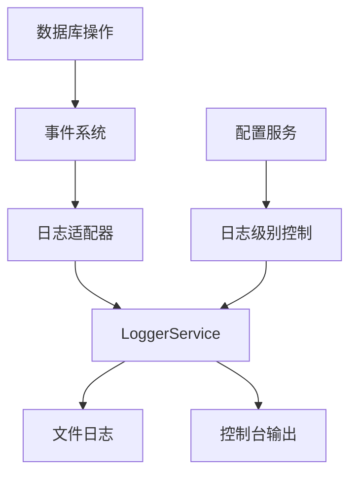

# 数据库日志服务集成方案

## 📋 项目概述

本方案旨在分析当前项目中数据库模块的日志服务集成情况，并提出合理的改进策略。重点在于平衡调试便利性和日志完整性，确保数据库操作的可观测性。

## 📊 当前状态分析

### 1. 现有日志系统架构

**核心组件：**
- `Logger` (`src/utils/logger.ts`) - 基础日志记录器
- `LoggerService` (`src/utils/LoggerService.ts`) - 依赖注入包装器  
- `ErrorHandlerService` (`src/utils/ErrorHandlerService.ts`) - 结构化错误处理

**主要特性：**
- 支持 INFO、WARN、ERROR、DEBUG 四个日志级别
- 文件和控制台双重输出
- 自动日志文件管理（正常退出删除，异常退出保留）
- 异步写入，不阻塞主线程
- 时区支持（UTC+8）

### 2. 数据库模块日志使用现状

**已实现的日志功能：**
- 连接状态变化日志（`QdrantConnectionManager`）
- 错误处理和异常日志
- 性能指标记录
- 事件系统支持（`DatabaseEventManager`）

**存在的问题：**
1. **日志级别不一致** - 不同组件使用不同的日志级别
2. **事件系统与日志系统分离** - 事件处理和日志记录没有很好整合
3. **缺乏统一的日志格式** - 不同服务的日志格式不一致
4. **配置管理不灵活** - 数据库模块无法独立控制日志级别

## 🎯 集成策略设计

### 策略一：分层日志架构



### 策略二：数据库专用日志服务

```typescript
// 建议的数据库专用日志服务
class DatabaseLogger {
  private logger: LoggerService;
  private eventBridge: EventBridge;
  
  // 数据库特定日志方法
  async logConnection(operation: string, status: 'success' | 'failed', details: any) {}
  async logQuery(operation: string, duration: number, resultCount: number) {}
  async logBatchOperation(type: string, batchSize: number, performance: any) {}
}
```

### 策略三：事件驱动的日志集成

将数据库事件系统与主日志系统通过 `EventBridge` 集成：

```typescript
// 事件到日志的映射
const eventToLogMapping = {
  'connection_opened': { level: 'info', message: 'Database connection established' },
  'connection_failed': { level: 'error', message: 'Database connection failed' },
  'query_executed': { level: 'debug', message: 'Query executed' }
};
```

## 📋 实施计划

### 阶段一：基础集成（1-2天）

**目标：** 建立数据库日志适配器和事件集成

**任务：**
1. 创建 `DatabaseLoggerService` 类
2. 实现事件系统到日志的映射
3. 统一数据库操作的日志格式

**关键文件：**
- `src/database/common/DatabaseLoggerService.ts`
- `src/database/common/EventToLogBridge.ts`

### 阶段二：功能增强（2-3天）

**目标：** 添加性能监控和配置管理

**任务：**
1. 实现数据库操作性能监控
2. 添加数据库模块独立的日志配置
3. 支持运行时日志级别调整

**关键文件：**
- `src/database/common/PerformanceMonitor.ts`
- `config/database-logging.json`

### 阶段三：优化完善（1-2天）

**目标：** 测试验证和性能优化

**任务：**
1. 编写集成测试用例
2. 验证日志覆盖率和完整性
3. 优化日志写入性能

**关键文件：**
- `src/__tests__/database/logging-integration.test.ts`

## 🎨 关键设计决策

### 1. 日志级别策略

| 操作类型 | 推荐日志级别 | 说明 |
|---------|-------------|------|
| 连接管理 | INFO | 重要状态变化 |
| 查询执行 | DEBUG | 详细操作信息 |
| 错误处理 | ERROR | 所有错误情况 |
| 性能监控 | INFO | 性能统计信息 |
| 批量操作 | DEBUG | 批量处理详情 |

### 2. 存储策略优化

**当前策略评估：**
- ✅ 优点：简单易用，调试友好
- ❌ 缺点：缺乏持久化，不适合生产环境

**建议改进：**
- 保留当前"正常退出删除"策略用于调试
- 为生产环境添加可选的持久化日志存储
- 支持日志轮转和归档

### 3. 性能考虑

- 保持异步写入不阻塞数据库操作
- 使用批量写入优化高频率日志
- 提供可配置的日志缓冲机制

## 💡 具体实现方案

### 1. 数据库专用日志服务

```typescript
// src/database/common/DatabaseLoggerService.ts
@injectable()
export class DatabaseLoggerService {
  constructor(
    @inject(TYPES.LoggerService) private loggerService: LoggerService,
    @inject(TYPES.ConfigService) private configService: ConfigService
  ) {}
  
  async logConnectionEvent(event: DatabaseEvent): Promise<void> {
    const level = this.getLogLevelForEvent(event.type);
    await this.loggerService[level](`Database ${event.type}`, event.data);
  }
  
  async logQueryPerformance(query: string, duration: number): Promise<void> {
    await this.loggerService.info(`Query executed in ${duration}ms`, { query });
  }
}
```

### 2. 事件到日志的桥接

```typescript
// src/database/common/EventToLogBridge.ts
export class EventToLogBridge {
  private eventToLogMapping = {
    [DatabaseEventType.CONNECTION_OPENED]: { level: 'info', template: 'Database connected' },
    [DatabaseEventType.CONNECTION_FAILED]: { level: 'error', template: 'Database connection failed' },
    [QdrantEventType.VECTOR_INSERTED]: { level: 'debug', template: 'Vectors inserted' }
  };
  
  async bridgeEvent(event: DatabaseEvent): Promise<void> {
    const mapping = this.eventToLogMapping[event.type];
    if (mapping) {
      await this.loggerService[mapping.level](mapping.template, event.data);
    }
  }
}
```

### 3. 性能监控集成

```typescript
// src/database/common/PerformanceMonitor.ts
export class DatabasePerformanceMonitor {
  private metrics: Map<string, PerformanceMetric> = new Map();
  
  recordOperation(operation: string, duration: number): void {
    const metric = this.metrics.get(operation) || { count: 0, totalDuration: 0 };
    metric.count++;
    metric.totalDuration += duration;
    this.metrics.set(operation, metric);
    
    // 定期输出性能统计
    if (metric.count % 100 === 0) {
      this.logPerformanceStats(operation, metric);
    }
  }
}
```

## 🔧 配置管理

### 数据库专用日志配置

```json
// config/database-logging.json
{
  "database": {
    "logging": {
      "level": "info",
      "performance": {
        "enabled": true,
        "threshold": 1000
      },
      "events": {
        "connection": "info",
        "query": "debug", 
        "error": "error"
      }
    }
  }
}
```

## 📈 预期收益

### 1. 可观测性提升
- 统一的数据库操作日志格式
- 完整的错误追踪链路
- 实时性能监控指标

### 2. 调试效率提升
- 结构化的事件日志
- 清晰的错误上下文
- 灵活的日志级别控制

### 3. 维护性改善
- 模块化的日志组件
- 可扩展的日志策略
- 配置驱动的行为调整

## 🚀 风险评估与缓解

### 风险1：性能影响
- **风险**：频繁的日志写入可能影响数据库性能
- **缓解**：异步写入、批量处理、可配置的日志级别

### 风险2：存储空间
- **风险**：大量日志可能占用磁盘空间
- **缓解**：日志轮转、自动清理、可选的持久化策略

### 风险3：复杂性增加
- **风险**：新的日志组件增加系统复杂性
- **缓解**：清晰的接口设计、充分的文档、渐进式实施

## 📝 验收标准

### 功能验收
- [ ] 数据库连接事件正确记录到日志
- [ ] 查询性能数据可监控
- [ ] 错误信息包含完整上下文
- [ ] 日志级别配置生效

### 性能验收  
- [ ] 日志写入不影响数据库操作性能
- [ ] 内存使用在合理范围内
- [ ] 日志文件大小可控

### 集成验收
- [ ] 与现有事件系统无缝集成
- [ ] 配置服务正常工作
- [ ] 测试用例通过率100%

## 🔄 后续优化方向

### 短期优化（1-3个月）
- 实现结构化日志（JSON格式）
- 添加日志分析和告警功能
- 优化日志存储性能

### 长期规划（3-6个月）【暂不考虑】
- 集成外部日志系统（如ELK Stack）
- 实现分布式追踪
- 添加机器学习驱动的异常检测

---

**文档版本：** 1.0  
**创建日期：** 2025-10-02  
**最后更新：** 2025-10-02  
**负责人：** 架构团队