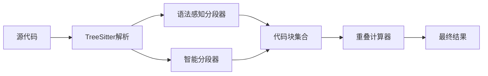
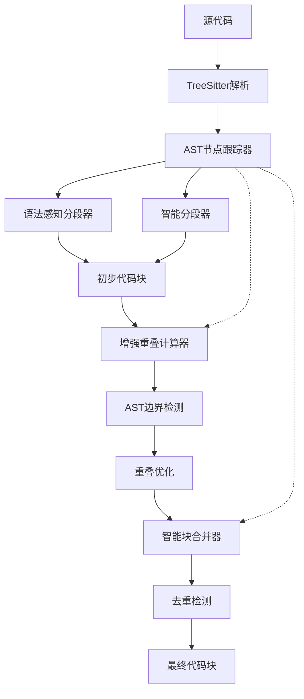

# 片段重复问题技术设计文档

## 概述

本文档详细描述了代码分段系统中片段重复问题的技术解决方案设计，包括核心算法、架构改进和实施策略。

## 问题现状分析

### 当前系统架构



### 主要问题点

1. **重叠计算无边界控制**：`UnifiedOverlapCalculator` 中的重叠范围无限制
2. **基于行号而非AST节点**：重叠计算依赖行号，忽略代码结构边界
3. **无重复检测机制**：同一段代码可能被多个分段器处理
4. **分段策略冲突**：不同分段器可能产生重叠内容

## 核心解决方案

### 1. AST节点跟踪系统

#### 设计目标
- 跟踪已使用的AST节点，避免重复处理
- 提供高效的节点查询和标记机制
- 支持LRU缓存优化内存使用

#### 接口设计
```typescript
interface ASTNodeTracker {
  // 标记节点为已使用
  markUsed(node: ASTNode): void;
  
  // 检查节点是否已被使用
  isUsed(node: ASTNode): boolean;
  
  // 获取未使用的节点列表
  getUnusedNodes(): ASTNode[];
  
  // 清空跟踪器
  clear(): void;
  
  // 获取统计信息
  getStats(): TrackingStats;
}
```

#### 实现要点
- 使用WeakMap存储节点引用，避免内存泄漏
- 实现LRU缓存机制，限制跟踪器大小
- 支持并发访问的线程安全设计

### 2. 增强的重叠计算器

#### 算法改进

**原有问题：**
```typescript
// 当前实现：无限制的重叠范围
for (let i = currentChunk.metadata.endLine - 1; i >= currentChunk.metadata.startLine - 1; i--) {
  // 可能包含大量重复内容
}
```

**改进方案：**
```typescript
class EnhancedOverlapCalculator {
  calculateASTBasedOverlap(
    currentChunk: CodeChunk,
    nextChunk: CodeChunk,
    originalCode: string,
    ast: ASTNode,
    nodeTracker: ASTNodeTracker
  ): OverlapResult {
    // 1. 基于AST节点边界计算重叠
    const astBoundaries = this.findASTBoundaries(ast, currentChunk, nextChunk);
    
    // 2. 限制重叠范围不超过30%
    const maxOverlapSize = currentChunk.content.length * 0.3;
    
    // 3. 检查节点是否已被使用
    const unusedNodes = this.filterUnusedNodes(astBoundaries, nodeTracker);
    
    // 4. 计算最优重叠
    return this.optimizeOverlap(unusedNodes, maxOverlapSize);
  }
}
```

### 3. 智能块合并器

#### 合并策略

**相似度计算算法：**
```typescript
class ChunkMerger {
  calculateChunkSimilarity(chunk1: CodeChunk, chunk2: CodeChunk): number {
    // 基于内容的相似度计算
    const contentSim = this.calculateContentSimilarity(chunk1.content, chunk2.content);
    
    // 基于AST结构的相似度计算
    const astSim = this.calculateASTSimilarity(chunk1, chunk2);
    
    // 基于位置的邻近度计算
    const proximity = this.calculateProximity(chunk1.metadata, chunk2.metadata);
    
    return (contentSim * 0.6) + (astSim * 0.3) + (proximity * 0.1);
  }
}
```

#### 合并决策逻辑
```typescript
interface MergeDecision {
  shouldMerge: boolean;
  mergeStrategy: 'combine' | 'replace' | 'ignore';
  confidence: number;
}

class ChunkMerger {
  decideMerge(chunk1: CodeChunk, chunk2: CodeChunk): MergeDecision {
    const similarity = this.calculateChunkSimilarity(chunk1, chunk2);
    
    if (similarity > 0.9) {
      return { shouldMerge: true, mergeStrategy: 'replace', confidence: similarity };
    } else if (similarity > 0.7) {
      return { shouldMerge: true, mergeStrategy: 'combine', confidence: similarity };
    } else {
      return { shouldMerge: false, mergeStrategy: 'ignore', confidence: similarity };
    }
  }
}
```

## 系统架构改进

### 新的系统架构



### 数据流设计

1. **解析阶段**：源代码 → AST解析 → 节点跟踪器初始化
2. **分段阶段**：分段器使用节点跟踪器 → 生成初步代码块
3. **优化阶段**：重叠计算 → 边界优化 → 块合并 → 去重检测
4. **输出阶段**：生成最终代码块集合

## 关键算法详细设计

### AST边界检测算法

```typescript
class ASTBoundaryDetector {
  findOptimalBoundaries(ast: ASTNode, chunk: CodeChunk): Boundary[] {
    const boundaries: Boundary[] = [];
    
    // 遍历AST，寻找合适的分段边界
    this.traverseAST(ast, (node) => {
      if (this.isBoundaryCandidate(node, chunk)) {
        boundaries.push({
          node,
          score: this.calculateBoundaryScore(node, chunk),
          type: this.getBoundaryType(node)
        });
      }
    });
    
    // 按评分排序并选择最优边界
    return boundaries.sort((a, b) => b.score - a.score).slice(0, 5);
  }
  
  private isBoundaryCandidate(node: ASTNode, chunk: CodeChunk): boolean {
    // 检查节点是否在chunk范围内
    const nodeRange = this.getNodeRange(node);
    const chunkRange = this.getChunkRange(chunk);
    
    return this.rangesOverlap(nodeRange, chunkRange) && 
           this.hasStructuralSignificance(node);
  }
}
```

### 重叠冲突检测算法

```typescript
class OverlapConflictDetector {
  detectConflicts(overlap: OverlapResult, existingChunks: CodeChunk[]): Conflict[] {
    const conflicts: Conflict[] = [];
    
    for (const chunk of existingChunks) {
      const overlapContent = overlap.content;
      const chunkContent = chunk.content;
      
      // 计算内容重叠度
      const overlapRatio = this.calculateOverlapRatio(overlapContent, chunkContent);
      
      if (overlapRatio > 0.3) { // 超过30%重叠视为冲突
        conflicts.push({
          type: 'content_overlap',
          severity: 'high',
          overlapRatio,
          conflictingChunk: chunk
        });
      }
      
      // 检查AST节点冲突
      const nodeConflicts = this.detectNodeConflicts(overlap, chunk);
      conflicts.push(...nodeConflicts);
    }
    
    return conflicts;
  }
}
```

## 性能优化策略

### 内存优化

1. **LRU缓存**：节点跟踪器使用LRU缓存，限制内存使用
2. **增量处理**：大文件分段时采用增量处理策略
3. **垃圾回收**：及时释放不再使用的AST节点引用

### 计算优化

1. **并行处理**：独立的分段器可以并行执行
2. **预处理缓存**：AST解析结果缓存复用
3. **懒加载**：按需加载和处理代码内容

## 测试策略

### 单元测试覆盖

```typescript
describe('EnhancedOverlapCalculator', () => {
  it('should respect max overlap ratio', () => {
    // 测试重叠比例限制
  });
  
  it('should avoid duplicate AST nodes', () => {
    // 测试节点重复检测
  });
  
  it('should maintain semantic integrity', () => {
    // 测试语义完整性保持
  });
});
```

### 集成测试场景

1. **简单重复场景**：同一段代码的多次出现
2. **部分重叠场景**：代码片段有部分内容重叠
3. **复杂嵌套场景**：嵌套结构的分段处理
4. **边界情况**：极端大小的文件和特殊代码结构

## 部署和监控

### 渐进式部署策略

1. **特性开关**：通过配置控制新功能的启用
2. **A/B测试**：对比新旧算法的效果
3. **回滚机制**：发现问题时快速回滚

### 监控指标

- **重复片段减少率**：衡量改进效果的主要指标
- **处理时间变化**：监控性能影响
- **内存使用情况**：确保资源使用合理
- **搜索准确率**：用户体验指标

## 总结

本技术设计方案通过引入AST节点跟踪、增强重叠计算和智能块合并三个核心机制，系统性地解决了代码片段重复问题。方案保持了向后兼容性，并通过渐进式部署策略确保平稳过渡。