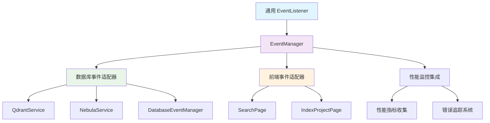
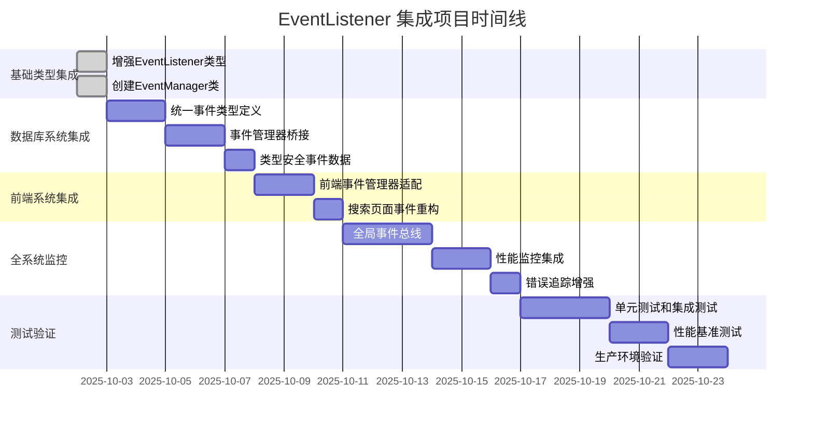

# EventListener 事件系统集成方案

## 📋 项目概述

本计划旨在将增强的 `EventListener` 类型和 `EventManager` 实现集成到现有的代码库索引与检索MCP服务中，提供统一、类型安全的事件处理机制。

## 🎯 集成目标

1. **统一事件处理架构**：为整个项目提供一致的事件处理模式
2. **类型安全性增强**：利用泛型支持提高事件数据的类型安全性
3. **向后兼容性**：确保现有代码不受影响，平稳过渡
4. **扩展性设计**：为未来模块提供可扩展的事件系统基础

## 📊 当前事件系统分析

### 现有架构概览

项目目前拥有两个主要的事件系统：

1. **基础事件系统** (`src/types.ts` 中的 `EventListener`)
   - 简单的事件监听器类型定义
   - 在数据库服务中广泛使用
   - 缺乏类型安全性

2. **数据库事件系统** (`src/database/common/`)
   - 完整的事件管理实现
   - 支持 Qdrant 和 Nebula 数据库
   - 包含事件历史记录和性能监控

### 架构对比分析

| 特性 | 基础事件系统 | 数据库事件系统 | 新事件系统 |
|------|-------------|---------------|-----------|
| 类型安全 | ❌ 弱类型 | ✅ 强类型 | ✅ 泛型支持 |
| 功能完整性 | ❌ 基础 | ✅ 完整 | ✅ 完整 |
| 向后兼容 | ✅ 高 | ❌ 特定领域 | ✅ 高 |
| 扩展性 | ❌ 有限 | ✅ 良好 | ✅ 优秀 |

## 🔄 集成策略

### 阶段一：基础类型集成（1-2天）

#### 任务1.1：增强基础事件类型
- **状态**：✅ 已完成
- **内容**：将 `EventListener` 类型改为泛型支持
- **文件**：`src/types.ts`
- **影响**：无破坏性变更，完全向后兼容

#### 任务1.2：创建通用事件管理器
- **状态**：✅ 已完成  
- **内容**：实现 `EventManager` 类作为参考实现
- **文件**：`src/utils/EventManager.ts`
- **用途**：为其他模块提供标准实现参考

### 阶段二：数据库事件系统增强（3-5天）

#### 任务2.1：统一事件类型定义
- **目标**：将数据库特定事件系统与通用事件系统对齐
- **实施**：
  ```typescript
  // 将 DatabaseEventListener 改为泛型
  export interface DatabaseEventListener<T = DatabaseEvent> {
    (event: T): void;
  }
  ```

#### 任务2.2：事件管理器桥接
- **目标**：在数据库事件管理器和通用事件管理器之间建立桥接
- **实施**：创建适配器类，支持两种事件系统的互操作

#### 任务2.3：类型安全事件数据
- **目标**：为数据库事件定义具体的类型接口
- **实施**：
  ```typescript
  interface QdrantConnectionEvent {
    type: QdrantEventType.CONNECTION_OPENED;
    data: {
      host: string;
      port: number;
      status: 'connected' | 'disconnected';
    };
  }
  ```

### 阶段三：前端事件系统集成（2-3天）

#### 任务3.1：前端事件管理器适配
- **目标**：为前端代码提供 TypeScript 类型安全的事件处理
- **文件**：`frontend/src/utils/EventManager.ts`
- **特性**：DOM 事件与自定义事件的统一管理

#### 任务3.2：搜索页面事件重构
- **目标**：将前端搜索功能的事件处理改为类型安全
- **文件**：`frontend/src/pages/SearchPage.ts`
- **改进**：使用泛型事件监听器替代 `any` 类型

### 阶段四：全系统事件监控（4-6天）

#### 任务4.1：全局事件总线
- **目标**：创建项目级的全局事件总线
- **实施**：基于 `EventManager` 实现跨模块事件通信
- **用途**：模块间解耦，系统状态监控

#### 任务4.2：性能监控集成
- **目标**：将事件系统与性能监控集成
- **实施**：自动记录关键操作的事件时间线
- **输出**：可观察的系统行为分析

#### 任务4.3：错误追踪增强
- **目标**：通过事件系统改进错误追踪
- **实施**：统一错误事件格式，集成到日志系统

## 🏗️ 技术实施方案

### 核心接口设计

```typescript
// 增强的通用事件接口
export interface IEventSystem<T = any> {
  on<K extends keyof T>(event: K, listener: EventListener<T[K]>): void;
  off<K extends keyof T>(event: K, listener: EventListener<T[K]>): void;
  emit<K extends keyof T>(event: K, data: T[K]): void;
}

// 数据库事件类型映射
interface DatabaseEvents {
  'qdrant.connected': QdrantConnectionEvent;
  'nebula.query.executed': NebulaQueryEvent;
  'project.indexed': ProjectIndexEvent;
}
```

### 集成架构图



### 代码迁移策略

1. **渐进式迁移**：新代码使用新事件系统，旧代码逐步迁移
2. **适配器模式**：为现有代码提供适配器，避免大规模重构
3. **类型兼容性**：利用 TypeScript 的类型系统确保平滑过渡

## 🧪 测试策略

### 单元测试
- 事件管理器基本功能测试
- 泛型类型安全性测试
- 跨模块事件通信测试

### 集成测试
- 数据库事件系统集成测试
- 前端事件处理集成测试
- 性能监控事件流测试

### 兼容性测试
- 向后兼容性验证
- 现有功能回归测试
- 类型系统兼容性测试

## ⚠️ 风险分析与缓解

### 技术风险
1. **类型系统冲突**
   - 风险：泛型类型与现有类型定义冲突
   - 缓解：充分的类型测试，渐进式迁移

2. **性能影响**
   - 风险：事件系统增加运行时开销
   - 缓解：性能基准测试，优化关键路径

3. **内存泄漏**
   - 风险：事件监听器未正确清理
   - 缓解：内存使用监控，自动清理机制

### 集成风险
1. **模块间依赖**
   - 风险：事件系统变更影响其他模块
   - 缓解：接口隔离，版本兼容性保证

2. **团队适应**
   - 风险：开发团队需要适应新的事件模式
   - 缓解：详细文档，示例代码，培训材料

## 📈 成功指标

### 功能指标
- [ ] 所有新代码使用类型安全的事件系统
- [ ] 现有功能100%向后兼容
- [ ] 事件系统覆盖核心模块的80%

### 质量指标
- [ ] 类型错误减少50%
- [ ] 事件相关bug减少30%
- [ ] 代码可维护性提升（基于静态分析）

### 性能指标
- [ ] 事件处理延迟 < 10ms
- [ ] 内存使用增长 < 5%
- [ ] CPU使用率增长 < 3%

## 📅 实施时间线



## 🔄 迭代改进计划

### 第一次迭代（基础集成）
- 完成阶段一和阶段二的核心功能
- 建立基本的事件系统架构
- 验证向后兼容性

### 第二次迭代（功能扩展）
- 完成阶段三的前端集成
- 实现性能监控基础功能
- 优化事件系统性能

### 第三次迭代（生产就绪）
- 完成全系统监控集成
- 通过生产环境测试
- 文档和培训材料完善

## 📋 交付物清单

### 代码交付物
- [x] 增强的 `EventListener<T>` 类型定义
- [x] 通用 `EventManager` 类实现
- [ ] 数据库事件系统适配器
- [ ] 前端事件管理器
- [ ] 全局事件总线实现
- [ ] 完整的测试用例

### 文档交付物
- [x] 集成方案文档 (`docs/plan/event-system-integration-plan.md`)
- [ ] API 使用指南
- [ ] 迁移指南
- [ ] 最佳实践文档

## 🎯 结论

通过本集成方案的实施，项目将获得一个统一、类型安全、可扩展的事件系统架构。这不仅解决了原始 `EventListener` 类型"没有实际实现"的问题，还为整个项目的可维护性和可扩展性提供了坚实基础。

建议按照阶段顺序执行，每个阶段完成后进行充分的测试和验证，确保系统的稳定性和可靠性。

---
*文档版本: 1.0*  
*创建日期: 2025-10-02*  
*最后更新: 2025-10-02*