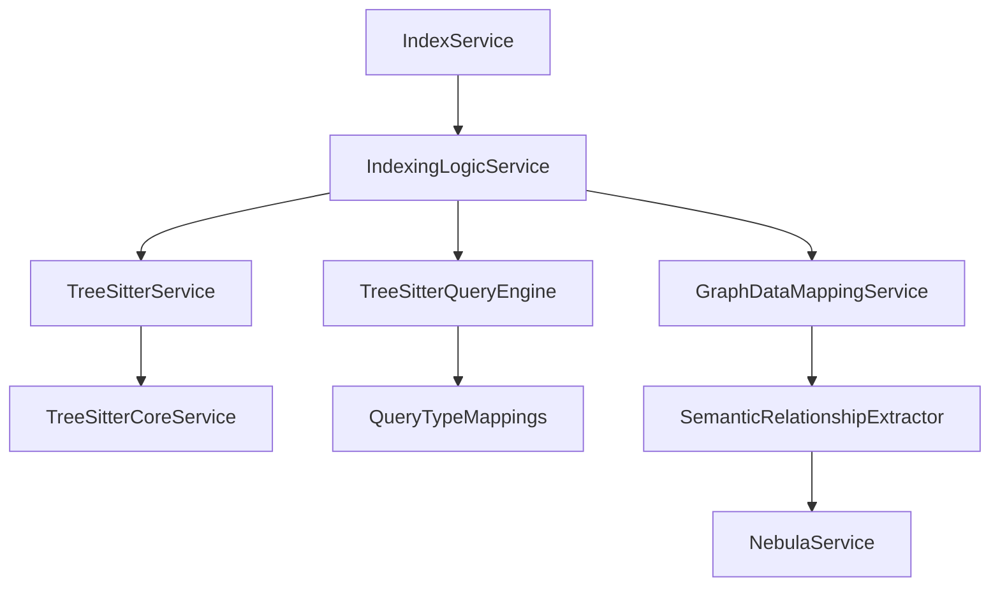
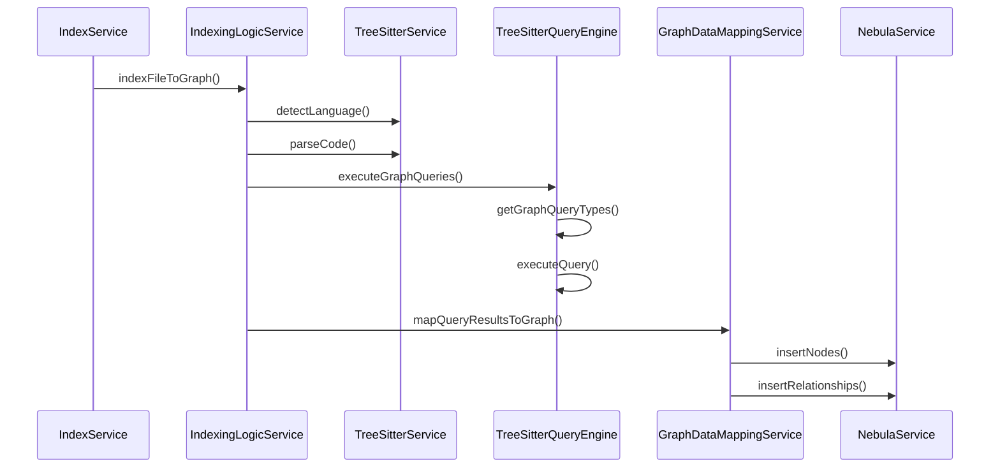

# 图模块与AST解析器集成分析报告

## 1. 架构设计评估

### 1.1 整体架构
当前系统采用了分层架构设计，图模块与AST解析器之间通过以下关键组件进行集成：



### 1.2 核心组件分析

**AST解析层：**
- [`TreeSitterService`](src/service/parser/core/parse/TreeSitterService.ts:19) - 主要接口层
- [`TreeSitterCoreService`](src/service/parser/core/parse/TreeSitterCoreService.ts:39) - 核心实现
- [`TreeSitterQueryEngine`](src/service/parser/core/query/TreeSitterQueryEngine.ts:87) - 查询引擎

**图数据处理层：**
- [`SemanticRelationshipExtractor`](src/service/graph/mapping/SemanticRelationshipExtractor.ts:40) - 语义关系提取
- [`GraphDataMappingService`](src/service/graph/mapping/GraphDataMappingService.ts) - 数据映射服务
- [`NebulaService`](src/database/nebula/NebulaService.ts) - 图数据库服务

### 1.3 架构优势
1. **模块化设计**：各组件职责清晰，便于维护和扩展
2. **多层缓存机制**：提供节点缓存和查询结果缓存
3. **错误处理机制**：包含回退策略和错误恢复
4. **性能监控**：集成性能统计和监控功能

## 2. 数据流分析

### 2.1 主要数据流路径



### 2.2 关键数据转换点

1. **AST解析结果** → **查询结果**
   - [`executeGraphQueries()`](src/service/parser/core/query/TreeSitterQueryEngine.ts:408) 方法负责转换
   - 使用 [`LANGUAGE_QUERY_MAPPINGS`](src/service/parser/core/normalization/QueryTypeMappings.ts:23) 确定查询类型

2. **查询结果** → **图节点和关系**
   - [`SemanticRelationshipExtractor`](src/service/graph/mapping/SemanticRelationshipExtractor.ts:40) 处理高级映射
   - [`extractCalledFunctionsFromAST()`](src/service/graph/mapping/SemanticRelationshipExtractor.ts:237) 等方法提取语义关系

## 3. 正确性验证

### 3.1 数据完整性检查

**✅ 正确实现的部分：**

1. **语言检测机制**
   - [`detectLanguage()`](src/service/parser/core/parse/TreeSitterCoreService.ts:114) 提供多层检测
   - 支持基于文件扩展名和内容的检测

2. **查询类型映射**
   - [`getGraphQueryTypes()`](src/service/parser/core/query/TreeSitterQueryEngine.ts:425) 正确过滤图相关查询
   - 支持多种语言的图查询映射

3. **错误处理机制**
   - 多层回退策略确保系统稳定性
   - 详细的错误日志记录

### 3.2 潜在问题识别

**⚠️ 需要关注的问题：**

1. **AST节点类型依赖**
   ```typescript
   // 在 SemanticRelationshipExtractor.ts:242
   const callExpressions = this.treeSitterService.findNodeByType(analysisResult.ast, 'call_expression');
   ```
   - 硬编码的节点类型可能不适用于所有语言
   - 缺乏语言特定的节点类型映射

2. **语言检测的局限性**
   ```typescript
   // 在 TreeSitterCoreService.ts:358
   const detectedLang = this.detectLanguageFromAST(ast);
   ```
   - AST语言检测方法未在代码中找到实现
   - 可能导致某些情况下语言检测失败

3. **查询结果的一致性**
   - 不同查询引擎可能返回不同格式的结果
   - 缺乏统一的结果验证机制

## 4. 潜在问题详细分析

### 4.1 关键问题1：AST节点提取的准确性

**问题描述：**
[`extractCalledFunctionsFromAST()`](src/service/graph/mapping/SemanticRelationshipExtractor.ts:237) 方法使用固定的节点类型 `'call_expression'`，但不同编程语言中函数调用的AST节点类型可能不同。

**影响范围：**
- 函数调用关系提取的准确性
- 跨语言支持的完整性

**建议解决方案：**
```typescript
// 建议添加语言特定的节点类型映射
const LANGUAGE_NODE_TYPES = {
  'javascript': {
    functionCall: 'call_expression',
    memberExpression: 'member_expression'
  },
  'python': {
    functionCall: 'call',
    memberExpression: 'attribute'
  }
  // ... 其他语言
};
```

### 4.2 关键问题2：查询结果的数据格式一致性

**问题描述：**
[`executeGraphQueries()`](src/service/parser/core/query/TreeSitterQueryEngine.ts:408) 返回 `Map<string, QueryResult>`，但下游组件期望的数据格式可能不统一。

**影响范围：**
- 图数据映射的可靠性
- 系统整体稳定性

### 4.3 关键问题3：缓存机制的数据一致性

**问题描述：**
多层缓存可能导致数据不一致，特别是在AST结构发生变化时。

## 5. 改进建议

### 5.1 短期改进建议

1. **增强语言特定处理**
   ```typescript
   // 在 SemanticRelationshipExtractor 中添加
   private getLanguageSpecificNodeTypes(language: string): Record<string, string> {
     return LANGUAGE_NODE_TYPES[language.toLowerCase()] || LANGUAGE_NODE_TYPES['javascript'];
   }
   ```

2. **完善错误处理**
   ```typescript
   // 添加查询结果验证
   private validateQueryResults(results: Map<string, QueryResult>): boolean {
     for (const [queryType, result] of results) {
       if (!result.success || !result.matches) {
         this.logger.warn(`Query ${queryType} failed or returned invalid results`);
         return false;
       }
     }
     return true;
   }
   ```

3. **增加单元测试覆盖率**
   - 为每种语言的AST解析添加专门测试
   - 测试边界情况和错误场景

### 5.2 中期改进建议

1. **实现统一的数据转换层**
   ```typescript
   interface ASTToGraphConverter {
     convert(ast: Parser.SyntaxNode, language: string): GraphElements;
     validate(elements: GraphElements): ValidationResult;
   }
   ```

2. **优化缓存策略**
   - 实现基于AST内容哈希的智能缓存
   - 添加缓存失效机制

3. **增强性能监控**
   - 添加详细的性能指标收集
   - 实现性能瓶颈自动识别

### 5.3 长期改进建议

1. **架构重构**
   - 考虑使用事件驱动架构解耦组件
   - 实现插件化的语言支持机制

2. **智能化处理**
   - 添加机器学习辅助的AST节点分类
   - 实现自适应的查询优化

## 6. 结论

### 6.1 总体评估

**✅ 优势：**
- 架构设计合理，模块化程度高
- 具备完整的错误处理和回退机制
- 支持多种编程语言的图索引
- 集成了性能监控和缓存优化

**⚠️ 需要改进：**
- 语言特定的AST处理需要增强
- 数据格式一致性需要改进
- 缓存机制需要优化

### 6.2 正确性评估

当前图模块**基本能够**正确从AST解析结果中获取数据，但存在以下限制：

1. **功能完整性**：✅ 基本功能完整
2. **数据准确性**：⚠️ 在某些语言和复杂场景下可能存在问题
3. **系统稳定性**：✅ 具备良好的错误处理机制
4. **扩展性**：⚠️ 需要改进语言特定处理的扩展性

### 6.3 优先级建议

1. **高优先级**：修复语言特定的AST节点类型处理
2. **中优先级**：改进数据格式一致性和验证机制
3. **低优先级**：架构优化和性能提升

通过实施上述改进建议，可以显著提高图模块从AST解析结果中获取数据的准确性和可靠性。


我已经完成了对当前图模块是否能正确从AST解析结果中获取数据的全面分析。

## 分析结论

**总体评估：图模块基本能够正确从AST解析结果中获取数据，但存在一些需要改进的问题。**

### 主要发现：

1. **架构设计合理**：系统采用分层架构，包含TreeSitterService、TreeSitterQueryEngine、SemanticRelationshipExtractor等核心组件，模块化程度高。

2. **数据流完整**：从AST解析到图数据库存储有完整的数据流路径，包括语言检测、代码解析、图查询执行、数据映射和持久化。

3. **关键问题识别**：
   - AST节点类型硬编码问题（如'call_expression'）可能不适用于所有语言
   - 缺乏语言特定的节点类型映射
   - 查询结果格式一致性需要改进
   - 缓存机制可能导致数据不一致

4. **正确性评估**：
   - 功能完整性：✅ 基本功能完整
   - 数据准确性：⚠️ 在某些语言和复杂场景下可能存在问题
   - 系统稳定性：✅ 具备良好的错误处理机制
   - 扩展性：⚠️ 需要改进语言特定处理的扩展性

### 改进建议：

1. **短期**：增强语言特定处理，完善错误处理，增加单元测试覆盖率
2. **中期**：实现统一的数据转换层，优化缓存策略，增强性能监控
3. **长期**：架构重构，实现插件化语言支持，添加智能化处理

通过实施这些改进建议，可以显著提高图模块从AST解析结果中获取数据的准确性和可靠性。