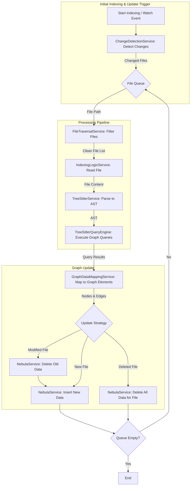

# 图索引实现指南

## 概述

本文档提供了在现有项目结构基础上实现图索引功能的完整指南。该实现充分利用了现有的服务和组件，通过最小化的修改和扩展，实现从代码文件到图索引的完整构建流程。

## 图数据库 Schema 设计

### 节点类型 (Tags)

1. **`File`**: 代表一个源代码文件。
   - **属性**:
     - `path` (string): 文件的唯一路径，作为 VID (Vertex ID)。
     - `language` (string): 代码语言 (例如, 'typescript', 'go')。
     - `line_count` (int): 文件行数。

2. **`Class`**: 代表一个类定义。
   - **属性**:
     - `name` (string): 类名。
     - `file_path` (string): 所属文件的路径。
     - `start_line` (int): 起始行号。
     - `end_line` (int): 结束行号。
     - `method_count` (int): 包含的方法数量。
     - `property_count` (int): 包含的属性数量。

3. **`Function`**: 代表一个函数或方法。
   - **属性**:
     - `name` (string): 函数或方法名。
     - `file_path` (string): 所属文件的路径。
     - `start_line` (int): 起始行号。
     - `end_line` (int): 结束行号。
     - `signature` (string, optional): 函数签名。
     - `cyclomatic_complexity` (int): 圈复杂度，衡量代码的复杂性。
     - `is_method` (bool): 是否为方法。

4. **`Interface`**: 代表一个接口定义。
   - **属性**:
     - `name` (string): 接口名。
     - `file_path` (string): 所属文件的路径。
     - `start_line` (int): 起始行号。
     - `end_line` (int): 结束行号。

5. **`Import`**: 代表一个导入的模块或标识符。
   - **属性**:
     - `source` (string): 导入的来源路径 (e.g., './utils')。
     - `specifiers` (string, optional): 导入的具体成员列表 (e.g., '{ parse, query }')。
     - `file_path` (string): 执行导入操作的文件路径。

6. **`Export`**: 代表一个导出的标识符。
   - **属性**:
     - `name` (string): 导出的标识符名称。
     - `file_path` (string): 执行导出操作的文件路径。

### 边类型 (Edge Types)

1. **`CONTAINS`**: 表示文件或类包含其他代码结构。
   - `(File)` - `[:CONTAINS]` -> `(Class)`
   - `(File)` - `[:CONTAINS]` -> `(Function)`
   - `(File)` - `[:CONTAINS]` -> `(Interface)`
   - `(Class)` - `[:CONTAINS]` -> `(Function)` (表示类方法)

2. **`IMPORTS_FROM`**: 表示文件间的导入关系。
   - `(File)` - `[:IMPORTS_FROM]` -> `(File)`

3. **`CALLS`**: 表示函数间的调用关系。
   - `(Function)` - `[:CALLS]` -> `(Function)`

4. **`INHERITS_FROM`**: 表示类的继承关系。
   - `(Class)` - `[:INHERITS_FROM]` -> `(Class)`

5. **`IMPLEMENTS`**: 表示类实现接口的关系。
   - `(Class)` - `[:IMPLEMENTS]` -> `(Interface)`

## 架构设计

### 核心组件

1. **现有组件**:
   - `IndexService` (位于 `src/service/index/IndexService.ts`) - 负责整个索引流程的编排和管理
   - `TreeSitterService` (位于 `src/service/parser/core/parse/TreeSitterService.ts`) - 负责将文件内容解析为 AST
   - `TreeSitterQueryEngine` (位于 `src/service/parser/core/query/TreeSitterQueryEngine.ts`) - 负责执行查询提取代码结构
   - `NebulaService` (位于 `src/database/nebula/NebulaService.ts`) - 负责图数据库的操作
   - `GraphIndexService` (位于 `src/service/index/GraphIndexService.ts`) - 负责图索引的特定操作和管理
   - `ChangeDetectionService` (位于 `src/service/filesystem/ChangeDetectionService.ts`) - 负责检测文件变更
   - `FileTraversalService` (位于 `src/service/index/shared/FileTraversalService.ts`) - 负责文件遍历和过滤
   - `IndexingLogicService` (位于 `src/service/index/IndexingLogicService.ts`) - 负责文件索引的具体逻辑
   - `GraphDataMappingService` (位于 `src/service/graph/mapping/GraphDataMappingService.ts`) - 现有的图数据映射服务

2. **新增组件**:
   - `GraphMapperService` (扩展现有 `GraphDataMappingService`) - 核心组件，负责将查询结果转换为图元素

### 数据流和处理流程



## 查询规则设计

### 现有查询模式分析

项目使用 `QueryTypeMappings.ts` 定义语言查询映射，查询文件位于 `src/service/parser/constants/queries/` 目录下，按语言组织。

### 图索引查询规则扩展

#### 1. 类和接口提取

基于现有的 `typescript/classes.ts`，扩展以支持图索引所需的关系提取：

```scm
; 捕获类定义
(class_declaration
  name: (type_identifier) @class.name
  body: (class_body) @class.body) @class.definition

; 捕获类的继承
(class_declaration
  name: (type_identifier) @class.name
  heritage: (class_heritage 
    (extends_clause 
      (type_identifier) @class.inherits))) @class.with_inheritance

; 捕获类的接口实现
(class_declaration
  name: (type_identifier) @class.name
  heritage: (class_heritage 
    (implements_clause 
      (type_identifier) @class.implements))) @class.with_implementation

; 捕获接口定义
(interface_declaration
  name: (type_identifier) @interface.name
  body: (interface_body) @interface.body) @interface.definition
```

#### 2. 函数和方法提取

```scm
; 捕获函数声明
(function_declaration
  name: (identifier) @function.name
  parameters: (formal_parameters) @function.parameters
  return_type: (type_annotation)? @function.return_type) @function.definition

; 捕获方法定义
(method_definition
  name: (property_identifier) @method.name
  parameters: (formal_parameters) @method.parameters
  return_type: (type_annotation)? @method.return_type) @method.definition
```

#### 3. 函数调用提取

```scm
; 捕获直接函数调用, e.g., myFunction()
(call_expression
  function: (identifier) @call.name) @call.expression

; 捕获成员方法调用, e.g., myObject.myMethod()
(call_expression
  function: (member_expression
    property: (property_identifier) @call.name)) @call.member_expression

; 捕获静态方法调用, e.g., MyClass.myStaticMethod()
(call_expression
  function: (member_expression
    object: (type_identifier) @call.class_name
    property: (property_identifier) @call.name)) @call.static_method
```

#### 4. 导入和导出语句提取

```scm
; 捕获导入语句
(import_statement
  (import_clause 
    (identifier) @import.default_name)
  source: (string) @import.source) @import.default

; 捕获导出语句
(export_statement
  (identifier) @export.name) @export.named
```

### 查询规则集成策略

1. **更新查询映射**: 在 `QueryTypeMappings.ts` 中添加图索引特定的查询类型：

```typescript
export const LANGUAGE_QUERY_MAPPINGS: LanguageMappings = {
  'typescript': {
    // 现有映射...
    'functions': ['functions'],
    'classes': ['classes'],
    
    // 新增图索引映射
    'graph-classes': ['classes', 'interfaces'],
    'graph-functions': ['functions', 'methods'],
    'graph-calls': ['expressions'],
    'graph-imports': ['imports'],
    'graph-exports': ['exports'],
    ...
  },
  // ... 其他语言
};
```

2. **扩展 TreeSitterQueryEngine**: 添加执行图索引特定查询的方法。

## 实现计划

### 阶段一：核心服务实现

#### 1. 扩展 `GraphDataMappingService`

**文件路径**: `src/service/graph/mapping/GraphDataMappingService.ts`

**核心职责**:
- 提供一个 `mapQueryResultsToGraph(queryResults: Map<string, QueryResult>): GraphMappingResult` 方法。
- 根据查询结果创建图节点和边。
- 计算静态分析属性（如圈复杂度、方法数量等）。

**关键方法**:

```typescript
@injectable()
export class GraphDataMappingService implements IGraphDataMappingService {
  // 现有方法保持不变...

  /**
   * 将查询结果映射为图元素
   */
  mapQueryResultsToGraph(queryResults: Map<string, QueryResult>): GraphMappingResult {
    const nodes: GraphNode[] = [];
    const edges: GraphEdge[] = [];

    // 处理类和接口
    const classResults = queryResults.get('graph-classes');
    if (classResults) {
      for (const match of classResults.matches) {
        this.processClassOrInterface(match, nodes, edges);
      }
    }

    // 处理函数和方法
    const functionResults = queryResults.get('graph-functions');
    if (functionResults) {
      for (const match of functionResults.matches) {
        this.processFunctionOrMethod(match, nodes, edges);
      }
    }

    // 处理函数调用
    const callResults = queryResults.get('graph-calls');
    if (callResults) {
      for (const match of callResults.matches) {
        this.processCall(match, nodes, edges);
      }
    }

    // 处理导入和导出
    const importResults = queryResults.get('graph-imports');
    if (importResults) {
      for (const match of importResults.matches) {
        this.processImport(match, nodes, edges);
      }
    }

    const exportResults = queryResults.get('graph-exports');
    if (exportResults) {
      for (const match of exportResults.matches) {
        this.processExport(match, nodes, edges);
      }
    }

    return { nodes, edges };
  }

  /**
   * 处理类或接口
   */
  private processClassOrInterface(match: QueryMatch, nodes: GraphNode[], edges: GraphEdge[]): void {
    // 实现类和接口处理逻辑
  }

  /**
   * 处理函数或方法
   */
  private processFunctionOrMethod(match: QueryMatch, nodes: GraphNode[], edges: GraphEdge[]): void {
    // 实现函数和方法处理逻辑
  }

  /**
   * 处理函数调用
   */
  private processCall(match: QueryMatch, nodes: GraphNode[], edges: GraphEdge[]): void {
    // 实现函数调用处理逻辑
  }

  /**
   * 处理导入
   */
  private processImport(match: QueryMatch, nodes: GraphNode[], edges: GraphEdge[]): void {
    // 实现导入处理逻辑
  }

  /**
   * 处理导出
   */
  private processExport(match: QueryMatch, nodes: GraphNode[], edges: GraphEdge[]): void {
    // 实现导出处理逻辑
  }
}
```

#### 2. 更新接口定义

**文件路径**: `src/service/graph/mapping/IGraphDataMappingService.ts`

**新增接口**:

```typescript
/**
 * 图映射结果
 */
export interface GraphMappingResult {
  nodes: GraphNode[];
  edges: GraphEdge[];
}

/**
 * 图边接口
 */
export interface GraphEdge {
  id: string;
  type: GraphRelationshipType;
  sourceNodeId: string;
  targetNodeId: string;
  properties: Record<string, any>;
}

/**
 * 扩展图数据映射服务接口
 */
export interface IGraphDataMappingService {
  // 现有方法保持不变...

  /**
   * 将查询结果映射为图元素
   */
  mapQueryResultsToGraph(queryResults: Map<string, QueryResult>): GraphMappingResult;
}
```

### 阶段二：服务扩展

#### 1. 扩展 `TreeSitterQueryEngine`

**文件路径**: `src/service/parser/core/query/TreeSitterQueryEngine.ts`

**新增方法**:

```typescript
/**
 * 执行图索引查询
 */
async executeGraphQueries(ast: Parser.SyntaxNode, language: string): Promise<Map<string, QueryResult>> {
  // 获取图索引查询类型
  const graphQueryTypes = this.getGraphQueryTypes(language);
  
  // 执行查询
  const results = new Map<string, QueryResult>();
  for (const queryType of graphQueryTypes) {
    const result = await this.executeQuery(ast, queryType, language);
    results.set(queryType, result);
  }
  
  return results;
}

/**
 * 获取图索引查询类型
 */
private getGraphQueryTypes(language: string): string[] {
  const mapping = LANGUAGE_QUERY_MAPPINGS[language.toLowerCase()];
  if (!mapping) {
    return [];
  }
  
  // 返回图索引相关的查询类型
  return Object.keys(mapping).filter(key => key.startsWith('graph-'));
}
```

#### 2. 扩展 `IndexingLogicService`

**文件路径**: `src/service/index/IndexingLogicService.ts`

**新增方法**:

```typescript
/**
 * 索引文件到图数据库
 */
async indexFileToGraph(projectPath: string, filePath: string): Promise<void> {
  try {
    // 读取文件内容
    const content = await fs.readFile(filePath, 'utf8');
    
    // 检测语言
    const language = await this.treeSitterService.detectLanguage(filePath);
    if (!language) {
      this.logger.warn(`Unsupported language for file: ${filePath}`);
      return;
    }

    // 解析为 AST
    const parseResult = await this.treeSitterService.parseCode(content, language);
    
    // 执行图索引查询
    const queryResults = await this.treeSitterQueryEngine.executeGraphQueries(parseResult.ast, language);

    // 映射为图元素
    const graphElements = await this.graphMappingService.mapQueryResultsToGraph(queryResults);

    // 转换为 Nebula 格式
    const nebulaNodes = this.convertToNebulaNodes(graphElements.nodes);
    const nebulaRelationships = this.convertToNebulaRelationships(graphElements.edges);

    // 插入到图数据库
    if (nebulaNodes.length > 0) {
      await this.nebulaService.insertNodes(nebulaNodes);
    }

    if (nebulaRelationships.length > 0) {
      await this.nebulaService.insertRelationships(nebulaRelationships);
    }

    this.logger.info(`Successfully indexed file to graph: ${filePath}`, {
      nodeCount: nebulaNodes.length,
      edgeCount: nebulaRelationships.length
    });

  } catch (error) {
    this.logger.error(`Failed to index file to graph: ${filePath}`, error);
    throw error;
  }
}
```

#### 3. 扩展 `NebulaService`

**文件路径**: `src/database/nebula/NebulaService.ts`

**新增方法**:

```typescript
/**
 * 批量插入节点
 */
async batchInsertNodes(nodes: NebulaNode[]): Promise<void> {
  if (!nodes || nodes.length === 0) {
    return;
  }

  try {
    // 按标签分组节点
    const nodesByLabel = this.groupNodesByLabel(nodes);

    // 为每个标签批量插入
    for (const [label, labelNodes] of Object.entries(nodesByLabel)) {
      const queries = labelNodes.map(node => ({
        query: `INSERT VERTEX ${label} (${Object.keys(node.properties).join(', ')}) VALUES ${node.id}: (${Object.values(node.properties).map(v => this.formatValue(v)).join(', ')})`,
        params: {}
      }));

      await this.executeTransaction(queries);
    }

    this.logger.info(`Successfully batch inserted ${nodes.length} nodes`);
  } catch (error) {
    this.logger.error(`Failed to batch insert nodes`, error);
    throw error;
  }
}

/**
 * 删除文件相关的所有数据
 */
async deleteDataForFile(filePath: string): Promise<void> {
  try {
    // 删除与文件相关的所有节点和关系
    const deleteQuery = `
      LOOKUP ON File WHERE file_path == "${filePath}" YIELD id AS vid |
      FETCH PROP ON * $-.vid YIELD * |
      GO FROM $-.vid OVER * REVERSELY YIELD dst AS dst |
      DELETE VERTEX $-.vid WITH EDGE
    `;

    await this.executeWriteQuery(deleteQuery);
    this.logger.info(`Successfully deleted data for file: ${filePath}`);
  } catch (error) {
    this.logger.error(`Failed to delete data for file: ${filePath}`, error);
    throw error;
  }
}
```

### 阶段三：集成与协调

#### 1. 扩展 `IndexService`

**文件路径**: `src/service/index/IndexService.ts`

**修改方法**:

```typescript
/**
 * 索引单个文件（增强版，带图索引支持）
 */
private async indexFile(projectPath: string, filePath: string): Promise<void> {
  try {
    // 原有的向量索引逻辑
    await this.indexingLogicService.indexFile(projectPath, filePath);
    
    // 新增的图索引逻辑
    if (process.env.NEBULA_ENABLED?.toLowerCase() !== 'false') {
      await this.indexingLogicService.indexFileToGraph(projectPath, filePath);
    }
  } catch (error) {
    this.recordError(filePath, error);
    this.errorHandler.handleError(
      new Error(`Failed to index file: ${error instanceof Error ? error.message : String(error)}`),
      { component: 'IndexService', operation: 'indexFile', projectPath, filePath }
    );
    throw error;
  }
}
```

#### 2. 更新依赖注入配置

**文件路径**: `src/types.ts`

**新增类型**:

```typescript
export const TYPES = {
  // 现有类型...
  
  // 图映射服务
  GraphMapperService: Symbol.for('GraphMapperService'),
  
  // 其他现有类型...
};
```

**文件路径**: `src/core/registrars/DatabaseServiceRegistrar.ts`

**注册新服务**:

```typescript
// 注册 GraphMapperService
container.bind<GraphDataMappingService>(TYPES.GraphMapperService).to(GraphDataMappingService).inSingletonScope();
```

## 图 Schema 初始化脚本

**文件路径**: `scripts/setup-graph-schema.ts`

**核心职责**:
- 连接到 Nebula Graph。
- 创建图 Schema 的 TAGs 和 EDGEs。
- 创建必要的索引。

**关键代码**:

```typescript
// 创建标签 (Tags)
const tagQueries = [
  'CREATE TAG IF NOT EXISTS File(name string, path string, language string, line_count int)',
  'CREATE TAG IF NOT EXISTS Class(name string, file_path string, start_line int, end_line int, method_count int, property_count int)',
  'CREATE TAG IF NOT EXISTS Function(name string, file_path string, start_line int, end_line int, signature string, cyclomatic_complexity int, is_method bool)',
  'CREATE TAG IF NOT EXISTS Interface(name string, file_path string, start_line int, end_line int)',
  'CREATE TAG IF NOT EXISTS Import(source string, specifiers string, file_path string)',
  'CREATE TAG IF NOT EXISTS Export(name string, file_path string)'
];

// 创建边类型 (Edge Types)
const edgeQueries = [
  'CREATE EDGE IF NOT EXISTS CONTAINS(line_number int)',
  'CREATE EDGE IF NOT EXISTS IMPORTS_FROM(line_number int)',
  'CREATE EDGE IF NOT EXISTS CALLS(line_number int)',
  'CREATE EDGE IF NOT EXISTS INHERITS_FROM(line_number int)',
  'CREATE EDGE IF NOT EXISTS IMPLEMENTS(line_number int)'
];
```

## 实现步骤总结

1. **Schema 初始化**: 运行 `setup-graph-schema.ts` 脚本，在数据库中创建好 TAGs 和 EDGEs。
2. **服务实现**: 扩展 `GraphDataMappingService`，添加 `mapQueryResultsToGraph` 方法。
3. **服务扩展**: 增强 `TreeSitterQueryEngine`、`IndexingLogicService` 和 `NebulaService`。
4. **集成协调**: 扩展 `IndexService` 和 `GraphIndexService`，将所有部分串联起来。
5. **API 集成**: 确保现有的 API 端点能够支持图索引功能。
6. **依赖注入**: 更新依赖注入配置，注册新的服务。

## 性能优化策略

### 批量处理

1. **文件批量处理**: 将文件分批处理，避免内存溢出。
2. **数据库批量操作**: 使用 `NebulaService` 的批量插入功能，减少数据库连接和事务开销。

### 并发控制

1. **文件处理并发**: 使用 `ConcurrencyService` 控制并发文件处理数量。
2. **数据库操作并发**: 合理控制数据库并发操作，避免数据库连接池耗尽。

### 缓存策略

1. **查询结果缓存**: `TreeSitterQueryEngine` 已有查询缓存，避免重复解析相同的代码结构。
2. **AST 缓存**: 可以考虑缓存解析后的 AST，减少重复解析开销。
3. **映射结果缓存**: 利用现有的 `GraphMappingCache` 缓存映射结果。

## 错误处理和恢复

### 错误分类

1. **文件级错误**: 文件读取失败、文件解析失败，不影响其他文件的处理。
2. **系统级错误**: 数据库连接失败、内存不足，需要暂停或重试。

### 恢复策略

1. **自动重试**: 对于临时性错误，自动重试，使用指数退避策略。
2. **断点续传**: 记录处理进度，支持从中断点继续处理。
3. **降级处理**: 在资源不足时，降低处理并发度，优先处理重要文件。

## 向后兼容性

1. **现有接口保持不变**: 所有现有的 `GraphDataMappingService` 方法保持原有签名和行为。
2. **渐进式集成**: 新功能通过配置开关控制，默认关闭，不影响现有功能。
3. **依赖注入兼容**: 新服务通过现有的依赖注入系统注册，不破坏现有依赖关系。

这个实现指南充分利用了现有的服务和组件，避免了重复开发，确保新功能与现有架构无缝集成，同时保持了向后兼容性。