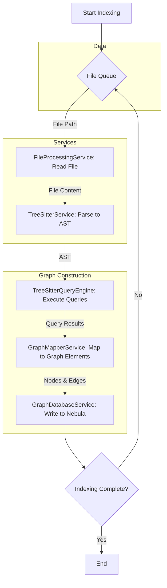
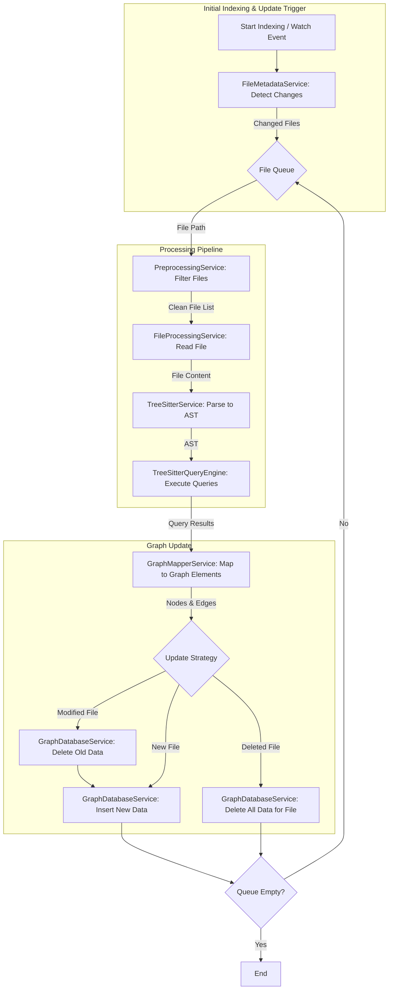

Schema 定义和查询规则设计完成后，我们现在需要一个清晰的架构来将它们整合在一起，实现从代码文件到图索引的完整构建流程。

### 计划第三步：设计索引构建流程的架构

我将设计一个模块化的、可扩展的架构，该架构将利用现有的 `TreeSitterService` 和 `GraphDatabaseService`，并通过引入一些新的协调服务来完成整个流程。

#### **架构核心组件**

1.  **`FileProcessingService` (现有)**: 负责读取文件系统，获取需要被索引的文件列表和内容。
2.  **`TreeSitterService` (现有)**: 负责将文件内容解析为 AST。
3.  **`TreeSitterQueryEngine` (现有)**: 负责使用我们设计的 `.scm` 查询文件在 AST 上执行查询，提取代码结构。
4.  **`GraphMapperService` (新建)**: 这是新引入的核心组件。它的职责是将 `TreeSitterQueryEngine` 的查询结果（`QueryMatch` 数组）转换为符合我们图 Schema 的节点和边。
5.  **`GraphDatabaseService` (现有)**: 负责将 `GraphMapperService` 生成的图数据（节点和边）写入 Nebula Graph。
6.  **`IndexingOrchestratorService` (新建)**: 作为一个顶层服务，负责协调以上所有服务，管理整个索引构建流程的生命周期（启动、监控、完成）。

#### **数据流和处理流程**

整个索引构建流程可以分为以下几个阶段，我将使用 Mermaid 的流程图来清晰地展示这个过程。

**流程详解**:

1.  **启动 (Start Indexing)**: `IndexingOrchestratorService` 被触发，接收一个项目路径作为输入。
2.  **文件发现**: `FileProcessingService` 扫描项目路径，将所有符合条件（例如，`.ts`, `.go` 文件）的文件路径放入一个处理队列（`File Queue`）。
3.  **文件解析**: 流程从队列中取出一个文件。`FileProcessingService` 读取文件内容，然后 `TreeSitterService` 将其解析为 AST。
4.  **结构提取**: `TreeSitterQueryEngine` 加载我们为该语言设计的 `.scm` 查询文件，并在 AST 上批量执行这些查询。
5.  **图元素映射**: 这是关键步骤。`GraphMapperService` 接收查询结果，并执行以下操作：
    *   **节点创建**: 根据 `@class.name`, `@function.name` 等捕获结果，创建 `Class`, `Function` 等节点对象。
    *   **边创建**: 根据 `@class.inherits`, `@call.name` 等捕获结果，创建 `INHERITS_FROM`, `CALLS` 等边对象。
    *   **静态分析**: 在此阶段，可以调用 `ComplexityService` 等工具，计算圈复杂度等属性，并附加到相应的节点上。
6.  **数据写入**: `GraphDatabaseService` 接收 `GraphMapperService` 生成的节点和边列表，并使用其 `executeBatch` 或 `executeTransaction` 方法将它们高效地写入 Nebula Graph。为了性能，这里应该采用批量写入的方式。
7.  **循环与完成**: 流程循环，直到文件队列为空。`IndexingOrchestratorService` 监控整个过程，并在完成后报告状态。

**设计理由**:
*   **模块化**: 每个服务职责单一，便于开发、测试和维护。例如，如果我们想支持一种新语言，主要工作将集中在提供新的 `.scm` 查询文件和在 `GraphMapperService` 中增加少量适配逻辑。
*   **可扩展性**: `GraphMapperService` 是一个理想的扩展点。未来如果需要更复杂的代码分析（例如，数据流分析），可以插入新的分析服务，并将结果映射到图谱中。
*   **性能**: 通过文件队列和批量写入数据库，该架构可以充分利用系统资源，实现高效的并行处理和 I/O 操作。

这是计划的第三步，描述了整个索引构建的宏观架构。您认为这个架构设计是否合理？有没有需要调整的地方？

您提的这两个问题都非常关键：**文件过滤**和**增量更新**。一个健壮的索引系统必须高效地处理这两个问题。我将对架构进行修订，将这两点纳入设计。

### 计划第三步（修订版）：设计索引构建流程的架构

#### **1. 增加预处理与过滤步骤**

为了过滤掉不需要索引的文件（如 `node_modules`，测试文件）或代码块（如注释），我将在文件发现阶段后增加一个专门的 `PreprocessingService`。

*   **`PreprocessingService` (新建)**:
    *   **职责**:
        1.  **文件过滤**: 基于 `.gitignore` 规则、项目配置（例如，排除 `test` 目录）或文件大小来过滤文件列表。
        2.  **内容过滤 (可选)**: 在解析为 AST 之前，可以先移除代码中的注释，或者根据特定标记（如 `@no-index`）忽略某些代码块。
    *   **在架构中的位置**: 它将在 `FileProcessingService` 之后，`TreeSitterService` 之前介入。

#### **2. 设计增量更新机制**

增量更新是避免全量重建索引、提升效率的核心。当文件发生变更（增、删、改）时，我们只需更新图谱中受影响的部分。

*   **变更检测**:
    *   我们可以利用文件系统的 `watch` 机制，或者在每次索引开始时，通过比较文件的 `hash` 或 `mtime` (修改时间) 来检测发生变化的文件。一个 `FileMetadataService` 将负责维护这些状态。

*   **更新策略**:
    1.  **文件新增 (Add)**: 按照正常的索引流程处理新文件即可。
    2.  **文件删除 (Delete)**: 当一个文件被删除时，我们需要从图谱中删除所有与该文件相关的节点（`File` 节点本身，以及它包含的 `Class`, `Function` 等）和边。这可以通过一个 nGQL 查询实现，例如：`MATCH (n) WHERE n.file_path == 'deleted_file.ts' DETACH DELETE n;`
    3.  **文件修改 (Modify)**: 这是最复杂的情况。最高效的方式是**先删除，后新增**。即，将该文件的旧图数据完全删除，然后像处理新文件一样，对其重新进行解析和索引。这避免了复杂的 diff 算法，且对于单个文件的操作来说，性能开销是可接受的。

#### **修订后的架构图**

我将更新 Mermaid 图来反映这些变化，特别是**增量更新**的逻辑。

**修订版架构详解**:
1.  **触发**: 流程由**首次索引**或**文件变更事件**触发。
2.  **变更检测**: `FileMetadataService` 识别出哪些文件是新增、修改或删除的。
3.  **预处理**: `PreprocessingService` 对文件列表进行过滤。
4.  **解析与提取**: 与原架构相同。
5.  **图更新策略**:
    *   `GraphMapperService` 生成新的图元素后，`IndexingOrchestratorService` (现在包含了更新策略逻辑) 会根据文件的状态（修改、新增、删除）来调用 `GraphDatabaseService` 执行不同的操作。
    *   对于**修改**的文件，先执行删除操作，再执行插入操作。

**设计理由**:
*   **效率**: 增量更新机制避免了每次都对整个代码库进行索引，极大地提升了后续更新的效率。
*   **健壮性**: 先删除后新增的策略确保了数据的一致性，避免了复杂的 diff 逻辑可能带来的错误。
*   **灵活性**: `PreprocessingService` 提供了一个灵活的扩展点，可以轻松地定制过滤规则。

现在，这个架构同时考虑了首次全量索引和后续的增量更新，变得更加完整和实用。

我将更新任务清单，将第三步标记为已完成，并开始进行第四步：**提出具体的实现计划**。