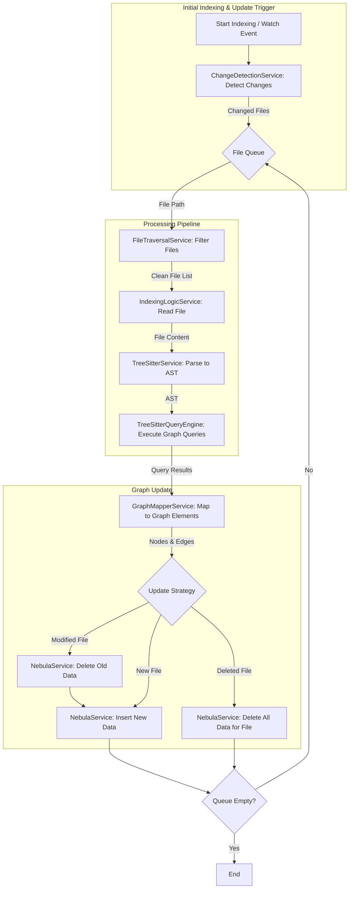

# 图索引架构设计

## 概述

本文档详细描述了图索引功能的架构设计。完整的实现指南请参考 [实现指南](./implementation-guide.md)。

## 架构核心组件

### 现有组件

1. **`IndexService`** (位于 `src/service/index/IndexService.ts`)
   - 负责整个索引流程的编排和管理
   - 已有文件变更检测、增量更新等功能

2. **`TreeSitterService`** (位于 `src/service/parser/core/parse/TreeSitterService.ts`)
   - 负责将文件内容解析为 AST
   - 已有提取类、函数、导入/导出等功能

3. **`TreeSitterQueryEngine`** (位于 `src/service/parser/core/query/TreeSitterQueryEngine.ts`)
   - 负责使用 `.scm` 查询文件在 AST 上执行查询，提取代码结构
   - 已有查询缓存、性能监控等功能

4. **`NebulaService`** (位于 `src/database/nebula/NebulaService.ts`)
   - 负责图数据库的操作
   - 已有节点和关系的插入、查询等功能

5. **`GraphIndexService`** (位于 `src/service/index/GraphIndexService.ts`)
   - 负责图索引的特定操作和管理

6. **`ChangeDetectionService`** (位于 `src/service/filesystem/ChangeDetectionService.ts`)
   - 负责检测文件变更

7. **`FileTraversalService`** (位于 `src/service/index/shared/FileTraversalService.ts`)
   - 负责文件遍历和过滤

8. **`IndexingLogicService`** (位于 `src/service/index/IndexingLogicService.ts`)
   - 负责文件索引的具体逻辑

### 新增组件

1. **`GraphMapperService`** (新建，位于 `src/service/graph/GraphMapperService.ts`)
   - 核心组件，负责将 `TreeSitterQueryEngine` 的查询结果转换为符合图 Schema 的节点和边
   - 计算静态分析属性（如圈复杂度）

## 数据流和处理流程

### 整体流程图

### 详细流程说明

1. **触发阶段**: 流程由**首次索引**或**文件变更事件**触发
2. **变更检测阶段**: `ChangeDetectionService` 识别出哪些文件是新增、修改或删除的
3. **文件遍历和过滤阶段**: `FileTraversalService` 对文件列表进行过滤
4. **文件解析阶段**: `IndexingLogicService` 读取文件内容，`TreeSitterService` 将其解析为 AST
5. **结构提取阶段**: `TreeSitterQueryEngine` 执行图索引特定查询
6. **图元素映射阶段**: `GraphMapperService` 将查询结果转换为图节点和边
7. **图更新阶段**: `IndexService` 调用 `NebulaService` 执行不同的数据库操作

## 增量更新机制

### 变更检测策略

1. **文件系统监控**: 使用 `ChangeDetectionService` 监控文件系统变化
2. **更新策略**:
   - **文件新增 (Add)**: 按照正常的索引流程处理新文件
   - **文件删除 (Delete)**: 从图谱中删除所有与该文件相关的节点和边
   - **文件修改 (Modify)**: 采用**先删除，后新增**的策略

## 文件过滤和预处理

### 过滤规则

1. **基于 `.gitignore` 的过滤**: 复用 `IgnoreRuleManager` 服务
2. **自定义过滤规则**: 支持基于正则表达式和 glob 模式的过滤
3. **文件大小限制**: 过滤掉过大的文件，避免内存问题

## 性能优化策略

### 批量处理

1. **文件批量处理**: 将文件分批处理，避免内存溢出
2. **数据库批量操作**: 使用 `NebulaService` 的批量插入功能

### 并发控制

1. **文件处理并发**: 使用 `ConcurrencyService` 控制并发文件处理数量
2. **数据库操作并发**: 合理控制数据库并发操作

### 缓存策略

1. **查询结果缓存**: `TreeSitterQueryEngine` 已有查询缓存
2. **AST 缓存**: 可以考虑缓存解析后的 AST

## 错误处理和恢复

### 错误分类

1. **文件级错误**: 文件读取失败、文件解析失败
2. **系统级错误**: 数据库连接失败、内存不足

### 恢复策略

1. **自动重试**: 对于临时性错误，自动重试
2. **断点续传**: 记录处理进度，支持从中断点继续处理
3. **降级处理**: 在资源不足时，降低处理并发度

## 监控和日志

### 关键指标

1. **处理速度**: 文件处理速度、图元素生成速度
2. **资源使用**: 内存使用情况、CPU 使用情况、数据库连接数
3. **错误率**: 文件处理失败率、数据库操作失败率

## 扩展性考虑

### 语言扩展

1. **新语言支持**: 只需添加新的 `.scm` 查询文件
2. **查询规则扩展**: 可以轻松添加新的查询规则

### 功能扩展

1. **更复杂的分析**: 可以插入新的分析服务
2. **多种存储后端**: 可以扩展支持其他图数据库

## 相关文档

- [实现指南](./implementation-guide.md) - 综合性实现指南，包含完整代码示例
- [计划概述](./plan.md) - 高层次实现计划
- [查询规则设计](./rule-design.md) - 查询规则详细设计
- [代码设计](./code-design.md) - 具体代码实现设计