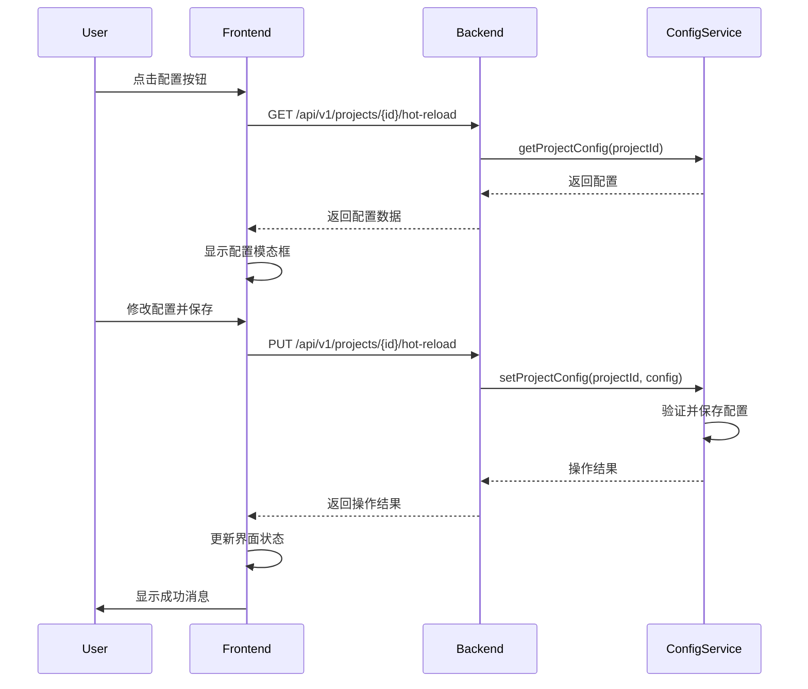
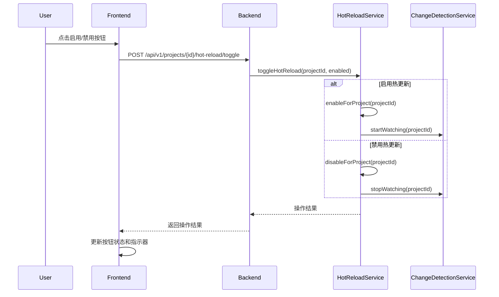

# 前端界面与API接口详细设计

## 📋 概述

本文档详细描述项目级热更新配置的前端界面设计和API接口规范，为开发提供明确的实现指南。

## 🎨 前端界面设计

### 1. 项目管理页面增强

#### 表格列扩展
在 [`ProjectsPage`](frontend/src/pages/ProjectsPage.ts) 的项目表格中添加热更新相关列：

```typescript
// 在 renderProjectsList 方法中添加热更新状态和操作列
private renderProjectsList(projects: any[], container: HTMLElement) {
    container.innerHTML = projects.map(project => `
        <tr>
            <!-- 现有列... -->
            <td>
                <hot-reload-status 
                    project-id="${project.id}"
                    enabled="${project.hotReload?.enabled || false}"
                    changes-detected="${project.hotReload?.changesDetected || 0}"
                    errors-count="${project.hotReload?.errorsCount || 0}">
                </hot-reload-status>
            </td>
            <td>
                <div class="hot-reload-actions">
                    <button class="action-button toggle" 
                            data-project-id="${project.id}" 
                            data-enabled="${project.hotReload?.enabled || false}"
                            title="${project.hotReload?.enabled ? '禁用热更新' : '启用热更新'}">
                        ${project.hotReload?.enabled ? '🔴 禁用' : '🟢 启用'}
                    </button>
                    <button class="action-button configure" 
                            data-project-id="${project.id}" 
                            data-action="configure-hot-reload"
                            title="配置热更新">
                        ⚙️ 配置
                    </button>
                </div>
            </td>
        </tr>
    `).join('');
}
```

#### 热更新状态组件
创建 [`HotReloadStatus`](frontend/src/components/HotReloadStatus.ts) 自定义元素：

```typescript
export class HotReloadStatus extends HTMLElement {
    private projectId: string = '';
    private enabled: boolean = false;
    private changesDetected: number = 0;
    private errorsCount: number = 0;

    static get observedAttributes() {
        return ['project-id', 'enabled', 'changes-detected', 'errors-count'];
    }

    attributeChangedCallback(name: string, oldValue: string, newValue: string) {
        switch (name) {
            case 'project-id':
                this.projectId = newValue;
                break;
            case 'enabled':
                this.enabled = newValue === 'true';
                break;
            case 'changes-detected':
                this.changesDetected = parseInt(newValue) || 0;
                break;
            case 'errors-count':
                this.errorsCount = parseInt(newValue) || 0;
                break;
        }
        this.render();
    }

    private render() {
        this.innerHTML = `
            <div class="hot-reload-status ${this.enabled ? 'enabled' : 'disabled'}">
                <span class="status-indicator ${this.enabled ? 'active' : 'inactive'}"></span>
                <span class="status-text">${this.enabled ? '已启用' : '已禁用'}</span>
                ${this.enabled ? `
                    <span class="stats">
                        <span class="changes" title="检测到的变更数">📝 ${this.changesDetected}</span>
                        <span class="errors" title="错误数">❌ ${this.errorsCount}</span>
                    </span>
                ` : ''}
            </div>
        `;
    }
}
```

### 2. 热更新配置模态框

创建 [`HotReloadConfigModal`](frontend/src/components/HotReloadConfigModal.ts) 组件：

```typescript
export class HotReloadConfigModal extends HTMLElement {
    private projectId: string = '';
    private projectName: string = '';
    private config: any = {};
    private shadow: ShadowRoot;

    constructor() {
        super();
        this.shadow = this.attachShadow({ mode: 'open' });
    }

    // 设置项目信息和配置
    setProjectInfo(projectId: string, projectName: string, config: any) {
        this.projectId = projectId;
        this.projectName = projectName;
        this.config = { ...config };
        this.render();
    }

    private render() {
        this.shadow.innerHTML = `
            <style>
                /* 模态框样式 */
                .modal-overlay {
                    position: fixed;
                    top: 0;
                    left: 0;
                    right: 0;
                    bottom: 0;
                    background: rgba(0, 0, 0, 0.5);
                    display: flex;
                    align-items: center;
                    justify-content: center;
                    z-index: 1000;
                }
                
                .modal-content {
                    background: white;
                    padding: 20px;
                    border-radius: 8px;
                    max-width: 500px;
                    width: 90%;
                    max-height: 80vh;
                    overflow-y: auto;
                }
                
                .form-group {
                    margin-bottom: 15px;
                }
                
                label {
                    display: block;
                    margin-bottom: 5px;
                    font-weight: bold;
                }
                
                input[type="number"], select {
                    width: 100%;
                    padding: 8px;
                    border: 1px solid #ddd;
                    border-radius: 4px;
                }
                
                .modal-actions {
                    display: flex;
                    justify-content: flex-end;
                    gap: 10px;
                    margin-top: 20px;
                }
                
                button {
                    padding: 8px 16px;
                    border: none;
                    border-radius: 4px;
                    cursor: pointer;
                }
                
                button.primary {
                    background: #007bff;
                    color: white;
                }
                
                button.secondary {
                    background: #6c757d;
                    color: white;
                }
            </style>
            
            <div class="modal-overlay">
                <div class="modal-content">
                    <h3>热更新配置 - ${this.projectName}</h3>
                    
                    <div class="form-group">
                        <label>
                            <input type="checkbox" id="enabled" 
                                   ${this.config.enabled ? 'checked' : ''}>
                            启用热更新
                        </label>
                    </div>
                    
                    <div class="form-group">
                        <label for="debounceInterval">去抖间隔 (毫秒)</label>
                        <input type="number" id="debounceInterval" 
                               value="${this.config.debounceInterval || 500}" 
                               min="50" max="5000" step="50">
                    </div>
                    
                    <div class="form-group">
                        <label for="maxFileSize">最大文件大小 (MB)</label>
                        <input type="number" id="maxFileSize" 
                               value="${(this.config.maxFileSize || 10485760) / 1024 / 1024}" 
                               min="1" max="100" step="1">
                    </div>
                    
                    <div class="form-group">
                        <label for="maxRetries">最大重试次数</label>
                        <input type="number" id="maxRetries" 
                               value="${this.config.errorHandling?.maxRetries || 3}" 
                               min="0" max="10" step="1">
                    </div>
                    
                    <div class="form-group">
                        <label>
                            <input type="checkbox" id="autoRecovery" 
                                   ${this.config.errorHandling?.autoRecovery !== false ? 'checked' : ''}>
                            自动恢复
                        </label>
                    </div>
                    
                    <div class="modal-actions">
                        <button id="save" class="primary">保存</button>
                        <button id="cancel" class="secondary">取消</button>
                    </div>
                </div>
            </div>
        `;

        this.setupEventListeners();
    }

    private setupEventListeners() {
        this.shadow.getElementById('save')?.addEventListener('click', () => this.saveConfig());
        this.shadow.getElementById('cancel')?.addEventListener('click', () => this.close());
        
        // 启用状态变化时，动态显示/隐藏配置选项
        const enabledCheckbox = this.shadow.getElementById('enabled') as HTMLInputElement;
        enabledCheckbox.addEventListener('change', () => this.toggleConfigFields());
        this.toggleConfigFields(); // 初始状态
    }

    private toggleConfigFields() {
        const enabled = (this.shadow.getElementById('enabled') as HTMLInputElement).checked;
        const configFields = this.shadow.querySelectorAll('.form-group:not(:first-child)');
        
        configFields.forEach(field => {
            (field as HTMLElement).style.opacity = enabled ? '1' : '0.5';
            (field as HTMLElement).style.pointerEvents = enabled ? 'auto' : 'none';
        });
    }

    private async saveConfig() {
        const enabled = (this.shadow.getElementById('enabled') as HTMLInputElement).checked;
        const debounceInterval = parseInt((this.shadow.getElementById('debounceInterval') as HTMLInputElement).value) || 500;
        const maxFileSize = parseInt((this.shadow.getElementById('maxFileSize') as HTMLInputElement).value) * 1024 * 1024 || 10485760;
        const maxRetries = parseInt((this.shadow.getElementById('maxRetries') as HTMLInputElement).value) || 3;
        const autoRecovery = (this.shadow.getElementById('autoRecovery') as HTMLInputElement).checked;

        const config = {
            enabled,
            debounceInterval,
            maxFileSize,
            errorHandling: {
                maxRetries,
                autoRecovery
            }
        };

        try {
            // 调用API保存配置
            const apiClient = window.apiClient; // 假设全局可用
            const result = await apiClient.updateProjectHotReloadConfig(this.projectId, config);
            
            if (result.success) {
                this.dispatchEvent(new CustomEvent('config-saved', {
                    detail: { projectId: this.projectId, config }
                }));
                this.close();
            } else {
                alert('保存配置失败: ' + (result.error || '未知错误'));
            }
        } catch (error) {
            alert('保存配置时发生错误: ' + (error as Error).message);
        }
    }

    private close() {
        this.dispatchEvent(new CustomEvent('modal-closed'));
        this.remove();
    }
}
```

## 🔌 API接口规范

### 1. 项目热更新配置端点

#### GET `/api/v1/projects/:projectId/hot-reload`
获取指定项目的热更新配置。

**响应格式:**
```json
{
  "success": true,
  "data": {
    "enabled": true,
    "debounceInterval": 500,
    "watchPatterns": ["**/*.ts", "**/*.js"],
    "ignorePatterns": ["**/node_modules/**"],
    "maxFileSize": 10485760,
    "errorHandling": {
      "maxRetries": 3,
      "alertThreshold": 5,
      "autoRecovery": true
    },
    "lastEnabled": "2024-01-15T10:30:00.000Z",
    "changesDetected": 42,
    "errorsCount": 2
  }
}
```

#### PUT `/api/v1/projects/:projectId/hot-reload`
更新指定项目的热更新配置。

**请求体:**
```json
{
  "enabled": true,
  "debounceInterval": 500,
  "maxFileSize": 10485760,
  "errorHandling": {
    "maxRetries": 3,
    "autoRecovery": true
  }
}
```

**响应格式:**
```json
{
  "success": true,
  "data": {
    "message": "配置更新成功",
    "config": { /* 更新后的完整配置 */ }
  }
}
```

#### POST `/api/v1/projects/:projectId/hot-reload/toggle`
启用或禁用项目的热更新。

**请求体:**
```json
{
  "enabled": true
}
```

**响应格式:**
```json
{
  "success": true,
  "data": {
    "message": "热更新已启用",
    "enabled": true
  }
}
```

### 2. 全局热更新配置端点

#### GET `/api/v1/hot-reload/global`
获取全局热更新配置。

#### PUT `/api/v1/hot-reload/global`
更新全局热更新配置。

#### GET `/api/v1/hot-reload/projects`
获取所有项目的热更新配置。

## 🎯 交互流程

### 1. 配置修改流程



### 2. 状态切换流程



## 🎨 样式设计

### 状态指示器样式
```css
.hot-reload-status {
    display: flex;
    align-items: center;
    gap: 8px;
    padding: 4px 8px;
    border-radius: 4px;
    font-size: 12px;
}

.hot-reload-status.enabled {
    background-color: #f0f9ff;
    border: 1px solid #bae6fd;
}

.hot-reload-status.disabled {
    background-color: #f8f9fa;
    border: 1px solid #e9ecef;
    color: #6c757d;
}

.status-indicator {
    width: 8px;
    height: 8px;
    border-radius: 50%;
}

.status-indicator.active {
    background-color: #22c55e;
    animation: pulse 2s infinite;
}

.status-indicator.inactive {
    background-color: #6b7280;
}

.stats {
    display: flex;
    gap: 8px;
    font-size: 11px;
}

.changes {
    color: #3b82f6;
}

.errors {
    color: #ef4444;
}

@keyframes pulse {
    0% { opacity: 1; }
    50% { opacity: 0.5; }
    100% { opacity: 1; }
}
```

### 操作按钮样式
```css
.hot-reload-actions {
    display: flex;
    gap: 4px;
}

.action-button {
    padding: 4px 8px;
    border: 1px solid #ddd;
    border-radius: 4px;
    background: white;
    cursor: pointer;
    font-size: 12px;
}

.action-button:hover {
    background: #f8f9fa;
}

.action-button.toggle.enabled {
    background: #dcfce7;
    border-color: #22c55e;
}

.action-button.toggle:not(.enabled) {
    background: #fef3c7;
    border-color: #f59e0b;
}

.action-button.configure {
    background: #eff6ff;
    border-color: #3b82f6;
}
```

## 📱 响应式设计

### 移动端适配
```css
@media (max-width: 768px) {
    .hot-reload-status {
        flex-direction: column;
        align-items: flex-start;
        gap: 4px;
    }
    
    .stats {
        flex-direction: column;
        gap: 2px;
    }
    
    .hot-reload-actions {
        flex-direction: column;
    }
    
    .action-button {
        width: 100%;
        text-align: center;
    }
}
```

## 🔧 错误处理

### 前端错误处理
```typescript
// 在 ApiClient 中添加错误处理
async updateProjectHotReloadConfig(projectId: string, config: any): Promise<any> {
    try {
        const response = await fetch(`${this.apiBaseUrl}/api/v1/projects/${projectId}/hot-reload`, {
            method: 'PUT',
            headers: { 'Content-Type': 'application/json' },
            body: JSON.stringify(config)
        });
        
        if (!response.ok) {
            throw new Error(`HTTP error! status: ${response.status}`);
        }
        
        return await response.json();
    } catch (error) {
        console.error('更新热更新配置失败:', error);
        throw new Error(`更新配置失败: ${error.message}`);
    }
}
```

### 配置验证
```typescript
// 在保存前验证配置
private validateConfig(config: any): string[] {
    const errors: string[] = [];
    
    if (config.debounceInterval < 50) {
        errors.push('去抖间隔不能小于50毫秒');
    }
    
    if (config.maxFileSize > 100 * 1024 * 1024) {
        errors.push('最大文件大小不能超过100MB');
    }
    
    if (config.errorHandling?.maxRetries < 0) {
        errors.push('最大重试次数不能为负数');
    }
    
    return errors;
}
```

通过这样的设计，前端界面将提供直观、易用的热更新配置体验，API接口则确保配置的安全性和一致性。