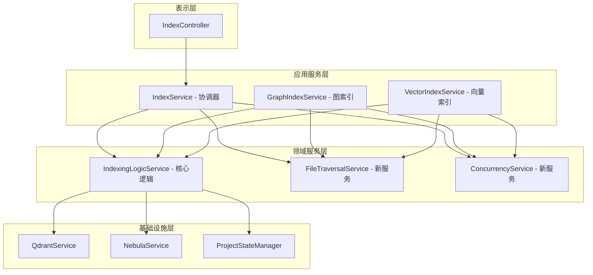
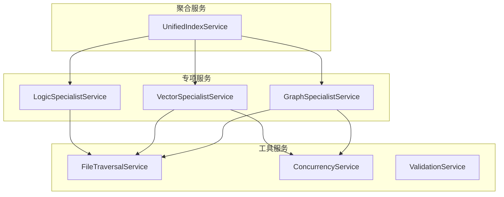

# 索引服务重构计划

## 📋 概述

本文件分析了 `src/service/index/` 目录下的四个索引服务文件，识别了严重的代码重复和架构设计问题，并提出了详细的重构方案。

## 🔍 分析的文件

1. **IndexingLogicService.ts** (569行) - 核心索引逻辑服务
2. **GraphIndexService.ts** (367行) - 图数据库索引服务  
3. **IndexService.ts** (695行) - 主索引服务
4. **VectorIndexService.ts** (345行) - 向量索引服务

## ⚠️ 主要问题识别

### 1. 严重的代码重复

#### 文件遍历逻辑重复
- **IndexService.ts** (第336-343行): 使用 `fileSystemTraversal.traverseDirectory()`
- **GraphIndexService.ts** (第204-226行): 自定义 `getProjectFiles()` 方法
- **VectorIndexService.ts** (第208-230行): 自定义 `getProjectFiles()` 方法

#### 文件类型检查重复
- **GraphIndexService.ts** (第231-240行): `isCodeFile()` 方法
- **VectorIndexService.ts** (第235-244行): 完全相同的 `isCodeFile()` 方法

#### 并发控制逻辑重复
- **IndexingLogicService.ts** (第535-554行): `processWithConcurrency()` 方法
- **IndexService.ts** (第542-561行): 完全相同的 `processWithConcurrency()` 方法

#### 批处理逻辑重复
- **GraphIndexService.ts** (第245-323行): `performGraphIndexing()` 批处理逻辑
- **VectorIndexService.ts** (第249-336行): `performVectorIndexing()` 批处理逻辑

### 2. 架构设计问题

#### 循环依赖问题
- **GraphIndexService** 注入 **IndexService**，但通过私有属性访问 `indexingLogicService`
- **VectorIndexService** 同样注入 **IndexService** 并访问私有属性

#### 职责不清晰
- **IndexService** 承担了太多职责：队列管理、状态管理、事件管理、文件处理
- **GraphIndexService** 和 **VectorIndexService** 重复实现了批处理和文件遍历逻辑

#### 状态管理混乱
- 三个服务都有各自的状态管理机制
- 缺乏统一的状态管理接口

## 🎯 重构目标

1. **消除代码重复** - 减少约40%的代码量
2. **明确职责边界** - 建立清晰的架构层次
3. **统一接口设计** - 提供一致的API
4. **提高可维护性** - 简化代码结构
5. **增强可测试性** - 减少依赖耦合

## 🏗️ 重构方案

### 方案一：分层架构（推荐）



### 方案二：聚合服务模式



## 🔧 具体实施步骤

### 第一阶段：基础设施重构（1-2天）

1. **创建共享服务**
   ```typescript
   // src/service/index/shared/FileTraversalService.ts
   @injectable()
   export class FileTraversalService {
       async getProjectFiles(projectPath: string): Promise<string[]> {
           // 统一文件遍历逻辑
       }
       
       isCodeFile(filename: string): boolean {
           // 统一文件类型检查
       }
   }
   ```

2. **创建并发控制服务**
   ```typescript
   // src/service/index/shared/ConcurrencyService.ts
   @injectable()
   export class ConcurrencyService {
       async processWithConcurrency<T>(
           promises: Promise<T>[], 
           maxConcurrency: number
       ): Promise<void> {
           // 统一并发控制
       }
   }
   ```

### 第二阶段：服务重构（3-5天）

1. **重构 IndexService**
   - 移除重复的文件遍历和并发逻辑
   - 专注于队列管理和状态协调
   - 提供统一的事件接口

2. **重构 GraphIndexService 和 VectorIndexService**
   - 移除文件遍历和并发逻辑
   - 专注于各自的专业领域
   - 通过依赖注入使用共享服务

3. **强化 IndexingLogicService**
   - 作为核心逻辑处理器
   - 提供统一的文件处理接口

### 第三阶段：接口统一（2-3天）

1. **定义统一接口**
   ```typescript
   export interface IIndexService {
       indexProject(projectPath: string, options?: IndexOptions): Promise<string>;
       getIndexStatus(projectId: string): IndexStatus | null;
       stopIndexing(projectId: string): Promise<boolean>;
       reindexProject(projectPath: string, options?: IndexOptions): Promise<string>;
   }
   ```

2. **创建适配器模式**
   - 为不同类型的索引提供统一接口
   - 支持可插拔的索引策略

## 📊 预期收益

### 代码量减少
- **当前总行数**: 569 + 367 + 695 + 345 = 1976行
- **预计减少**: 约800行（40%减少）
- **最终行数**: 约1176行

### 性能提升
- 减少重复的文件系统操作
- 统一的并发控制优化资源使用
- 更清晰的内存管理

### 可维护性提升
- 单一职责原则
- 依赖注入清晰
- 测试覆盖更容易

## 🚀 实施优先级

| 优先级 | 任务 | 预计工时 | 风险 |
|--------|------|----------|------|
| P0 | 创建共享服务（FileTraversalService） | 1天 | 低 |
| P0 | 创建共享服务（ConcurrencyService） | 1天 | 低 |
| P1 | 重构 IndexService | 2天 | 中 |
| P1 | 重构 GraphIndexService | 1天 | 中 |
| P1 | 重构 VectorIndexService | 1天 | 中 |
| P2 | 定义统一接口 | 1天 | 低 |
| P2 | 创建适配器模式 | 2天 | 中 |

## 🔍 风险评估

### 技术风险
- **循环依赖**: 需要通过接口设计和依赖注入解决
- **向后兼容**: 需要确保现有API不受影响
- **测试覆盖**: 需要补充单元测试和集成测试

### 缓解措施
1. **分阶段实施**: 逐步替换，而不是一次性重写
2. **接口先行**: 先定义接口，再实现具体逻辑
3. **测试驱动**: 为每个新服务编写测试用例
4. **代码审查**: 确保架构一致性

## 📝 后续建议

1. **监控指标**: 添加性能监控和错误追踪
2. **文档更新**: 更新架构文档和API文档
3. **团队培训**: 分享新的架构设计和最佳实践
4. **持续优化**: 定期评估架构效果并进行优化

## ✅ 验收标准

- [ ] 代码重复率降低40%以上
- [ ] 所有现有功能保持正常
- [ ] 性能指标没有下降
- [ ] 测试覆盖率提高
- [ ] 架构文档更新完成

---

**最后更新**: 2025-10-10  
**负责人**: 架构团队  
**状态**: 待评审 🟡