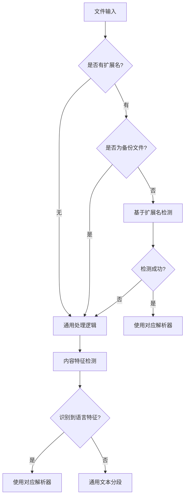

# 通用文件处理逻辑设计方案

## 问题背景

在代码索引过程中，我们发现当文件扩展名与内容不匹配时会出现内存泄漏问题，特别是：
- 文件扩展名为 `.md` 但内容为 TypeScript 代码
- 备份文件（`.bak`, `.backup`）的处理
- 无扩展名文件的处理

## 设计目标

1. **内存安全**：防止在处理不匹配文件时发生内存泄漏
2. **通用性**：为各种文件类型提供统一处理机制
3. **容错性**：当达到错误阈值时能够自动降级处理
4. **性能优化**：避免不必要的解析和内存占用

## 架构设计

### 1. 文件类型检测层级



### 2. 通用处理流程

#### 2.1 文件分类策略

```
文件类型分类:
1. 标准文件: 有明确扩展名且内容匹配
2. 备份文件: .bak, .backup 等后缀
3. 无扩展名文件: 无后缀或未知后缀
4. 内容不匹配文件: 扩展名与内容不符
```

#### 2.2 通用文本分段逻辑

```typescript
interface UniversalChunkingOptions {
  maxChunkSize: number;        // 最大块大小
  overlapSize: number;         // 重叠大小
  maxLinesPerChunk: number;    // 每块最大行数
  errorThreshold: number;      // 错误阈值
  memoryLimitMB: number;       // 内存限制(MB)
}

class UniversalTextSplitter {  
  // 基于语义的分段
  chunkBySemanticBoundaries(content: string): CodeChunk[]

  // 基于括号【包括(),xml标记，{}，[]】和行数的智能分段
  chunkByBracketsAndLines(content: string): CodeChunk[]
  
  // 简单的行数分段（基于括号和行数方案仍然失败后的最终解决方案）
  chunkByLines(content: string): CodeChunk[]
}
```

### 3. 内存管理和错误处理

#### 3.1 错误阈值机制

```typescript
class ErrorThresholdManager {
  private errorCount: number = 0;
  private readonly maxErrors: number = 10;
  private readonly resetInterval: number = 60000; // 1分钟
  
  // 检查是否达到错误阈值
  shouldUseFallback(): boolean
  
  // 记录错误并清理资源
  recordErrorAndCleanup(): void
  
  // 重置计数器
  resetCounter(): void
}
```

#### 3.2 内存监控和清理

```typescript
class MemoryGuard {
  private readonly memoryLimit: number;
  private readonly checkInterval: number = 5000; // 5秒检查一次
  
  // 检查内存使用情况
  checkMemoryUsage(): boolean
  
  // 强制清理缓存和临时对象
  forceCleanup(): void
  
  // 优雅降级处理
  gracefulDegradation(): void
}
```

## 具体实现方案

### 1. 备份文件处理策略

```typescript
class BackupFileProcessor {
  // 识别备份文件并推断原始类型
  inferOriginalType(filePath: string): string {
    const baseName = path.basename(filePath);
    const backupPatterns = ['.bak', '.backup', '.old', '.tmp'];
    
    for (const pattern of backupPatterns) {
      if (baseName.endsWith(pattern)) {
        const originalName = baseName.slice(0, -pattern.length);
        const originalExt = path.extname(originalName);
        return this.detectLanguageByExtension(originalExt);
      }
    }
    return 'unknown';
  }
}
```

### 2. 无扩展名文件处理

```typescript
class ExtensionlessFileProcessor {
  // 基于内容的语言检测
  detectLanguageByContent(content: string): string {
    const detectors = [
      this.detectByShebang,
      this.detectBySyntaxPatterns,
      this.detectByFileStructure
    ];
    
    for (const detector of detectors) {
      const language = detector(content);
      if (language !== 'unknown') {
        return language;
      }
    }
    return 'unknown';
  }
  
  // 检测shebang
  private detectByShebang(content: string): string {
    const shebangPatterns = {
      '#!/bin/bash': 'shell',
      '#!/bin/sh': 'shell',
      '#!/usr/bin/env python': 'python',
      '#!/usr/bin/env node': 'javascript',
      '#!/usr/bin/env ruby': 'ruby'
    };
    
    const firstLine = content.split('\n')[0];
    for (const [pattern, language] of Object.entries(shebangPatterns)) {
      if (firstLine.startsWith(pattern)) {
        return language;
      }
    }
    return 'unknown';
  }
}
```

### 3. 通用分段算法

```typescript
class UniversalChunkingStrategy {
  // 基于括号平衡的分段
  chunkByBracketBalance(content: string): CodeChunk[] {
    const chunks: CodeChunk[] = [];
    let currentChunk: string[] = [];
    let bracketDepth = 0;
    let lineNumber = 1;
    
    const lines = content.split('\n');
    
    for (let i = 0; i < lines.length; i++) {
      const line = lines[i];
      currentChunk.push(line);
      
      // 更新括号深度
      bracketDepth += this.countOpeningBrackets(line);
      bracketDepth -= this.countClosingBrackets(line);
      
      // 分段条件：括号平衡且达到最小块大小
      if (bracketDepth === 0 && currentChunk.length >= 5) {
        chunks.push(this.createChunk(currentChunk, lineNumber));
        lineNumber = i + 2; // 下一行开始
        currentChunk = [];
      }
      
      // 强制分段：达到最大块大小
      if (currentChunk.length >= this.options.maxLinesPerChunk) {
        chunks.push(this.createChunk(currentChunk, lineNumber));
        lineNumber = i + 2;
        currentChunk = [];
        bracketDepth = 0; // 重置括号深度
      }
    }
    
    // 处理剩余内容
    if (currentChunk.length > 0) {
      chunks.push(this.createChunk(currentChunk, lineNumber));
    }
    
    return chunks;
  }
}
```

### 4. 错误阈值和内存保护

```typescript
class ProcessingGuard {
  private static instance: ProcessingGuard;
  private errorCount: number = 0;
  private lastErrorTime: number = 0;
  
  static getInstance(): ProcessingGuard {
    if (!ProcessingGuard.instance) {
      ProcessingGuard.instance = new ProcessingGuard();
    }
    return ProcessingGuard.instance;
  }
  
  // 检查是否应该使用降级方案
  shouldUseFallback(): boolean {
    const now = Date.now();
    
    // 重置计数器（1分钟内无错误）
    if (now - this.lastErrorTime > 60000) {
      this.errorCount = 0;
    }
    
    return this.errorCount >= 5; // 5次错误后使用降级方案
  }
  
  // 记录错误并清理资源
  recordError(error: Error): void {
    this.errorCount++;
    this.lastErrorTime = Date.now();
    
    // 强制清理缓存
    this.forceCleanup();
    
    // 记录日志
    console.warn(`Processing error #${this.errorCount}:`, error.message);
  }
  
  // 强制清理缓存和临时对象
  private forceCleanup(): void {
    // 清理TreeSitter缓存
    TreeSitterCoreService.getInstance().clearCache();
    
    // 清理LRU缓存
    LRUCache.clearAll();
    
    // 强制垃圾回收（如果可用）
    if (global.gc) {
      global.gc();
    }
  }
}
```

## 集成到现有系统

### 1. 修改 ChunkToVectorCoordinationService

```typescript
class EnhancedChunkToVectorCoordinationService {
  async processFileForEmbedding(filePath: string, content: string): Promise<VectorPoint[]> {
    // 检查错误阈值
    if (ProcessingGuard.getInstance().shouldUseFallback()) {
      return this.processWithFallback(filePath, content);
    }
    
    try {
      // 智能语言检测
      const language = await this.detectLanguageIntelligently(filePath, content);
      
      // 使用对应解析器
      const chunks = await this.astSplitter.split(content, language, filePath);
      
      // 转换为向量点
      return await this.convertToVectorPoints(chunks);
      
    } catch (error) {
      // 记录错误并清理
      ProcessingGuard.getInstance().recordError(error);
      
      // 使用降级方案
      return this.processWithFallback(filePath, content);
    }
  }
  
  private processWithFallback(filePath: string, content: string): VectorPoint[] {
    const universalSplitter = new UniversalTextSplitter();
    const chunks = universalSplitter.chunkByBracketsAndLines(content);
    return this.convertToSimpleVectorPoints(chunks, filePath);
  }
}
```

### 2. 配置参数

在.env中添加这些配置项，方便个性化调整

```typescript
const UNIVERSAL_PROCESSING_CONFIG = {
  // 错误处理
  maxErrors: 5,
  errorResetInterval: 60000,
  
  // 内存限制
  memoryLimitMB: 500,
  memoryCheckInterval: 5000,
  
  // 分段参数
  maxChunkSize: 2000,
  chunkOverlap: 200,
  maxLinesPerChunk: 50,
  
  // 备份文件处理
  backupFilePatterns: ['.bak', '.backup', '.old', '.tmp']
};
```

## 测试策略

### 1. 单元测试
- 备份文件类型推断测试
- 无扩展名文件检测测试
- 通用分段算法测试
- 错误阈值机制测试

### 2. 集成测试
- 内存泄漏测试（使用大文件和错误类型）【可以考虑直接把项目中的某个文件复制到test-files目录，并修改后缀名为多种形式，来测试潜在的问题】
- 性能测试（处理各种文件类型）
- 容错性测试（模拟解析错误）

### 3. 压力测试
- 连续处理大量不匹配文件【可以考虑直接把本项目的某个子目录复制到test-files目录】
- 内存使用监控
- 错误恢复能力测试

## 风险评估和缓解措施

### 风险1：性能下降
- **风险**：通用处理逻辑可能比专用解析器慢
- **缓解**：使用缓存和优化算法，仅在必要时使用通用逻辑

### 风险2：分段质量下降
- **风险**：通用分段可能不如语法感知分段准确
- **缓解**：提供多种分段策略，根据内容复杂度、是否达到错误阈值逐步降级

## 实施计划

### 阶段1：基础框架（1周）
- 实现通用分段算法
- 实现错误阈值机制
- 实现内存监控

### 阶段2：集成测试（1周）
- 集成到现有系统
- 单元测试和集成测试
- 性能基准测试

### 阶段3：优化和部署（1周）
- 性能优化
- 生产环境测试
- 监控和日志完善

## 总结

本设计方案提供了一个完整的通用文件处理框架，能够有效处理各种文件类型不匹配的情况，同时确保内存安全和系统稳定性。通过错误阈值机制和内存保护策略，系统能够在遇到问题时优雅降级，避免内存泄漏和性能问题。