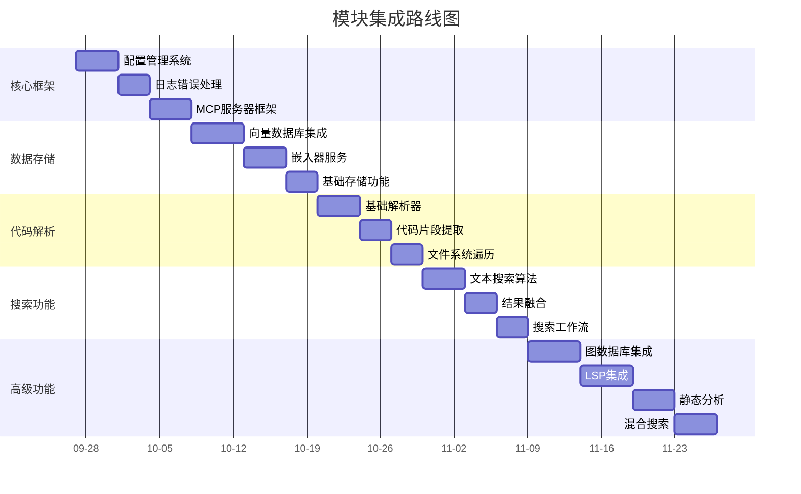

# 模块分析与分批集成计划

## 📊 现有模块分析

基于对 `ref/` 目录的详细分析，现有模块结构如下：

### 1. 核心基础设施模块
```
ref/
├── src/
│   ├── database/           # 数据库服务
│   │   ├── QdrantService.ts        # 向量数据库服务
│   │   ├── NebulaService.ts       # 图数据库服务  
│   │   ├── ProjectIdManager.ts    # 项目管理
│   │   └── ProjectLookupService.ts # 项目查找
│   ├── embedders/          # 嵌入器提供商
│   │   ├── EmbedderFactory.ts     # 嵌入器工厂
│   │   ├── OpenAIEmbedder.ts      # OpenAI嵌入器
│   │   ├── OllamaEmbedder.ts      # Ollama嵌入器
│   │   ├── GeminiEmbedder.ts      # Gemini嵌入器
│   │   ├── MistralEmbedder.ts     # Mistral嵌入器
│   │   ├── SiliconFlowEmbedder.ts # SiliconFlow嵌入器
│   │   └── CustomEmbedders.ts     # 自定义嵌入器
│   ├── mcp/                # MCP协议处理
│   │   ├── MCPServer.ts           # MCP服务器主类
│   │   └── MCPServer.test.ts     # MCP服务器测试
│   └── service/            # 各种服务实现
│       ├── graph/                 # 图分析服务
│       ├── parser/                # 代码解析服务
│       ├── search/                # 搜索服务
│       ├── storage/               # 存储服务
│       ├── lsp/                   # LSP集成服务
│       └── static-analysis/       # 静态分析服务
└── utils/                  # 工具函数
```

## 🎯 分批集成策略

### 阶段一：基础框架与核心服务（1-2周）

**目标**: 建立可运行的基础框架，集成核心服务模块

**集成模块**:
1. **核心服务模块** (`ref/src/service/core/`)
   - LoggerService - 日志服务
   - ErrorHandlerService - 错误处理
   - ConfigService - 配置管理

2. **基础工具类** (`ref/src/utils/`)
   - HashUtils - 哈希工具
   - PathUtils - 路径工具

3. **MCP服务器框架** (`ref/src/mcp/MCPServer.ts`)

**集成顺序**:
1. 配置管理系统
2. 日志和错误处理
3. 基础工具函数
4. MCP服务器框架

### 阶段二：数据存储与嵌入器（2-3周）

**目标**: 集成数据存储和嵌入器功能

**集成模块**:
1. **数据库服务** (`ref/src/database/`)
   - QdrantService - 向量数据库
   - 基础存储接口

2. **嵌入器服务** (`ref/src/embedders/`)
   - EmbedderFactory - 嵌入器工厂
   - 至少2种嵌入器实现

**集成顺序**:
1. 数据库客户端封装
2. 嵌入器工厂模式
3. 向量存储基础功能
4. 简单的嵌入生成功能

### 阶段三：代码解析与搜索（3-4周）

**目标**: 集成代码解析和搜索功能

**集成模块**:
1. **解析服务** (`ref/src/service/parser/`)
   - 基础解析器功能
   - 代码片段提取

2. **搜索服务** (`ref/src/service/search/`)
   - 基础搜索算法
   - 结果融合

**集成顺序**:
1. 代码解析基础功能
2. 文本搜索算法
3. 结果处理和格式化
4. 基本搜索工作流

### 阶段四：高级功能集成（4-6周）

**目标**: 集成高级功能模块

**集成模块**:
1. **图数据库服务** (`ref/src/database/NebulaService.ts`)
2. **LSP集成** (`ref/src/service/lsp/`)
3. **静态分析** (`ref/src/service/static-analysis/`)
4. **高级搜索算法**

**集成顺序**:
1. 图数据库连接和基本操作
2. LSP客户端集成
3. 静态分析基础功能
4. 混合搜索算法

## 🔄 详细集成路线图



## 📋 第一阶段详细计划（基础框架）

### 1. 配置管理系统集成

**文件**: `ref/src/config/ConfigService.ts`
**功能**: 类型安全的配置管理，环境变量处理

**集成步骤**:
1. 复制配置文件到 `src/config/`
2. 创建配置类型定义
3. 集成环境变量验证
4. 测试配置加载

### 2. 日志服务集成

**文件**: `ref/src/core/LoggerService.ts`
**功能**: 结构化日志记录，多传输支持

**集成步骤**:
1. 复制日志服务文件
2. 配置日志级别和格式
3. 集成到主应用
4. 测试日志输出

### 3. 错误处理服务集成

**文件**: `ref/src/core/ErrorHandlerService.ts`
**功能**: 统一错误处理，错误上下文记录

**集成步骤**:
1. 复制错误处理服务
2. 定义错误类型
3. 集成错误处理中间件
4. 测试错误处理

### 4. MCP服务器框架集成

**文件**: `ref/src/mcp/MCPServer.ts`
**功能**: MCP协议处理，工具注册

**集成步骤**:
1. 复制MCP服务器框架
2. 简化工具注册
3. 集成基础工具（搜索、状态）
4. 测试MCP连接

## 🧪 测试策略

### 单元测试
- 每个模块独立的单元测试
- 模拟依赖进行隔离测试
- 覆盖率要求：核心模块80%+

### 集成测试
- 模块间接口测试
- 端到端功能测试
- 性能基准测试

### 测试工具
- Jest - 单元测试框架
- Supertest - API测试
- 自定义集成测试工具

## ⚠️ 风险分析与缓解

### 技术风险
1. **模块依赖复杂**
   - 缓解：明确接口边界，减少耦合
   - 措施：使用依赖注入，接口隔离

2. **性能问题**
   - 缓解：分阶段性能测试
   - 措施：性能监控，优化关键路径

3. **内存泄漏**
   - 缓解：内存使用监控
   - 措施：定期内存分析，资源清理

### 集成风险
1. **接口不兼容**
   - 缓解：接口契约测试
   - 措施：版本管理，向后兼容

2. **数据一致性**
   - 缓解：事务处理，数据验证
   - 措施：一致性检查工具

## 📊 进度监控

### 关键里程碑
1. ✅ 基础框架文档完成
2. ⏳ 核心服务集成完成
3. ◻️ 第一阶段功能测试通过
4. ◻️ 性能基准建立
5. ◻️ 文档更新完成

### 质量指标
- 代码覆盖率：≥80%
- 静态分析警告：0
- 性能指标：符合预期
- 内存使用：稳定

## 🔄 迭代改进

每个集成阶段完成后进行：
1. 代码审查
2. 性能分析
3. 文档更新
4. 经验总结
5. 下一阶段计划调整

---

*文档版本: 1.0*
*创建日期: 2025-09-27*
*最后更新: 2025-09-27*