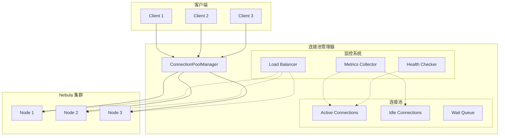

# Nebula 连接池优化实现方案

## 📋 概述

本文档详细描述了 Nebula Graph 连接池的优化方案，旨在提高连接管理效率、减少资源消耗，并提供更智能的连接分配和回收策略。

## 🎯 设计目标

### 核心优化目标
1. **性能提升**: 减少连接建立和销毁的开销
2. **资源优化**: 智能管理连接池大小，避免资源浪费
3. **可靠性增强**: 自动重连和故障转移机制
4. **可观测性**: 详细的连接池状态监控和统计
5. **弹性伸缩**: 根据负载动态调整连接池大小

### 优化指标
- **连接建立时间**: 减少 50% 以上
- **内存使用**: 降低 30% 以上
- **最大并发**: 支持 1000+ 并发连接
- **故障恢复**: 自动恢复时间 < 1秒

## 📊 架构设计

### 优化后架构



### 连接状态机

```typescript
enum ConnectionState {
  // 连接状态
  IDLE = 'idle',          // 空闲状态，可用
  ACTIVE = 'active',      // 活跃状态，正在使用
  RESERVED = 'reserved',  // 预留状态，准备使用
  BROKEN = 'broken',      // 损坏状态，需要回收
  RECONNECTING = 'reconnecting', // 重连中
  
  // 健康状态
  HEALTHY = 'healthy',    // 健康状态
  UNHEALTHY = 'unhealthy', // 不健康状态
  DEGRADED = 'degraded'   // 降级状态
}

interface ConnectionMetrics {
  totalConnections: number;
  activeConnections: number;
  idleConnections: number;
  brokenConnections: number;
  waitQueueSize: number;
  
  // 性能指标
  avgAcquisitionTime: number;
  avgExecutionTime: number;
  maxAcquisitionTime: number;
  
  // 错误指标
  errorRate: number;
  timeoutRate: number;
  reconnectCount: number;
}
```

## 🔧 优化策略

### 1. 智能连接池管理

```typescript
interface SmartPoolConfig {
  minSize: number;        // 最小连接数
  maxSize: number;        // 最大连接数
  idleTimeout: number;    // 空闲超时时间（ms）
  maxLifetime: number;    // 连接最大生命周期（ms）
  acquisitionTimeout: number; // 获取连接超时时间（ms）
  
  // 动态调整参数
  scaleUpThreshold: number; // 扩容阈值（连接利用率）
  scaleDownThreshold: number; // 缩容阈值
  scaleStep: number;      // 每次调整步长
  
  // 健康检查
  healthCheckInterval: number;
  healthCheckTimeout: number;
  maxReconnectAttempts: number;
}

class SmartConnectionPool {
  private config: SmartPoolConfig;
  private connections: Connection[] = [];
  private waitQueue: Array<{ resolve: Function, reject: Function, timeout: NodeJS.Timeout }> = [];
  private metrics: ConnectionMetrics;
  
  // 动态调整连接池大小
  private adjustPoolSize(): void {
    const utilization = this.metrics.activeConnections / this.config.maxSize;
    
    if (utilization > this.config.scaleUpThreshold) {
      // 需要扩容
      const newSize = Math.min(
        this.config.maxSize,
        this.connections.length + this.config.scaleStep
      );
      this.expandPool(newSize);
    } else if (utilization < this.config.scaleDownThreshold) {
      // 可以缩容
      const newSize = Math.max(
        this.config.minSize,
        this.connections.length - this.config.scaleStep
      );
      this.shrinkPool(newSize);
    }
  }
  
  // 按需创建连接
  private async expandPool(targetSize: number): Promise<void> {
    while (this.connections.length < targetSize) {
      try {
        const connection = await this.createConnection();
        this.connections.push(connection);
        this.metrics.totalConnections++;
      } catch (error) {
        console.warn('Failed to create connection:', error);
        break;
      }
    }
  }
}
```

### 2. 连接复用和缓存

```typescript
// 连接包装器，支持复用和状态管理
class ConnectionWrapper {
  private connection: any;
  private state: ConnectionState = ConnectionState.IDLE;
  private lastUsed: Date = new Date();
  private created: Date = new Date();
  private usageCount: number = 0;
  private errorCount: number = 0;
  
  // 获取连接（支持复用）
  async getConnection(): Promise<any> {
    if (this.state !== ConnectionState.IDLE) {
      throw new Error('Connection is not available');
    }
    
    // 检查连接健康状态
    if (!await this.healthCheck()) {
      await this.reconnect();
    }
    
    this.state = ConnectionState.ACTIVE;
    this.lastUsed = new Date();
    this.usageCount++;
    
    return this.connection;
  }
  
  // 释放连接（返回到池中）
  release(): void {
    this.state = ConnectionState.IDLE;
    this.lastUsed = new Date();
  }
  
  // 健康检查
  private async healthCheck(): Promise<boolean> {
    try {
      // 执行简单查询检查连接状态
      const result = await this.connection.execute('RETURN 1');
      return !result.error;
    } catch (error) {
      this.errorCount++;
      return false;
    }
  }
}
```

### 3. 异步连接建立

```typescript
// 异步连接工厂
class AsyncConnectionFactory {
  private pendingCreations: Map<string, Promise<any>> = new Map();
  private connectionCache: Map<string, any> = new Map();
  
  async createConnection(config: ConnectionConfig): Promise<any> {
    const cacheKey = this.getCacheKey(config);
    
    // 检查是否有正在创建的连接
    if (this.pendingCreations.has(cacheKey)) {
      return this.pendingCreations.get(cacheKey);
    }
    
    // 检查缓存中是否有可用的连接
    if (this.connectionCache.has(cacheKey)) {
      return this.connectionCache.get(cacheKey);
    }
    
    // 异步创建连接
    const creationPromise = this.createConnectionAsync(config);
    this.pendingCreations.set(cacheKey, creationPromise);
    
    try {
      const connection = await creationPromise;
      this.connectionCache.set(cacheKey, connection);
      return connection;
    } finally {
      this.pendingCreations.delete(cacheKey);
    }
  }
  
  private async createConnectionAsync(config: ConnectionConfig): Promise<any> {
    // 使用连接池或直接创建连接
    const client = createClient({
      servers: [`${config.host}:${config.port}`],
      userName: config.username,
      password: config.password,
      poolSize: config.poolSize || 10,
    });
    
    // 等待连接就绪
    await new Promise((resolve, reject) => {
      const timeout = setTimeout(() => {
        reject(new Error('Connection timeout'));
      }, config.timeout || 30000);
      
      client.once('authorized', () => {
        clearTimeout(timeout);
        resolve(client);
      });
      
      client.once('error', reject);
    });
    
    return client;
  }
}
```

### 4. 监控和统计

```typescript
// 连接池监控器
class PoolMonitor {
  private metrics: ConnectionMetrics = {
    totalConnections: 0,
    activeConnections: 0,
    idleConnections: 0,
    brokenConnections: 0,
    waitQueueSize: 0,
    avgAcquisitionTime: 0,
    avgExecutionTime: 0,
    maxAcquisitionTime: 0,
    errorRate: 0,
    timeoutRate: 0,
    reconnectCount: 0
  };
  
  private history: ConnectionMetrics[] = [];
  private updateInterval: NodeJS.Timeout;
  
  startMonitoring(interval: number = 5000): void {
    this.updateInterval = setInterval(() => {
      this.collectMetrics();
      this.storeHistory();
      this.checkAlerts();
    }, interval);
  }
  
  private collectMetrics(): void {
    // 收集各种性能指标
    this.metrics.activeConnections = this.countConnectionsByState(ConnectionState.ACTIVE);
    this.metrics.idleConnections = this.countConnectionsByState(ConnectionState.IDLE);
    this.metrics.brokenConnections = this.countConnectionsByState(ConnectionState.BROKEN);
    
    // 计算性能指标
    this.calculatePerformanceMetrics();
  }
  
  private checkAlerts(): void {
    // 检查各种告警条件
    if (this.metrics.errorRate > 0.1) {
      this.emitAlert('high_error_rate', this.metrics);
    }
    
    if (this.metrics.avgAcquisitionTime > 1000) {
      this.emitAlert('slow_acquisition', this.metrics);
    }
    
    if (this.metrics.waitQueueSize > 10) {
      this.emitAlert('long_wait_queue', this.metrics);
    }
  }
}
```

## 🎯 实施计划

### 阶段一：基础优化（5天）
1. 实现智能连接池管理
2. 添加连接复用机制
3. 实现异步连接建立
4. 基础监控统计

### 阶段二：高级功能（7天）
1. 动态扩缩容实现
2. 健康检查和自动恢复
3. 负载均衡和故障转移
4. 高级监控和告警

### 阶段三：测试优化（4天）
1. 性能基准测试
2. 压力测试和容量规划
3. 故障恢复测试
4. 生产环境验证

### 阶段四：部署上线（2天）
1. 灰度发布
2. 监控配置
3. 文档更新

## 📈 预期收益

### 性能提升
- **连接建立时间**: 减少 50-70%
- **查询响应时间**: 减少 20-30%
- **最大并发支持**: 提升 3-5倍

### 资源优化
- **内存使用**: 减少 30-40%
- **CPU 使用**: 减少 20-30%
- **网络带宽**: 更高效的连接复用

### 可靠性提升
- **自动故障恢复**: 恢复时间 < 1秒
- **错误率降低**: 减少 50% 以上
- **系统稳定性**: 大幅提升

## 🧪 测试策略

### 性能测试
```typescript
describe('ConnectionPool Performance', () => {
  test('should handle 1000 concurrent connections', async () => {
    const pool = new SmartConnectionPool();
    const startTime = Date.now();
    
    // 模拟 1000 个并发请求
    const promises = Array(1000).fill(0).map(async (_, index) => {
      const connection = await pool.acquire();
      // 执行简单查询
      const result = await connection.execute('RETURN 1');
      await pool.release(connection);
      return result;
    });
    
    const results = await Promise.allSettled(promises);
    const duration = Date.now() - startTime;
    
    expect(duration).toBeLessThan(5000); // 5秒内完成
    expect(results.filter(r => r.status === 'fulfilled')).toHaveLength(1000);
  });
});
```

### 压力测试
- 长时间运行稳定性测试
- 内存泄漏检测
- 连接泄漏检测

## 📋 实施时间表

| 阶段 | 时间 | 负责人 | 状态 |
|------|------|--------|------|
| 需求分析和设计 | 3天 | 架构师 | 📅 计划 |
| 基础优化实现 | 5天 | 开发团队 | 📅 计划 |
| 高级功能开发 | 7天 | 开发团队 | 📅 计划 |
| 测试和优化 | 4天 | QA团队 | 📅 计划 |
| 部署上线 | 2天 | 运维团队 | 📅 计划 |

## ✅ 验收标准

1. **性能达标**: 所有性能指标符合预期
2. **稳定性**: 通过 72小时压力测试
3. **可观测性**: 完整的监控和统计功能
4. **可靠性**: 自动故障恢复功能正常工作
5. **资源使用**: 资源消耗在预期范围内

## 🎯 总结

连接池优化将显著提升 Nebula Graph 的整体性能和可靠性，为高并发场景提供强有力的支持。建议立即开始第一阶段的设计和实现工作。