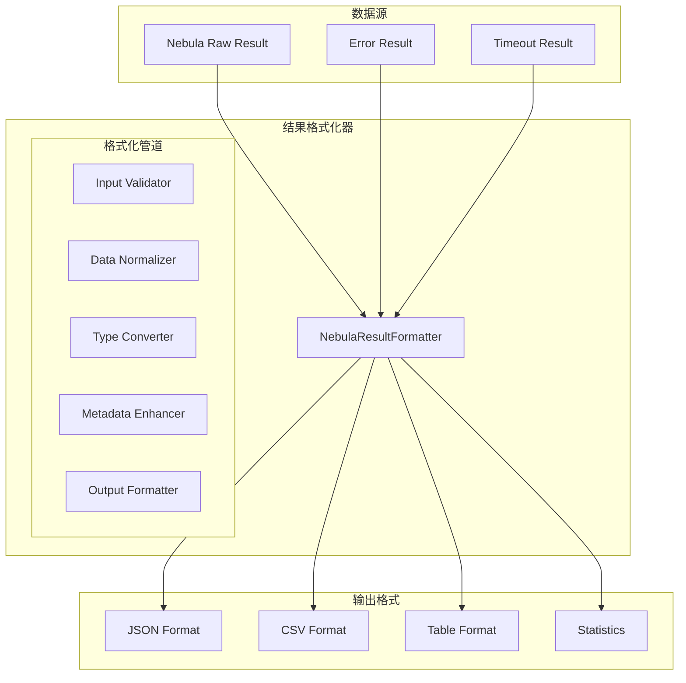

# NebulaResultFormatter 实现方案

## 📋 概述

本文档详细描述了 `NebulaResultFormatter` 结果格式化器的设计和实现方案，用于将 Nebula Graph 的原始查询结果转换为统一的、易于使用的格式，并提供丰富的结果处理功能。

## 🎯 设计目标

### 核心功能
1. **结果标准化**: 将不同格式的原始结果转换为统一格式
2. **数据转换**: 支持多种数据格式转换（JSON、CSV、表格等）
3. **错误处理**: 统一的错误结果格式化
4. **性能统计**: 查询执行时间统计和性能分析
5. **数据增强**: 添加元数据和统计信息

### 架构原则
- **单一职责**: 只负责结果格式化，不涉及查询执行
- **无状态**: 所有方法都是纯函数，不保存状态
- **可扩展**: 支持自定义格式化器和转换器
- **类型安全**: 完整的 TypeScript 类型定义

## 📊 架构设计

### 系统架构



### 结果类型定义

```typescript
interface NebulaQueryResult {
  // 核心数据
  data: any[];
  rows: any[];
  table: Record<string, any>;
  
  // 元数据
  executionTime: number;
  timeCost: number;
  space?: string;
  query?: string;
  
  // 错误信息
  error?: string;
  errorCode?: number;
  errorDetails?: any;
  
  // 统计信息
  stats: {
    rowCount: number;
    columnCount: number;
    dataSize: number;
    processedTime: number;
  };
  
  // 分页信息（如果适用）
  pagination?: {
    total: number;
    page: number;
    pageSize: number;
    hasNext: boolean;
    hasPrevious: boolean;
  };
}

interface FormatOptions {
  format?: 'json' | 'csv' | 'table' | 'raw';
  includeStats?: boolean;
  includeMetadata?: boolean;
  flatten?: boolean;
  maxRows?: number;
  dateFormat?: string;
}
```

## 🔧 接口设计

### INebulaResultFormatter 接口

```typescript
interface INebulaResultFormatter {
  // 基础格式化
  formatResult(rawResult: any, options?: FormatOptions): NebulaQueryResult;
  formatError(error: Error, query?: string, options?: FormatOptions): NebulaQueryResult;
  
  // 批量格式化
  formatBatchResults(results: any[], options?: FormatOptions): NebulaQueryResult[];
  formatTransactionResults(queries: Array<{query: string, result: any}>, options?: FormatOptions): TransactionResult;
  
  // 数据转换
  toJSON(result: NebulaQueryResult, options?: FormatOptions): string;
  toCSV(result: NebulaQueryResult, options?: FormatOptions): string;
  toTable(result: NebulaQueryResult, options?: FormatOptions): string;
  
  // 工具函数
  normalizeData(data: any[]): any[];
  extractColumnNames(result: any): string[];
  calculateStats(result: any): ResultStats;
  
  // 配置管理
  setDefaultOptions(options: FormatOptions): void;
  getDefaultOptions(): FormatOptions;
}

interface TransactionResult {
  results: NebulaQueryResult[];
  stats: {
    totalTime: number;
    successCount: number;
    failureCount: number;
    totalRows: number;
  };
}
```

## 🚀 实现细节

### 1. 核心格式化实现

```typescript
@injectable()
class NebulaResultFormatter implements INebulaResultFormatter {
  private defaultOptions: FormatOptions = {
    format: 'json',
    includeStats: true,
    includeMetadata: true,
    flatten: false,
    maxRows: 1000
  };
  
  formatResult(rawResult: any, options?: FormatOptions): NebulaQueryResult {
    const mergedOptions = { ...this.defaultOptions, ...options };
    const startTime = Date.now();
    
    try {
      // 验证输入
      this.validateInput(rawResult);
      
      // 标准化数据
      const normalizedData = this.normalizeData(rawResult.data || []);
      const normalizedRows = this.normalizeData(rawResult.rows || []);
      
      // 计算统计信息
      const stats = this.calculateStats(normalizedData);
      
      // 构建结果对象
      const result: NebulaQueryResult = {
        data: normalizedData,
        rows: normalizedRows,
        table: rawResult.table || {},
        executionTime: rawResult.executionTime || 0,
        timeCost: rawResult.timeCost || 0,
        space: rawResult.space,
        error: rawResult.error,
        errorCode: rawResult.code,
        errorDetails: rawResult.errorDetails,
        stats: {
          rowCount: normalizedData.length,
          columnCount: this.extractColumnNames(rawResult).length,
          dataSize: this.calculateDataSize(normalizedData),
          processedTime: Date.now() - startTime
        }
      };
      
      // 应用格式选项
      return this.applyFormatOptions(result, mergedOptions);
    } catch (error) {
      return this.formatError(
        new Error(`Failed to format result: ${error.message}`),
        undefined,
        mergedOptions
      );
    }
  }
}
```

### 2. 数据标准化实现

```typescript
private normalizeData(data: any[]): any[] {
  if (!Array.isArray(data)) {
    return [];
  }
  
  return data.map(item => {
    // 处理各种数据格式
    if (typeof item === 'object' && item !== null) {
      return this.normalizeObject(item);
    }
    
    return item;
  });
}

private normalizeObject(obj: Record<string, any>): Record<string, any> {
  const normalized: Record<string, any> = {};
  
  for (const [key, value] of Object.entries(obj)) {
    // 处理 Nebula 的特殊数据类型
    if (this.isNebulaSpecialType(value)) {
      normalized[key] = this.convertNebulaType(value);
    } else if (Array.isArray(value)) {
      normalized[key] = value.map(v => this.normalizeValue(v));
    } else if (typeof value === 'object' && value !== null) {
      normalized[key] = this.normalizeObject(value);
    } else {
      normalized[key] = this.normalizeValue(value);
    }
  }
  
  return normalized;
}
```

### 3. 错误格式化实现

```typescript
formatError(error: Error, query?: string, options?: FormatOptions): NebulaQueryResult {
  const mergedOptions = { ...this.defaultOptions, ...options };
  const errorResult: NebulaQueryResult = {
    data: [],
    rows: [],
    table: {},
    executionTime: 0,
    timeCost: 0,
    error: error.message,
    errorDetails: error.stack ? { stack: error.stack } : undefined,
    stats: {
      rowCount: 0,
      columnCount: 0,
      dataSize: 0,
      processedTime: 0
    }
  };
  
  if (query) {
    errorResult.query = query;
  }
  
  return this.applyFormatOptions(errorResult, mergedOptions);
}
```

### 4. CSV 转换实现

```typescript
toCSV(result: NebulaQueryResult, options?: FormatOptions): string {
  const mergedOptions = { ...this.defaultOptions, ...options };
  const formattedResult = this.applyFormatOptions(result, mergedOptions);
  
  if (formattedResult.data.length === 0) {
    return '';
  }
  
  const columns = this.extractColumnNames(formattedResult);
  let csv = columns.join(',') + '\n';
  
  for (const row of formattedResult.data) {
    const values = columns.map(column => {
      const value = row[column];
      return this.escapeCSVValue(value);
    });
    
    csv += values.join(',') + '\n';
  }
  
  return csv;
}

private escapeCSVValue(value: any): string {
  if (value === null || value === undefined) {
    return '';
  }
  
  const stringValue = String(value);
  
  // 如果包含逗号、引号或换行符，需要转义
  if (stringValue.includes(',') || stringValue.includes('"') || stringValue.includes('\n')) {
    return `"${stringValue.replace(/"/g, '""')}"`;
  }
  
  return stringValue;
}
```

## 🎯 集成计划

### 阶段一：基础格式化器创建（3天）
1. 创建 `NebulaResultFormatter` 核心类
2. 实现基本的结果格式化功能
3. 编写单元测试

### 阶段二：高级功能开发（4天）
1. 实现多种输出格式（JSON、CSV、表格）
2. 添加数据增强和统计功能
3. 实现错误处理和数据验证

### 阶段三：重构现有代码（3天）
1. 修改 `NebulaConnectionManager` 使用格式化器
2. 更新其他服务使用统一的结果格式
3. 确保向后兼容性

### 阶段四：测试验证（2天）
1. 单元测试覆盖
2. 集成测试验证
3. 性能基准测试

## 📈 优势

### 代码质量提升
- **统一格式**: 所有服务返回相同格式的结果
- **减少重复**: 结果处理逻辑集中在一处
- **易于维护**: 修改格式只需修改一个文件

### 功能增强
- **丰富元数据**: 自动添加统计和性能信息
- **多格式支持**: 支持多种输出格式
- **错误处理**: 统一的错误结果格式

### 性能优化
- **高效处理**: 优化的数据处理算法
- **内存优化**: 流式处理大数据集
- **缓存优化**: 结果缓存和复用

## 🧪 测试策略

### 单元测试
```typescript
describe('NebulaResultFormatter', () => {
  let formatter: NebulaResultFormatter;
  
  beforeEach(() => {
    formatter = new NebulaResultFormatter();
  });
  
  test('should format basic result correctly', () => {
    const rawResult = {
      data: [{ name: 'test', age: 25 }],
      code: 0,
      executionTime: 100
    };
    
    const result = formatter.formatResult(rawResult);
    
    expect(result.data).toHaveLength(1);
    expect(result.stats.rowCount).toBe(1);
    expect(result.error).toBeUndefined();
  });
});
```

### 集成测试
- 与现有服务的集成测试
- 大数据集性能测试
- 错误处理测试

## 📋 实施时间表

| 阶段 | 时间 | 负责人 | 状态 |
|------|------|--------|------|
| 需求分析和设计 | 2天 | 架构师 | 📅 计划 |
| 核心功能实现 | 3天 | 极速开发团队 | 📅 计划 |
| 高级功能开发 | 4天 | 开发团队 | 📅 计划 |
| 重构现有代码 | 3天 | 开发团队 | 📅 计划 |
| 测试验证 | 2天 | QA团队 | 📅 计划 |

## ✅ 验收标准

1. **功能完整性**: 所有格式化功能正常工作
2. **性能达标**: 格式化时间 < 5ms（1000行数据）
3. **格式统一**: 所有服务返回统一格式的结果
4. **错误处理**: 完整的错误结果格式化
5. **测试覆盖**: 单元测试覆盖率 95% 以上

## 🎯 总结

`NebulaResultFormatter` 将显著提高结果处理的统一性和可维护性，为数据分析和监控提供强大支持。建议立即开始第一阶段的设计和实现工作。