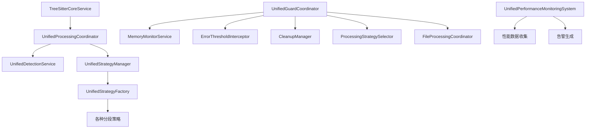

# Parser架构协调模块分析

## 📋 概述

本文档详细分析当前parser架构中的核心协调模块，识别已集成到完整工作流中的模块以及尚未完全集成的模块。

## 🎯 核心协调模块分析

### 1. 已完全集成的核心协调模块

#### 1.1 统一处理协调器 (UnifiedProcessingCoordinator)
**文件**: [`src/service/parser/processing/coordination/UnifiedProcessingCoordinator.ts`](src/service/parser/processing/coordination/UnifiedProcessingCoordinator.ts:1)

**主要职责**:
- 统一文件处理流程协调
- 语言检测和策略选择
- 错误处理和降级机制
- 性能监控和优化

**协调流程**:
```
文件输入 → 检测中心 → 策略选择 → 解析执行 → 结果标准化 → 输出
```

**关键方法**:
- `processFile()` - 处理单个文件
- `processFiles()` - 批量处理文件
- `selectStrategy()` - 智能策略选择
- `executeProcessing()` - 执行处理流程

#### 1.2 统一检测服务 (UnifiedDetectionService)
**文件**: [`src/service/parser/processing/detection/UnifiedDetectionService.ts`](src/service/parser/processing/detection/UnifiedDetectionService.ts:1)

**主要职责**:
- 多维度文件检测（扩展名、内容、备份文件）
- 智能语言识别
- 文件特征分析
- 处理策略推荐

**检测流程**:
```
备份文件检测 → 扩展名检测 → 内容检测 → 智能决策 → 特征分析 → 策略推荐
```

#### 1.3 统一策略管理器 (UnifiedStrategyManager)
**文件**: [`src/service/parser/processing/strategies/manager/UnifiedStrategyManager.ts`](src/service/parser/processing/strategies/manager/UnifiedStrategyManager.ts:1)

**主要职责**:
- 策略选择和执行管理
- 策略缓存和性能统计
- 降级路径管理
- 分层策略执行

**核心功能**:
- `selectOptimalStrategy()` - 智能策略选择
- `executeStrategy()` - 策略执行
- `getFallbackPath()` - 降级路径获取
- `executeHierarchicalStrategy()` - 分层策略执行

### 2. 部分集成的保护协调模块

#### 2.1 统一保护协调器 (UnifiedGuardCoordinator)
**文件**: [`src/service/parser/guard/UnifiedGuardCoordinator.ts`](src/service/parser/guard/UnifiedGuardCoordinator.ts:1)

**当前状态**: 已创建但未完全集成到主工作流

**主要职责**:
- 内存保护和监控
- 错误阈值管理
- 优雅降级处理
- 资源清理协调

**集成状态**:
- ✅ 整合了MemoryGuard和ProcessingGuard功能
- ✅ 提供了统一的保护接口
- ❌ 尚未被UnifiedProcessingCoordinator调用
- ❌ 与主处理流程的集成不完整

#### 2.2 处理保护器 (ProcessingGuard)
**文件**: [`src/service/parser/guard/ProcessingGuard.ts`](src/service/parser/guard/ProcessingGuard.ts:1)

**当前状态**: 已存在但功能被UnifiedGuardCoordinator替代

**主要职责**:
- 文件处理保护
- 错误阈值检查
- 内存状态监控
- 降级策略执行

**集成状态**:
- ✅ 功能完整
- ❌ 已被UnifiedGuardCoordinator替代
- ❌ 建议逐步废弃

### 3. 性能监控模块

#### 3.1 统一性能监控系统 (UnifiedPerformanceMonitoringSystem)
**文件**: [`src/service/parser/processing/utils/performance/UnifiedPerformanceMonitoringSystem.ts`](src/service/parser/processing/utils/performance/UnifiedPerformanceMonitoringSystem.ts:1)

**当前状态**: 已实现但集成度有限

**主要职责**:
- 操作性能监控
- 内存使用统计
- 缓存性能分析
- 性能告警生成

**集成状态**:
- ✅ 功能完整
- ❌ 在UnifiedProcessingCoordinator中未充分使用
- ❌ 性能数据收集不完整

## 🔄 模块调用链分析

### 完整工作流调用链



### 核心协调流程

```
1. 文件输入
   ↓
2. UnifiedProcessingCoordinator.processFile()
   ↓
3. UnifiedDetectionService.detectFile()
   ↓
4. UnifiedStrategyManager.selectOptimalStrategy()
   ↓
5. UnifiedStrategyManager.executeStrategy()
   ↓
6. 策略.split() 方法执行
   ↓
7. 结果构建和返回
```

## ⚠️ 未完全集成的模块

### 1. 保护机制模块

#### 问题分析:
- **UnifiedGuardCoordinator** 虽然功能完整，但未被主流程调用
- **ProcessingGuard** 与 UnifiedGuardCoordinator 功能重叠
- 内存保护和错误处理未与主处理流程深度集成

#### 建议集成方案:
```typescript
// 在 UnifiedProcessingCoordinator 中集成保护机制
async processFile(context: ProcessingContext): Promise<ProcessingResult> {
    // 1. 保护机制检查
    const guardStatus = await this.guardCoordinator.checkSystemStatus();
    if (guardStatus.shouldUseFallback) {
        return this.executeFallbackProcessing(context);
    }
    
    // 2. 正常处理流程
    // ... 现有逻辑
}
```

### 2. 性能监控模块

#### 问题分析:
- **UnifiedPerformanceMonitoringSystem** 功能完整但使用有限
- 缺乏统一的性能数据收集机制
- 性能告警未与系统状态管理集成

#### 建议集成方案:
```typescript
// 在关键方法中添加性能监控
async executeStrategy(strategy: ISplitStrategy, context: StrategyExecutionContext) {
    const startTime = Date.now();
    
    try {
        const result = await strategy.split(...);
        const duration = Date.now() - startTime;
        
        // 记录性能指标
        this.performanceMonitor.recordOperation('strategy-execution', {
            duration,
            success: true,
            metadata: { strategy: strategy.getName() }
        });
        
        return result;
    } catch (error) {
        // 记录错误性能指标
        this.performanceMonitor.recordOperation('strategy-execution', {
            duration: Date.now() - startTime,
            success: false,
            error: error.message
        });
        throw error;
    }
}
```

### 3. 配置管理模块

#### 问题分析:
- 配置管理分散在多个模块中
- 缺乏统一的配置协调机制
- 动态配置更新支持有限

#### 建议集成方案:
```typescript
// 创建统一的配置协调器
class UnifiedConfigCoordinator {
    private configManager: UnifiedConfigManager;
    private performanceMonitor: UnifiedPerformanceMonitoringSystem;
    
    updateConfig(newConfig: Partial<Config>) {
        // 验证配置
        // 通知相关模块配置变更
        // 更新性能监控阈值
    }
}
```

## 🎯 集成优先级建议

### 高优先级（立即实施）

1. **保护机制集成**
   - 将 UnifiedGuardCoordinator 集成到 UnifiedProcessingCoordinator
   - 统一错误处理和降级机制
   - 完善内存保护集成

2. **性能监控集成**
   - 在关键路径添加性能监控点
   - 建立统一的性能数据收集
   - 集成性能告警机制

### 中优先级（短期规划）

3. **配置协调集成**
   - 创建统一的配置协调器
   - 实现动态配置更新
   - 优化配置验证机制

4. **缓存协调集成**
   - 统一缓存策略管理
   - 优化缓存失效机制
   - 添加缓存性能监控

### 低优先级（长期优化）

5. **扩展性集成**
   - 插件系统集成
   - 自定义策略注册
   - 动态模块加载

## 📊 当前架构状态总结

### ✅ 已完成的集成
- 核心处理流程协调 (UnifiedProcessingCoordinator)
- 语言检测和策略选择 (UnifiedDetectionService + UnifiedStrategyManager)
- 策略执行和缓存管理
- 错误处理和降级机制

### ⚠️ 需要改进的集成
- 保护机制与主流程的深度集成
- 性能监控的全面覆盖
- 配置管理的统一协调
- 缓存策略的优化集成

### 🔄 建议的集成路径

1. **第一阶段**: 保护机制集成
   - 修改 UnifiedProcessingCoordinator 集成 UnifiedGuardCoordinator
   - 统一错误处理和降级流程
   - 完善内存保护机制

2. **第二阶段**: 性能监控集成
   - 在关键路径添加性能监控
   - 建立性能数据收集和分析
   - 集成性能告警和优化建议

3. **第三阶段**: 配置协调集成
   - 创建统一的配置协调器
   - 实现动态配置更新
   - 优化配置验证和回滚

通过以上集成改进，可以构建一个更加健壮、可观测和可维护的parser架构。