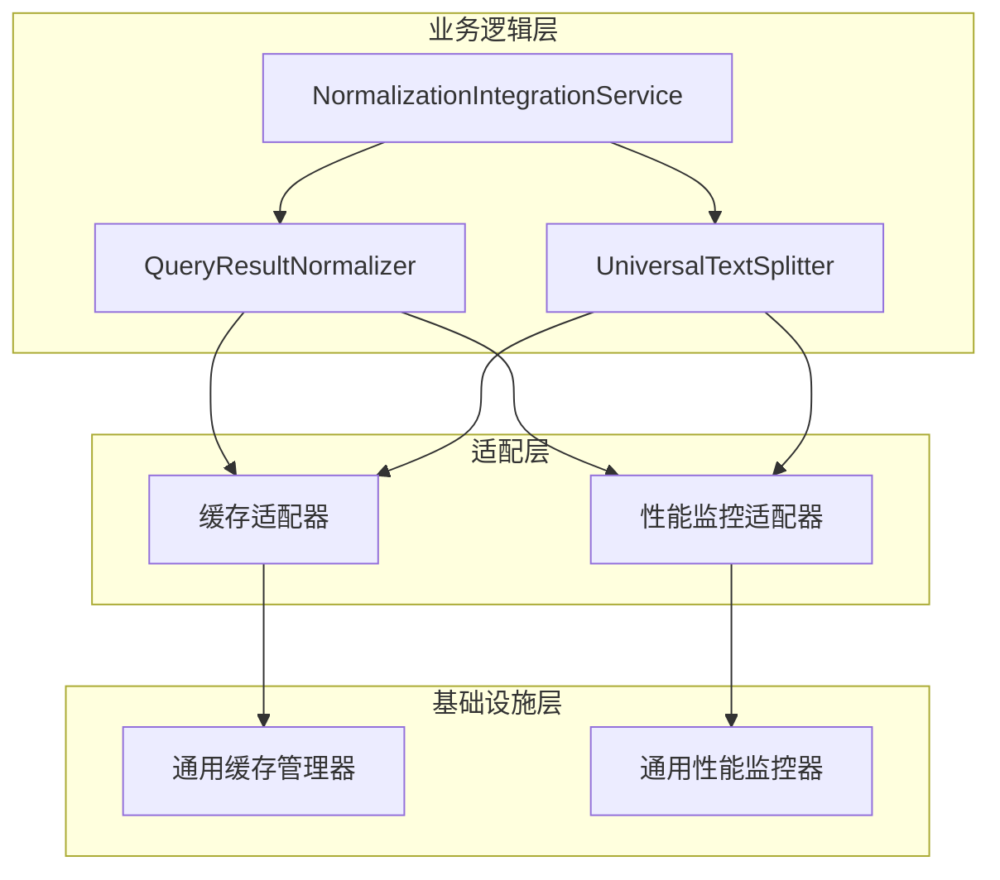

# 缓存和性能监控分离设计计划

## 概述

本文档描述了针对缓存和性能监控系统的重新设计方案，旨在将专用逻辑与基础设施层分离，遵循单一职责原则和关注点分离原则。

## 问题分析

当前实现中，基础设施层（如`UnifiedCacheManager`和`PerformanceMonitor`）包含了过多特定于查询标准化模块的专用逻辑，违反了基础设施层应保持通用性的原则。

### 具体问题

1. **基础设施层污染**：基础设施层包含了特定模块的专用逻辑
2. **耦合度过高**：基础设施与业务逻辑紧密耦合
3. **复用性差**：基础设施无法被其他模块通用
4. **维护困难**：修改基础设施需要考虑多个业务模块的影响

## 重新设计方案

### 1. 分离架构设计



### 2. 基础设施层设计

基础设施层保持通用性，不包含任何业务逻辑：

#### 通用缓存管理器 (src/infrastructure/caching/LRUCache.ts)

```typescript
// 保持现有的通用LRUCache实现，不添加任何业务逻辑
export class LRUCache<K, V> {
  private cache: Map<K, V>;
  private capacity: number;
  
  constructor(capacity: number) {
    this.capacity = capacity;
    this.cache = new Map<K, V>();
  }
  
  get(key: K): V | undefined {
    // 通用LRU缓存逻辑
  }
  
 set(key: K, value: V): void {
    // 通用LRU缓存逻辑
  }
  
  has(key: K): boolean {
    // 通用LRU缓存逻辑
  }
  
  delete(key: K): boolean {
    // 通用LRU缓存逻辑
  }
  
  clear(): void {
    // 通用LRU缓存逻辑
  }
  
  size(): number {
    // 通用LRU缓存逻辑
  }
}
```

#### 通用性能监控器 (src/infrastructure/monitoring/PerformanceMonitor.ts)

```typescript
// 保持通用性能监控功能，不添加特定业务逻辑
export class PerformanceMonitor {
  private metrics: Map<string, any>;
  
  recordMetric(key: string, value: any): void {
    // 通用指标记录逻辑
  }
  
 getMetric(key: string): any {
    // 通用指标获取逻辑
  }
  
  startTimer(operation: string): () => number {
    // 通用计时器逻辑
  }
  
  // 其他通用监控方法
}
```

### 3. 适配层设计

适配层负责将通用基础设施适配到特定业务需求：

#### 缓存适配器 (src/service/parser/core/normalization/CacheAdapter.ts)

```typescript
// 专门用于查询标准化模块的缓存适配器
export class NormalizationCacheAdapter {
  private cache: LRUCache<string, StandardizedQueryResult[]>;
  private stats: CacheStats;
  
  constructor(cacheSize: number) {
    this.cache = new LRUCache<string, StandardizedQueryResult[]>(cacheSize);
    this.stats = {
      hits: 0,
      misses: 0,
      total: 0
    };
  }
  
  get(key: string): StandardizedQueryResult[] | undefined {
    this.stats.total++;
    const result = this.cache.get(key);
    if (result) {
      this.stats.hits++;
    } else {
      this.stats.misses++;
    }
    return result;
  }
  
  set(key: string, value: StandardizedQueryResult[]): void {
    this.cache.set(key, value);
  }
  
  getStats(): CacheStats {
    return { ...this.stats };
  }
  
  calculateHitRate(): number {
    return this.stats.total > 0 ? this.stats.hits / this.stats.total : 0;
  }
}
```

#### 性能监控适配器 (src/service/parser/core/normalization/PerformanceAdapter.ts)

```typescript
// 专门用于查询标准化模块的性能监控适配器
export class NormalizationPerformanceAdapter {
  private monitor: PerformanceMonitor;
  private operationTimers: Map<string, { startTime: number, operation: string }>;
  
  constructor() {
    this.monitor = new PerformanceMonitor();
    this.operationTimers = new Map();
  }
  
 startOperation(operation: string, language: string, queryType: string): string {
    const key = `${operation}:${language}:${queryType}`;
    const startTime = Date.now();
    this.operationTimers.set(key, { startTime, operation });
    return key;
 }
  
  endOperation(timerKey: string): number | null {
    const timer = this.operationTimers.get(timerKey);
    if (!timer) {
      return null;
    }
    
    const endTime = Date.now();
    const duration = endTime - timer.startTime;
    
    // 记录特定于查询标准化的指标
    this.monitor.recordMetric(`normalization.${timer.operation}.duration`, duration);
    this.monitor.recordMetric(`normalization.${timer.operation}.timestamp`, endTime);
    
    this.operationTimers.delete(timerKey);
    return duration;
  }
  
  recordCacheHit(queryType: string): void {
    this.monitor.recordMetric(`normalization.cache.hits.${queryType}`, 
      (this.monitor.getMetric(`normalization.cache.hits.${queryType}`) || 0) + 1);
  }
  
  recordOperation(operation: string, count: number, duration: number): void {
    this.monitor.recordMetric(`normalization.${operation}.count`, count);
    this.monitor.recordMetric(`normalization.${operation}.duration`, duration);
  }
  
  getMetrics(): any {
    return this.monitor.getMetric('');
  }
}
```

### 4. 业务逻辑层集成

业务逻辑层通过适配层使用基础设施服务：

#### QueryResultNormalizer集成适配器

```typescript
export class QueryResultNormalizer implements IQueryResultNormalizer {
  private logger: LoggerService;
  private options: Required<NormalizationOptions>;
  private cacheAdapter: NormalizationCacheAdapter;  // 使用适配器而不是直接使用基础设施
  private performanceAdapter: NormalizationPerformanceAdapter;  // 使用适配器
  private stats: NormalizationStats;
  
  constructor(options: NormalizationOptions = {}) {
    this.logger = new LoggerService();
    this.options = {
      enableCache: options.enableCache ?? true,
      cacheSize: options.cacheSize ?? 100,
      enablePerformanceMonitoring: options.enablePerformanceMonitoring ?? false,
      customTypeMappings: options.customTypeMappings ?? [],
      debug: options.debug ?? false
    };
    
    // 使用适配器
    this.cacheAdapter = new NormalizationCacheAdapter(this.options.cacheSize);
    this.performanceAdapter = new NormalizationPerformanceAdapter();
    
    this.stats = {
      totalNodes: 0,
      successfulNormalizations: 0,
      failedNormalizations: 0,
      processingTime: 0,
      cacheHitRate: 0,
      typeStats: {}
    };
  }
  
  async normalize(
    ast: Parser.SyntaxNode, 
    language: string, 
    queryTypes?: string[]
  ): Promise<StandardizedQueryResult[]> {
    const startTime = Date.now();
    
    try {
      // 使用缓存适配器
      const cacheKey = this.generateCacheKey(ast, language, queryTypes);
      
      if (this.options.enableCache) {
        const cachedResult = this.cacheAdapter.get(cacheKey);
        if (cachedResult) {
          // 使用性能监控适配器记录缓存命中
          this.performanceAdapter.recordCacheHit('normalization');
          return cachedResult;
        }
      }
      
      // 使用性能监控适配器开始操作计时
      let timerKey: string | null = null;
      if (this.options.enablePerformanceMonitoring) {
        timerKey = this.performanceAdapter.startOperation('normalization', language, 'query');
      }
      
      // ... 标准化逻辑 ...
      
      // 使用性能监控适配器结束操作计时
      if (timerKey) {
        const duration = this.performanceAdapter.endOperation(timerKey);
        if (duration !== null) {
          this.performanceAdapter.recordOperation('normalization', results.length, duration);
        }
      }
      
      // 使用缓存适配器存储结果
      if (this.options.enableCache) {
        this.cacheAdapter.set(cacheKey, results);
      }
      
      return results;
    } finally {
      const endTime = Date.now();
      this.stats.processingTime += endTime - startTime;
    }
  }
}
```

### 5. 实施计划

#### 阶段1：基础设施层清理（1天）
- [ ] 移除基础设施层中的业务逻辑
- [ ] 确保基础设施保持通用性
- [ ] 测试基础设施层功能完整性

#### 阶段2：适配层实现（2天）
- [ ] 实现缓存适配器
- [ ] 实现性能监控适配器
- [ ] 实现错误处理适配器
- [ ] 编写适配器单元测试

#### 阶段3：业务逻辑层集成（2天）
- [ ] 修改QueryResultNormalizer使用适配器
- [ ] 修改UniversalTextSplitter使用适配器
- [ ] 更新NormalizationIntegrationService
- [ ] 编写集成测试

#### 阶段4：测试和验证（1天）
- [ ] 完整的单元测试
- [ ] 集成测试
- [ ] 性能基准测试
- [ ] 文档更新

## 预期收益

1. **职责分离**：基础设施层保持通用性，业务逻辑层处理特定需求
2. **可维护性**：修改业务逻辑不影响基础设施
3. **可复用性**：基础设施可在其他模块中复用
4. **可扩展性**：新增业务模块只需实现相应适配器
5. **清晰性**：架构更清晰，易于理解和维护

## 风险控制

1. **兼容性**：确保适配层API与现有业务逻辑兼容
2. **性能**：适配层不应引入显著性能开销
3. **错误处理**：适配层需正确处理基础设施层错误
4. **测试覆盖**：确保适配层有充分的测试覆盖