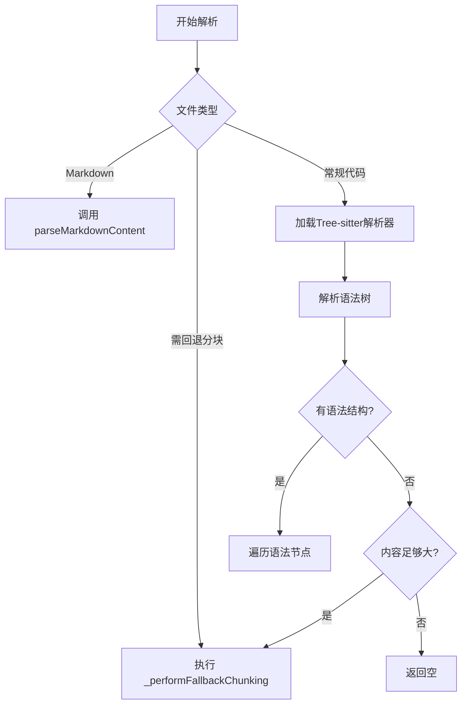
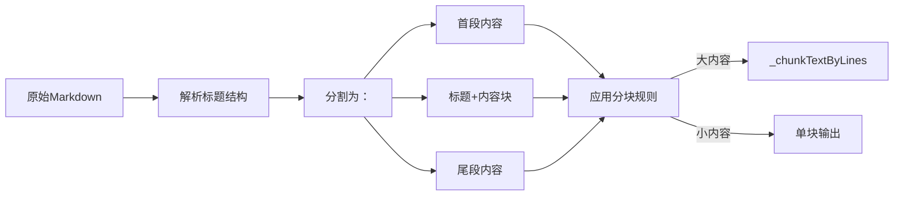
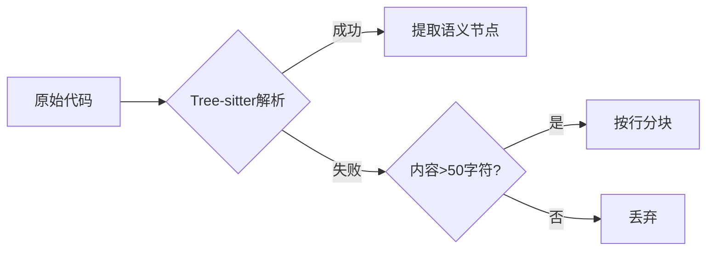

### 模块逻辑分析：代码片段化解析器

该模块实现了将代码文件（包括Markdown）解析为结构化代码块的功能，核心目标是**将源代码分割为语义上有意义且大小适中的片段**，用于后续索引、分析或AI处理。以下是关键逻辑的深度解析：

---

### **核心设计思想**
1. **语义优先**：优先使用语法树（Tree-sitter）提取真实代码结构（函数/类等）
2. **大小约束**：严格控制片段大小（`MIN_BLOCK_CHARS` ~ `MAX_BLOCK_CHARS`）
3. **降级策略**：当语法解析失败时，自动回退到基于行的分块
4. **防重复机制**：通过哈希避免处理重复内容片段
5. **Markdown专项处理**：将Markdown按标题结构化分割

---

### **关键流程解析**

#### **1. 文件解析入口 (`parseFile`)**
- **扩展名过滤**：仅处理 `scannerExtensions` 列表中的语言（如 `.js`, `.py`, `.md`）
- **内容获取**：
  - 优先使用传入的 `options.content`（避免重复读文件）
  - 否则从文件系统读取并计算SHA256哈希（用于内容变更检测）
- **错误处理**：文件读取失败时发送遥测事件，返回空数组

#### **2. 语义化解析核心 (`parseContent`)**


##### **语法树解析阶段**
- **节点处理逻辑**：
  - **跳过小节点**：`node.text.length < MIN_BLOCK_CHARS`（默认50字符）
  - **理想节点**：大小在 `[MIN, MAX*1.2]` 范围内 → 直接生成代码块
  - **过大节点**：
    - 有子节点 → 递归处理子节点（如函数体内部分解）
    - 无子节点（叶子节点）→ 按行分块（`_chunkLeafNodeByLines`）

##### **关键优化：再平衡分块**
当分块接近`MAX_BLOCK_CHARS`时：
```javascript
if (当前块 + 下一行 > MAX) {
  if (剩余内容 < MIN_CHUNK_REMAINDER_CHARS) { // 剩余内容太少
    向前调整分割点 // 确保剩余块至少200字符
  } else {
    正常分割
  }
}
```
**目的**：避免产生"碎片化"小块（如最后一块只有10字符）

#### **3. 降级策略：回退分块 (`_performFallbackChunking`)**
- **触发条件**：
  - 不支持的语法（如`.json`）
  - Tree-sitter解析结果为空
- **分块逻辑**：
  - 按行累积内容直到接近`MAX_BLOCK_CHARS`
  - 特殊处理超长行：单行 > MAX → 拆分为多个`segment`块
  - 严格避免小块：剩余内容 < `MIN_CHUNK_REMAINDER_CHARS`（200字符）时向前合并

#### **4. Markdown专项处理 (`parseMarkdownContent`)**

- **标题识别**：通过正则提取 `#.标题` 的级别（h1/h2...）
- **内容分段**：
  - 标题前的内容 → `markdown_content` 类型
  - 每个标题及其内容 → `markdown_header_h{level}` 类型
  - 标题后的内容 → `markdown_content` 类型
- **智能分块**：内容过大时自动调用 `_chunkTextByLines`

#### **5. 分块统一引擎 (`_chunkTextByLines`)**
- **输入**：行数组 + 起始行号
- **核心能力**：
  - 处理超长行（>1000字符）→ 拆分为`segment`块
  - 动态调整分割点避免小块
  - 保留原始行号映射（`baseStartLine`）
- **输出**：符合大小约束的代码块数组

---

### **关键设计亮点**

#### **1. 智能分块再平衡**
```javascript
// 当剩余内容过少时的处理
if (remainderLength < MIN_CHUNK_REMAINDER_CHARS) {
  // 从当前块末尾向前寻找最佳分割点
  for (let k = i-2; k >= chunkStart; k--) {
    if (potentialChunk >= MIN && potentialNext >= MIN_REMAINDER) {
      splitIndex = k; // 找到最优分割点
      break;
    }
  }
}
```
**价值**：确保最后一块不会因"刚好超限"而产生极小碎片

#### **2. 多级降级机制**

**优势**：最大化利用语法信息，最小化信息丢失

#### **3. 防重复哈希机制**
```javascript
const segmentHash = createHash('sha256')
  .update(`${filePath}-${start_line}-${end_line}-${content.length}-${contentPreview}`)
  .digest('hex')
```
**关键字段**：文件路径 + 行号范围 + 内容长度 + 前100字符预览  
**作用**：避免相同内容在不同解析中重复处理

#### **4. Markdown结构化处理**
- 将Markdown视为**层次化文档**而非纯文本
- 保留标题语义（`markdown_header_h2`）
- 内容与标题关联（`identifier`存储标题文本）

---

### **参数配置策略**
| 参数 | 默认值 | 作用 |
|------|--------|------|
| `MIN_BLOCK_CHARS` | 50 | 过滤无意义小片段 |
| `MAX_BLOCK_CHARS` | 1000 | 避免AI处理超长上下文 |
| `MAX_CHARS_TOLERANCE_FACTOR` | 1.2 | 允许1200字符的弹性空间 |
| `MIN_CHUNK_REMAINDER_CHARS` | 200 | 防止最后一块过小 |

**设计哲学**：  
> "片段应包含完整语义单元，同时适应AI模型的上下文窗口限制"

---

### **错误处理与遥测**
- **关键点捕获**：文件读取、解析器加载、节点处理
- **脱敏处理**：`sanitizeErrorMessage` 防止敏感信息泄露
- **遥测事件**：`TelemetryEventName.CODE_INDEX_ERROR`
- **降级保障**：任何错误返回空数组，不影响主流程

---

### **典型使用场景**
1. **代码索引系统**：为每个代码块生成唯一ID供检索
2. **AI代码理解**：将大文件分割为可处理的上下文片段
3. **文档生成**：从Markdown提取结构化内容
4. **变更分析**：通过`fileHash`检测内容变更

---

### **优化建议**
1. **缓存增强**：对已解析文件缓存`seenSegmentHashes`结果
2. **并行处理**：对独立节点（如Markdown章节）并行分块
3. **自适应阈值**：根据语言特性动态调整`MIN/MAX_BLOCK_CHARS`
4. **增量解析**：结合`fileHash`实现变更部分的增量处理

> 该模块成功平衡了**语义准确性**与**工程实用性**，通过多层降级策略确保在各种代码场景下都能产出高质量片段，是代码理解基础设施的关键组件。