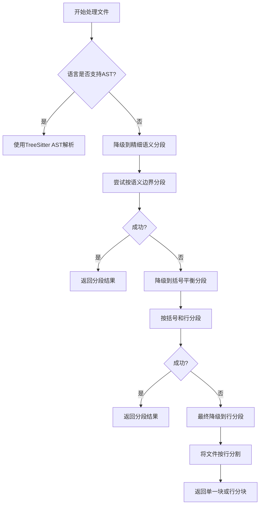

根据对代码库的分析，整理出没有适配器的语言的处理工作流如下：

## 无适配器语言的处理工作流

当遇到没有AST解析器适配器的语言时，系统会通过一系列降级机制来处理文件，确保即使无法进行AST解析，也能提供基本的分段能力。

### 1. 语言检测与支持判断

首先，系统通过 [`LanguageDetector`](src/service/parser/core/language-detection/LanguageDetector.ts:91) 判断语言是否支持AST解析：
```typescript
isLanguageSupportedForAST(language: string | undefined): boolean {
  return this.featureDetector.isLanguageSupportedForAST(language);
}
```

该方法调用 [`LanguageFeatureDetector`](src/service/parser/utils/language/LanguageFeatureDetector.ts:309) 中的实现，检查语言是否在支持列表中：
```typescript
isLanguageSupportedForAST(language: string | undefined): boolean {
  if (!language) return false;
  
  const supportedLanguages = [
    'typescript', 'javascript', 'python', 'java', 
    'go', 'rust', 'cpp', 'c', 'csharp'
  ];
  return supportedLanguages.includes(language.toLowerCase());
}
```

**支持AST解析的语言**：TypeScript, JavaScript, Python, Java, Go, Rust, C++, C, C#

### 2. 处理策略选择

当语言不支持AST解析时，`FileProcessingCoordinator` 会选择其他处理策略。处理流程如下：

#### 主要策略优先级：
1. **TreeSitter AST解析** (`TREESITTER_AST`) - 仅用于支持的语言
2. **精细语义分段** (`UNIVERSAL_SEMANTIC_FINE`)
3. **通用语义分段** (`UNIVERSAL_SEMANTIC`)
4. **括号平衡分段** (`UNIVERSAL_BRACKET`)
5. **行分段** (`UNIVERSAL_LINE`) - 最终降级方案

### 3. 具体处理流程

对于不支持AST解析的语言，系统按照以下工作流处理：



### 4. 降级机制实现

在 [`FileProcessingCoordinator`](src/service/parser/universal/coordination/FileProcessingCoordinator.ts:225) 中，当选择 `TREESITTER_AST` 策略但语言不支持时，会自动降级：

```typescript
async chunkByTreeSitter(content: string, filePath: string, language: string): Promise<CodeChunk[]> {
  try {
    // ...
    
    // 检测语言支持
    const detectedLanguage = this.treeSitterService.detectLanguage(filePath);
    if (!detectedLanguage) {
      this.logger?.warn(`Language not supported by TreeSitter for ${filePath}, falling back to fine semantic`);
      return await this.chunkByFineSemantic(content, filePath, language);
    }
    
    // ... AST解析逻辑 ...
    
  } catch (error) {
    // TreeSitter失败时降级到精细语义分段
    return await this.chunkByFineSemantic(content, filePath, language);
  }
}
```

### 5. 内容检测作为补充

对于无扩展名的文件，系统还会使用 [`ExtensionlessFileProcessor`](src/service/parser/universal/ExtensionlessFileProcessor.ts:37) 基于内容进行语言检测：

```typescript
detectLanguageByContent(content: string): {
  language: string;
  confidence: number;
  indicators: string[];
} {
  const detectors = [
    this.detectByShebang.bind(this),
    this.detectBySyntaxPatterns.bind(this),
    this.detectByFileStructure.bind(this)
  ];
  // ...
}
```

这些检测基于：
- **Shebang模式**：如 `#!/usr/bin/env python`
- **语法特征**：特定语言的关键字和结构
- **文件结构**：特定格式的文件布局

### 6. 备份文件处理

对于备份文件（如 `.bak`, `.backup`），[`BackupFileProcessor`](src/service/parser/universal/BackupFileProcessor.ts:38) 会尝试推断原始文件类型：

```typescript
inferOriginalType(filePath: string): {
  originalExtension: string;
  originalLanguage: string;
  originalFileName: string;
  confidence: number;
} {
  // 尝试从文件名中提取原始扩展名
  const specialPatternMatch = baseName.match(/^(.+?)\.([a-z0-9]+)\.(?:bak|backup|old|tmp|temp|orig|save|swo)$/i);
  if (specialPatternMatch) {
    const detectedOriginalExt = '.' + specialPatternMatch[2].toLowerCase();
    if (this.isValidLanguageExtension(detectedOriginalExt)) {
      // 高置信度推断
      confidence = 0.95;
    }
  }
  // ...
}
```

### 总结

对于没有适配器的语言，系统的处理工作流是：
1. **检测语言**：通过扩展名、内容特征或备份文件模式检测语言
2. **判断支持**：检查语言是否在支持的AST解析列表中
3. **选择策略**：如果语言不支持AST解析，则跳过 `TREESITTER_AST` 策略
4. **逐级降级**：从精细语义分段开始，逐步降级到更简单的分段方法
5. **最终保障**：使用行分段作为最后的后备方案，确保所有文件都能被处理

这种设计确保了系统的健壮性，即使面对未知或不支持的语言，也能提供基本的代码分段能力。