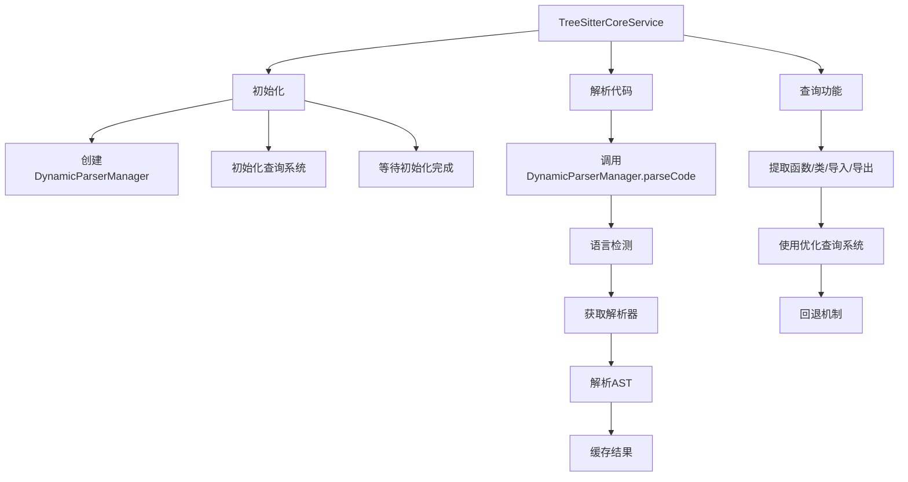
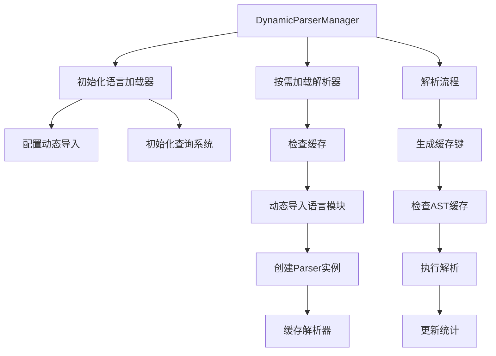
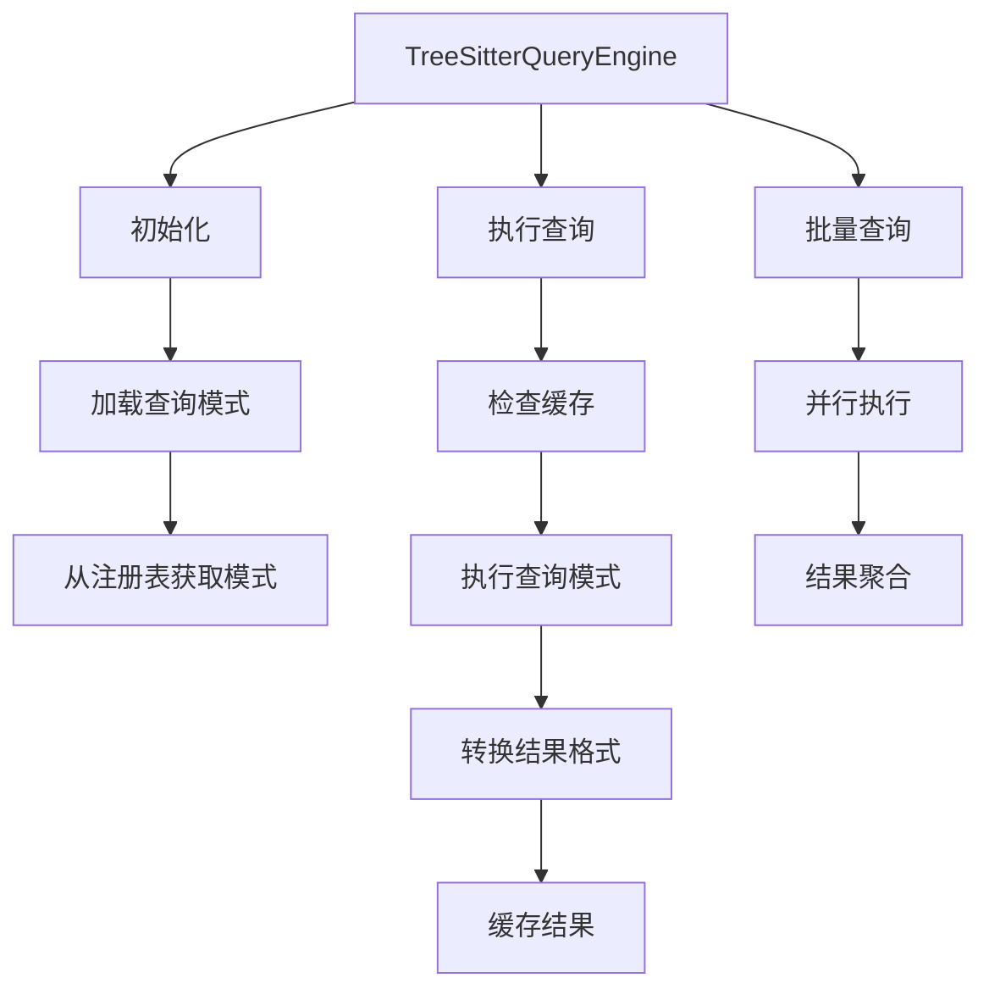
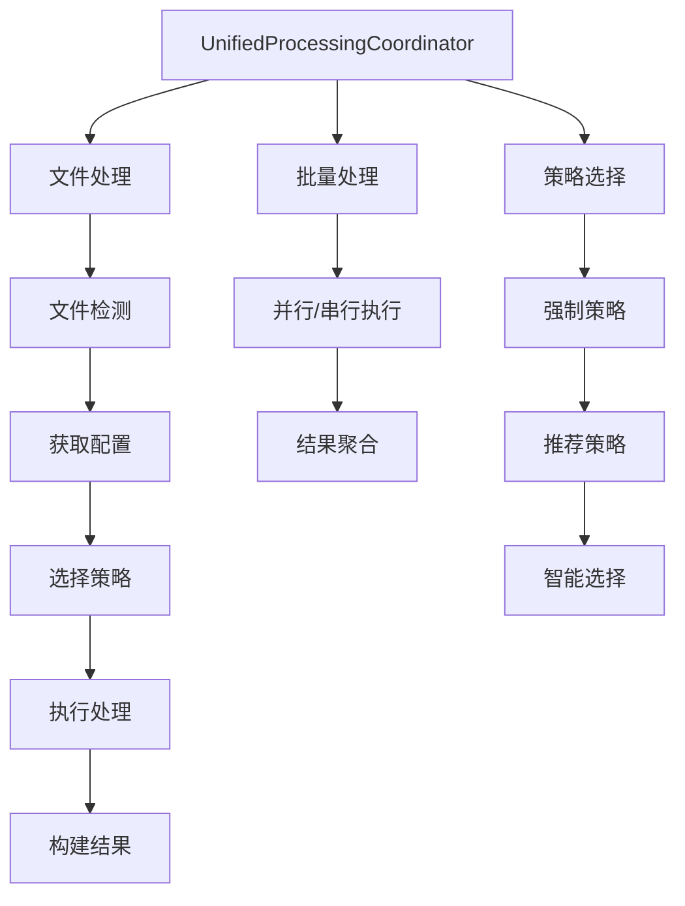
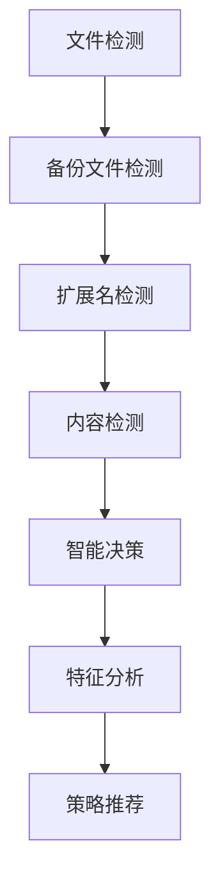
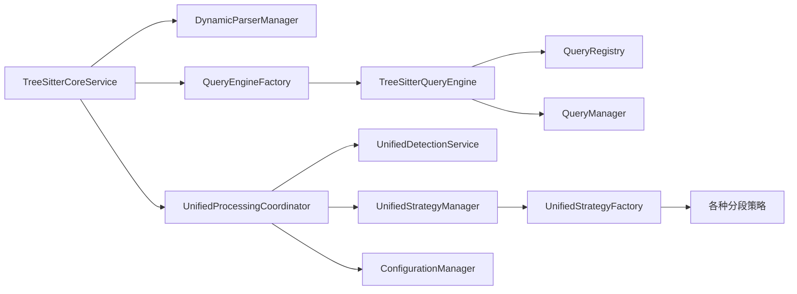

# Parser模块调用链分析

## 📋 概述

本文档详细分析了代码库索引与检索MCP服务中parser模块的整体流程与模块调用链。parser系统采用分层架构设计，集成了语言检测、代码解析、查询执行和智能分段等核心功能。

## 🏗️ 整体架构

### 核心模块层次结构

```
Parser系统架构
├── 核心解析层 (Core Parsing Layer)
│   ├── TreeSitterCoreService (主入口)
│   ├── DynamicParserManager (动态解析器管理)
│   └── TreeSitterService (基础解析服务)
├── 查询系统层 (Query System Layer)
│   ├── QueryEngineFactory (查询引擎工厂)
│   ├── TreeSitterQueryEngine (查询引擎)
│   ├── QueryManager (查询管理器)
│   └── QueryRegistry (查询注册表)
├── 处理协调层 (Processing Coordination Layer)
│   ├── UnifiedProcessingCoordinator (统一处理协调器)
│   ├── UnifiedDetectionService (统一检测服务)
│   └── UnifiedStrategyManager (统一策略管理器)
└── 策略执行层 (Strategy Execution Layer)
    ├── 分段策略 (Split Strategies)
    ├── 检测策略 (Detection Strategies)
    └── 适配器层 (Language Adapters)
```

## 🔄 核心调用流程

### 1. 主入口流程 (TreeSitterCoreService)

**文件**: `src/service/parser/core/parse/TreeSitterCoreService.ts`



**关键方法调用链**:
- `parseCode()` → `DynamicParserManager.parseCode()` → `getParser()` → `parse()`
- `extractFunctions()` → `SimpleQueryEngine.findFunctions()` → `QueryManager.executeQuery()`
- `queryTree()` → `Parser.Query.matches()`

### 2. 动态解析器管理流程 (DynamicParserManager)

**文件**: `src/service/parser/core/parse/DynamicParserManager.ts`



**关键特性**:
- 支持13种编程语言的动态加载
- 三级缓存机制：解析器缓存、AST缓存、节点缓存
- 智能回退机制确保服务稳定性

### 3. 查询系统流程

#### 3.1 查询引擎工厂 (QueryEngineFactory)
**文件**: `src/service/parser/core/query/QueryEngineFactory.ts`
- 提供TreeSitterQueryEngine的单例实例
- 支持查询引擎的重置和状态检查

#### 3.2 树查询引擎 (TreeSitterQueryEngine)
**文件**: `src/service/parser/core/query/TreeSitterQueryEngine.ts`



#### 3.3 查询管理器 (QueryManager)
**文件**: `src/service/parser/core/query/QueryManager.ts`
- 管理查询缓存和模式缓存
- 提供批量查询执行功能
- 支持查询模式的合并和优化

#### 3.4 查询注册表 (QueryRegistry)
**文件**: `src/service/parser/core/query/QueryRegistry.ts`
- 管理所有语言的查询模式
- 支持动态加载和重新加载
- 提供查询统计信息

### 4. 处理协调流程

#### 4.1 统一处理协调器 (UnifiedProcessingCoordinator)
**文件**: `src/service/parser/processing/coordination/UnifiedProcessingCoordinator.ts`



**处理步骤**:
1. **文件检测**: 使用UnifiedDetectionService检测文件类型
2. **配置获取**: 从ConfigurationManager获取处理配置
3. **策略选择**: 基于检测结果选择最优分段策略
4. **执行处理**: 通过UnifiedStrategyManager执行策略
5. **结果构建**: 生成标准化的处理结果

#### 4.2 统一检测服务 (UnifiedDetectionService)
**文件**: `src/service/parser/processing/detection/UnifiedDetectionService.ts`

**检测流程**:


**检测方法**:
- **扩展名检测**: 基于文件扩展名映射
- **内容检测**: 使用正则表达式模式匹配
- **备份文件检测**: 识别和处理备份文件
- **混合检测**: 综合多种检测结果

#### 4.3 统一策略管理器 (UnifiedStrategyManager)
**文件**: `src/service/parser/processing/strategies/manager/UnifiedStrategyManager.ts`

**策略管理功能**:
- **策略选择**: 基于语言、内容特征和文件大小选择最优策略
- **策略执行**: 支持串行和并行执行
- **降级机制**: 提供策略失败时的降级路径
- **性能监控**: 统计策略执行性能

### 5. 语言适配器工厂 (LanguageAdapterFactory)
**文件**: `src/service/parser/core/normalization/LanguageAdapterFactory.ts`

**适配器管理**:
- 支持18种编程语言的适配器
- 提供适配器缓存和配置管理
- 支持自定义适配器注册

## 📊 模块依赖关系

### 核心依赖图



### 数据流分析

1. **解析请求流程**:
   ```
   外部调用 → TreeSitterCoreService → DynamicParserManager → 语言检测 → 解析器获取 → AST生成 → 结果返回
   ```

2. **查询执行流程**:
   ```
   查询请求 → QueryEngineFactory → TreeSitterQueryEngine → QueryRegistry → QueryManager → 查询执行 → 结果转换
   ```

3. **文件处理流程**:
   ```
   文件输入 → UnifiedProcessingCoordinator → UnifiedDetectionService → 策略选择 → UnifiedStrategyManager → 分段执行 → 结果构建
   ```

## 🔧 关键配置和参数

### 缓存配置
- **解析器缓存**: LRU缓存，容量50
- **AST缓存**: LRU缓存，容量500  
- **节点缓存**: LRU缓存，容量1000
- **查询缓存**: LRU缓存，容量100

### 性能配置
- **最大等待时间**: 10秒
- **最大重试次数**: 3次
- **内存限制**: 可配置的MB限制
- **并行处理**: 基于内存限制自动启用

### 分段配置
- **最大块大小**: 2000字符（默认）
- **重叠大小**: 可配置的重叠比例
- **错误阈值**: 错误处理机制
- **策略优先级**: 可配置的策略执行顺序

## 🎯 设计模式应用

### 1. 工厂模式 (Factory Pattern)
- `QueryEngineFactory`: 查询引擎工厂
- `LanguageAdapterFactory`: 语言适配器工厂
- `UnifiedStrategyFactory`: 策略工厂

### 2. 策略模式 (Strategy Pattern)
- 多种分段策略实现
- 动态策略选择和切换
- 策略降级机制

### 3. 适配器模式 (Adapter Pattern)
- 语言特定适配器
- 配置格式适配器
- 查询结果适配器

### 4. 观察者模式 (Observer Pattern)
- 性能监控统计
- 缓存命中率统计
- 错误跟踪和报告

## 📈 性能优化特性

### 缓存优化
- 多级缓存机制减少重复计算
- 智能缓存键生成
- 缓存统计和监控

### 并行处理
- 批量查询的并行执行
- 文件处理的并行/串行选择
- 基于系统资源的智能调度

### 懒加载
- 解析器的按需加载
- 查询模式的动态发现
- 适配器的延迟初始化

## 🔍 错误处理和恢复

### 错误处理机制
1. **初始化错误**: 服务降级继续运行
2. **解析错误**: 回退到简单解析
3. **查询错误**: 使用回退查询模式
4. **策略错误**: 降级到更简单的策略

### 恢复策略
- **超时处理**: 配置超时时间避免无限等待
- **重试机制**: 可配置的重试次数
- **健康检查**: 定期服务健康状态检查

## 🚀 扩展性设计

### 语言扩展
- 通过配置添加新语言支持
- 动态语言加载器机制
- 自定义语言适配器

### 策略扩展
- 插件式策略注册
- 策略优先级配置
- 自定义策略实现

### 查询扩展
- 动态查询模式发现
- 自定义查询类型
- 查询结果格式化

## 📝 总结

Parser模块采用高度模块化的设计，通过清晰的调用链和职责分离，实现了高效、可靠的代码解析和处理功能。系统具备良好的扩展性、容错性和性能优化特性，为代码库索引和检索提供了强大的基础支持。

**核心优势**:
- ✅ 模块化架构，职责清晰
- ✅ 多级缓存，性能优化
- ✅ 智能降级，高可用性
- ✅ 扩展性强，易于维护
- ✅ 全面的监控和统计

**改进建议**:
- 🔄 进一步优化内存使用
- 🔄 增强分布式处理能力
- 🔄 完善测试覆盖率
- 🔄 添加更多语言支持