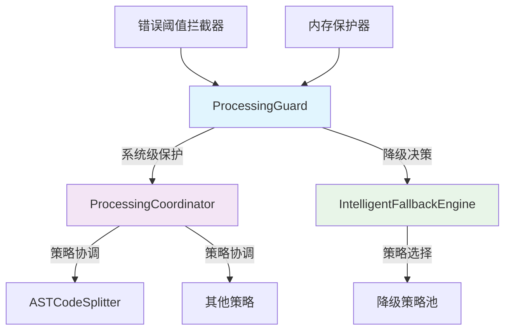

# Processing模块文档索引

本目录包含代码处理模块的相关文档，涵盖工作流程、错误处理、降级机制和优化记录。

## 📚 核心文档

### 🔄 工作流与架构
- **[Processing工作流、错误处理与降级机制文档](./workflow-error-handling-fallback-mechanism.md)**
  - 系统架构概览
  - 正常处理流程
  - 降级处理流程
  - 错误分类与处理
  - 监控与最佳实践

### 🛠️ 优化记录
- **[ASTCodeSplitter优化完成报告](./ast-codesplitter-optimization-completion.md)**
  - 优化背景与目标
  - 具体修改内容
  - 优化效果分析
  - 验证结果
  - 经验总结

## 📋 计划文档

### 🎯 增强计划
- **[ASTCodeSplitter增强计划](./ast-codesplitter-enhancement-plan.md)**
  - 功能增强规划
  - 性能优化目标
  - 实施路线图

### 🔄 重构计划
- **[策略重构计划](./strategy-refactoring-plan.md)**
  - 策略模式重构
  - 架构改进方案
  - 实施步骤

### 📈 集成计划
- **[分块集成计划](./chunking-integration.md)**
  - 分块功能集成
  - 接口设计
  - 测试策略

- **[分块集成完成报告](./chunking-integration-completion.md)**
  - 集成结果总结
  - 性能评估
  - 问题与解决方案

### 🧩 迁移计划
- **[分块复杂度迁移](./chunking-complexity-migration.md)**
  - 复杂度计算迁移
  - 兼容性处理
  - 验证方案

- **[重叠迁移完成报告](./overlap-migration-completion.md)**
  - 重叠处理迁移
  - 性能优化
  - 测试结果

### 📝 后续步骤
- **[下一步重构步骤](./next-refactoring-steps.md)**
  - 短期改进计划
  - 中期优化目标
  - 长期架构规划

### 🔍 置信度分析
- **[后缀置信度分析](./surfix-confidence.md)**
  - 置信度评估方法
  - 分析结果
  - 改进建议

## 🏗️ 架构概览

### 核心组件关系

### 职责分工

| 组件 | 主要职责 | 文档链接 |
|------|----------|----------|
| **ProcessingGuard** | 系统级保护、统一降级入口 | [工作流文档](./workflow-error-handling-fallback-mechanism.md) |
| **ProcessingCoordinator** | 策略选择与执行协调 | [工作流文档](./workflow-error-handling-fallback-mechanism.md) |
| **ASTCodeSplitter** | AST解析与代码分割 | [优化报告](./ast-codesplitter-optimization-completion.md) |
| **IntelligentFallbackEngine** | 智能降级策略选择 | [工作流文档](./workflow-error-handling-fallback-mechanism.md) |

## 🚀 快速导航

### 新团队成员
1. 首先阅读 [Processing工作流、错误处理与降级机制文档](./workflow-error-handling-fallback-mechanism.md) 了解整体架构
2. 然后查看 [ASTCodeSplitter优化完成报告](./ast-codesplitter-optimization-completion.md) 了解最新优化

### 开发人员
1. 查看相关增强计划了解未来发展方向
2. 参考重构计划进行代码改进
3. 查看优化记录了解最佳实践

### 架构师
1. 阅读所有计划文档了解整体规划
2. 查看优化报告评估改进效果
3. 参考下一步重构计划制定架构演进策略

## 📊 文档状态

| 文档 | 状态 | 最后更新 | 维护者 |
|------|------|----------|--------|
| 工作流文档 | ✅ 最新 | 2024-01-08 | 架构团队 |
| ASTCodeSplitter优化报告 | ✅ 最新 | 2024-01-08 | 架构团队 |
| 增强计划 | 📋 规划中 | 2023-12-15 | 开发团队 |
| 策略重构计划 | 📋 规划中 | 2023-12-10 | 架构团队 |
| 分块集成计划 | ✅ 已完成 | 2023-11-20 | 开发团队 |

## 🤝 贡献指南

### 文档更新
1. 确保内容准确性和时效性
2. 保持格式一致性
3. 更新相关索引和链接
4. 记录变更历史

### 新增文档
1. 遵循现有文档结构
2. 包含必要的图表和示例
3. 添加到本索引文档
4. 通知相关团队成员

## 📞 联系方式

如有疑问或建议，请联系：
- **架构团队**：architecture@team.com
- **开发团队**：development@team.com
- **文档维护**：docs@team.com

---

*最后更新：2024年1月8日*