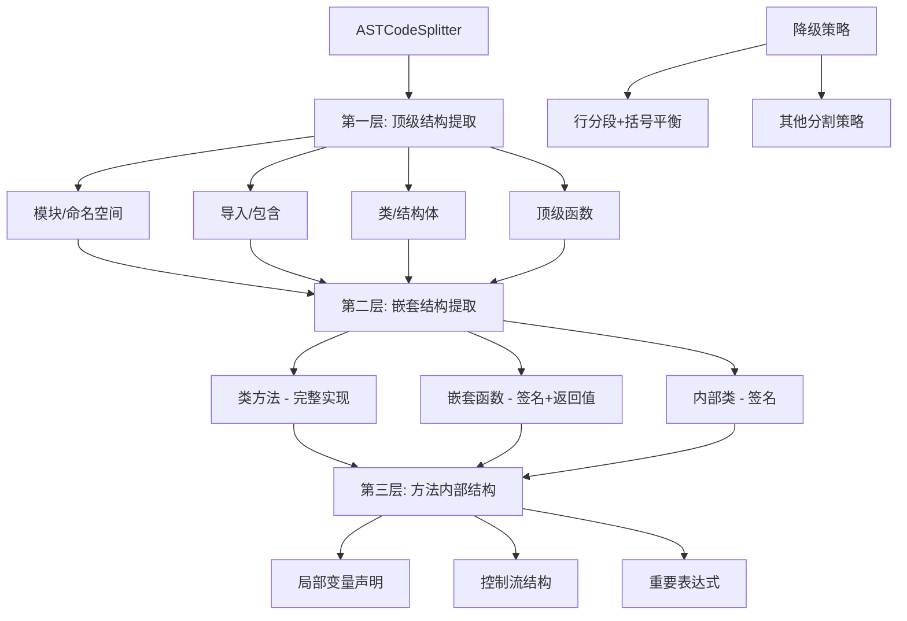
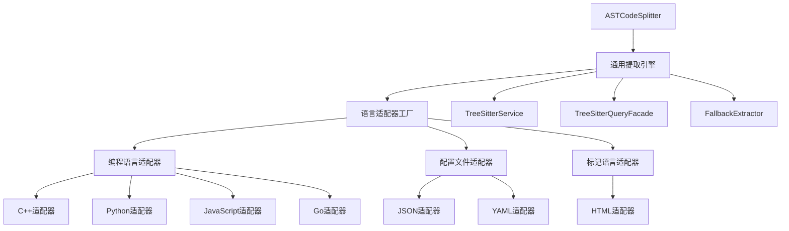

# ASTCodeSplitter 增强方案

## 概述

本文档提供了 ASTCodeSplitter 的全面增强方案，包括分层提取架构、多语言支持、配置优化以及与查询适配器的集成策略。

## 1. 当前实现分析

### 1.1 现有问题

- **空实现问题**：原始版本中 `getFunctionQueries()` 和 `getClassQueries()` 返回空数组
- **名称提取缺陷**：`extractFunctionName()` 和 `extractClassName()` 返回硬编码字符串
- **配置不合理**：大小限制设置过大，与实际需求不匹配
- **缺乏嵌套支持**：无法处理嵌套函数和类的智能提取

### 1.2 用户改进

用户已实现基础版本，主要改进包括：
- 集成 `QueryResultNormalizer` 进行标准化处理
- 实现类型映射和元数据转换
- 添加基本的错误处理和降级机制

## 2. 分层提取架构设计

### 2.1 架构概览



### 2.2 可提取的代码结构

底层的块作为独立代码块
上层结构内部的方法等仅保留签名和返回值等[仅保留下一层的，更多层的不保留]

#### 顶级结构（第一层）
- **模块/命名空间**: `namespace_definition`
- **导入/包含**: `preproc_include`, `using_declaration`
- **类/结构体**: `class_specifier`, `struct_specifier`, `union_specifier`
- **顶级函数**: `function_definition`
- **类型定义**: `type_definition`, `type_alias_declaration`, `enum_specifier`
- **模板声明**: `template_declaration`

#### 嵌套结构（第二层）
- **类方法**: 完整实现，包括方法体
- **嵌套函数**: 仅保留签名和返回值，不保留完整实现
- **内部类**: 仅保留类声明签名
- **构造函数/析构函数**: 完整实现
- **运算符重载**: 完整实现

#### 内部结构（第三层）
- **局部变量声明**: 重要变量声明
- **控制流结构**: if、for、while、switch等关键结构
- **重要表达式**: 复杂表达式、函数调用等

## 3. 配置参数优化

### 3.1 推荐配置

```typescript
interface ASTSplitterConfig {
  // 大小限制
  maxFunctionSize: 1000;        // 函数最大字符数
  maxClassSize: 2000;           // 类最大字符数
  maxNamespaceSize: 3000;       // 命名空间最大字符数
  minFunctionLines: 3;          // 函数最小行数
  minClassLines: 2;             // 类最小行数
  maxChunkSize: 1500;           // 通用代码块最大大小
  minChunkSize: 50;             // 通用代码块最小大小
  
  // 嵌套提取控制
  enableNestedExtraction: true;     // 是否启用嵌套提取
  maxNestingLevel: 2;               // 最大嵌套层级
  preserveNestedMethods: true;      // 是否保留嵌套方法的完整实现
  preserveNestedFunctions: false;   // 是否保留嵌套函数的完整实现
  preserveNestedClasses: false;     // 是否保留嵌套类的完整实现
  
  // 语义边界控制
  preferSemanticBoundaries: true;   // 是否优先语义边界
  extractImports: true;             // 是否提取导入语句
  extractNamespaces: true;          // 是否提取命名空间
  extractTemplates: true;           // 是否提取模板声明
  
  // 降级策略
  fallbackStrategies: ['line-based', 'bracket-balancing']; // 降级策略顺序
  enableFallback: true;             // 是否启用降级
}
```

### 3.2 配置问题分析

原始配置存在以下问题：
- `maxFunctionSize: 3000` 过大，可能导致内存问题
- `maxClassSize: 5000` 过大，类通常不会这么大
- `maxChunkSize: 1000` 与 `maxFunctionSize` 不一致

## 4. 多语言适配器架构

### 4.1 语言分类与差异

#### 编程语言适配器
- **共同特征**: 继承自 `BaseLanguageAdapter`，支持函数、类、方法等编程概念
- **关键差异**: 
  - C++: 模板、命名空间、预处理器
  - Python: 装饰器、异步函数、推导式
  - JavaScript: JSX、闭包、原型链
  - Go: 接口、goroutine、channel

#### 配置文件适配器
- **共同特征**: 继承自 `ConfigLanguageAdapter`，处理键值对、数组、对象结构
- **关键差异**:
  - JSON: 对象、数组、标量值
  - YAML: 锚点、别名、多文档

#### 标记语言适配器
- **特征**: 处理标签、属性、脚本/样式块
- **特殊能力**: 资源引用和自定义元素检测

### 4.2 通用适配器架构



## 5. 查询适配器与 Processing 模块集成

### 5.1 职责分工

- **查询适配器**: 负责 AST 节点的标准化，将原始查询结果转换为统一格式
- **Processing 模块**: 负责代码分段策略，将标准化的节点转换为代码块

### 5.2 数据流转换

```typescript
// 查询适配器输出
interface StandardizedQueryResult {
  nodeId: string;
  type: 'function' | 'class' | 'method' | 'import' | 'variable';
  name: string;
  startLine: number;
  endLine: number;
  content: string;
  metadata: ExtensibleMetadata;
}

// Processing模块输出
interface CodeChunk {
  content: string;
  metadata: ChunkMetadata;
}
```

### 5.3 桥接方案

```typescript
/**
 * 查询结果到代码块的转换器
 */
export class QueryResultToChunkConverter {
  static convertToChunk(
    result: StandardizedQueryResult,
    strategy: string,
    filePath?: string
  ): CodeChunk {
    return new CodeChunkBuilder()
      .setContent(result.content)
      .setStartLine(result.startLine)
      .setEndLine(result.endLine)
      .setLanguage(result.metadata.language)
      .setStrategy(strategy)
      .setType(this.mapToChunkType(result.type))
      .setFilePath(filePath || result.metadata.filePath || '')
      .setComplexity(result.metadata.complexity)
      .addMetadata('nodeId', result.nodeId)
      .addMetadata('symbolInfo', result.symbolInfo)
      .addMetadata('originalType', result.type)
      .build();
  }
}
```

## 6. 实现方案

### 6.1 增强的 ASTCodeSplitter

基于用户现有实现，建议以下增强：

1. **扩展查询类型支持**
   ```typescript
   const standardizedResults = await normalizer.normalize(
     ast, 
     language, 
     ['functions', 'classes', 'namespaces', 'imports', 'types', 'templates']
   );
   ```

2. **添加嵌套提取逻辑**
   ```typescript
   // 第二层：嵌套结构提取
   if (this.config.enableNestedExtraction && this.config.maxNestingLevel >= 2) {
     const nestedResults = await normalizer.normalize(
       ast, 
       language, 
       ['methods', 'nested_functions', 'inner_classes']
     );
     // 处理嵌套结果...
   }
   ```

3. **实现智能降级策略**
   ```typescript
   private fallbackSplit(content: string, filePath: string, language: string): CodeChunk[] {
     for (const strategy of this.config.fallbackStrategies) {
       try {
         switch (strategy) {
           case 'line-based':
             return this.lineBasedSplit(content, filePath, language);
           case 'bracket-balancing':
             return this.bracketBalancingSplit(content, filePath, language);
         }
       } catch (error) {
         this.logger.warn(`降级策略 ${strategy} 失败: ${error}`);
       }
     }
   }
   ```

### 6.2 语言特定配置

```typescript
interface LanguageSpecificConfig {
  cpp: {
    extractTemplates: boolean;
    extractPreprocessor: boolean;
    maxTemplateDepth: number;
  };
  python: {
    extractDecorators: boolean;
    extractAsyncFunctions: boolean;
    extractComprehensions: boolean;
  };
  javascript: {
    extractJSX: boolean;
    extractClosures: boolean;
    extractPrototypes: boolean;
  };
}
```

## 7. 性能优化策略

### 7.1 缓存机制

- **AST 解析结果缓存**: 避免重复解析相同文件
- **查询结果缓存**: 缓存标准化查询结果
- **复杂度计算缓存**: 缓存复杂度计算结果

### 7.2 并行处理

- **并行查询**: 同时查询多种结构类型
- **批量处理**: 批量处理多个文件
- **异步处理**: 使用异步方法避免阻塞

### 7.3 内存管理

- **流式处理**: 大文件分块处理
- **垃圾回收**: 及时释放不需要的对象
- **内存限制**: 设置合理的内存使用上限

## 8. 测试策略

### 8.1 单元测试

- **配置测试**: 验证配置参数的正确性
- **提取测试**: 验证各种结构的提取准确性
- **转换测试**: 验证查询结果到代码块的转换

### 8.2 集成测试

- **多语言测试**: 测试不同语言的适配器
- **嵌套提取测试**: 验证嵌套结构的正确处理
- **降级策略测试**: 验证降级机制的有效性

### 8.3 性能测试

- **大文件处理**: 测试大文件的处理性能
- **内存使用**: 监控内存使用情况
- **并发处理**: 测试并发处理能力

## 9. 实施计划

### 9.1 第一阶段：基础增强（1-2周）
- 优化配置参数
- 实现基础嵌套提取
- 集成查询适配器

### 9.2 第二阶段：多语言支持（2-3周）
- 实现语言特定配置
- 添加更多语言适配器
- 完善降级策略

### 9.3 第三阶段：性能优化（1-2周）
- 实现缓存机制
- 添加并行处理
- 优化内存使用

### 9.4 第四阶段：测试与完善（1周）
- 全面测试
- 性能调优
- 文档完善

## 10. 结论

本方案提供了一个全面的 ASTCodeSplitter 增强策略，通过分层提取架构、多语言支持、配置优化和查询适配器集成，实现了智能、高效、可扩展的代码分段能力。关键优势包括：

1. **充分利用现有基础设施**：避免重复实现，复用查询适配器的标准化能力
2. **支持复杂嵌套结构**：满足现代编程语言的复杂代码结构需求
3. **灵活的配置系统**：支持语言特定的配置和策略
4. **强大的降级机制**：确保在各种情况下的鲁棒性
5. **优秀的性能表现**：通过缓存和并行处理提升效率

这个方案既解决了当前实现的问题，又为未来的扩展奠定了坚实的基础。