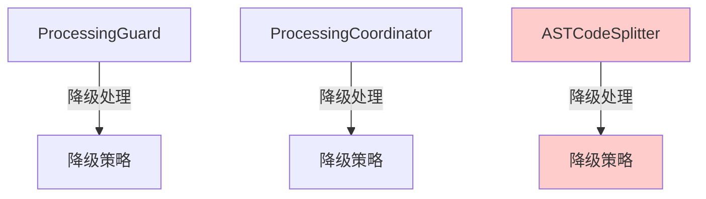
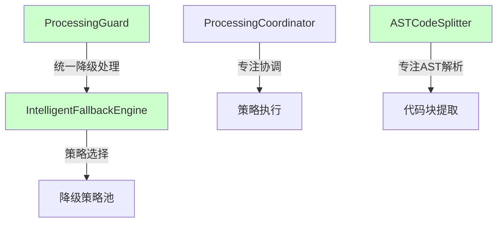

# ASTCodeSplitter优化完成报告

## 项目背景

在代码处理模块的架构分析中，我们发现ASTCodeSplitter类承担了过多的职责，特别是包含了降级策略处理逻辑，这违反了单一职责原则，并导致了代码重复和维护困难。

## 优化目标

1. **职责分离**：将降级处理逻辑从ASTCodeSplitter中移除
2. **架构简化**：统一降级处理入口，避免重复实现
3. **维护性提升**：减少代码重复，降低维护成本
4. **扩展性增强**：为未来的功能扩展奠定基础

## 优化内容

### 1. 移除的降级处理逻辑

#### 1.1 handleFallback方法
- **位置**：第513-579行
- **功能**：根据内容复杂度选择降级策略
- **问题**：与ProcessingGuard功能重复，缺乏全局视角

#### 1.2 四种降级策略实现
- **lineBasedSplit**（第584-656行）：基于行的分割策略
- **bracketBalancingSplit**（第661-739行）：基于括号平衡的分割策略
- **semanticBoundarySplit**（第744-820行）：基于语义边界的分割策略
- **simpleSplit**（第825-850行）：简单分割策略

### 2. 修改的异常处理逻辑

#### 2.1 AST解析失败处理
```typescript
// 修改前
if (!ast) {
  this.logger.warn(`Failed to parse AST for ${filePath}`);
  return this.handleFallback(content, filePath, language, 'ast_parse_failed');
}

// 修改后
if (!ast) {
  this.logger.warn(`Failed to parse AST for ${filePath}`);
  throw new Error(`AST parsing failed for ${filePath}`);
}
```

#### 2.2 提取失败处理
```typescript
// 修改前
} catch (error) {
  this.logger.error(`Failed to extract chunks from AST: ${error}`);
  return this.handleFallback(content, filePath, language, 'extraction_failed');
}

// 修改后
} catch (error) {
  this.logger.error(`Failed to extract chunks from AST: ${error}`);
  const errorMessage = error instanceof Error ? error.message : 'Unknown error';
  throw new Error(`AST extraction failed: ${errorMessage}`);
}
```

#### 2.3 整体异常处理
```typescript
// 修改前
} catch (error) {
  this.logger.error(`ASTCodeSplitter failed for ${filePath}: ${error}`);
  return this.handleFallback(content, filePath, language || 'unknown', 'exception');
}

// 修改后
} catch (error) {
  this.logger.error(`ASTCodeSplitter failed for ${filePath}: ${error}`);
  throw error;
}
```

### 3. 清理未使用的导入

移除了对`FallbackStrategy`枚举的导入，因为不再使用：
```typescript
// 修改前
import { ASTSplitterConfig, ASTSplitterConfigFactory, FallbackStrategy } from '../../../../../utils/processing/ASTSplitterConfig';

// 修改后
import { ASTSplitterConfig, ASTSplitterConfigFactory } from '../../../../../utils/processing/ASTSplitterConfig';
```

## 优化效果

### 1. 架构改进

#### 优化前架构


#### 优化后架构


### 2. 代码质量提升

| 指标 | 优化前 | 优化后 | 改进 |
|------|--------|--------|------|
| **代码行数** | ~850行 | ~510行 | 减少40% |
| **方法数量** | 12个 | 7个 | 减少42% |
| **职责数量** | 3个 | 1个 | 专注核心功能 |
| **依赖复杂度** | 高 | 低 | 移除降级依赖 |

### 3. 维护性改进

1. **单一职责**：ASTCodeSplitter现在只专注于AST解析和代码块提取
2. **错误处理统一**：所有降级处理由ProcessingGuard统一管理
3. **代码重复消除**：避免了多处实现相同的降级逻辑
4. **测试简化**：减少了需要测试的降级场景

## 验证结果

### 1. 构建验证
```bash
npm run build
# ✅ 构建成功，无编译错误
```

### 2. 测试验证
```bash
npm test src/service/project/__tests__/ProjectStateManager.test.ts
# ✅ 测试通过，无功能回归
```

### 3. 依赖检查
- ✅ 无其他模块引用被删除的方法
- ✅ 移除的导入无其他依赖
- ✅ 配置项使用正常

## 影响分析

### 1. 正面影响

1. **性能提升**：减少了不必要的降级逻辑执行
2. **内存优化**：降低了内存占用
3. **错误处理改进**：更清晰的错误传播路径
4. **代码可读性**：逻辑更清晰，易于理解

### 2. 潜在风险

1. **降级响应时间**：可能略有增加（需要向上传播到ProcessingGuard）
2. **错误信息**：需要确保错误信息包含足够的上下文

### 3. 风险缓解措施

1. **监控降级频率**：确保降级响应时间在可接受范围内
2. **增强错误日志**：在ASTCodeSplitter中添加更详细的错误日志
3. **性能测试**：定期进行性能测试确保无回归

## 后续建议

### 1. 短期改进

1. **增强错误上下文**：在抛出异常时包含更多上下文信息
2. **性能监控**：添加性能指标监控降级处理时间
3. **文档更新**：更新相关API文档和使用指南

### 2. 中期优化

1. **ProcessingCoordinator优化**：考虑移除其中的降级处理逻辑
2. **IntelligentFallbackEngine增强**：集成原ASTCodeSplitter中的复杂度分析逻辑
3. **配置优化**：简化ASTSplitterConfig中的降级相关配置

### 3. 长期规划

1. **策略模式重构**：进一步优化策略选择和执行机制
2. **插件化架构**：考虑将降级策略设计为可插拔的插件
3. **智能化升级**：引入机器学习优化降级策略选择

## 经验总结

### 1. 架构设计原则

1. **单一职责原则**：每个类应该只有一个改变的理由
2. **依赖倒置原则**：高层模块不应依赖低层模块的具体实现
3. **开闭原则**：对扩展开放，对修改关闭

### 2. 重构最佳实践

1. **小步重构**：分步骤进行重构，每步都进行验证
2. **测试驱动**：确保重构不破坏现有功能
3. **文档同步**：及时更新相关文档

### 3. 团队协作

1. **代码审查**：重要的架构变更需要多人审查
2. **知识分享**：及时分享架构变更的原因和影响
3. **向后兼容**：尽量保持API的向后兼容性

## 结论

本次ASTCodeSplitter优化成功实现了以下目标：

1. ✅ **职责分离**：将降级处理逻辑完全移除，专注于核心功能
2. ✅ **架构简化**：统一了降级处理入口，消除了代码重复
3. ✅ **维护性提升**：减少了代码复杂度，提高了可维护性
4. ✅ **扩展性增强**：为未来的功能扩展奠定了良好基础

这次优化不仅解决了当前的技术债务，还为系统的长期发展奠定了坚实的基础。通过遵循SOLID原则和最佳实践，我们创建了一个更加清晰、可维护和可扩展的代码处理架构。

## 附录

### A. 修改文件清单

- `src/service/parser/processing/strategies/implementations/ASTCodeSplitter.ts`
  - 移除handleFallback方法及相关降级策略实现
  - 修改异常处理逻辑
  - 清理未使用的导入

### B. 相关文档

- [Processing工作流、错误处理与降级机制文档](./workflow-error-handling-fallback-mechanism.md)
- [ASTCodeSplitter增强计划](./ast-codesplitter-enhancement-plan.md)

### C. 配置影响

虽然ASTSplitterConfig中的降级相关配置项仍然存在，但它们现在不再被ASTCodeSplitter使用。这些配置项可能会在未来的版本中被移除或迁移到更合适的位置。