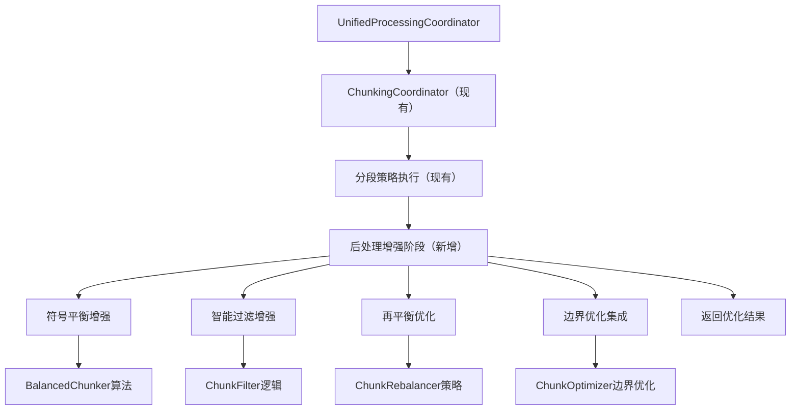

基于我对代码的深入分析，我现在为您详细解析chunking和chunk-processing模块的作用以及如何集成到parser工作流中。

## 📊 模块功能分析总结

### 1. chunking模块（分段处理）
**位置**: `src/service/parser/processing/utils/chunking/`

**核心组件功能**:
- **`BalancedChunker`**: 符号平衡跟踪器，确保分段不破坏语法结构
- **`ChunkFilter`**: 过滤无意义的小块，智能合并相邻块
- **`ChunkRebalancer`**: 智能分块再平衡，防止产生过小的最后一块
- **`OverlapProcessor`**: 为分段结果添加重叠内容

### 2. chunk-processing模块（块后处理）
**位置**: `src/service/parser/processing/utils/chunk-processing/`

**核心组件功能**:
- **`ChunkMerger`**: 智能块合并器，检测并合并重复或重叠的片段
- **`ChunkOptimizer`**: 块优化器，优化块大小和边界
- **`ChunkSimilarityUtils`**: 代码块相似性检测工具

## 🔄 当前Parser工作流分析（重新评估）

根据深入代码分析，发现**重要情况**：当前已存在功能完整的`ChunkingCoordinator`，它已经集成了：

### 现有ChunkingCoordinator功能覆盖
- ✅ **相似度检测和去重**: 通过`SimilarityDetector`实现
- ✅ **智能重叠控制**: 通过`UnifiedOverlapCalculator`实现
- ✅ **节点感知的重叠计算**: 支持AST边界检测
- ✅ **重复内容检测和合并**: 已整合SmartOverlapController功能

### 当前工作流（修正版）
```
UnifiedProcessingCoordinator.processFile()
  → 保护机制检查
  → 文件检测 (UnifiedDetectionService)
  → 策略选择 (SegmentationStrategyCoordinator)
  → 策略执行 (UnifiedStrategyManager.executeStrategy)
  → ChunkingCoordinator协调分段策略执行（已存在）
  → 返回结果
```

**关键发现**: 当前工作流**已经包含分段协调**，但chunking和chunk-processing模块的独特功能尚未完全集成。

## 🎯 重新设计的集成方案（基于现有架构）

### 核心原则：避免重复实现，增强现有架构

**功能重叠分析**：
- ✅ **已覆盖**: 相似度检测、重叠控制、重复合并
- 🔄 **需要增强**: 符号平衡、小块过滤、智能再平衡
- ➕ **新增集成**: 边界优化、高级合并策略

### 方案：增强现有ChunkingCoordinator架构



### 集成策略
1. **最小化修改**: 在现有`ChunkingCoordinator.postProcessChunks`方法中增强功能
2. **选择性集成**: 只集成chunking/chunk-processing模块的独特算法
3. **配置驱动**: 通过扩展`ChunkingOptions`控制新功能的启用
4. **重叠策略确认**: 确保重叠仅在代码块过大（超过maxChunkSize）或纯文本文件（如markdown）时使用，这已在`OverlapDecorator`中正确实现

## 🏗️ 重新评估的集成计划

### 阶段一：功能差距分析和架构评估（第1周）
1. **详细对比分析**: 识别chunking/chunk-processing模块与现有实现的差异
2. **架构评估**: 确定最小化修改的集成点
3. **设计增强方案**: 制定基于现有ChunkingCoordinator的增强策略
4. **重叠策略确认**: 验证现有实现中重叠仅在代码块过大或纯文本时使用

### 阶段二：chunking模块功能增强（第2-3周）
1. **符号平衡增强**: 将BalancedChunker算法集成到分段策略
2. **智能过滤集成**: 将ChunkFilter的高级过滤逻辑添加到后处理
3. **再平衡优化**: 集成ChunkRebalancer的智能再平衡算法
4. **重叠处理对比**: 选择性集成OverlapProcessor的独特功能，确保重叠策略正确应用

### 阶段三：chunk-processing模块整合（第4周）
1. **合并策略优化**: 将ChunkMerger的智能决策逻辑集成到现有去重系统
2. **边界优化增强**: 集成ChunkOptimizer的边界优化算法
3. **配置系统统一**: 扩展ChunkingOptions接口

### 阶段四：测试和验证（第5周）
1. **功能验证测试**: 确保新功能与现有系统兼容
2. **性能基准测试**: 评估集成对系统性能的影响
3. **回归测试**: 确保现有功能不受影响
4. **重叠策略验证**: 验证重叠仅在代码块过大或纯文本时使用

## 📋 技术架构设计

### 1. 新增接口定义
```typescript
interface IChunkPostProcessor {
  process(chunks: CodeChunk[], context: PostProcessingContext): Promise<CodeChunk[]>;
  getName(): string;
  shouldApply(chunks: CodeChunk[], context: PostProcessingContext): boolean;
}

interface PostProcessingContext {
  originalContent: string;
  language: string;
  filePath?: string;
  options: UniversalChunkingOptions;
}
```

### 2. 协调器架构
```typescript
class ChunkPostProcessorCoordinator {
  private chunkingProcessors: IChunkPostProcessor[];
  private chunkProcessingProcessors: IChunkPostProcessor[];
  
  async process(chunks: CodeChunk[], context: PostProcessingContext): Promise<CodeChunk[]> {
    // 执行chunking处理
    let processedChunks = await this.executeChunkingProcessors(chunks, context);
    // 执行chunk-processing处理
    processedChunks = await this.executeChunkProcessingProcessors(processedChunks, context);
    return processedChunks;
  }
}
```

### 3. UnifiedProcessingCoordinator集成点
```typescript
// 在executeProcessing方法中添加后处理
const strategyResult = await this.strategyManager.executeStrategy(currentStrategy, executionContext);
if (strategyResult.success) {
  // 新增：执行分段后处理
  const postProcessedChunks = await this.chunkPostProcessor.process(
    strategyResult.chunks, 
    postProcessingContext
  );
  
  return {
    chunks: postProcessedChunks,
    success: true,
    executionTime: strategyResult.executionTime,
    fallbackReason,
    errorCount
  };
}
```

## 🎯 重新设计的实施步骤和优先级

### 阶段一：功能差距分析和架构评估（第1周）

#### 第1步：详细功能对比分析
- **目标**: 识别chunking/chunk-processing模块与现有ChunkingCoordinator的功能差异
- **优先级**: 高
- **输出**: 功能差距分析报告

#### 第2步：架构评估和集成点确定
- **目标**: 确定最小化修改的集成点，避免破坏现有架构
- **优先级**: 高
- **关键集成点**: `ChunkingCoordinator.postProcessChunks`方法

#### 第3步：设计增强方案
- **目标**: 制定基于现有架构的增强策略
- **优先级**: 高
- **策略**: 选择性集成独特算法，避免重复实现

### 阶段二：chunking模块功能增强（第2-3周）

#### 第4步：符号平衡增强
- **目标**: 将BalancedChunker的符号平衡算法集成到分段策略
- **集成方式**: 修改现有分段策略，增强符号平衡检查
- **优先级**: 中

#### 第5步：智能过滤集成
- **目标**: 将ChunkFilter的高级过滤逻辑添加到后处理
- **集成方式**: 在`postProcessChunks`方法中添加智能过滤逻辑
- **优先级**: 高（解决小块问题）

#### 第6步：再平衡优化
- **目标**: 集成ChunkRebalancer的智能再平衡算法
- **集成方式**: 在分段后处理阶段添加再平衡逻辑
- **优先级**: 高（提升块质量）

#### 第7步：重叠处理对比和优化
- **目标**: 对比OverlapProcessor与现有UnifiedOverlapCalculator的功能差异
- **集成方式**: 选择性集成独特功能到现有重叠计算器
- **特别注意**: 确保重叠策略仅在代码块过大（超过maxChunkSize）或纯文本文件（如markdown）时使用，这已在OverlapDecorator中正确实现
- **优先级**: 中

### 阶段三：chunk-processing模块整合（第4周）

#### 第8步：合并策略优化
- **目标**: 将ChunkMerger的智能合并决策逻辑集成到现有去重系统
- **集成方式**: 增强SimilarityDetector的合并决策能力
- **优先级**: 中

#### 第9步：边界优化增强
- **目标**: 集成ChunkOptimizer的边界优化算法
- **集成方式**: 在分段后处理阶段添加边界优化
- **优先级**: 中

#### 第10步：配置系统统一
- **目标**: 扩展ChunkingOptions接口，统一配置参数
- **集成方式**: 添加新功能的配置项到现有选项接口
- **优先级**: 中

### 阶段四：测试和验证（第5周）

#### 第11步：功能验证测试
- **目标**: 确保新功能与现有系统兼容
- **优先级**: 高

#### 第12步：性能基准测试
- **目标**: 评估集成对系统性能的影响
- **优先级**: 中

#### 第13步：回归测试
- **目标**: 确保现有功能不受影响
- **优先级**: 高

## 📊 风险分析和缓解措施

### 技术风险
1. **性能影响风险**
   - **风险**: 后处理可能增加处理时间
   - **缓解**: 实现可配置的处理器开关，支持渐进式启用

2. **兼容性风险**
   - **风险**: 与现有策略的兼容性问题
   - **缓解**: 保持向后兼容，提供降级机制

### 实施风险
1. **复杂度风险**
   - **风险**: 新增协调器增加系统复杂度
   - **缓解**: 清晰的接口设计和模块化架构

2. **测试覆盖风险**
   - **风险**: 新功能测试不充分
   - **缓解**: 分阶段测试，确保每个模块独立测试

## 🔧 重新设计的配置参数

```typescript
// 扩展现有的ChunkingOptions接口
interface EnhancedChunkingOptions extends ChunkingOptions {
  // 符号平衡增强配置
  enableEnhancedBalancing?: boolean;
  balancedChunkerThreshold?: number;
  
  // 智能过滤配置
  enableIntelligentFiltering?: boolean;
  minChunkSizeThreshold?: number;
  maxChunkSizeThreshold?: number;
  
  // 再平衡配置
  enableSmartRebalancing?: boolean;
  rebalancingStrategy?: 'conservative' | 'aggressive';
  
  // 边界优化配置
  enableBoundaryOptimization?: boolean;
  boundaryOptimizationThreshold?: number;
  
  // 合并策略配置
  enableAdvancedMerging?: boolean;
  mergeDecisionThreshold?: number;
}
```

**配置说明**:
- **向后兼容**: 所有新配置都有默认值，不影响现有功能
- **渐进式启用**: 可以逐个启用新功能进行测试
- **性能优化**: 配置项支持性能调优

## 🚀 重新定义的成功指标

### 功能性指标
- ✅ **现有功能保持**: 确保ChunkingCoordinator现有功能不受影响
- ✅ **独特功能集成**: 成功集成chunking/chunk-processing模块的独特算法
- ✅ **配置驱动**: 支持渐进式功能启用和性能调优
- ✅ **向后兼容**: 保持与现有配置和API的兼容性

### 性能指标
- ✅ **性能影响可控**: 新功能对处理时间的影响在可接受范围内（<20%）
- ✅ **内存使用优化**: 避免显著增加内存占用
- ✅ **并行处理支持**: 保持现有并行处理能力

### 质量指标
- ✅ **块质量提升**: 减少无意义小块，优化块边界
- ✅ **语义完整性**: 保持代码片段的语义完整性
- ✅ **重叠策略正确**: 确保重叠仅在代码块过大（超过maxChunkSize）或纯文本文件（如markdown）时使用
- ✅ **错误处理**: 完善的错误处理和降级机制