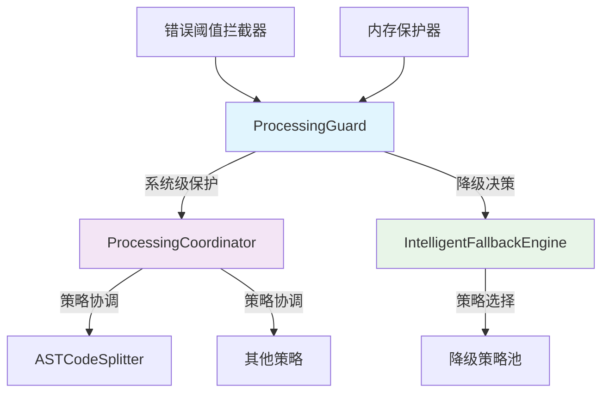
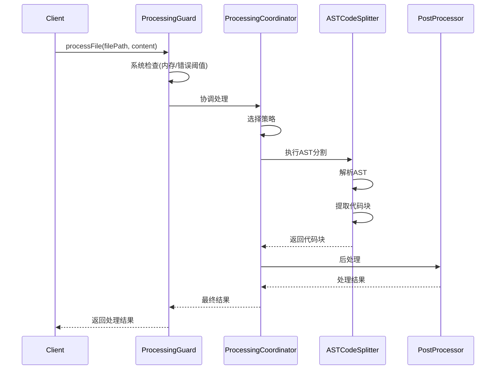
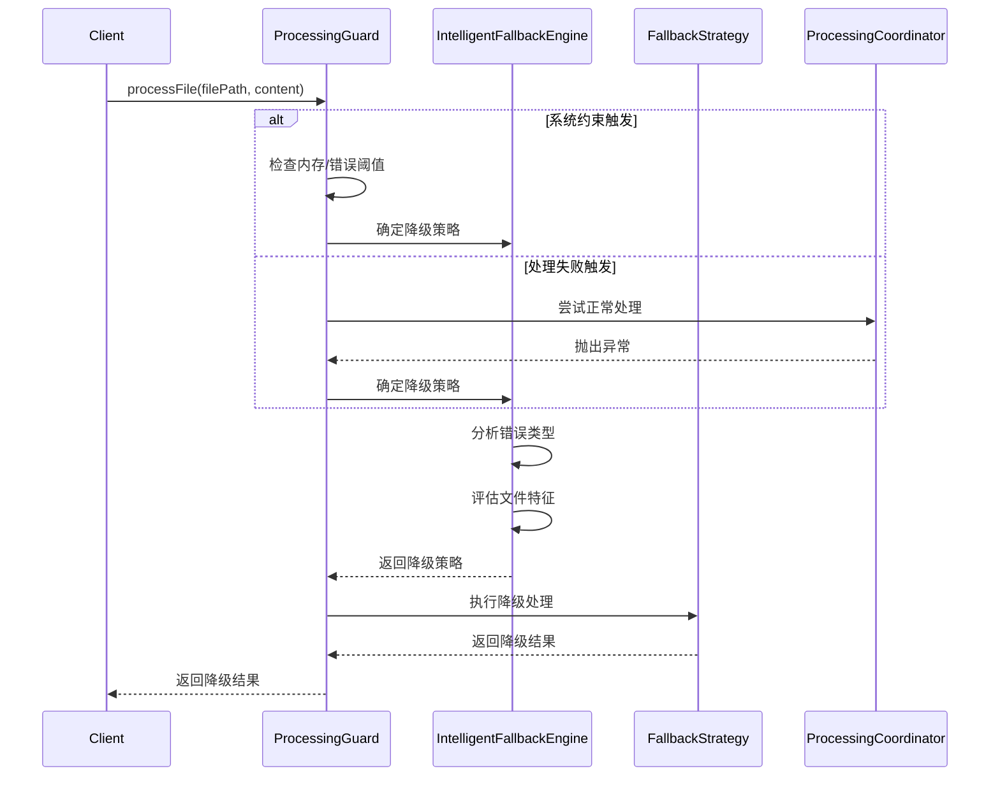
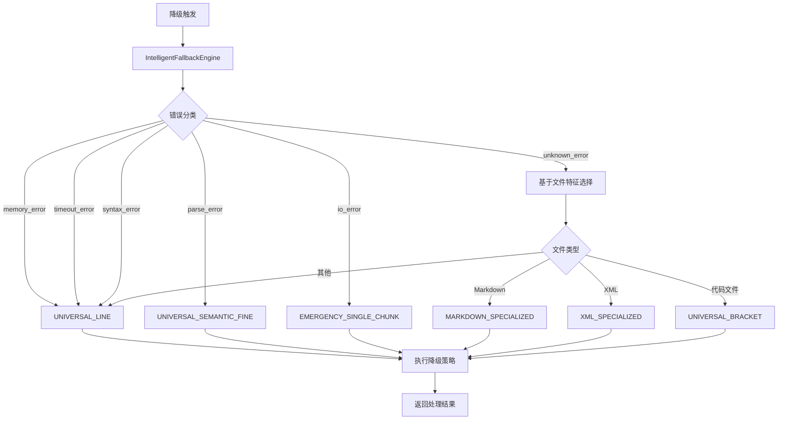

# Processing工作流、错误处理与降级机制文档

## 概述

本文档详细描述了代码处理模块的工作流程、错误处理机制和降级策略。经过架构优化后，系统现在具有更清晰的职责分工和更可靠的降级处理能力。

## 架构概览

### 核心组件



### 职责分工

| 组件 | 主要职责 | 降级处理 |
|------|----------|----------|
| **ProcessingGuard** | 系统级保护、统一降级入口 | ✅ 主要降级决策者 |
| **ProcessingCoordinator** | 策略选择与执行协调 | ❌ 不处理降级 |
| **ASTCodeSplitter** | AST解析与代码分割 | ❌ 专注核心功能 |
| **IntelligentFallbackEngine** | 智能降级策略选择 | ✅ 提供决策支持 |

## 工作流程

### 1. 正常处理流程



### 2. 降级处理流程



## 错误处理机制

### 1. 错误分类系统

IntelligentFallbackEngine将错误分为以下类型：

| 错误类型 | 触发条件 | 推荐降级策略 |
|----------|----------|--------------|
| **memory_error** | 内存不足、堆分配失败 | UNIVERSAL_LINE |
| **parse_error** | AST解析失败、tree-sitter错误 | UNIVERSAL_SEMANTIC_FINE |
| **timeout_error** | 处理超时 | UNIVERSAL_LINE |
| **syntax_error** | 语法错误 | UNIVERSAL_LINE |
| **io_error** | 文件访问错误 | EMERGENCY_SINGLE_CHUNK |
| **unknown_error** | 其他未分类错误 | 基于文件特征选择 |

### 2. 错误阈值管理

ErrorThresholdInterceptor提供以下功能：

- **错误计数**：跟踪指定时间窗口内的错误数量
- **阈值检查**：当错误数超过阈值时触发降级
- **自动重置**：定期重置错误计数
- **历史记录**：保留最近的错误历史用于分析

### 3. 内存保护机制

MemoryGuard提供以下保护：

- **实时监控**：持续监控内存使用情况
- **预警机制**：内存使用达到警告级别时触发清理
- **紧急降级**：内存不足时强制使用最节省内存的策略
- **垃圾回收**：必要时触发垃圾回收

## 降级策略详解

### 1. 策略选择算法

IntelligentFallbackEngine使用多因素决策算法：

```typescript
function determineFallbackStrategy(error, detection, systemState) {
  // 1. 错误类型优先
  const errorBasedStrategy = getStrategyByErrorType(error.type);
  
  // 2. 文件特征调整
  const fileBasedAdjustment = adjustByFileFeatures(detection);
  
  // 3. 系统状态考虑
  const systemBasedAdjustment = adjustBySystemState(systemState);
  
  // 4. 综合决策
  return combineStrategies(errorBasedStrategy, fileBasedAdjustment, systemBasedAdjustment);
}
```

### 2. 可用降级策略

| 策略名称 | 适用场景 | 优势 | 劣势 |
|----------|----------|------|------|
| **UNIVERSAL_LINE** | 高复杂度、内存受限 | 速度快、内存占用低 | 可能破坏语义结构 |
| **UNIVERSAL_SEMANTIC_FINE** | AST解析失败 | 保持语义完整性 | 处理速度较慢 |
| **UNIVERSAL_BRACKET** | 结构化代码 | 保持代码结构 | 对非结构化代码效果差 |
| **MARKDOWN_SPECIALIZED** | Markdown文件 | 专门优化 | 仅适用于Markdown |
| **XML_SPECIALIZED** | XML/HTML文件 | 保持标签结构 | 仅适用于XML类语言 |
| **EMERGENCY_SINGLE_CHUNK** | IO错误、系统严重受限 | 确保处理完成 | 结果质量最低 |

### 3. 降级策略执行流程



## 配置管理

### 1. ProcessingGuard配置

```typescript
interface ProcessingGuardConfig {
  errorThreshold: {
    maxErrors: number;           // 最大错误数
    timeWindowMs: number;        // 时间窗口
    resetInterval: number;       // 重置间隔
  };
  memoryGuard: {
    warningThreshold: number;    // 警告阈值
    criticalThreshold: number;   // 严重阈值
    emergencyThreshold: number;  // 紧急阈值
  };
  fallback: {
    enableIntelligent: boolean;  // 启用智能降级
    maxRetries: number;          // 最大重试次数
    timeoutMs: number;           // 降级超时
  };
}
```

### 2. IntelligentFallbackEngine配置

```typescript
interface FallbackEngineConfig {
  strategies: {
    priority: Record<string, number>;  // 策略优先级
    timeouts: Record<string, number>;   // 策略超时
    conditions: Record<string, Function>; // 策略条件
  };
  learning: {
    enableHistory: boolean;      // 启用历史记录
    maxHistorySize: number;      // 最大历史记录数
    enableAdaptation: boolean;   // 启用自适应调整
  };
}
```

## 监控与日志

### 1. 关键指标

系统监控以下关键指标：

- **降级频率**：降级触发的频率
- **策略分布**：各降级策略的使用比例
- **成功率**：降级处理的成功率
- **性能影响**：降级对处理性能的影响
- **错误模式**：常见错误类型分析

### 2. 日志记录

```typescript
// 降级触发日志
logger.info(`Fallback triggered for ${filePath}: ${reason}`, {
  errorType: error.type,
  selectedStrategy: strategy.name,
  systemState: memoryStatus,
  processingTime: duration
});

// 策略执行日志
logger.debug(`Executing fallback strategy ${strategy.name}`, {
  strategyParams: strategy.parameters,
  expectedOutcome: strategy.expectedResult,
  timeout: strategy.timeout
});
```

## 最佳实践

### 1. 错误处理最佳实践

1. **快速失败**：策略内部不应尝试降级，应快速失败
2. **详细日志**：记录足够的上下文信息用于问题诊断
3. **异常传播**：让异常向上传播到统一的降级处理器
4. **资源清理**：确保异常时正确清理资源

### 2. 降级策略设计原则

1. **渐进降级**：从最接近原始策略的方案开始降级
2. **保持功能**：确保降级后仍能提供基本功能
3. **性能考虑**：优先选择性能更好的降级方案
4. **用户体验**：尽量保持结果的质量和可用性

### 3. 系统优化建议

1. **缓存优化**：缓存降级决策结果
2. **预热机制**：系统启动时预加载常用降级策略
3. **自适应调整**：根据历史数据优化降级策略选择
4. **监控告警**：设置降级频率和成功率的告警阈值

## 故障排除

### 1. 常见问题

| 问题 | 可能原因 | 解决方案 |
|------|----------|----------|
| **频繁降级** | 系统资源不足、策略配置不当 | 增加内存、调整策略参数 |
| **降级失败** | 所有降级策略都不可用 | 检查策略配置、添加紧急降级 |
| **性能下降** | 降级策略选择不当 | 优化策略选择算法 |
| **结果质量差** | 降级策略过于保守 | 调整降级策略优先级 |

### 2. 诊断工具

```typescript
// 系统状态检查
function diagnoseSystem() {
  return {
    memoryStatus: memoryGuard.getStatus(),
    errorStatus: errorThreshold.getStatus(),
    strategyHealth: checkStrategyHealth(),
    recentFailures: getRecentFailurePatterns()
  };
}

// 降级效果分析
function analyzeFallbackEffectiveness() {
  return {
    fallbackRate: calculateFallbackRate(),
    successRate: calculateSuccessRate(),
    performanceImpact: measurePerformanceImpact(),
    qualityDegradation: measureQualityDegradation()
  };
}
```

## 未来改进方向

### 1. 智能化增强

- **机器学习**：使用ML模型优化降级策略选择
- **预测分析**：预测可能的失败并提前降级
- **自适应优化**：根据使用模式自动调整参数

### 2. 性能优化

- **并行处理**：并行尝试多个降级策略
- **增量降级**：基于部分结果进行增量降级
- **缓存策略**：更智能的降级结果缓存

### 3. 监控增强

- **实时仪表板**：提供实时的降级状态监控
- **自动告警**：基于模式识别的智能告警
- **性能分析**：详细的性能影响分析报告

## 总结

经过架构优化，代码处理模块现在具有：

1. **清晰的职责分工**：每个组件专注于自己的核心功能
2. **统一的降级处理**：ProcessingGuard作为唯一的降级决策入口
3. **智能的策略选择**：基于多因素分析的智能降级决策
4. **完善的错误处理**：从错误分类到恢复的完整处理链
5. **可靠的系统保护**：多层保护机制确保系统稳定性

这种设计不仅提高了系统的可维护性和扩展性，还显著增强了系统的可靠性和用户体验。