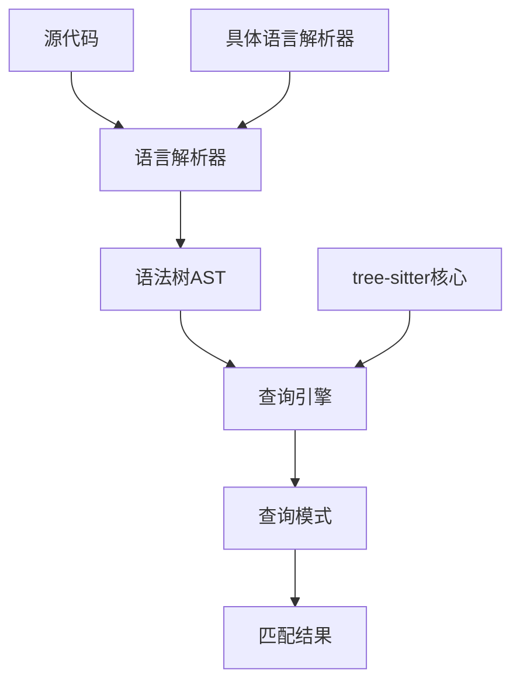
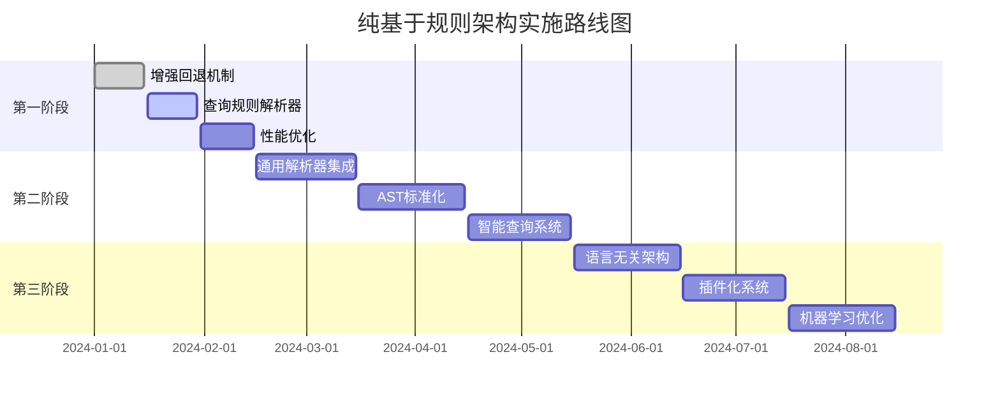

# 纯基于规则的Tree-sitter架构分析

## 1. 问题分析

用户询问是否可以完全移除语言专门的tree-sitter解析器，纯粹使用现有的查询规则。经过深入分析，答案是：**部分可行，但存在重大限制**。

## 2. 当前架构分析

### 2.1 Tree-sitter工作原理

Tree-sitter的核心工作流程：
1. **语言解析器**：将源代码解析为语法树（AST）
2. **查询引擎**：使用查询模式在AST上查找匹配的节点
3. **查询模式**：S-expression语法的模式匹配规则

### 2.2 当前依赖关系



## 3. 纯基于规则的可行性分析

### 3.1 ✅ 可行的部分

#### 3.1.1 查询规则系统
- **查询模式独立**：查询规则文件（如javascript.ts、python.ts）是独立的文本文件
- **模式匹配**：可以使用正则表达式或简单的字符串匹配来解析这些模式
- **类型提取**：可以从查询模式中提取目标节点类型（如function_declaration、class_declaration）

#### 3.1.2 TreeSitterQueryEngine的模拟实现
当前系统已经有一个模拟的查询引擎实现：

```typescript
private executeQueryPattern(ast: Parser.SyntaxNode, pattern: QueryPattern): QueryMatch[] {
  // 简化的模式匹配逻辑
  const targetTypes = this.extractTargetTypesFromPattern(pattern.pattern);
  
  // 遍历AST查找匹配的节点
  this.traverseAST(ast, (node) => {
    if (targetTypes.has(node.type)) {
      const captures = this.extractCaptures(node, pattern);
      matches.push({ node, captures, location });
    }
  });
  
  return matches;
}
```

#### 3.1.3 回退机制
系统已经实现了完整的回退机制，当查询失败时使用硬编码的节点遍历：

```typescript
private legacyExtractFunctions(ast: Parser.SyntaxNode): Parser.SyntaxNode[] {
  const functionTypes = new Set([
    'function_declaration',
    'function_definition',
    'method_definition',
    // ...
  ]);
  
  const traverse = (node: Parser.SyntaxNode, depth: number = 0) => {
    if (functionTypes.has(node.type)) {
      functions.push(node);
    }
    // 递归遍历子节点
  };
  
  traverse(ast);
  return functions;
}
```

### 3.2 ❌ 不可行的部分

#### 3.2.1 AST生成的根本问题
**核心问题**：Tree-sitter的查询引擎需要语言解析器来生成AST。没有语言解析器，就无法：
- 将源代码解析为语法树
- 提供节点类型信息（如function_declaration、class_declaration等）
- 维护语法结构的层次关系

#### 3.2.2 查询执行的依赖
```typescript
// 当前实现需要语言解析器
const query = new Parser.Query(parser.getLanguage(), pattern);
const matches = query.matches(ast);
```

没有`parser.getLanguage()`，就无法创建Query对象。

#### 3.2.3 语法准确性的损失
- **节点类型映射**：每种语言的节点类型都不同，需要精确映射
- **语法结构**：复杂的语法结构（如装饰器、泛型等）难以用简单规则处理
- **错误恢复**：语言解析器提供错误恢复机制，纯规则系统难以实现

## 4. 替代方案分析

### 4.1 方案一：增强回退机制（推荐）

**实现思路**：
- 完全移除语言解析器依赖
- 增强现有的硬编码提取逻辑
- 使用查询规则作为类型定义的参考

**优势**：
- 完全移除运行时依赖
- 减少包体积和内存使用
- 简化部署和维护

**劣势**：
- 语法准确性可能下降
- 需要手动维护节点类型映射
- 复杂语法结构支持有限

### 4.2 方案二：通用解析器（实验性）

**实现思路**：
- 使用通用的解析器（如Acorn、Babel等）
- 将AST转换为tree-sitter兼容格式
- 保持查询规则系统

**优势**：
- 可以处理复杂语法
- 保持查询规则的优势
- 更好的错误处理

**劣势**：
- 引入新的依赖
- 转换开销
- 兼容性问题

### 4.3 方案三：混合模式（当前实现）

**实现思路**：
- 保留动态导入机制
- 在开发环境使用完整解析器
- 在生产环境使用回退机制

**优势**：
- 灵活的部署选项
- 开发时功能完整
- 生产时资源优化

**劣势**：
- 复杂性增加
- 需要两套实现
- 测试成本高

## 5. 技术实现建议

### 5.1 立即可行的优化

基于当前分析，建议采用以下渐进式优化策略：

#### 5.1.1 第一阶段：增强回退机制
```typescript
class EnhancedRuleBasedExtractor {
  private typeMappings: Map<string, Set<string>> = new Map();
  
  constructor() {
    this.initializeTypeMappings();
  }
  
  private initializeTypeMappings(): void {
    // 从查询规则中提取类型映射
    this.typeMappings.set('functions', new Set([
      'function_declaration', 'function_definition', 'method_definition'
    ]));
    this.typeMappings.set('classes', new Set([
      'class_declaration', 'class_definition', 'interface_declaration'
    ]));
  }
  
  extractFunctions(ast: Parser.SyntaxNode): Parser.SyntaxNode[] {
    const functionTypes = this.typeMappings.get('functions') || new Set();
    return this.extractByTypes(ast, functionTypes);
  }
  
  private extractByTypes(ast: Parser.SyntaxNode, types: Set<string>): Parser.SyntaxNode[] {
    // 使用遍历算法提取节点
  }
}
```

#### 5.1.2 第二阶段：查询规则解析器
```typescript
class QueryRuleParser {
  parseQueryFile(queryString: string): ParsedQuery {
    // 解析查询规则文件
    // 提取节点类型和捕获信息
    // 生成类型映射
  }
  
  generateTypeMappings(queries: Map<string, string>): Map<string, Set<string>> {
    // 从所有查询规则中生成类型映射
  }
}
```

### 5.2 长期解决方案

#### 5.2.1 语言无关的AST表示
```typescript
interface UniversalASTNode {
  type: string;
  children: UniversalASTNode[];
  text: string;
  position: Position;
  properties: Record<string, any>;
}

class UniversalParser {
  parse(code: string, language: string): UniversalASTNode {
    // 使用多种解析策略
    // 1. 尝试tree-sitter（如果可用）
    // 2. 使用通用解析器
    // 3. 使用正则表达式回退
  }
}
```

#### 5.2.2 智能查询系统
```typescript
class IntelligentQueryEngine {
  executeQuery(ast: UniversalASTNode, pattern: string): QueryMatch[] {
    // 1. 分析查询模式
    // 2. 选择最佳执行策略
    // 3. 优化查询性能
  }
}
```

## 6. 风险评估

### 6.1 技术风险
- **语法准确性**：纯规则系统可能无法处理复杂语法
- **维护成本**：需要手动维护类型映射
- **性能影响**：遍历算法可能比原生查询慢

### 6.2 兼容性风险
- **语言支持**：新语言需要手动添加支持
- **语法更新**：语言语法变化需要更新规则
- **测试覆盖**：需要大量测试确保准确性

### 6.3 缓解措施
- **渐进式迁移**：逐步替换，保持向后兼容
- **全面测试**：建立完整的测试体系
- **监控机制**：监控准确性和性能指标

## 7. 结论与建议

### 7.1 短期建议（1-2个月）
1. **增强回退机制**：完善现有的硬编码提取逻辑
2. **查询规则解析**：从查询规则中自动生成类型映射
3. **性能优化**：优化遍历算法和缓存策略

### 7.2 中期建议（3-6个月）
1. **通用解析器集成**：集成Acorn等通用解析器
2. **AST标准化**：建立统一的AST表示
3. **智能查询**：实现自适应查询执行

### 7.3 长期建议（6个月以上）
1. **语言无关架构**：完全解耦语言依赖
2. **插件化系统**：支持自定义语言插件
3. **机器学习优化**：使用ML优化查询准确性

## 8. 实施路线图



## 9. 总结

**完全移除语言专门的tree-sitter在技术上是可行的，但需要权衡利弊**：

1. **可行性**：通过增强回退机制和查询规则解析，可以实现纯基于规则的系统
2. **限制**：会损失一些语法准确性和复杂语法支持
3. **建议**：采用渐进式迁移策略，先增强回退机制，再逐步实现更高级的解决方案

当前系统已经具备了良好的基础，通过适当的优化和扩展，可以实现一个高效、轻量的纯规则基础解析系统。