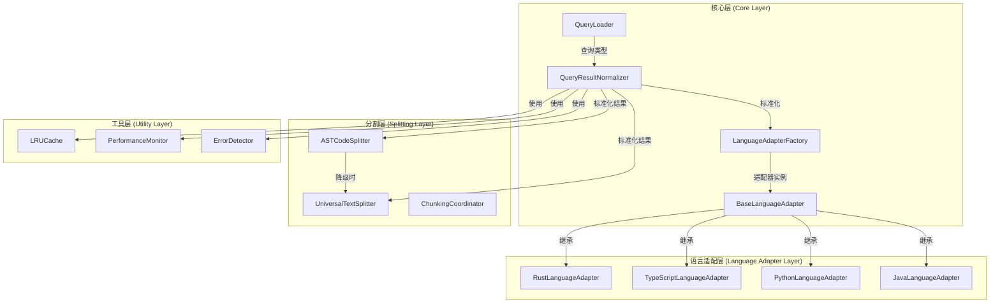
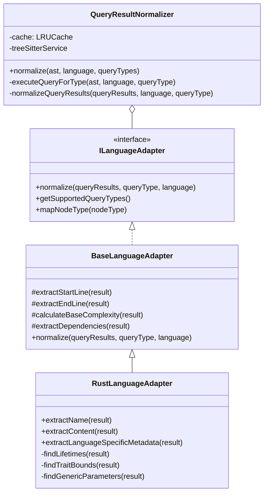

# Rust查询优化实现细节

## 架构设计

### 1. 模块职责清晰划分



### 2. 类关系设计



## 具体实现代码

### 1. 基础适配器实现

```typescript
// src/service/parser/core/normalization/BaseLanguageAdapter.ts
export abstract class BaseLanguageAdapter implements ILanguageAdapter {
  protected logger: LoggerService;

  constructor() {
    this.logger = new LoggerService();
  }

  /**
   * 通用标准化方法
   */
  normalize(queryResults: any[], queryType: string, language: string): StandardizedQueryResult[] {
    const results: StandardizedQueryResult[] = [];
    
    for (const result of queryResults) {
      try {
        const standardizedResult = this.createStandardizedResult(result, queryType, language);
        results.push(standardizedResult);
      } catch (error) {
        this.logger.warn(`Failed to normalize result for ${queryType}:`, error);
      }
    }
    
    return this.postProcessResults(results, queryType, language);
  }

  /**
   * 创建标准化结果
   */
  protected createStandardizedResult(result: any, queryType: string, language: string): StandardizedQueryResult {
    return {
      type: this.mapQueryTypeToStandardType(queryType),
      name: this.extractName(result),
      startLine: this.extractStartLine(result),
      endLine: this.extractEndLine(result),
      content: this.extractContent(result),
      metadata: this.createMetadata(result, language)
    };
  }

  /**
   * 创建元数据
   */
  protected createMetadata(result: any, language: string): QueryResultMetadata {
    const baseMetadata = {
      language,
      complexity: this.calculateComplexity(result),
      dependencies: this.extractDependencies(result),
      modifiers: this.extractModifiers(result)
    };

    const languageSpecificMetadata = this.extractLanguageSpecificMetadata(result);
    
    return {
      ...baseMetadata,
      ...languageSpecificMetadata
    };
  }

  /**
   * 后处理结果（去重、排序等）
   */
  protected postProcessResults(results: StandardizedQueryResult[], queryType: string, language: string): StandardizedQueryResult[] {
    // 1. 去重
    const deduplicated = this.deduplicateResults(results);
    
    // 2. 按行号排序
    return deduplicated.sort((a, b) => a.startLine - b.startLine);
  }

  /**
   * 智能去重
   */
  protected deduplicateResults(results: StandardizedQueryResult[]): StandardizedQueryResult[] {
    const seen = new Map<string, StandardizedQueryResult>();
    
    for (const result of results) {
      const key = this.generateUniqueKey(result);
      
      if (!seen.has(key)) {
        seen.set(key, result);
      } else {
        this.mergeMetadata(seen.get(key)!, result);
      }
    }
    
    return Array.from(seen.values());
  }

  /**
   * 生成唯一键
   */
  protected generateUniqueKey(result: StandardizedQueryResult): string {
    return `${result.type}:${result.name}:${result.startLine}:${result.endLine}`;
  }

  /**
   * 合并元数据
   */
  protected mergeMetadata(existing: StandardizedQueryResult, newResult: StandardizedQueryResult): void {
    // 合并依赖项
    const mergedDependencies = [
      ...new Set([...existing.metadata.dependencies, ...newResult.metadata.dependencies])
    ];
    
    // 合并修饰符
    const mergedModifiers = [
      ...new Set([...existing.metadata.modifiers, ...newResult.metadata.modifiers])
    ];
    
    existing.metadata.dependencies = mergedDependencies;
    existing.metadata.modifiers = mergedModifiers;
    
    // 合并语言特定元数据
    Object.assign(existing.metadata, newResult.metadata);
  }

  // 通用工具方法
  protected extractStartLine(result: any): number {
    const mainNode = result.captures?.[0]?.node;
    return (mainNode?.startPosition?.row || 0) + 1;
  }

  protected extractEndLine(result: any): number {
    const mainNode = result.captures?.[0]?.node;
    return (mainNode?.endPosition?.row || 0) + 1;
  }

  protected calculateBaseComplexity(result: any): number {
    let complexity = 1;
    const mainNode = result.captures?.[0]?.node;
    
    if (mainNode) {
      // 基于代码行数
      const lineCount = this.extractEndLine(result) - this.extractStartLine(result) + 1;
      complexity += Math.floor(lineCount / 10);
    }
    
    return complexity;
  }

  // 抽象方法，由子类实现
  abstract extractName(result: any): string;
  abstract extractContent(result: any): string;
  abstract extractLanguageSpecificMetadata(result: any): Record<string, any>;
  abstract getSupportedQueryTypes(): string[];
  abstract mapNodeType(nodeType: string): string;
}
```

### 2. Rust特定适配器实现

```typescript
// src/service/parser/core/normalization/adapters/RustLanguageAdapter.ts
export class RustLanguageAdapter extends BaseLanguageAdapter {
  
  extractName(result: any): string {
    // Rust特定的名称提取逻辑
    const nameCaptures = [
      'name.definition.function',
      'name.definition.struct',
      'name.definition.enum',
      'name.definition.trait',
      'name.definition.constant',
      'name.definition.static',
      'name.definition.variable',
      'name.definition.module',
      'name.definition.type_alias',
      'name.definition.macro',
      'name.definition.extern_crate',
      'name',
      'identifier',
      'type_identifier'
    ];

    for (const captureName of nameCaptures) {
      const capture = result.captures?.find((c: any) => c.name === captureName);
      if (capture?.node) {
        // 具体的名称提取逻辑
        if (capture.node.childForFieldName) {
          const nameNode = capture.node.childForFieldName('name');
          if (nameNode?.text) return nameNode.text;
          
          const identifier = capture.node.childForFieldName('identifier') ||
                            capture.node.childForFieldName('type_identifier') ||
                            capture.node.childForFieldName('field_identifier');
          if (identifier?.text) return identifier.text;
        }
        
        if (capture.node.text) return capture.node.text;
      }
    }

    return 'unnamed';
  }

  extractContent(result: any): string {
    const mainNode = result.captures?.[0]?.node;
    return mainNode?.text || '';
  }

  extractLanguageSpecificMetadata(result: any): Record<string, any> {
    const mainNode = result.captures?.[0]?.node;
    const metadata: Record<string, any> = {};
    
    if (mainNode) {
      // Rust特定元数据提取
      const lifetimes = this.findLifetimes(mainNode);
      if (lifetimes.length > 0) {
        metadata.lifetimes = lifetimes;
        metadata.hasLifetimes = true;
      }
      
      const traitBounds = this.findTraitBounds(mainNode);
      if (traitBounds.length > 0) {
        metadata.traitBounds = traitBounds;
        metadata.hasTraitBounds = true;
      }
      
      const generics = this.findGenericParameters(mainNode);
      if (generics.length > 0) {
        metadata.genericParameters = generics;
        metadata.hasGenerics = true;
      }
      
      // 其他Rust特定元数据
      const returnType = this.findReturnType(mainNode);
      if (returnType) metadata.returnType = returnType;
      
      const visibility = this.findVisibility(mainNode);
      if (visibility) metadata.visibility = visibility;
    }
    
    return metadata;
  }

  getSupportedQueryTypes(): string[] {
    return [
      'functions',
      'classes',        // 对应Rust的struct、enum、union
      'interfaces',     // 对应Rust的trait
      'methods',        // 对应impl块中的函数
      'imports',        // 对应use声明和extern crate
      'variables',      // 对应变量声明、常量、静态变量
      'control-flow',   // 对应match、if、loop等控制流
      'types',          // 对应类型别名、类型参数
      'expressions',    // 对应各种表达式
      'macros',         // 对应宏定义和宏调用
      'modules'         // 对应模块定义
    ];
  }

  mapNodeType(nodeType: string): string {
    const typeMapping: Record<string, string> = {
      'function_item': 'function',
      'struct_item': 'class',
      'enum_item': 'class',
      'trait_item': 'interface',
      'use_declaration': 'import',
      'const_item': 'variable',
      'static_item': 'variable',
      'let_declaration': 'variable',
      'type_item': 'type',
      'macro_definition': 'function',
      'mod_item': 'import',
      // ... 其他映射
    };
    
    return typeMapping[nodeType] || nodeType;
  }

  // Rust特定的辅助方法
  private findLifetimes(node: any): string[] {
    const lifetimes: string[] = [];
    this.traverseNode(node, (child) => {
      if (child.type === 'lifetime') {
        lifetimes.push(child.text);
      }
    });
    return lifetimes;
  }

  private findTraitBounds(node: any): string[] {
    const bounds: string[] = [];
    this.traverseNode(node, (child) => {
      if (child.type === 'trait_bound' || child.type === 'type_bound') {
        bounds.push(child.text);
      }
    });
    return bounds;
  }

  private findGenericParameters(node: any): string[] {
    const generics: string[] = [];
    this.traverseNode(node, (child) => {
      if (child.type === 'type_parameters' || child.type === 'type_arguments') {
        generics.push(child.text);
      }
    });
    return generics;
  }

  private traverseNode(node: any, callback: (child: any) => void): void {
    if (!node || !node.children) return;
    
    for (const child of node.children) {
      callback(child);
      this.traverseNode(child, callback);
    }
  }
}
```

### 3. 查询加载器增强

```typescript
// src/service/parser/core/query/QueryLoader.ts
export class QueryLoader {
  // 语言特定映射配置
  private static languageSpecificMappings: Record<string, Record<string, string[]>> = {
    'rust': {
      'functions-structs': ['functions', 'classes'],
      'modules-imports': ['imports', 'modules'],
      'variables-expressions': ['variables', 'expressions'],
      'types-macros': ['types', 'macros'],
      'control-flow': ['control-flow']
    },
    // 其他语言的映射配置
  };

  /**
   * 获取语言支持的查询类型（增强版）
   */
  static async getQueryTypesForLanguage(language: string): Promise<string[]> {
    const mapping = this.languageSpecificMappings[language.toLowerCase()];
    
    if (mapping) {
      const discoveredTypes = await this.discoverQueryTypes(language);
      const mappedTypes: string[] = [];
      
      for (const discoveredType of discoveredTypes) {
        const mapped = mapping[discoveredType];
        if (mapped) {
          mappedTypes.push(...mapped);
        } else {
          mappedTypes.push(discoveredType);
        }
      }
      
      return [...new Set(mappedTypes)]; // 去重
    }
    
    // 回退到默认逻辑
    return this.discoverQueryTypes(language);
  }

  /**
   * 检查查询类型是否存在（增强版）
   */
  static async queryTypeExists(language: string, queryType: string): Promise<boolean> {
    const mapping = this.languageSpecificMappings[language.toLowerCase()];
    
    if (mapping) {
      // 检查映射配置
      for (const [fileType, mappedTypes] of Object.entries(mapping)) {
        if (mappedTypes.includes(queryType)) {
          return true;
        }
      }
    }
    
    // 回退到默认逻辑
    return super.queryTypeExists(language, queryType);
  }
}
```

## 集成方案

### 1. UniversalTextSplitter与标准化集成

```typescript
// src/service/parser/universal/UniversalTextSplitter.ts
export class UniversalTextSplitter {
  private queryNormalizer?: QueryResultNormalizer;
  private treeSitterService?: TreeSitterService;

  /**
   * 设置查询标准化器
   */
  setQueryNormalizer(normalizer: QueryResultNormalizer): void {
    this.queryNormalizer = normalizer;
  }

  /**
   * 设置Tree-sitter服务
   */
  setTreeSitterService(service: TreeSitterService): void {
    this.treeSitterService = service;
  }

  /**
   * 基于语义边界的分段（增强版）
   */
  async chunkBySemanticBoundaries(content: string, filePath?: string, language?: string): Promise<CodeChunk[]> {
    // 尝试使用标准化结果（如果可用）
    if (this.queryNormalizer && this.treeSitterService && language) {
      try {
        const parseResult = await this.treeSitterService.parseCode(content, language);
        if (parseResult.success && parseResult.ast) {
          const standardizedResults = await this.queryNormalizer.normalize(parseResult.ast, language);
          if (standardizedResults.length > 0) {
            return this.chunkByStandardizedResults(standardizedResults, content, language, filePath);
          }
        }
      } catch (error) {
        this.logger?.debug('Standardization failed, falling back to text-based chunking');
      }
    }
    
    // 回退到原有的文本分段逻辑
    return this.chunkByTextAnalysis(content, filePath, language);
  }

  /**
   * 基于标准化结果的分段
   */
  private chunkByStandardizedResults(
    standardizedResults: StandardizedQueryResult[],
    content: string,
    language: string,
    filePath?: string
  ): CodeChunk[] {
    const chunks: CodeChunk[] = [];
    const lines = content.split('\n');
    
    for (const result of standardizedResults) {
      const chunkContent = lines.slice(result.startLine - 1, result.endLine).join('\n');
      
      chunks.push({
        content: chunkContent,
        metadata: {
          startLine: result.startLine,
          endLine: result.endLine,
          language: language || 'unknown',
          filePath,
          type: result.type,
          complexity: result.metadata.complexity,
          functionName: result.type === 'function' ? result.name : undefined,
          className: result.type === 'class' ? result.name : undefined
        }
      });
    }
    
    return this.postProcessChunks(chunks, content);
  }
}
```

## 测试策略

### 1. 单元测试

```typescript
// 测试基础适配器
describe('BaseLanguageAdapter', () => {
  let adapter: BaseLanguageAdapter;

  beforeEach(() => {
    adapter = new (class extends BaseLanguageAdapter {
      extractName = jest.fn().mockReturnValue('test');
      extractContent = jest.fn().mockReturnValue('content');
      extractLanguageSpecificMetadata = jest.fn().mockReturnValue({});
      getSupportedQueryTypes = jest.fn().mockReturnValue(['functions']);
      mapNodeType = jest.fn().mockReturnValue('function');
    })();
  });

  it('should deduplicate results', () => {
    const mockResults = [
      { type: 'function', name: 'test', startLine: 1, endLine: 10 },
      { type: 'function', name: 'test', startLine: 1, endLine: 10 }
    ];
    
    const deduplicated = (adapter as any).deduplicateResults(mockResults);
    expect(deduplicated).toHaveLength(1);
  });
});

// 测试Rust适配器
describe('RustLanguageAdapter', () => {
  let adapter: RustLanguageAdapter;

  beforeEach(() => {
    adapter = new RustLanguageAdapter();
  });

  it('should extract Rust-specific metadata', () => {
    const mockResult = {
      captures: [{ node: { text: 'fn test<T: Clone>() where T: Debug {}' } }]
    };
    
    const metadata = (adapter as any).extractLanguageSpecificMetadata(mockResult);
    expect(metadata.hasGenerics).toBe(true);
    expect(metadata.hasTraitBounds).toBe(true);
  });
});
```

### 2. 集成测试

```typescript
// 测试完整查询流程
describe('Rust Query Integration', () => {
  let normalizer: QueryResultNormalizer;
  let treeSitterService: TreeSitterService;

  beforeEach(async () => {
    treeSitterService = new TreeSitterService();
    normalizer = new QueryResultNormalizer();
    normalizer.setTreeSitterService(treeSitterService);
    
    // 加载Rust查询
    await QueryLoader.loadLanguageQueries('rust');
  });

  it('should normalize Rust code with proper type mapping', async () => {
    const rustCode = `
      struct MyStruct { field: i32 }
      impl MyStruct {
          fn new() -> Self { Self { field: 0 } }
      }
    `;
    
    const ast = await treeSitterService.parseCode(rustCode, 'rust');
    const results = await normalizer.normalize(ast.ast!, 'rust');
    
    // 验证结构体和方法的正确映射
    const structResult = results.find(r => r.type === 'class');
    const methodResult = results.find(r => r.type === 'method');
    
    expect(structResult).toBeDefined();
    expect(methodResult).toBeDefined();
    expect(structResult?.name).toBe('MyStruct');
    expect(methodResult?.name).toBe('new');
  });
});
```

## 性能优化策略

### 1. 缓存优化

```typescript
class CachedQueryNormalizer extends QueryResultNormalizer {
  private astCache = new LRUCache<string, any>(100);
  private resultCache = new LRUCache<string, StandardizedQueryResult[]>(200);

  async normalize(ast: any, language: string, queryTypes?: string[]): Promise<StandardizedQueryResult[]> {
    const cacheKey = this.generateCacheKey(ast, language, queryTypes);
    
    // 检查结果缓存
    if (this.resultCache.has(cacheKey)) {
      return this.resultCache.get(cacheKey)!;
    }
    
    // 检查AST缓存（避免重复解析）
    const astKey = this.hashAST(ast);
    let processedAst = ast;
    if (this.astCache.has(astKey)) {
      processedAst = this.astCache.get(astKey)!;
    } else {
      this.astCache.set(astKey, ast);
    }
    
    const results = await super.normalize(processedAst, language, queryTypes);
    this.resultCache.set(cacheKey, results);
    
    return results;
  }
}
```

### 2. 并行处理

```typescript
class ParallelQueryNormalizer extends QueryResultNormalizer {
  private async parallelNormalize(
    ast: any, 
    language: string, 
    queryTypes?: string[]
  ): Promise<StandardizedQueryResult[]> {
    const typesToQuery = queryTypes || await this.getSupportedQueryTypes(language);
    
    // 并行处理每种查询类型
    const results = await Promise.all(
      typesToQuery.map(queryType => 
        this.normalizeQueryType(ast, language, queryType)
      )
    );
    
    return results.flat();
  }

  private async normalizeQueryType(ast: any, language: string, queryType: string): Promise<StandardizedQueryResult[]> {
    try {
      const queryResults = await this.executeQueryForType(ast, language, queryType);
      return this.normalizeQueryResults(queryResults, language, queryType);
    } catch (error) {
      this.logger.warn(`Failed to normalize query type ${queryType}:`, error);
      return [];
    }
  }
}
```

## 部署和监控

### 1. 性能监控

```typescript
interface NormalizationMetrics {
  totalProcessed: number;
  cacheHitRate: number;
  averageProcessingTime: number;
  errorRate: number;
  typeDistribution: Record<string, number>;
}

class NormalizationMonitor {
  private metrics: NormalizationMetrics = {
    totalProcessed: 0,
    cacheHitRate: 0,
    averageProcessingTime: 0,
    errorRate: 0,
    typeDistribution: {}
  };

  recordOperation(
    operation: 'normalize' | 'cache_hit' | 'error',
    duration?: number,
    queryType?: string
  ) {
    this.metrics.totalProcessed++;
    
    if (operation === 'cache_hit') {
      this.metrics.cacheHitRate = (this.metrics.cacheHitRate * (this.metrics.totalProcessed - 1) + 1) / this.metrics.totalProcessed;
    }
    
    if (duration !== undefined) {
      this.metrics.averageProcessingTime = 
        (this.metrics.averageProcessingTime * (this.metrics.totalProcessed - 1) + duration) / this.metrics.totalProcessed;
    }
    
    if (operation === 'error') {
      this.metrics.errorRate = (this.metrics.errorRate * (this.metrics.totalProcessed - 1) + 1) / this.metrics.totalProcessed;
    }
    
    if (queryType) {
      this.metrics.typeDistribution[queryType] = (this.metrics.typeDistribution[queryType] || 0) + 1;
    }
  }

  getMetrics(): NormalizationMetrics {
    return { ...this.metrics };
  }
}
```

### 2. 错误处理和改进

```typescript
class ErrorAwareQueryNormalizer extends QueryResultNormalizer {
  private errorTracker = new ErrorTracker();
  private fallbackStrategies = new Map<string, FallbackStrategy>();

  async normalize(ast: any, language: string, queryTypes?: string[]): Promise<StandardizedQueryResult[]> {
    try {
      const results = await super.normalize(ast, language, queryTypes);
      this.errorTracker.recordSuccess(language);
      return results;
    } catch (error) {
      this.errorTracker.recordError(language, error);
      
      // 尝试降级策略
      const fallbackStrategy = this.fallbackStrategies.get(language);
      if (fallbackStrategy) {
        return fallbackStrategy.execute(ast, language);
      }
      
      // 最终回退
      return this.finalFallback(ast, language);
    }
  }

  private finalFallback(ast: any, language: string): StandardizedQueryResult[] {
    // 最基本的标准化逻辑
    return [{
      type: 'unknown',
      name: 'unknown',
      startLine: 1,
      endLine: 1,
      content: ast.text || '',
      metadata: { language, complexity: 1, dependencies: [], modifiers: [] }
    }];
  }
}
```

这个实现方案提供了完整的架构设计、具体代码实现、测试策略和性能优化方案，确保Rust查询系统的稳定性、性能和可维护性。