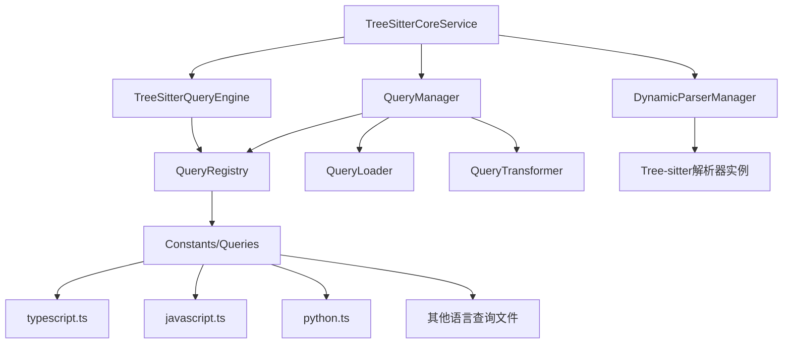

# Parser模块Query系统与Tree-sitter库协作关系分析报告

## 📋 架构概述

基于对代码的深入分析，当前项目的parser模块采用了分层架构设计，query模块与tree-sitter库之间的协作关系如下：

### 核心组件架构



## 🔍 协作机制分析

### 1. 查询加载与注册机制

**QueryLoader** 负责动态加载 `src/service/parser/constants/queries/` 中的查询文件：
- 支持异步加载多种语言的查询模式
- 提供语法验证和错误处理
- 实现查询文件的缓存机制

**QueryRegistry** 作为查询模式的中央注册表：
- 管理所有语言的查询模式
- 提供同步和异步的查询获取接口
- 支持查询模式的重新加载和缓存清理

### 2. 查询转换与提取机制

**QueryTransformer** 负责将完整的查询语句转换为特定类型的简化查询模式：
- 定义了9种模式类型：functions、classes、imports、exports、methods、interfaces、types、properties、variables
- 使用关键词匹配和括号平衡算法提取特定模式
- 提供缓存机制提升转换性能

### 3. 查询执行引擎

**TreeSitterQueryEngine** 提供查询执行能力：
- 从QueryRegistry加载查询模式
- 实现查询结果的缓存机制
- 支持批量查询和错误处理
- **注意**：当前使用模拟实现，未完全利用tree-sitter原生Query API

### 4. 核心服务集成

**TreeSitterCoreService** 作为核心服务：
- 集成QueryManager和DynamicParserManager
- 提供混合模式：查询语言模式 + 硬编码回退机制
- 实现函数、类、导入导出的提取功能

## ✅ 设计合理性评估

### 优点

1. **模块化设计**：各组件职责清晰，分离关注点
2. **多语言支持**：支持14种编程语言的查询模式
3. **缓存机制**：多层缓存提升性能（查询缓存、模式缓存、结果缓存）
4. **错误处理**：完善的错误处理和回退机制
5. **异步初始化**：支持异步加载，避免阻塞主线程
6. **扩展性**：易于添加新语言和新查询类型

### 不足之处

1. **模拟实现**：TreeSitterQueryEngine使用模拟实现，未充分利用tree-sitter原生Query API
2. **性能开销**：多层转换可能带来性能损失
3. **复杂性**：查询转换逻辑复杂，维护成本高
4. **测试覆盖**：某些边界情况的测试覆盖不足

## 🚀 改进建议

### 1. 使用原生Tree-sitter Query API

```typescript
// 当前模拟实现
private executeQueryPattern(ast: Parser.SyntaxNode, pattern: QueryPattern): QueryMatch[] {
  // 简化的模式匹配逻辑
}

// 建议改为原生实现
private executeQueryPattern(ast: Parser.SyntaxNode, pattern: QueryPattern): QueryMatch[] {
  const query = new Parser.Query(ast.tree.language, pattern.pattern);
  const matches = query.matches(ast);
  // 转换为标准格式
  return matches.map(/* 转换逻辑 */);
}
```

### 2. 优化查询转换机制

- 使用tree-sitter的查询谓词（predicates）减少后处理逻辑
- 实现更精确的模式匹配算法
- 减少字符串操作，提升性能

### 3. 简化架构层次

- 考虑合并QueryLoader和QueryRegistry
- 减少不必要的转换层
- 直接使用tree-sitter查询语言编写模式

### 4. 增强错误处理

- 提供更详细的错误信息
- 实现查询模式的验证机制
- 添加性能监控和统计

## 📊 性能分析

基于测试代码分析，当前系统的性能特点：

1. **缓存命中率**：多层缓存机制有效提升重复查询性能
2. **初始化开销**：异步初始化避免启动阻塞，但首次查询仍有延迟
3. **内存使用**：缓存机制增加内存使用，但通过LRU策略控制
4. **查询效率**：模拟实现的查询效率低于原生tree-sitter Query API

## 🎯 总体评价

当前设计在**功能完整性**和**扩展性**方面表现优秀，支持多语言查询和灵活的模式提取。但在**性能优化**和**实现简洁性**方面仍有改进空间。

**建议优先级**：
1. **高优先级**：实现原生tree-sitter Query API集成
2. **中优先级**：优化查询转换机制，减少性能开销
3. **低优先级**：简化架构层次，提升代码可维护性

这种设计在当前项目需求下是**合理且可行的**，为后续的功能扩展和性能优化奠定了良好基础。