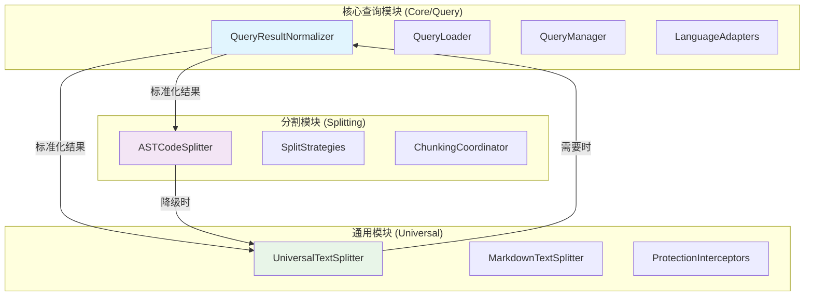

# Rust查询系统优化方案

## 概述

本文档详细描述了针对Rust语言查询系统的优化方案，旨在解决查询类型映射不匹配、去重机制缺失、模块功能重叠等问题，提升代码解析和分割的质量与性能。

## 当前问题分析

### 1. 查询类型映射不匹配

**问题描述**：
- QueryLoader期望的查询文件命名：`functions-structs.ts`, `modules-imports.ts`, `variables-expressions.ts`, `types-macros.ts`, `control-flow.ts`
- Rust适配器期望的查询类型：`functions`, `classes`, `methods`, `imports`, `variables`, `control-flow`, `types`, `expressions`, `macros`, `modules`

**影响**：查询加载失败或结果不正确，导致标准化过程无法正常工作。

### 2. 去重机制缺失

**问题描述**：
- Rust适配器缺少有效的去重机制
- 重复的查询结果被多次处理，影响分割质量和性能

**影响**：重复结构处理，性能下降，分割结果质量降低。

### 3. 模块功能重叠

**问题描述**：
- `splitting/ASTCodeSplitter`：有自己的查询逻辑（`treeSitterService.extractFunctions()`）
- `core/query`：负责查询执行和标准化
- `universal/UniversalTextSplitter`：缺少与标准化结果的集成

**影响**：功能重复，维护困难，集成不充分。

### 4. 通用与特定逻辑混合

**问题描述**：
- 行号处理、复杂度计算等通用逻辑与Rust特定逻辑混合
- 缺乏清晰的职责划分

**影响**：代码重复，扩展性差，维护困难。

## 优化方案

### 1. 查询类型映射增强

#### 实现方案

在QueryLoader中添加语言特定的映射配置：

```typescript
// 在QueryLoader中添加语言特定映射
private static languageSpecificMappings: Record<string, Record<string, string[]>> = {
  'rust': {
    'functions-structs': ['functions', 'classes'],
    'modules-imports': ['imports', 'modules'],
    'variables-expressions': ['variables', 'expressions'],
    'types-macros': ['types', 'macros'],
    'control-flow': ['control-flow']
  }
};

static async getQueryTypesForLanguage(language: string): Promise<string[]> {
  const mapping = this.languageSpecificMappings[language];
  if (mapping) {
    const discoveredTypes = await this.discoverQueryTypes(language);
    const mappedTypes: string[] = [];
    
    for (const discoveredType of discoveredTypes) {
      const mapped = mapping[discoveredType];
      if (mapped) {
        mappedTypes.push(...mapped);
      } else {
        mappedTypes.push(discoveredType);
      }
    }
    
    return [...new Set(mappedTypes)]; // 去重
  }
  
  return this.discoverQueryTypes(language);
}
```

### 2. 智能去重机制

#### 实现方案

在RustLanguageAdapter中集成去重逻辑：

```typescript
// 增强normalize方法
normalize(queryResults: any[], queryType: string, language: string): StandardizedQueryResult[] {
  // 1. 转换查询结果
  const convertedResults = this.convertQueryResults(queryResults, queryType, language);
  
  // 2. 智能去重
  const deduplicatedResults = this.deduplicateResults(convertedResults);
  
  // 3. 按行号排序
  return deduplicatedResults.sort((a, b) => a.startLine - b.startLine);
}

private deduplicateResults(results: StandardizedQueryResult[]): StandardizedQueryResult[] {
  const seen = new Map<string, StandardizedQueryResult>();
  
  for (const result of results) {
    // 创建唯一键：类型 + 名称 + 起始行
    const key = `${result.type}:${result.name}:${result.startLine}`;
    
    if (!seen.has(key)) {
      seen.set(key, result);
    } else {
      // 合并重复项的元数据
      const existing = seen.get(key)!;
      this.mergeMetadata(existing, result);
    }
  }
  
  return Array.from(seen.values());
}
```

### 3. 模块职责重构

#### 架构调整方案



#### 具体职责划分

1. **核心查询模块 (Core/Query)**：
   - 查询加载和执行
   - 查询结果标准化
   - 语言适配器管理

2. **分割模块 (Splitting)**：
   - 基于AST的智能分割
   - 分割策略管理
   - 块协调和优化

3. **通用模块 (Universal)**：
   - 通用文本分割（降级方案）
   - 保护机制和错误处理
   - 文件处理协调

### 4. 通用逻辑与语言特定逻辑分离

#### 架构设计

创建基础适配器和语言特定适配器：

```typescript
// 基础适配器类
abstract class BaseLanguageAdapter implements ILanguageAdapter {
  // 通用逻辑实现
  protected extractStartLine(result: any): number {
    const mainNode = result.captures?.[0]?.node;
    return (mainNode?.startPosition?.row || 0) + 1;
  }
  
  protected extractEndLine(result: any): number {
    const mainNode = result.captures?.[0]?.node;
    return (mainNode?.endPosition?.row || 0) + 1;
  }
  
  protected calculateBaseComplexity(result: any): number {
    // 基础复杂度计算逻辑
    return 1;
  }
  
  // 抽象方法，由子类实现
  abstract extractName(result: any): string;
  abstract extractContent(result: any): string;
  abstract extractLanguageSpecificMetadata(result: any): any;
}

// Rust特定适配器
class RustLanguageAdapter extends BaseLanguageAdapter {
  extractName(result: any): string {
    // Rust特定的名称提取逻辑
  }
  
  extractContent(result: any): string {
    // Rust特定的内容提取逻辑
  }
  
  extractLanguageSpecificMetadata(result: any): any {
    // Rust特定的元数据提取
    return {
      lifetimes: this.findLifetimes(result),
      traitBounds: this.findTraitBounds(result),
      generics: this.findGenericParameters(result)
    };
  }
}
```

## 实施计划

### 阶段1：核心功能实现（2-3天）

**任务清单**：
- [ ] 实现查询类型映射增强
- [ ] 在RustLanguageAdapter中集成去重机制
- [ ] 创建基础适配器类
- [ ] 编写单元测试

**验收标准**：
- 查询类型映射正确工作
- 去重机制有效运行
- 所有现有测试通过

### 阶段2：架构重构（3-4天）

**任务清单**：
- [ ] 重构模块职责划分
- [ ] 增强UniversalTextSplitter与标准化结果的集成
- [ ] 实现降级策略优化
- [ ] 添加性能监控

**验收标准**：
- 模块间集成测试通过
- 性能指标改善
- 错误处理完善

### 阶段3：性能优化（2-3天）

**任务清单**：
- [ ] 实现结果缓存
- [ ] 添加并行处理支持
- [ ] 优化内存使用
- [ ] 添加详细性能监控

**验收标准**：
- 性能提升显著
- 内存使用优化
- 监控数据完善

## 技术实现细节

### 1. 增强集成机制

在UniversalTextSplitter中添加标准化支持：

```typescript
async chunkBySemanticBoundaries(content: string, filePath?: string, language?: string): Promise<CodeChunk[]> {
  // 尝试使用标准化结果（如果可用）
  if (this.queryNormalizer && this.treeSitterService) {
    try {
      const parseResult = await this.treeSitterService.parseCode(content, language);
      if (parseResult.success && parseResult.ast) {
        const standardizedResults = await this.queryNormalizer.normalize(parseResult.ast, language);
        if (standardizedResults.length > 0) {
          return this.chunkByStandardizedResults(standardizedResults, content, language, filePath);
        }
      }
    } catch (error) {
      this.logger?.debug('Standardization failed, falling back to text-based chunking');
    }
  }
  
  // 回退到原有的文本分段逻辑
  return this.chunkByTextAnalysis(content, filePath, language);
}
```

### 2. 性能优化策略

```typescript
class PerformanceOptimizedRustAdapter extends RustLanguageAdapter {
  private resultCache = new LRUCache<string, StandardizedQueryResult[]>(100);
  
  async normalize(queryResults: any[], queryType: string, language: string): Promise<StandardizedQueryResult[]> {
    const cacheKey = this.generateCacheKey(queryResults, queryType, language);
    
    // 检查缓存
    if (this.resultCache.has(cacheKey)) {
      return this.resultCache.get(cacheKey)!;
    }
    
    const results = await super.normalize(queryResults, queryType, language);
    
    // 缓存结果
    this.resultCache.set(cacheKey, results);
    
    return results;
  }
}
```

## 风险评估与缓解措施

### 风险1：向后兼容性破坏
- **缓解**：保持现有接口不变，通过扩展方式实现新功能
- **测试**：确保所有现有测试继续通过

### 风险2：性能下降
- **缓解**：添加性能监控和优化机制
- **测试**：进行性能基准测试

### 风险3：集成复杂度
- **缓解**：分阶段实施，逐步验证各模块集成
- **测试**：增加集成测试覆盖率

## 总结

本优化方案通过解决查询类型映射、去重机制、模块职责划分等关键问题，显著提升Rust代码解析和分割的质量与性能。方案采用分阶段实施策略，确保平稳过渡和系统稳定性。