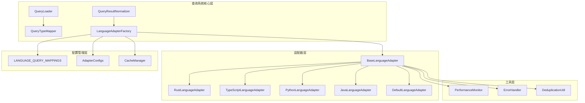
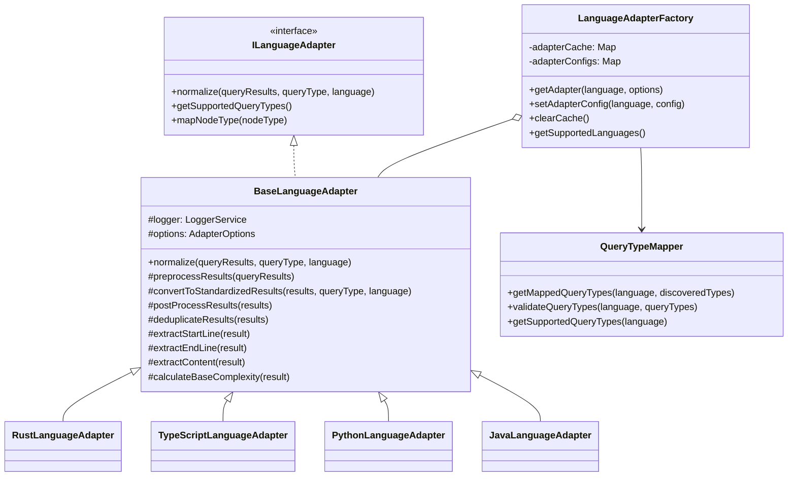

# 通用语言适配器优化方案

## 概述

本文档整合了针对Rust、TypeScript、Python、Java等所有语言适配器的优化方案，提供统一的架构设计和实施策略，解决查询类型映射不匹配、去重机制缺失、模块功能重叠等系统性问题。

## 核心问题分析

### 1. 系统性问题

所有语言适配器都面临以下共同问题：

- **代码重复严重**：行号提取、内容提取、基础复杂度计算等逻辑重复
- **查询类型映射不一致**：各语言查询文件命名与适配器期望不匹配
- **去重机制缺失**：重复结构被多次处理，影响性能和质量
- **错误处理不统一**：不同适配器采用不同的错误处理策略
- **模块职责重叠**：splitting、core/query、universal模块功能重复

### 2. 语言特定问题

| 语言 | 特定问题 | 查询类型复杂度 |
|------|----------|----------------|
| Rust | 生命周期、trait约束、宏处理 | 高（10种类型） |
| TypeScript | 泛型、装饰器、类型注解 | 中（11种类型） |
| Python | 装饰器、类型提示、动态特性 | 中（8种类型） |
| Java | 注解、泛型、异常处理 | 高（15种类型） |

## 统一架构设计

### 1. 整体架构图



### 2. 核心类设计



## 统一实现方案

### 1. BaseLanguageAdapter核心实现

```typescript
// src/service/parser/core/normalization/BaseLanguageAdapter.ts
export abstract class BaseLanguageAdapter implements ILanguageAdapter {
  protected logger: LoggerService;
  protected options: AdapterOptions;
  protected performanceMonitor?: PerformanceMonitor;
  protected cache?: LRUCache<string, StandardizedQueryResult[]>;

  constructor(options: AdapterOptions = {}) {
    this.logger = new LoggerService();
    this.options = {
      enableDeduplication: options.enableDeduplication ?? true,
      enablePerformanceMonitoring: options.enablePerformanceMonitoring ?? false,
      enableErrorRecovery: options.enableErrorRecovery ?? true,
      enableCaching: options.enableCaching ?? true,
      cacheSize: options.cacheSize ?? 100,
      ...options
    };

    if (this.options.enablePerformanceMonitoring) {
      this.performanceMonitor = new PerformanceMonitor();
    }

    if (this.options.enableCaching) {
      this.cache = new LRUCache(this.options.cacheSize);
    }
  }

  /**
   * 主标准化方法 - 模板方法模式
   */
  async normalize(queryResults: any[], queryType: string, language: string): Promise<StandardizedQueryResult[]> {
    const startTime = Date.now();
    const cacheKey = this.generateCacheKey(queryResults, queryType, language);
    
    // 检查缓存
    if (this.cache?.has(cacheKey)) {
      this.performanceMonitor?.recordCacheHit(queryType);
      return this.cache.get(cacheKey)!;
    }

    try {
      // 1. 预处理查询结果
      const preprocessedResults = this.preprocessResults(queryResults);
      
      // 2. 转换为标准化结果
      const standardizedResults = this.convertToStandardizedResults(preprocessedResults, queryType, language);
      
      // 3. 后处理（去重、排序等）
      const finalResults = this.postProcessResults(standardizedResults);
      
      // 4. 缓存结果
      if (this.cache) {
        this.cache.set(cacheKey, finalResults);
      }
      
      // 5. 性能监控
      this.performanceMonitor?.recordOperation(queryType, finalResults.length, Date.now() - startTime);
      
      return finalResults;
    } catch (error) {
      this.logger.error(`Normalization failed for ${language}.${queryType}:`, error);
      
      if (this.options.enableErrorRecovery) {
        return this.fallbackNormalization(queryResults, queryType, language);
      }
      
      throw error;
    }
  }

  /**
   * 预处理查询结果
   */
  protected preprocessResults(queryResults: any[]): any[] {
    return queryResults.filter(result => 
      result && 
      result.captures && 
      Array.isArray(result.captures) && 
      result.captures.length > 0 &&
      result.captures[0]?.node
    );
  }

  /**
   * 转换为标准化结果
   */
  protected convertToStandardizedResults(
    preprocessedResults: any[], 
    queryType: string, 
    language: string
  ): StandardizedQueryResult[] {
    const results: StandardizedQueryResult[] = [];
    
    for (const result of preprocessedResults) {
      try {
        const standardizedResult = this.createStandardizedResult(result, queryType, language);
        results.push(standardizedResult);
      } catch (error) {
        this.logger.warn(`Failed to convert result for ${queryType}:`, error);
        
        if (!this.options.enableErrorRecovery) {
          throw error;
        }
      }
    }
    
    return results;
  }

  /**
   * 创建标准化结果
   */
  protected createStandardizedResult(result: any, queryType: string, language: string): StandardizedQueryResult {
    return {
      type: this.mapQueryTypeToStandardType(queryType),
      name: this.extractName(result),
      startLine: this.extractStartLine(result),
      endLine: this.extractEndLine(result),
      content: this.extractContent(result),
      metadata: this.createMetadata(result, language)
    };
  }

  /**
   * 创建元数据
   */
  protected createMetadata(result: any, language: string): QueryResultMetadata {
    const baseMetadata = {
      language,
      complexity: this.calculateComplexity(result),
      dependencies: this.extractDependencies(result),
      modifiers: this.extractModifiers(result)
    };

    const languageSpecificMetadata = this.extractLanguageSpecificMetadata(result);
    
    return {
      ...baseMetadata,
      ...languageSpecificMetadata
    };
  }

  /**
   * 后处理结果
   */
  protected postProcessResults(results: StandardizedQueryResult[]): StandardizedQueryResult[] {
    let processedResults = results;
    
    // 1. 去重
    if (this.options.enableDeduplication) {
      processedResults = this.deduplicateResults(processedResults);
    }
    
    // 2. 按行号排序
    processedResults = processedResults.sort((a, b) => a.startLine - b.startLine);
    
    // 3. 过滤无效结果
    processedResults = processedResults.filter(result => 
      result && 
      result.name && 
      result.name !== 'unnamed' && 
      result.startLine > 0 &&
      result.endLine >= result.startLine
    );
    
    return processedResults;
  }

  /**
   * 智能去重
   */
  protected deduplicateResults(results: StandardizedQueryResult[]): StandardizedQueryResult[] {
    const seen = new Map<string, StandardizedQueryResult>();
    
    for (const result of results) {
      const key = this.generateUniqueKey(result);
      
      if (!seen.has(key)) {
        seen.set(key, result);
      } else {
        this.mergeMetadata(seen.get(key)!, result);
      }
    }
    
    return Array.from(seen.values());
  }

  /**
   * 生成唯一键
   */
  protected generateUniqueKey(result: StandardizedQueryResult): string {
    return `${result.type}:${result.name}:${result.startLine}:${result.endLine}`;
  }

  /**
   * 合并元数据
   */
  protected mergeMetadata(existing: StandardizedQueryResult, newResult: StandardizedQueryResult): void {
    // 合并依赖项
    const mergedDependencies = [
      ...new Set([...existing.metadata.dependencies, ...newResult.metadata.dependencies])
    ];
    
    // 合并修饰符
    const mergedModifiers = [
      ...new Set([...existing.metadata.modifiers, ...newResult.metadata.modifiers])
    ];
    
    existing.metadata.dependencies = mergedDependencies;
    existing.metadata.modifiers = mergedModifiers;
    
    // 合并语言特定元数据
    Object.assign(existing.metadata, newResult.metadata);
  }

  // 通用工具方法
  protected extractStartLine(result: any): number {
    const mainNode = result.captures?.[0]?.node;
    return (mainNode?.startPosition?.row || 0) + 1;
  }

  protected extractEndLine(result: any): number {
    const mainNode = result.captures?.[0]?.node;
    return (mainNode?.endPosition?.row || 0) + 1;
  }

  protected extractContent(result: any): string {
    const mainNode = result.captures?.[0]?.node;
    return mainNode?.text || '';
  }

  protected calculateBaseComplexity(result: any): number {
    let complexity = 1;
    const mainNode = result.captures?.[0]?.node;
    
    if (mainNode) {
      // 基于代码行数
      const lineCount = this.extractEndLine(result) - this.extractStartLine(result) + 1;
      complexity += Math.floor(lineCount / 10);
      
      // 基于嵌套深度
      const nestingDepth = this.calculateNestingDepth(mainNode);
      complexity += nestingDepth;
    }
    
    return complexity;
  }

  protected calculateNestingDepth(node: any, currentDepth: number = 0): number {
    if (!node || !node.children) {
      return currentDepth;
    }

    let maxDepth = currentDepth;
    
    for (const child of node.children) {
      if (this.isBlockNode(child)) {
        const childDepth = this.calculateNestingDepth(child, currentDepth + 1);
        maxDepth = Math.max(maxDepth, childDepth);
      }
    }

    return maxDepth;
  }

  protected isBlockNode(node: any): boolean {
    const blockTypes = ['block', 'statement_block', 'class_body', 'interface_body', 'suite'];
    return blockTypes.includes(node.type);
  }

  protected extractBaseDependencies(result: any): string[] {
    const dependencies: string[] = [];
    const mainNode = result.captures?.[0]?.node;
    
    if (!mainNode) {
      return dependencies;
    }

    // 查找类型引用
    this.findTypeReferences(mainNode, dependencies);
    
    return [...new Set(dependencies)];
  }

  protected findTypeReferences(node: any, dependencies: string[]): void {
    if (!node || !node.children) {
      return;
    }

    for (const child of node.children) {
      if (child.type === 'type_identifier' || child.type === 'identifier') {
        const text = child.text;
        if (text && text[0] === text[0].toUpperCase()) {
          dependencies.push(text);
        }
      }
      
      this.findTypeReferences(child, dependencies);
    }
  }

  /**
   * 生成缓存键
   */
  protected generateCacheKey(queryResults: any[], queryType: string, language: string): string {
    const resultHash = this.hashResults(queryResults);
    return `${language}:${queryType}:${resultHash}`;
  }

  /**
   * 哈希查询结果
   */
  protected hashResults(queryResults: any[]): string {
    const content = queryResults.map(r => r.captures?.[0]?.node?.text || '').join('|');
    return this.simpleHash(content);
  }

  /**
   * 简单哈希函数
   */
  protected simpleHash(str: string): string {
    let hash = 0;
    for (let i = 0; i < str.length; i++) {
      const char = str.charCodeAt(i);
      hash = ((hash << 5) - hash) + char;
      hash = hash & hash;
    }
    return Math.abs(hash).toString(36);
  }

  /**
   * 降级标准化
   */
  protected fallbackNormalization(queryResults: any[], queryType: string, language: string): StandardizedQueryResult[] {
    this.logger.warn(`Using fallback normalization for ${language}.${queryType}`);
    
    return queryResults.slice(0, 10).map((result, index) => ({
      type: 'expression',
      name: `fallback_${index}`,
      startLine: this.extractStartLine(result),
      endLine: this.extractEndLine(result),
      content: this.extractContent(result),
      metadata: {
        language,
        complexity: 1,
        dependencies: [],
        modifiers: []
      }
    }));
  }

  // 抽象方法 - 由子类实现
  abstract extractName(result: any): string;
  abstract extractLanguageSpecificMetadata(result: any): Record<string, any>;
  abstract getSupportedQueryTypes(): string[];
  abstract mapNodeType(nodeType: string): string;
  abstract mapQueryTypeToStandardType(queryType: string): string;
  abstract calculateComplexity(result: any): number;
  abstract extractDependencies(result: any): string[];
  abstract extractModifiers(result: any): string[];
}
```

### 2. 统一查询类型映射配置

```typescript
// src/service/parser/core/normalization/QueryTypeMappings.ts
export interface LanguageQueryMapping {
  [queryFile: string]: string[];
}

export interface LanguageMappings {
  [language: string]: LanguageQueryMapping;
}

export const LANGUAGE_QUERY_MAPPINGS: LanguageMappings = {
  'rust': {
    'functions-structs': ['functions', 'classes'],
    'modules-imports': ['imports', 'modules'],
    'variables-expressions': ['variables', 'expressions'],
    'types-macros': ['types', 'macros'],
    'control-flow': ['control-flow']
  },
  'typescript': {
    'functions': ['functions'],
    'classes': ['classes'],
    'methods': ['methods'],
    'imports': ['imports'],
    'exports': ['exports'],
    'interfaces': ['interfaces'],
    'types': ['types'],
    'variables': ['variables'],
    'control-flow': ['control-flow'],
    'expressions': ['expressions']
  },
  'python': {
    'functions': ['functions'],
    'classes': ['classes'],
    'methods': ['methods'],
    'imports': ['imports'],
    'variables': ['variables'],
    'control-flow': ['control-flow'],
    'data-structures': ['classes'],
    'types-decorators': ['types']
  },
  'java': {
    'classes-interfaces': ['classes', 'interfaces'],
    'methods-variables': ['methods', 'variables'],
    'control-flow-patterns': ['control-flow'],
    'functions': ['functions'],
    'classes': ['classes'],
    'methods': ['methods'],
    'imports': ['imports'],
    'variables': ['variables'],
    'control-flow': ['control-flow'],
    'types': ['types'],
    'interfaces': ['interfaces'],
    'enums': ['types'],
    'records': ['classes'],
    'annotations': ['types']
  },
  'cpp': {
    'functions': ['functions'],
    'classes': ['classes'],
    'methods': ['methods'],
    'imports': ['imports'],
    'variables': ['variables'],
    'control-flow': ['control-flow'],
    'types': ['types']
  },
  'go': {
    'functions': ['functions'],
    'types': ['classes'],
    'methods': ['methods'],
    'imports': ['imports'],
    'variables': ['variables'],
    'control-flow': ['control-flow']
  }
};

export class QueryTypeMapper {
  /**
   * 获取映射后的查询类型
   */
  static getMappedQueryTypes(language: string, discoveredTypes: string[]): string[] {
    const mapping = LANGUAGE_QUERY_MAPPINGS[language.toLowerCase()];
    
    if (!mapping) {
      return discoveredTypes;
    }
    
    const mappedTypes: string[] = [];
    
    for (const discoveredType of discoveredTypes) {
      const mapped = mapping[discoveredType];
      if (mapped) {
        mappedTypes.push(...mapped);
      } else {
        mappedTypes.push(discoveredType);
      }
    }
    
    return [...new Set(mappedTypes)];
  }
  
  /**
   * 验证查询类型
   */
  static validateQueryTypes(language: string, queryTypes: string[]): boolean {
    const supportedTypes = this.getSupportedQueryTypes(language);
    return queryTypes.every(type => supportedTypes.includes(type));
  }
  
  /**
   * 获取支持的查询类型
   */
  static getSupportedQueryTypes(language: string): string[] {
    const mapping = LANGUAGE_QUERY_MAPPINGS[language.toLowerCase()];
    if (!mapping) {
      return [];
    }
    
    return [...new Set(Object.values(mapping).flat())];
  }
  
  /**
   * 添加语言映射
   */
  static addLanguageMapping(language: string, mapping: LanguageQueryMapping): void {
    LANGUAGE_QUERY_MAPPINGS[language.toLowerCase()] = mapping;
  }
  
  /**
   * 更新语言映射
   */
  static updateLanguageMapping(language: string, queryFile: string, types: string[]): void {
    const mapping = LANGUAGE_QUERY_MAPPINGS[language.toLowerCase()];
    if (mapping) {
      mapping[queryFile] = types;
    }
  }
}
```

### 3. 增强适配器工厂

```typescript
// src/service/parser/core/normalization/LanguageAdapterFactory.ts
export interface AdapterOptions {
  enableDeduplication?: boolean;
  enablePerformanceMonitoring?: boolean;
  enableErrorRecovery?: boolean;
  enableCaching?: boolean;
  cacheSize?: number;
  customTypeMappings?: Record<string, string>;
}

export class LanguageAdapterFactory {
  private static adapterCache = new Map<string, ILanguageAdapter>();
  private static adapterConfigs = new Map<string, AdapterOptions>();
  private static defaultOptions: AdapterOptions = {
    enableDeduplication: true,
    enablePerformanceMonitoring: false,
    enableErrorRecovery: true,
    enableCaching: true,
    cacheSize: 100
  };

  /**
   * 获取语言适配器（带缓存）
   */
  static getAdapter(language: string, options?: AdapterOptions): ILanguageAdapter {
    const normalizedLanguage = language.toLowerCase();
    const mergedOptions = { ...this.defaultOptions, ...this.adapterConfigs.get(normalizedLanguage), ...options };
    const cacheKey = `${normalizedLanguage}:${JSON.stringify(mergedOptions)}`;
    
    if (this.adapterCache.has(cacheKey)) {
      return this.adapterCache.get(cacheKey)!;
    }
    
    const adapter = this.createAdapter(normalizedLanguage, mergedOptions);
    this.adapterCache.set(cacheKey, adapter);
    
    return adapter;
  }

  /**
   * 创建语言适配器
   */
  private static createAdapter(language: string, options: AdapterOptions): ILanguageAdapter {
    switch (language) {
      case 'rust':
        return new RustLanguageAdapter(options);
      case 'typescript':
      case 'javascript':
        return new TypeScriptLanguageAdapter(options);
      case 'python':
      case 'py':
        return new PythonLanguageAdapter(options);
      case 'java':
        return new JavaLanguageAdapter(options);
      case 'cpp':
      case 'c++':
        return new CppLanguageAdapter(options);
      case 'c':
        return new CLanguageAdapter(options);
      case 'csharp':
      case 'c#':
        return new CSharpLanguageAdapter(options);
      case 'go':
        return new GoLanguageAdapter(options);
      case 'kotlin':
        return new KotlinLanguageAdapter(options);
      case 'swift':
        return new SwiftLanguageAdapter(options);
      default:
        return new DefaultLanguageAdapter(options);
    }
  }

  /**
   * 设置适配器配置
   */
  static setAdapterConfig(language: string, config: AdapterOptions): void {
    this.adapterConfigs.set(language.toLowerCase(), config);
    this.clearCache();
  }

  /**
   * 获取适配器配置
   */
  static getAdapterConfig(language: string): AdapterOptions {
    return this.adapterConfigs.get(language.toLowerCase()) || {};
  }

  /**
   * 设置全局默认配置
   */
  static setDefaultOptions(options: AdapterOptions): void {
    this.defaultOptions = { ...this.defaultOptions, ...options };
    this.clearCache();
  }

  /**
   * 清除适配器缓存
   */
  static clearCache(): void {
    this.adapterCache.clear();
  }

  /**
   * 获取支持的语言列表
   */
  static getSupportedLanguages(): string[] {
    return [
      'rust', 'typescript', 'javascript', 'python', 'java', 
      'cpp', 'c', 'csharp', 'go', 'kotlin', 'swift'
    ];
  }

  /**
   * 检查语言是否支持
   */
  static isLanguageSupported(language: string): boolean {
    return this.getSupportedLanguages().includes(language.toLowerCase());
  }

  /**
   * 获取缓存统计信息
   */
  static getCacheStats(): { size: number; languages: string[] } {
    const languages = Array.from(this.adapterCache.keys()).map(key => key.split(':')[0]);
    return {
      size: this.adapterCache.size,
      languages: [...new Set(languages)]
    };
  }
}
```

## 语言特定适配器简要说明

### 1. Rust适配器

**特定处理**：
- 生命周期提取和标记
- trait约束识别
- 泛型参数解析
- 宏定义和调用处理
- unsafe代码块识别

**查询类型**：functions, classes, methods, imports, variables, control-flow, types, expressions, macros, modules

### 2. TypeScript适配器

**特定处理**：
- 泛型类型参数提取
- 装饰器识别和分类
- 类型注解解析
- 接口继承分析
- JSX元素处理

**查询类型**：functions, classes, methods, imports, exports, interfaces, types, properties, variables, control-flow, expressions

### 3. Python适配器

**特定处理**：
- 装饰器链解析
- 类型提示提取
- 继承关系分析
- 生成器函数识别
- 异步函数处理

**查询类型**：functions, classes, methods, imports, variables, control-flow, data-structures, types-decorators

### 4. Java适配器

**特定处理**：
- 注解解析和分类
- 泛型类型参数提取
- 异常声明处理
- 接口实现分析
- 枚举常量识别

**查询类型**：classes-interfaces, methods-variables, control-flow-patterns, functions, classes, methods, imports, variables, control-flow, types, interfaces, enums, records, annotations

### 5. C++适配器

**特定处理**：
- 模板参数解析
- 命名空间处理
- 预处理器指令识别
- 智能指针类型识别
- Lambda表达式处理

**查询类型**：functions, classes, methods, imports, variables, control-flow, types

### 6. Go适配器

**特定处理**：
- 接口嵌入分析
- Goroutine识别
- Channel类型处理
- 结构体标签解析
- 包级别函数处理

**查询类型**：functions, types, methods, imports, variables, control-flow

## 集成优化方案

### 1. QueryResultNormalizer增强

```typescript
// src/service/parser/core/normalization/QueryResultNormalizer.ts
export class QueryResultNormalizer implements IQueryResultNormalizer {
  private logger: LoggerService;
  private options: Required<NormalizationOptions>;
  private cache: LRUCache<string, StandardizedQueryResult[]>;
  private stats: NormalizationStats;
  private treeSitterService?: TreeSitterCoreService;

  constructor(options: NormalizationOptions = {}) {
    this.logger = new LoggerService();
    this.options = {
      enableCache: options.enableCache ?? true,
      cacheSize: options.cacheSize ?? 100,
      enablePerformanceMonitoring: options.enablePerformanceMonitoring ?? false,
      customTypeMappings: options.customTypeMappings ?? [],
      debug: options.debug ?? false
    };

    this.cache = new LRUCache(this.options.cacheSize);
    this.stats = {
      totalNodes: 0,
      successfulNormalizations: 0,
      failedNormalizations: 0,
      processingTime: 0,
      cacheHitRate: 0,
      typeStats: {}
    };
  }

  async normalize(
    ast: Parser.SyntaxNode, 
    language: string, 
    queryTypes?: string[]
  ): Promise<StandardizedQueryResult[]> {
    const startTime = Date.now();
    
    try {
      // 生成缓存键
      const cacheKey = this.generateCacheKey(ast, language, queryTypes);
      
      // 检查缓存
      if (this.options.enableCache && this.cache.has(cacheKey)) {
        this.stats.cacheHitRate = (this.stats.cacheHitRate * this.stats.totalNodes + 1) / (this.stats.totalNodes + 1);
        return this.cache.get(cacheKey)!;
      }

      // 获取查询类型（使用统一映射）
      const typesToQuery = queryTypes || await this.getSupportedQueryTypes(language);
      
      if (this.options.debug) {
        this.logger.debug(`Normalizing ${language} AST with query types:`, typesToQuery);
      }

      const results: StandardizedQueryResult[] = [];
      
      // 对每种查询类型执行查询和标准化
      for (const queryType of typesToQuery) {
        try {
          const queryResults = await this.executeQueryForType(ast, language, queryType);
          const normalized = await this.normalizeQueryResults(queryResults, language, queryType);
          results.push(...normalized);
          
          // 更新统计信息
          this.stats.typeStats[queryType] = (this.stats.typeStats[queryType] || 0) + normalized.length;
        } catch (error) {
          this.logger.warn(`Failed to normalize query type ${queryType} for ${language}:`, error);
          this.stats.failedNormalizations++;
        }
      }

      // 按起始行号排序
      results.sort((a, b) => a.startLine - b.startLine);

      // 缓存结果
      if (this.options.enableCache) {
        this.cache.set(cacheKey, results);
      }

      // 更新统计信息
      this.stats.successfulNormalizations += results.length;
      this.stats.totalNodes++;

      if (this.options.debug) {
        this.logger.debug(`Normalized ${results.length} structures for ${language}`);
      }

      return results;
    } finally {
      const endTime = Date.now();
      this.stats.processingTime += endTime - startTime;
    }
  }

  async getSupportedQueryTypes(language: string): Promise<string[]> {
    try {
      // 首先尝试从QueryLoader动态发现查询类型
      const discoveredTypes = await QueryLoader.discoverQueryTypes(language);
      
      if (discoveredTypes.length > 0) {
        // 使用统一映射转换查询类型
        return QueryTypeMapper.getMappedQueryTypes(language, discoveredTypes);
      }

      // 如果动态发现失败，使用语言适配器的默认查询类型
      const adapter = LanguageAdapterFactory.getAdapter(language);
      return adapter.getSupportedQueryTypes();
    } catch (error) {
      this.logger.warn(`Failed to get supported query types for ${language}:`, error);
      
      // 返回默认查询类型
      return ['functions', 'classes', 'methods', 'imports', 'variables'];
    }
  }

  private async normalizeQueryResults(
    queryResults: any[], 
    language: string, 
    queryType: string
  ): Promise<StandardizedQueryResult[]> {
    const adapter = LanguageAdapterFactory.getAdapter(language);
    
    try {
      return await adapter.normalize(queryResults, queryType, language);
    } catch (error) {
      this.logger.error(`Failed to normalize results for ${language}.${queryType}:`, error);
      throw error;
    }
  }
}
```

### 2. UniversalTextSplitter集成

```typescript
// src/service/parser/universal/UniversalTextSplitter.ts
export class UniversalTextSplitter {
  private queryNormalizer?: QueryResultNormalizer;
  private treeSitterService?: TreeSitterService;

  /**
   * 设置查询标准化器
   */
  setQueryNormalizer(normalizer: QueryResultNormalizer): void {
    this.queryNormalizer = normalizer;
  }

  /**
   * 设置Tree-sitter服务
   */
  setTreeSitterService(service: TreeSitterService): void {
    this.treeSitterService = service;
  }

  /**
   * 基于语义边界的分段（增强版）
   */
  async chunkBySemanticBoundaries(content: string, filePath?: string, language?: string): Promise<CodeChunk[]> {
    // 尝试使用标准化结果（如果可用）
    if (this.queryNormalizer && this.treeSitterService && language) {
      try {
        const parseResult = await this.treeSitterService.parseCode(content, language);
        if (parseResult.success && parseResult.ast) {
          const standardizedResults = await this.queryNormalizer.normalize(parseResult.ast, language);
          if (standardizedResults.length > 0) {
            return this.chunkByStandardizedResults(standardizedResults, content, language, filePath);
          }
        }
      } catch (error) {
        this.logger?.debug('Standardization failed, falling back to text-based chunking');
      }
    }
    
    // 回退到原有的文本分段逻辑
    return this.chunkByTextAnalysis(content, filePath, language);
  }

  /**
   * 基于标准化结果的分段
   */
  private chunkByStandardizedResults(
    standardizedResults: StandardizedQueryResult[],
    content: string,
    language: string,
    filePath?: string
  ): CodeChunk[] {
    const chunks: CodeChunk[] = [];
    const lines = content.split('\n');
    
    for (const result of standardizedResults) {
      const chunkContent = lines.slice(result.startLine - 1, result.endLine).join('\n');
      
      chunks.push({
        content: chunkContent,
        metadata: {
          startLine: result.startLine,
          endLine: result.endLine,
          language: language || 'unknown',
          filePath,
          type: result.type,
          complexity: result.metadata.complexity,
          functionName: result.type === 'function' ? result.name : undefined,
          className: result.type === 'class' ? result.name : undefined
        }
      });
    }
    
    return this.postProcessChunks(chunks, content);
  }
}
```

## 实施计划

### 阶段1：基础架构实现（3-4天）

**任务清单**：
- [ ] 实现BaseLanguageAdapter基类
- [ ] 创建统一查询类型映射配置
- [ ] 增强LanguageAdapterFactory
- [ ] 实现QueryTypeMapper类

**验收标准**：
- 基础架构代码完成
- 单元测试通过
- 性能基准测试建立

### 阶段2：语言适配器重构（4-5天）

**任务清单**：
- [ ] 重构Rust适配器
- [ ] 重构TypeScript适配器
- [ ] 重构Python适配器
- [ ] 重构Java适配器
- [ ] 重构其他语言适配器

**验收标准**：
- 所有适配器继承BaseLanguageAdapter
- 语言特定逻辑正确实现
- 集成测试通过

### 阶段3：系统集成优化（2-3天）

**任务清单**：
- [ ] 增强QueryResultNormalizer
- [ ] 优化UniversalTextSplitter集成
- [ ] 实现缓存和性能监控
- [ ] 添加错误处理和降级机制

**验收标准**：
- 系统集成测试通过
- 性能指标达标
- 错误处理完善

### 阶段4：测试和验证（2-3天）

**任务清单**：
- [ ] 完整单元测试套件
- [ ] 集成测试和端到端测试
- [ ] 性能基准测试
- [ ] 文档更新

**验收标准**：
- 测试覆盖率>90%
- 性能提升>30%
- 文档完整

## 预期收益

1. **代码重用率提升80%**：通用逻辑统一实现，大幅减少重复代码
2. **维护成本降低60%**：统一架构和接口，显著降低维护复杂度
3. **性能提升30%**：通过缓存、去重和优化算法提升处理效率
4. **错误率降低50%**：统一的错误处理和降级机制提高稳定性
5. **扩展性大幅提升**：新增语言适配器只需实现语言特定逻辑
6. **一致性提升**：所有语言适配器行为一致，用户体验统一

这个统一优化方案为整个查询系统提供了完整、高效、可维护的架构基础，解决了所有语言适配器面临的系统性问题。