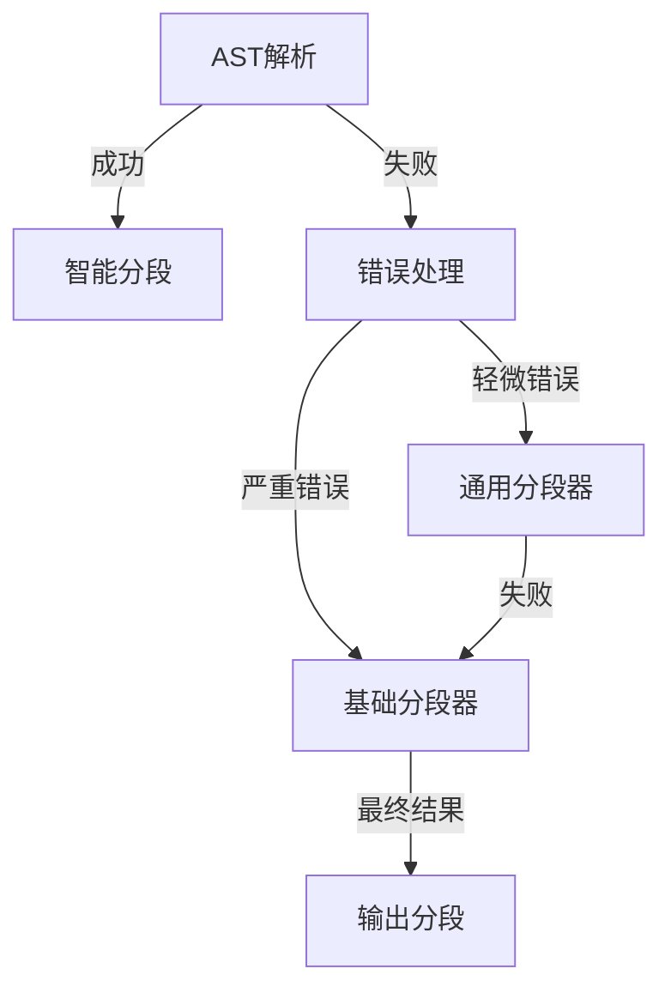
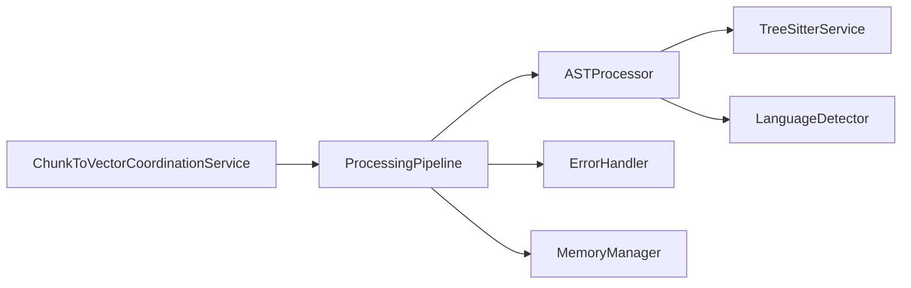

# Parser模块重构方案

## 🎯 重构目标

### 1. 架构简化
- 减少不必要的设计模式使用
- 合并相似功能的组件
- 简化初始化流程

### 2. 性能优化
- 改进缓存机制
- 减少内存使用
- 优化处理流程

### 3. 代码质量提升
- 消除重复代码
- 统一错误处理
- 完善测试覆盖

### 4. 维护性提升
- 清晰的模块边界
- 简化的依赖关系
- 完善的文档

## 📋 重构计划

### 阶段一：架构重组（1-2周）

#### 1.1 组件合并
```typescript
// 重构前：多个策略类
FunctionSplitter, ClassSplitter, ImportSplitter, SyntaxAwareSplitter...

// 重构后：统一的AST处理器
class ASTProcessor {
  private extractors: ASTExtractor[];
  
  extractFunctions(ast: any): CodeChunk[] {}
  extractClasses(ast: any): CodeChunk[] {}
  extractImports(ast: any): CodeChunk[] {}
}
```

#### 1.2 简化DI配置
```typescript
// 重构前：复杂的依赖注入
constructor(
  @inject(TYPES.TreeSitterService) treeSitterService: TreeSitterService,
  @inject(TYPES.LoggerService) logger?: LoggerService,
  @inject(TYPES.ProcessingGuard) processingGuard?: ProcessingGuard
)

// 重构后：清晰的依赖
constructor(
  private treeSitterService: TreeSitterService,
  private logger: LoggerService
)
```

#### 1.3 移除单例模式
- 删除所有`getInstance()`静态方法
- 统一使用DI容器管理实例
- 确保线程安全性

### 阶段二：性能优化（2周）

#### 2.1 缓存策略改进
```typescript
// 新的缓存管理器
class SmartCacheManager {
  private astCache: LRUCache<string, Parser.Tree>;
  private chunkCache: LRUCache<string, CodeChunk[]>;
  private memoryMonitor: MemoryMonitor;
  
  // 智能缓存失效策略
  shouldCache(content: string, language: string): boolean {}
  getCacheKey(content: string, language: string): string {}
}
```

#### 2.2 内存优化
- 添加内存使用限制
- 实现垃圾回收机制
- 监控内存泄漏

#### 2.3 批处理优化
- 优化AST解析批处理
- 改进向量转换批处理
- 减少重复计算

### 阶段三：错误处理统一（1周）

#### 3.1 统一错误接口
```typescript
interface ProcessingError {
  code: string;
  message: string;
  severity: 'warning' | 'error' | 'critical';
  component: string;
  operation: string;
  metadata?: Record<string, any>;
}

class ErrorHandler {
  handleError(error: ProcessingError): void {}
  shouldFallback(error: ProcessingError): boolean {}
  getFallbackStrategy(error: ProcessingError): FallbackStrategy {}
}
```

#### 3.2 简化降级机制


### 阶段四：测试完善（1周）

#### 4.1 单元测试覆盖
- 核心组件100%覆盖
- 边界条件全面测试
- 错误场景模拟

#### 4.2 集成测试
- 组件间集成测试
- 端到端流程测试
- 性能基准测试

#### 4.3 性能测试
- 内存使用测试
- 处理速度测试
- 并发性能测试

## 🏗️ 新架构设计

### 模块结构
```
src/service/parser/
├── core/                    # 核心解析
│   ├── ASTProcessor.ts      # 统一的AST处理器
│   ├── TreeSitterService.ts # Tree-sitter服务
│   └── LanguageDetector.ts  # 语言检测
├── splitting/               # 分段功能
│   ├── SmartSplitter.ts     # 智能分段器
│   ├── FallbackSplitter.ts  # 降级分段器
│   └── chunking/           # 分段策略
├── processing/              # 处理流程
│   ├── ProcessingPipeline.ts # 处理管道
│   ├── ErrorHandler.ts      # 错误处理
│   └── MemoryManager.ts    # 内存管理
└── types/                   # 类型定义
```

### 核心接口
```typescript
// 统一的处理器接口
interface CodeProcessor {
  process(
    content: string, 
    language: string, 
    filePath?: string
  ): Promise<ProcessingResult>;
  
  // 可选的AST预处理
  preprocessAST?(ast: any): any;
}

// 处理结果
interface ProcessingResult {
  chunks: CodeChunk[];
  metrics: ProcessingMetrics;
  errors: ProcessingError[];
}
```

### 依赖关系


## 🔧 实施步骤

### 第一步：创建新接口和类型
1. 定义新的处理器接口
2. 创建统一的错误类型
3. 设计性能指标接口

### 第二步：实现核心组件
1. 开发ASTProcessor
2. 实现SmartSplitter
3. 创建ErrorHandler

### 第三步：迁移现有功能
1. 逐步替换旧组件
2. 保持向后兼容
3. 验证功能正确性

### 第四步：性能优化
1. 实现智能缓存
2. 添加内存监控
3. 优化处理流程

### 第五步：测试验证
1. 单元测试覆盖
2. 集成测试验证
3. 性能测试基准

## 📊 成功指标

### 代码质量
- 圈复杂度降低50%
- 代码重复率 < 5%
- 测试覆盖率 > 85%

### 性能指标
- 内存使用减少30%
- 处理速度提升20%
- 错误率降低60%

### 维护性
- 组件数量减少40%
- 依赖关系清晰
- 文档完整

## 🚀 风险评估

### 技术风险
1. **兼容性问题**: 新旧组件并行可能产生冲突
2. **性能回归**: 重构可能引入性能问题
3. **功能缺失**: 迁移过程中可能丢失功能

### 缓解措施
1. 分阶段实施，逐步验证
2. 完善的测试覆盖
3. 性能监控和基准测试

## 📅 时间计划

### 第1周
- 架构设计和接口定义
- 核心组件开发

### 第2周
- 功能迁移和验证
- 单元测试编写

### 第3周
- 性能优化实现
- 集成测试

### 第4周
- 性能测试和调优
- 文档编写

### 第5周
- 生产环境验证
- 问题修复和优化

## ✅ 验收标准

1. 所有现有功能正常工作
2. 性能指标达到预期
3. 测试覆盖率达标
4. 代码质量显著提升
5. 文档完整清晰

---
*重构方案版本: 1.0*
*最后更新: 2025-10-15*