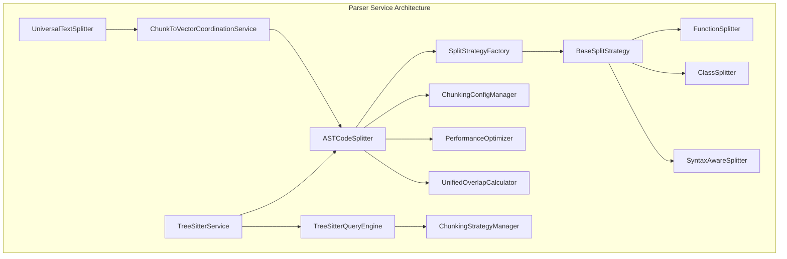
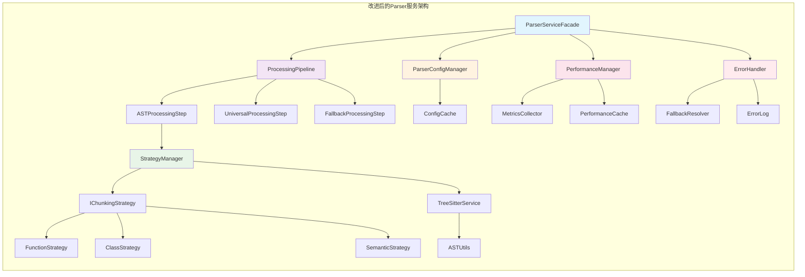

# 代码解析服务架构设计分析报告

## 📊 架构设计评估

### 🎯 当前架构概览

当前的 `src\service\parser` 目录采用了**多层架构设计**，主要包含以下核心模块：



### ✅ 架构优势

#### 1. **设计模式应用良好**
- **策略模式**: [`BaseSplitStrategy`](src/service/parser/splitting/strategies/base/BaseSplitStrategy.ts:11) 提供了良好的扩展基础
- **工厂模式**: [`SplitStrategyFactory`](src/service/parser/splitting/core/SplitStrategyFactory.ts:9) 实现了策略的灵活创建
- **依赖注入**: 使用 Inversify 容器管理依赖关系

#### 2. **分层架构清晰**
- **核心层** (`core/`): Tree-sitter 解析和查询引擎
- **分割层** (`splitting/`): 代码分割策略和协调器
- **通用层** (`universal/`): 通用文本处理和降级方案
- **配置层** (`config/`): 分层配置管理

#### 3. **性能优化考虑充分**
- **性能监控**: [`UnifiedPerformanceMonitoringSystem`](src/service/parser/splitting/utils/performance/UnifiedPerformanceMonitoringSystem.ts)
- **缓存机制**: LRU 缓存和 AST 节点缓存
- **内存保护**: [`ProcessingGuard`](src/service/parser/universal/ProcessingGuard.ts) 防止内存溢出

#### 4. **错误处理和降级机制**
- **多级降级**: AST → 通用分割器 → 简单文本分割
- **错误阈值管理**: [`ErrorThresholdManager`](src/service/parser/universal/ErrorThresholdManager.ts)
- **备份处理**: [`BackupFileProcessor`](src/service/parser/universal/BackupFileProcessor.ts)

### ⚠️ 架构问题分析

#### 1. **类型定义重复和混乱**
```typescript
// 问题：多个文件中存在重复或相似类型定义
// src/service/parser/types.ts
// src/service/parser/core/types.ts  
// src/service/parser/splitting/types/index.ts
// src/service/parser/splitting/Splitter.ts
```

#### 2. **策略接口不统一**
- **核心策略接口**: [`ChunkingStrategy`](src/service/parser/core/strategy/ChunkingStrategy.ts:8)
- **分割策略接口**: [`ISplitStrategy`](src/service/parser/splitting/interfaces/ISplitStrategy.ts)
- **两个接口体系并存**，造成实现混乱

#### 3. **配置管理过于复杂**
```typescript
// 配置层级过多，难以维护
interface ChunkingConfig {
  global: ChunkingOptions;           // 全局配置
  language: Map<string, ChunkingOptions>; // 语言特定
  strategy: Map<string, ChunkingOptions>; // 策略特定
}
```

#### 4. **循环依赖风险**
- [`ASTCodeSplitter`](src/service/parser/splitting/ASTCodeSplitter.ts:22) 依赖几乎所有其他模块
- 策略实现类之间相互依赖
- 工具类之间职责边界不清晰

## 🔧 具体修改建议

### 1. **统一类型系统**

#### 当前问题
类型定义分散在多个文件中，存在重复和不一致。

#### 解决方案
创建统一的类型定义中心：

```typescript
// src/service/parser/types/index.ts
export interface BaseCodeChunk {
  id?: string;
  content: string;
  metadata: CodeChunkMetadata;
}

export interface CodeChunkMetadata {
  startLine: number;
  endLine: number;
  language: string;
  filePath?: string;
  type?: ChunkType;
  functionName?: string;
  className?: string;
  complexity?: number;
  [key: string]: any;
}

export type ChunkType = 
  | 'function' | 'class' | 'interface' | 'method' 
  | 'import' | 'semantic' | 'generic' | 'code_block';

// 统一的策略接口
export interface IChunkingStrategy {
  readonly name: string;
  readonly priority: number;
  readonly supportedLanguages: string[];
  
  canHandle(language: string, content: string): boolean;
  chunk(content: string, language: string, options?: ChunkingOptions): Promise<CodeChunk[]>;
}
```

### 2. **简化配置管理**

#### 当前问题
配置层级过多，维护困难。

#### 解决方案
采用扁平化配置结构：

```typescript
// src/service/parser/config/ParserConfig.ts
export interface ParserConfig {
  // 基础配置
  maxChunkSize: number;
  overlapSize: number;
  minChunkSize: number;
  
  // 语言特定配置
  languageOverrides: Record<string, Partial<ParserConfig>>;
  
  // 策略特定配置  
  strategyOverrides: Record<string, Partial<ParserConfig>>;
  
  // 性能配置
  performance: {
    enableMonitoring: boolean;
    maxExecutionTime: number;
    cacheSize: number;
  };
  
  // 错误处理配置
  errorHandling: {
    maxRetries: number;
    fallbackThreshold: number;
  };
}

// 单一配置管理器
export class ParserConfigManager {
  private static instance: ParserConfigManager;
  private config: ParserConfig;
  
  static getInstance(): ParserConfigManager {
    if (!this.instance) {
      this.instance = new ParserConfigManager();
    }
    return this.instance;
  }
  
  getConfig(language?: string, strategy?: string): ParserConfig {
    let result = { ...this.config };
    
    if (language && this.config.languageOverrides[language]) {
      result = { ...result, ...this.config.languageOverrides[language] };
    }
    
    if (strategy && this.config.strategyOverrides[strategy]) {
      result = { ...result, ...this.config.strategyOverrides[strategy] };
    }
    
    return result;
  }
}
```

### 3. **重构策略体系**

#### 当前问题
两个并行的策略接口体系造成混乱。

#### 解决方案
统一策略接口和实现：

```typescript
// src/service/parser/strategies/IChunkingStrategy.ts
export interface IChunkingStrategy {
  readonly name: string;
  readonly priority: number;
  readonly description: string;
  readonly supportedLanguages: string[];
  
  canHandle(language: string, content: string, ast?: any): boolean;
  chunk(content: string, language: string, options?: StrategyOptions): Promise<ChunkResult>;
  validate(result: ChunkResult): boolean;
}

export interface StrategyOptions {
  maxChunkSize?: number;
  preserveBoundaries?: boolean;
  context?: any;
}

export interface ChunkResult {
  chunks: CodeChunk[];
  metadata: {
    executionTime: number;
    strategyUsed: string;
    confidence: number;
  };
}

// 抽象基类
export abstract class BaseChunkingStrategy implements IChunkingStrategy {
  protected logger?: LoggerService;
  protected config: ParserConfig;
  
  constructor(config?: Partial<ParserConfig>) {
    this.config = { ...DEFAULT_PARSER_CONFIG, ...config };
  }
  
  abstract readonly name: string;
  abstract readonly priority: number;
  abstract readonly supportedLanguages: string[];
  
  abstract canHandle(language: string, content: string, ast?: any): boolean;
  abstract chunk(content: string, language: string, options?: StrategyOptions): Promise<ChunkResult>;
  
  validate(result: ChunkResult): boolean {
    return result.chunks.length > 0 && 
           result.chunks.every(chunk => this.isValidChunk(chunk));
  }
  
  protected isValidChunk(chunk: CodeChunk): boolean {
    return chunk.content.length >= this.config.minChunkSize &&
           chunk.metadata.startLine <= chunk.metadata.endLine;
  }
}
```

### 4. **优化依赖注入**

#### 当前问题
依赖关系复杂，存在循环依赖风险。

#### 解决方案
采用模块化依赖管理：

```typescript
// src/service/parser/di/ParserModule.ts
import { ContainerModule, interfaces } from 'inversify';
import { TYPES } from './types';

export const parserModule = new ContainerModule((bind: interfaces.Bind) => {
  // 核心服务
  bind(TYPES.ParserConfigManager)
    .toDynamicValue(() => ParserConfigManager.getInstance())
    .inSingletonScope();
    
  bind(TYPES.TreeSitterService)
    .to(TreeSitterService)
    .inSingletonScope();
    
  bind(TYPES.StrategyFactory)
    .to(StrategyFactory)
    .inSingletonScope();
    
  // 策略注册
  bind(TYPES.ChunkingStrategy)
    .to(FunctionChunkingStrategy)
    .whenTargetNamed('function');
    
  bind(TYPES.ChunkingStrategy)
    .to(ClassChunkingStrategy)
    .whenTargetNamed('class');
    
  bind(TYPES.ChunkingStrategy)
    .to(SemanticChunkingStrategy)
    .whenTargetNamed('semantic');
});

// 策略工厂简化
export class StrategyFactory {
  constructor(
    @inject(TYPES.ParserConfigManager) private configManager: ParserConfigManager,
    @inject(TYPES.LoggerService) private logger: LoggerService
  ) {}
  
  createStrategy(type: string, language: string): IChunkingStrategy {
    const strategies = this.getStrategiesForLanguage(language);
    return strategies.find(s => s.name === type) || this.getDefaultStrategy();
  }
  
  private getStrategiesForLanguage(language: string): IChunkingStrategy[] {
    // 返回支持该语言的策略列表，按优先级排序
  }
}
```

### 5. **改进错误处理和降级机制**

#### 当前问题
错误处理分散，降级机制复杂。

#### 解决方案
统一错误处理和降级策略：

```typescript
// src/service/parser/error/ProcessingPipeline.ts
export interface ProcessingStep {
  name: string;
  execute(context: ProcessingContext): Promise<ProcessingResult>;
  shouldRetry(error: Error): boolean;
  getFallbackStep?(): ProcessingStep;
}

export class ProcessingPipeline {
  private steps: ProcessingStep[] = [];
  private errorHandler: ErrorHandler;
  
  constructor(
    @inject(TYPES.ErrorHandler) errorHandler: ErrorHandler,
    @inject(TYPES.LoggerService) logger: LoggerService
  ) {
    this.errorHandler = errorHandler;
  }
  
  async process(context: ProcessingContext): Promise<ProcessingResult> {
    for (const step of this.steps) {
      try {
        const result = await step.execute(context);
        if (result.success) {
          return result;
        }
      } catch (error) {
        this.logger.warn(`Step ${step.name} failed: ${error}`);
        
        if (step.shouldRetry(error)) {
          // 重试逻辑
          continue;
        }
        
        if (step.getFallbackStep) {
          const fallback = step.getFallbackStep();
          return await fallback.execute(context);
        }
        
        throw error;
      }
    }
    
    throw new Error('All processing steps failed');
  }
}

// 具体步骤实现
export class ASTProcessingStep implements ProcessingStep {
  constructor(
    @inject(TYPES.ASTCodeSplitter) private splitter: ASTCodeSplitter
  ) {}
  
  name = 'ast-processing';
  
  async execute(context: ProcessingContext): Promise<ProcessingResult> {
    const chunks = await this.splitter.split(
      context.content,
      context.language,
      context.filePath
    );
    
    return {
      success: chunks.length > 0,
      chunks,
      metadata: { strategy: 'ast', confidence: 0.9 }
    };
  }
  
  shouldRetry(error: Error): boolean {
    return error instanceof ParseError && error.retryable;
  }
  
  getFallbackStep(): ProcessingStep {
    return new UniversalProcessingStep();
  }
}
```

### 6. **性能优化改进**

#### 当前问题
性能监控分散，优化策略不够智能。

#### 解决方案
集中式性能管理和智能优化：

```typescript
// src/service/parser/performance/PerformanceManager.ts
export interface PerformanceMetrics {
  executionTime: number;
  memoryUsage: number;
  cacheHitRate: number;
  chunkCount: number;
  errorRate: number;
}

export class PerformanceManager {
  private metrics: Map<string, PerformanceMetrics[]> = new Map();
  private optimizer: PerformanceOptimizer;
  
  constructor(
    @inject(TYPES.LoggerService) private logger: LoggerService
  ) {
    this.optimizer = new PerformanceOptimizer();
  }
  
  async monitor<T>(
    operation: string,
    fn: () => Promise<T>
  ): Promise<T> {
    const startTime = Date.now();
    const startMemory = process.memoryUsage();
    
    try {
      const result = await fn();
      
      const metrics: PerformanceMetrics = {
        executionTime: Date.now() - startTime,
        memoryUsage: process.memoryUsage().heapUsed - startMemory.heapUsed,
        cacheHitRate: this.calculateCacheHitRate(operation),
        chunkCount: this.extractChunkCount(result),
        errorRate: 0
      };
      
      this.recordMetrics(operation, metrics);
      this.optimizeIfNeeded(operation, metrics);
      
      return result;
    } catch (error) {
      this.recordError(operation, error);
      throw error;
    }
  }
  
  private optimizeIfNeeded(operation: string, metrics: PerformanceMetrics): void {
    const historical = this.getHistoricalMetrics(operation);
    
    if (this.shouldOptimize(metrics, historical)) {
      this.optimizer.optimize(operation, metrics);
    }
  }
  
  private shouldOptimize(
    current: PerformanceMetrics,
    historical: PerformanceMetrics[]
  ): boolean {
    // 基于历史数据判断是否需要优化
    const avgExecutionTime = historical.reduce((sum, m) => sum + m.executionTime, 0) / historical.length;
    const avgMemoryUsage = historical.reduce((sum, m) => sum + m.memoryUsage, 0) / historical.length;
    
    return current.executionTime > avgExecutionTime * 1.5 ||
           current.memoryUsage > avgMemoryUsage * 2 ||
           current.errorRate > 0.1;
  }
}
```

## 🏗️ 改进后的架构设计

### 目标架构图



### 详细架构说明

#### 1. **统一入口层 (ParserServiceFacade)**

```typescript
// src/service/parser/ParserServiceFacade.ts
export class ParserServiceFacade {
  constructor(
    private pipeline: ProcessingPipeline,
    private configManager: ParserConfigManager,
    private performanceManager: PerformanceManager
  ) {}
  
  async parseFile(filePath: string, options?: ParseOptions): Promise<ParseResult> {
    return this.performanceManager.monitor('parseFile', async () => {
      const config = this.configManager.getConfigForFile(filePath);
      const context = new ProcessingContext(filePath, config, options);
      
      return await this.pipeline.process(context);
    });
  }
  
  async parseCode(content: string, language: string, options?: ParseOptions): Promise<ParseResult> {
    return this.performanceManager.monitor('parseCode', async () => {
      const config = this.configManager.getConfigForLanguage(language);
      const context = new ProcessingContext(content, language, config, options);
      
      return await this.pipeline.process(context);
    });
  }
}
```

#### 2. **处理管道层 (ProcessingPipeline)**

```typescript
// src/service/parser/pipeline/ProcessingPipeline.ts
export class ProcessingPipeline {
  private steps: ProcessingStep[] = [];
  
  constructor(
    private errorHandler: ErrorHandler,
    private logger: LoggerService
  ) {
    this.initializeSteps();
  }
  
  private initializeSteps(): void {
    this.steps = [
      new ASTProcessingStep(),
      new UniversalProcessingStep(),
      new FallbackProcessingStep()
    ];
  }
  
  async process(context: ProcessingContext): Promise<ParseResult> {
    for (const step of this.steps) {
      try {
        const result = await step.execute(context);
        if (result.success) {
          return this.enhanceResult(result, step.name);
        }
      } catch (error) {
        this.logger.warn(`Step ${step.name} failed`, { error });
        
        if (step.hasFallback()) {
          const fallbackResult = await step.getFallback().execute(context);
          if (fallbackResult.success) {
            return this.enhanceResult(fallbackResult, `${step.name}-fallback`);
          }
        }
      }
    }
    
    throw new ProcessingError('All processing steps failed');
  }
  
  private enhanceResult(result: ParseResult, source: string): ParseResult {
    return {
      ...result,
      metadata: {
        ...result.metadata,
        processingSource: source,
        timestamp: new Date()
      }
    };
  }
}
```

#### 3. **策略管理层 (StrategyManager)**

```typescript
// src/service/parser/strategy/StrategyManager.ts
export class StrategyManager {
  private strategies: Map<string, IChunkingStrategy> = new Map();
  private strategyChain: Map<string, string[]> = new Map();
  
  constructor(
    private configManager: ParserConfigManager,
    private treeSitterService: TreeSitterService
  ) {
    this.registerDefaultStrategies();
  }
  
  async processWithStrategies(
    content: string, 
    language: string, 
    ast?: any
  ): Promise<ChunkResult> {
    const applicableStrategies = this.getApplicableStrategies(language, content, ast);
    
    for (const strategy of applicableStrategies) {
      try {
        const config = this.configManager.getStrategyConfig(strategy.name);
        const result = await strategy.chunk(content, language, { config, ast });
        
        if (result.chunks.length > 0 && strategy.validate(result)) {
          return result;
        }
      } catch (error) {
        continue; // 尝试下一个策略
      }
    }
    
    return { chunks: [], metadata: { executionTime: 0, confidence: 0 } };
  }
  
  private getApplicableStrategies(language: string, content: string, ast?: any): IChunkingStrategy[] {
    return Array.from(this.strategies.values())
      .filter(strategy => strategy.canHandle(language, content, ast))
      .sort((a, b) => a.priority - b.priority);
  }
}
```

#### 4. **配置管理层 (ParserConfigManager)**

```typescript
// src/service/parser/config/ParserConfigManager.ts
export class ParserConfigManager {
  private static instance: ParserConfigManager;
  private config: ParserConfig;
  private fileTypeCache: Map<string, FileTypeConfig> = new Map();
  
  static getInstance(): ParserConfigManager {
    if (!this.instance) {
      this.instance = new ParserConfigManager();
    }
    return this.instance;
  }
  
  getConfigForFile(filePath: string): ParserConfig {
    const fileType = this.detectFileType(filePath);
    const cached = this.fileTypeCache.get(fileType);
    
    if (cached) {
      return this.mergeWithGlobalConfig(cached);
    }
    
    const config = this.loadConfigForFileType(fileType);
    this.fileTypeCache.set(fileType, config);
    
    return this.mergeWithGlobalConfig(config);
  }
  
  getConfigForLanguage(language: string): ParserConfig {
    const languageConfig = this.config.languages[language];
    return languageConfig ? 
      this.mergeConfigs(this.config.global, languageConfig) : 
      this.config.global;
  }
  
  getStrategyConfig(strategyName: string): StrategyConfig {
    return this.config.strategies[strategyName] || this.config.global.strategyDefaults;
  }
  
  private mergeConfigs(global: GlobalConfig, specific: Partial<GlobalConfig>): ParserConfig {
    return {
      global: { ...global, ...specific },
      languages: this.config.languages,
      strategies: this.config.strategies
    };
  }
}
```

#### 5. **性能管理层 (PerformanceManager)**

```typescript
// src/service/parser/performance/PerformanceManager.ts
export class PerformanceManager {
  private metrics: PerformanceMetrics = {};
  private optimizer: PerformanceOptimizer;
  private alerts: PerformanceAlert[] = [];
  
  constructor(private logger: LoggerService) {
    this.optimizer = new PerformanceOptimizer();
    this.startMonitoring();
  }
  
  async monitor<T>(
    operation: string,
    fn: () => Promise<T>
  ): Promise<T> {
    const startTime = Date.now();
    const startMemory = process.memoryUsage();
    
    try {
      const result = await fn();
      
      const duration = Date.now() - startTime;
      const memoryDelta = process.memoryUsage().heapUsed - startMemory.heapUsed;
      
      this.recordMetrics(operation, {
        duration,
        memoryDelta,
        success: true,
        timestamp: new Date()
      });
      
      this.checkPerformanceThresholds(operation, duration, memoryDelta);
      
      return result;
    } catch (error) {
      this.recordMetrics(operation, {
        duration: Date.now() - startTime,
        memoryDelta: process.memoryUsage().heapUsed - startMemory.heapUsed,
        success: false,
        error: error.message,
        timestamp: new Date()
      });
      
      throw error;
    }
  }
  
  private checkPerformanceThresholds(operation: string, duration: number, memoryDelta: number): void {
    const thresholds = this.getThresholdsForOperation(operation);
    
    if (duration > thresholds.maxDuration) {
      this.logger.warn(`Operation ${operation} exceeded duration threshold`, {
        duration,
        threshold: thresholds.maxDuration
      });
    }
    
    if (memoryDelta > thresholds.maxMemoryDelta) {
      this.logger.warn(`Operation ${operation} exceeded memory threshold`, {
        memoryDelta,
        threshold: thresholds.maxMemoryDelta
      });
    }
  }
  
  getPerformanceReport(): PerformanceReport {
    return {
      operations: this.metrics,
      alerts: this.alerts,
      recommendations: this.optimizer.generateRecommendations(this.metrics),
      timestamp: new Date()
    };
  }
}
```

### 6. **错误处理层 (ErrorHandler)**

```typescript
// src/service/parser/error/ErrorHandler.ts
export class ErrorHandler {
  private errorLog: ProcessingError[] = [];
  private fallbackStrategies: Map<string, FallbackStrategy> = new Map();
  
  constructor(private logger: LoggerService) {
    this.initializeFallbackStrategies();
  }
  
  handleError(error: Error, context: ErrorContext): ErrorHandlingResult {
    const processingError = this.createProcessingError(error, context);
    this.errorLog.push(processingError);
    
    this.logger.error('Processing error occurred', {
      error: processingError,
      context: context
    });
    
    const fallback = this.determineFallbackStrategy(processingError, context);
    
    return {
      shouldRetry: fallback.shouldRetry,
      fallbackStrategy: fallback.strategy,
      error: processingError
    };
  }
  
  private determineFallbackStrategy(error: ProcessingError, context: ErrorContext): FallbackDecision {
    // 基于错误类型和上下文决定降级策略
    if (error.type === 'ParseError') {
      return {
        shouldRetry: false,
        strategy: 'universal-splitter'
      };
    }
    
    if (error.type === 'MemoryError') {
      return {
        shouldRetry: true,
        strategy: 'reduced-scope-processing',
        retryConfig: { maxRetries: 2, backoffMs: 1000 }
      };
    }
    
    return {
      shouldRetry: false,
      strategy: 'simple-text-splitting'
    };
  }
  
  getErrorReport(): ErrorReport {
    return {
      totalErrors: this.errorLog.length,
      errorsByType: this.groupErrorsByType(),
      recentErrors: this.errorLog.slice(-10),
      recommendations: this.generateErrorRecommendations()
    };
  }
}
```
