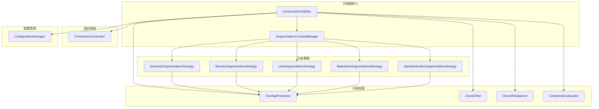

# UniversalTextSplitter 重构方案

## 问题分析

### 当前问题

1. **文件规模过大**: `UniversalTextSplitter.ts` 文件超过 1200 行，违反了单一职责原则
2. **职责过多**: 类承担了多种分段策略、重叠计算、复杂度计算、保护机制等多种职责
3. **耦合度高**: 各种功能混合在一起，难以独立测试和维护
4. **扩展性差**: 添加新的分段策略或修改现有逻辑需要修改核心类

### 当前职责分析

`UniversalTextSplitter` 类目前承担的职责包括：

1. **配置管理**: 分段选项的管理和设置
2. **分段策略选择**: 根据文件类型和内容选择合适的分段策略
3. **语义分段**: 基于语义边界的分段逻辑
4. **括号平衡分段**: 基于括号和XML标签平衡的分段
5. **行数分段**: 基于行数的简单分段
6. **重叠计算**: 智能重叠内容计算
7. **块过滤和再平衡**: 小块过滤和大小再平衡
8. **标准化集成**: 与 QueryResultNormalizer 的集成
9. **保护机制**: 与 ProtectionInterceptorChain 的集成
10. **Markdown处理**: Markdown文件的特殊处理
11. **复杂度计算**: 代码复杂度计算
12. **统计信息**: 标准化统计信息的维护

## 重构方案

### 设计原则

1. **单一职责原则**: 每个类只负责一个明确的职责
2. **开闭原则**: 对扩展开放，对修改关闭
3. **依赖倒置原则**: 依赖抽象而不是具体实现
4. **组合优于继承**: 使用组合来构建复杂功能
5. **策略模式**: 将各种分段策略抽象为可替换的策略

### 架构设计



### 模块划分

#### 1. 核心分段器 (UniversalTextSplitter)

**职责**: 
- 作为分段服务的入口点
- 协调各个组件的工作
- 提供统一的分段接口

**接口**:
```typescript
interface ITextSplitter {
  chunkBySemanticBoundaries(content: string, filePath?: string, language?: string): Promise<CodeChunk[]>;
  chunkByBracketsAndLines(content: string, filePath?: string, language?: string): Promise<CodeChunk[]>;
  chunkByLines(content: string, filePath?: string, language?: string): Promise<CodeChunk[]>;
  setOptions(options: Partial<UniversalChunkingOptions>): void;
  getOptions(): UniversalChunkingOptions;
}
```

#### 2. 分段上下文管理器 (SegmentationContextManager)

**职责**:
- 管理分段上下文信息
- 根据文件类型和内容选择合适的分段策略
- 协调策略的执行顺序

**接口**:
```typescript
interface ISegmentationContextManager {
  selectStrategy(content: string, filePath?: string, language?: string): ISegmentationStrategy;
  executeStrategy(strategy: ISegmentationStrategy, context: SegmentationContext): Promise<CodeChunk[]>;
  createSegmentationContext(content: string, filePath?: string, language?: string): SegmentationContext;
}
```

#### 3. 分段策略接口和实现

**职责**: 实现各种具体的分段策略

**接口**:
```typescript
interface ISegmentationStrategy {
  canHandle(context: SegmentationContext): boolean;
  segment(context: SegmentationContext): Promise<CodeChunk[]>;
  getName(): string;
  getPriority(): number;
}
```

**具体实现**:
- `SemanticSegmentationStrategy`: 基于语义边界的分段
- `BracketSegmentationStrategy`: 基于括号平衡的分段
- `LineSegmentationStrategy`: 基于行数的分段
- `MarkdownSegmentationStrategy`: Markdown文件专用分段
- `StandardizationSegmentationStrategy`: 基于标准化结果的分段

#### 4. 分段处理组件

**职责**: 处理分段后的各种操作

**组件**:
- `OverlapProcessor`: 重叠内容处理
- `ChunkFilter`: 小块过滤
- `ChunkRebalancer`: 块大小再平衡
- `ComplexityCalculator`: 复杂度计算

#### 5. 保护协调器 (ProtectionCoordinator)

**职责**:
- 协调各种保护机制
- 在分段过程中执行保护检查

#### 6. 配置管理器 (ConfigurationManager)

**职责**:
- 管理分段配置
- 提供配置验证和默认值

### 重构步骤

#### 第一阶段: 提取策略接口

1. 创建 `ISegmentationStrategy` 接口
2. 创建 `SegmentationContext` 类
3. 创建基础的策略实现类

#### 第二阶段: 提取处理组件

1. 创建 `OverlapProcessor` 类
2. 创建 `ChunkFilter` 类
3. 创建 `ChunkRebalancer` 类
4. 创建 `ComplexityCalculator` 类

#### 第三阶段: 创建上下文管理器

1. 创建 `SegmentationContextManager` 类
2. 实现策略选择逻辑
3. 实现策略执行协调

#### 第四阶段: 重构核心类

1. 简化 `UniversalTextSplitter` 类
2. 使用组合模式集成各个组件
3. 保持向后兼容的公共接口

#### 第五阶段: 优化和测试

1. 性能优化
2. 单元测试
3. 集成测试

### 文件结构

```
src/service/parser/universal/
├── UniversalTextSplitter.ts                 # 重构后的核心类
├── context/
│   ├── SegmentationContext.ts              # 分段上下文
│   └── SegmentationContextManager.ts       # 上下文管理器
├── strategies/
│   ├── ISegmentationStrategy.ts            # 策略接口
│   ├── SemanticSegmentationStrategy.ts     # 语义分段策略
│   ├── BracketSegmentationStrategy.ts      # 括号分段策略
│   ├── LineSegmentationStrategy.ts         # 行数分段策略
│   ├── MarkdownSegmentationStrategy.ts     # Markdown分段策略
│   └── StandardizationSegmentationStrategy.ts # 标准化分段策略
├── processors/
│   ├── OverlapProcessor.ts                 # 重叠处理器
│   ├── ChunkFilter.ts                      # 块过滤器
│   ├── ChunkRebalancer.ts                  # 块再平衡器
│   └── ComplexityCalculator.ts             # 复杂度计算器
├── protection/
│   └── ProtectionCoordinator.ts            # 保护协调器
├── config/
│   └── ConfigurationManager.ts             # 配置管理器
└── types/
    └── SegmentationTypes.ts                # 分段相关类型定义
```

### 实现细节

#### 策略选择逻辑

```typescript
class SegmentationContextManager {
  private strategies: ISegmentationStrategy[] = [
    new MarkdownSegmentationStrategy(),
    new StandardizationSegmentationStrategy(),
    new SemanticSegmentationStrategy(),
    new BracketSegmentationStrategy(),
    new LineSegmentationStrategy()
  ];
  
  selectStrategy(context: SegmentationContext): ISegmentationStrategy {
    for (const strategy of this.strategies) {
      if (strategy.canHandle(context)) {
        return strategy;
      }
    }
    throw new Error('No suitable segmentation strategy found');
  }
}
```

#### 重叠处理

```typescript
class OverlapProcessor {
  async addOverlap(chunks: CodeChunk[], context: SegmentationContext): Promise<CodeChunk[]> {
    if (!context.options.enableCodeOverlap && this.isCodeFile(context.language, context.filePath)) {
      return chunks;
    }
    
    // 实现重叠逻辑
    return this.processOverlap(chunks, context);
  }
}
```

### 向后兼容性

重构后的 `UniversalTextSplitter` 类将保持现有的公共接口不变，确保现有代码无需修改即可使用新的实现。

### 性能考虑

1. **策略缓存**: 缓存策略选择结果，避免重复计算
2. **组件复用**: 复用处理器组件实例，减少对象创建开销
3. **懒加载**: 按需加载策略和处理器组件
4. **异步处理**: 利用异步处理提高大文件处理性能

### 测试策略

1. **单元测试**: 每个策略和处理器组件的独立测试
2. **集成测试**: 策略组合和组件协作的测试
3. **性能测试**: 大文件处理性能测试
4. **兼容性测试**: 确保重构后行为与原实现一致

## 预期收益

1. **代码可维护性**: 每个类职责单一，易于理解和修改
2. **可扩展性**: 新增分段策略只需实现接口，无需修改核心代码
3. **可测试性**: 各组件可独立测试，提高测试覆盖率
4. **代码复用**: 处理组件可在不同策略间复用
5. **性能优化**: 更好的缓存和懒加载机制

## 风险评估

1. **重构复杂度**: 需要仔细处理现有逻辑的迁移
2. **性能影响**: 初期可能会有轻微性能下降，需要优化
3. **兼容性风险**: 需要确保重构后行为与原实现一致

## 总结

通过将 `UniversalTextSplitter` 拆分为多个职责单一的组件，我们可以显著提高代码的可维护性、可扩展性和可测试性。这种模块化的设计使得系统更加灵活，能够更好地适应未来的需求变化。